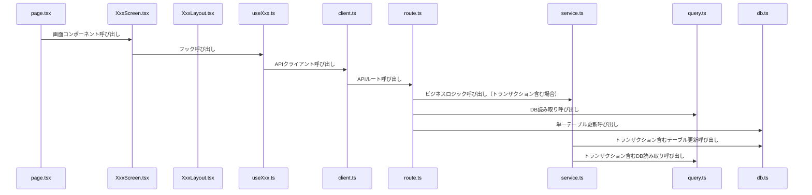

# GitHub Copilot 向け指示書

## アプリ概要
- アプリ名: `お小遣いクエストボード`
- アプリ概要: 
  - 親がクエストを登録し、子供がそのクエストを実行するとお小遣いが貰える仕組みをシステム化
  - オンライン機能により、世界中の家族が自身のクエストを共有できる
- ユーザタイプ:
  - 親: クエストの登録や編集、家族情報の変更、オンラインの公開クエストの閲覧が可能
  - 子供: 家族クエストの閲覧、受注が可能
- 技術:
  - フロントエンド: `Next.js`
    - UIコンポーネントライブラリ: `MantineUI`
  - バックエンド: `Next.js`
  - DB: `Supabase`
- 備考:
  - DB接続はSupabase Clientを使用
  - 複数テーブルの更新はSupabaseの`Database Functions`を使用
  - 基本的にバックエンド側は人間が作成し、フロントエンド部分をAIが担当する

## よく使うファイルパス
| 項目                       | パス                                       | 説明                                                               |
| -------------------------- | ------------------------------------------ | ------------------------------------------------------------------ |
| DBスキーマ定義             | `drizzle/schema.ts`                        |                                                                    |
| アプリ内エンドポイント定数 | `app/(core)/endpoints.ts`                  | APIや画面のエンドポイントを定義する                                |
| セッションストレージ       | `app/(core)/_sessionStorage/appStorage.ts` | アプリ内で使用するセッションストレージをキーバリュー形式で定義する |
| 家族クエスト一覧           | `app/(core)/quests/family/`                |                                                                    |
| サイドバー サイドメニュー  | `app/(app)/_components/SideMenu.tsx`       |                                                                    |
| フッター                   | `app/(app)/_components/BottomBar.tsx`      | モバイル時のフッター                                               |

## コーディングルール
### 全般
- PR、WIP、コメントなどすべて日本語で行うこと
- 文末のセミコロンはつけないこと`;`
- YAGNI原則に従い、不要な分割や共通化は避けること（例えば、関数の引数の型をその場でしか使わないにも関わらず、typeでXxxParamsと定義したりすることはNG。必要になった際に定義しなおすこと）
- index.tsファイルは極力作成しないこと（理由がある場合のみ作成可）
- もし、仮のファイルを作りたい場合は、`tmp/`ディレクトリ以下に作成すること

### 実装ルール
- API側を作成する場合、必ず、client.ts→route.tsというセットで作成すること
- フックからはclient.tsを経由してAPIを呼び出すこと
- フックでAPIを呼び出す場合、必ず`useMutation`か`useQuery`を使用すること

### フロント設計、実装
- フロントは以下の役割で実装する
  - page.tsx: 画面のリダイレクトを担当する。基本はサーバーコンポーネントで実装する
  - pageから呼ばれるコンポーネント: 画面の実装部分を担当する。主にapiを呼び出したり、Xxxレイアウトコンポーネントを使用して画面を構成する
  - XxxLayout.tsx: 画面のレイアウトを担当する。Layoutは直接apiを叩かず、引数で受け取ったデータを表示することに専念する

### api側
- client.ts: APIクライアントを実装する
- route.ts: APIルートを実装する
- db: DBアクセスを実装する（単一テーブル更新系）
- dbHelper.ts: DBアクセスのヘルパー関数を実装する（排他制御系）
- service.ts: client.tsでdb.tsを複数回呼ぶ場合のトランザクション用
- query.ts: DBの読み取り専用クエリを実装する

### 型
- `entity.ts`ファイルにZodスキーマの型を共有しているため、必要であればこちらを利用すること（間違っても同じような型を生成しないこと）
- DBのカラムと同じ意味の変数や引数を定義するときは、`entity.ts`の型内を参照すること。（もしくはUnionを使用）（Entity定義を変えたときに自動で変わるように）
  - 例: 
```ts
type QuestItem = {
  id: QuestEntity["id"]
  category_id?: QuestEntity["category_id"]
  [key: string]: any
}
```

### typeとinterface
- 理由がない場合、typeを使用すること

### 関数
- 理由がない場合、functionではなく、constを使用すること

### JSX(tsxファイル)
- 理由がない場合、functionではなく、constを使用すること
  - export defaultの場合のみfunctionを使う（page.tsxなど）
- Props部分は理由がない場合、分割してexportせず、直接引数部分（インライン）に書くこと
  - 例:
```tsx
/** 子供登録フォームを取得する */
export const useChildForm = ({childId}: {childId?: string}) => {
  const router = useRouter()
```

- フローティング部品は親JSX要素の一番下に配置すること（ポップアップ部品やフローティングボタン等）

### コメント
- 関数や関数呼び出しのコメントは名詞系で終わらせず、`~する`のような形式にすること
  - 例: `親情報を取得する。`, `画面を閉じる`など
- JSX内のコンポーネントには細かくコメントを入れること。（ただし、コードの横には極力コメントを書かないこと。）
  - 例:
```tsx
        <Box pos="relative" className="max-w-120">
          {/* ロード中のオーバーレイ */}
          <LoadingOverlay visible={isLoading} zIndex={1000} overlayProps={{ radius: "sm", blur: 2, }} />
          {/* 子供入力フォーム */}
          <form onSubmit={handleSubmit((form) => handleRegister({form}))}>
            {/* 入力欄のコンテナ */}
            <div className="flex flex-col gap-2">
              {/* 子供名入力欄 */}
              <div>
              ...
```

### DBクエリ
- drizzleの高レベルクエリ（db.query.xxx.findFirstなど）は使用せず、低レベルクエリ（db.select().from(...).where(...)など）を使用すること
  - なお、オブジェクトが入れ子担っている場合は、変換するプライベート関数を作成し、そこに変換ロジックを集約すること

### 命名規則
- 閲覧画面: 〇〇View
- 編集画面: 〇〇Edit

### 共通コンポーネント
- 共通コンポーネントは`app/(core)/_components/`以下に配置すること
- 共通タブ: `ScrollableTabs`
- 

## 構成図
### フロー図


### 各モジュール説明
#### page.tsx
- 画面のリダイレクトを担当する。基本はサーバーコンポーネントで実装する
- 一覧画面のURL例: `/quests`
- 編集画面のURL例: `/quests/[id]`
- 閲覧画面のURL例: `/quests/[id]/view`

#### screen.tsx
- 画面の実装部分を担当する。主にapiを呼び出したり、Xxxレイアウトコンポーネントを使用して画面を構成する

#### layout.tsx
- 画面のレイアウトを担当する。Layoutは直接apiを叩かず、引数で受け取ったデータを表示することに専念する

#### hook.ts
- APIクライアントを実装する
- 関数名は`useXxx`形式にする
- `useQuery`か`useMutation`を使用してAPIを呼び出す

#### client.ts
- APIクライアントを実装する
- 複雑な処理は実装せず、route.tsを呼び出すだけにする
- リクエストとレスポンスはroute.tsから型をインポートして使用する

#### route.ts
- APIルートを実装する
- 複雑な処理は実装せず、service.tsかquery.tsかdb.tsを呼び出すだけにする
  - 単一のqueryかdb呼び出しの場合は直接呼び出しても良い
  - 複数のqueryやdb呼び出しがある場合はservice.tsを呼び出す（トランザクション含むなど）

#### service.ts
- client.tsでdb.tsを複数回呼ぶ場合のトランザクション用
- 複数のdb.tsやquery.tsを呼び出す場合に使用する

#### query.ts
- DBの読み取り専用クエリを実装する
- 複雑な結合クエリやビュー的なクエリを実装する

#### db.ts
- DBアクセスを実装する（単一テーブル更新系）
- drizzleの低レベルクエリを使用して実装すること
- db_helper.tsを使用し、排他制御が必要な場合は排他制御を実装すること
