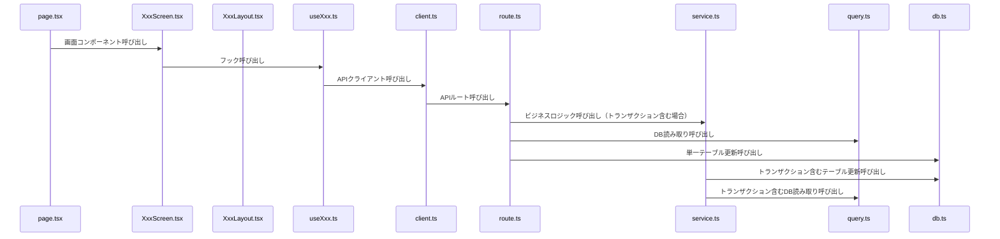

(2026年3月15日 14:30記載)

# レイヤードアーキテクチャ

## フロントエンド設計

### 1. page.tsx
- **責務**: 画面のルーティングを担当する
- **実装**: 基本はサーバーコンポーネントで実装する
- **URL例**:
  - 一覧画面: `/quests`
  - 編集画面: `/quests/[id]`
  - 閲覧画面: `/quests/[id]/view`

### 2. XxxScreen.tsx
- **責務**: 画面の実装部分を担当する
- **実装**: APIを呼び出したり、Xxxレイアウトコンポーネントを使用して画面を構成する
- **注意**: ビジネスロジックはフックに分離すること
- **必須**: 必ず`ScreenWrapper`でコンポーネント全体をラップすること（画面遷移完了検知のため）

**例:**
```tsx
import { ScreenWrapper } from '@/app/(core)/_components/ScreenWrapper'

export const FamilyQuestsScreen = () => {
  return (
    <ScreenWrapper>
      <div>画面内容</div>
    </ScreenWrapper>
  )
}
```

### 3. XxxLayout.tsx
- **責務**: 画面のレイアウトを担当する
- **制約**: 直接APIを叩かず、引数で受け取ったデータを表示することに専念する
- **目的**: プレゼンテーション層の分離

## API設計

### client.ts
- **責務**: APIクライアントを実装する
- **実装**: 複雑な処理は実装せず、route.tsを呼び出すだけにする
- **型**: リクエストとレスポンスはroute.tsから型をインポートして使用する

### route.ts
- **責務**: APIルートを実装する
- **実装パターン**:
  - 単一のqueryかdb呼び出しの場合は直接呼び出しても良い
  - 複数のqueryやdb呼び出しがある場合はservice.tsを呼び出す（トランザクション含むなど）

### service.ts
- **責務**: トランザクションを含むビジネスロジックを実装する
- **使用タイミング**: 複数のdb.tsやquery.tsを呼び出す場合に使用する

### query.ts
- **責務**: DBの読み取り専用クエリを実装する
- **実装**: 複雑な結合クエリやビュー的なクエリを実装する

### db.ts
- **責務**: DBアクセスを実装する（単一テーブル更新系）
- **実装**: drizzleの低レベルクエリを使用して実装すること
- **排他制御**: db_helper.tsを使用し、排他制御が必要な場合は排他制御を実装すること

## フックのパターン

### hook.ts (useXxx.ts)
- **責務**: APIクライアントを呼び出すロジックを実装する
- **命名**: 関数名は`useXxx`形式にする
- **実装**: `useQuery`か`useMutation`を使用してAPIを呼び出す
- **経路**: フックからはclient.tsを経由してAPIを呼び出すこと

## 実装フロー

以下のシーケンス図は、各モジュールの呼び出し関係を示す:



## 実装ルール

### API作成時の必須セット
- API側を作成する場合、必ず、`client.ts` → `route.ts`というセットで作成すること
- フックからは必ずclient.tsを経由してAPIを呼び出すこと
- フックでAPIを呼び出す場合、必ず`useMutation`か`useQuery`を使用すること
