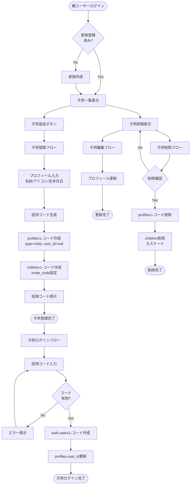
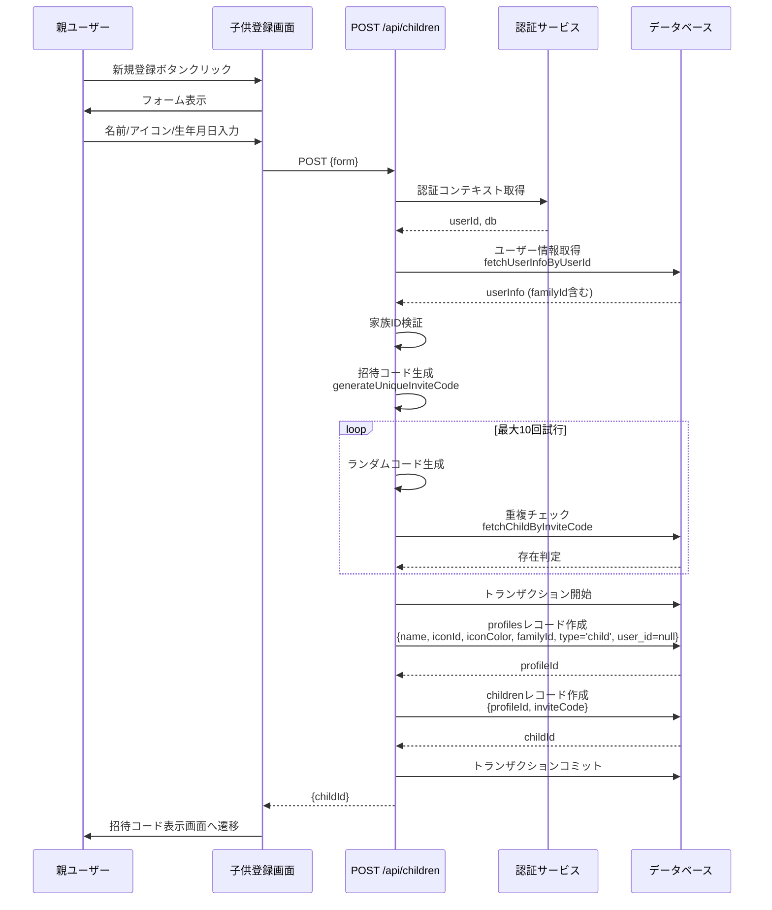
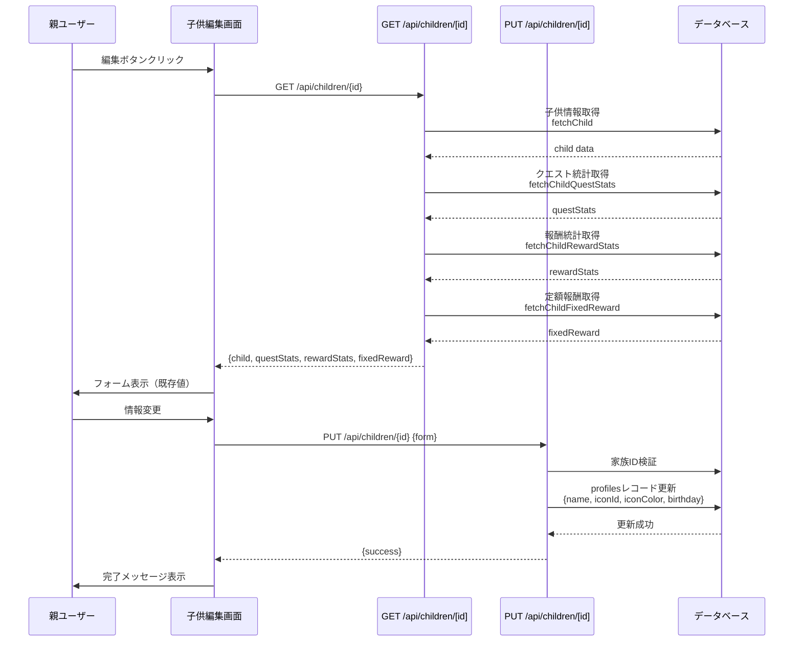
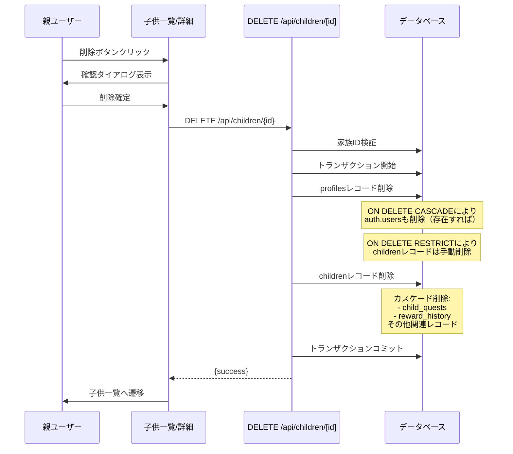

(2026年3月記載)

# 子供管理フロー図

## 子供ライフサイクル全体フロー

## 子供登録詳細フロー

## プロフィール更新フロー

## 子供削除フロー

## ステータス遷移なし

子供管理APIにはステータス遷移はありません。主な状態変化：

1. **未認証 → 認証済み**: 子供が招待コードでログイン
2. **レベル/経験値/貯金額**: クエスト完了時に更新
3. **プロフィール情報**: いつでも更新可能

## エラーハンドリング

### 1. 家族ID検証失敗
- 原因: ユーザーが家族に所属していない
- 処理: ServerError例外をスロー
- UI: エラーメッセージ表示

### 2. 招待コード生成失敗
- 原因: 10回試行しても重複
- 処理: ServerError例外をスロー
- UI: エラーメッセージ表示、再試行促す

### 3. 権限不正
- 原因: 別家族の子供にアクセス
- 処理: ServerError例外をスロー
- UI: 403エラー表示

### 4. データ不整合
- 原因: profileIdとchildIdの不一致
- 処理: トランザクションロールバック
- UI: エラーメッセージ表示
