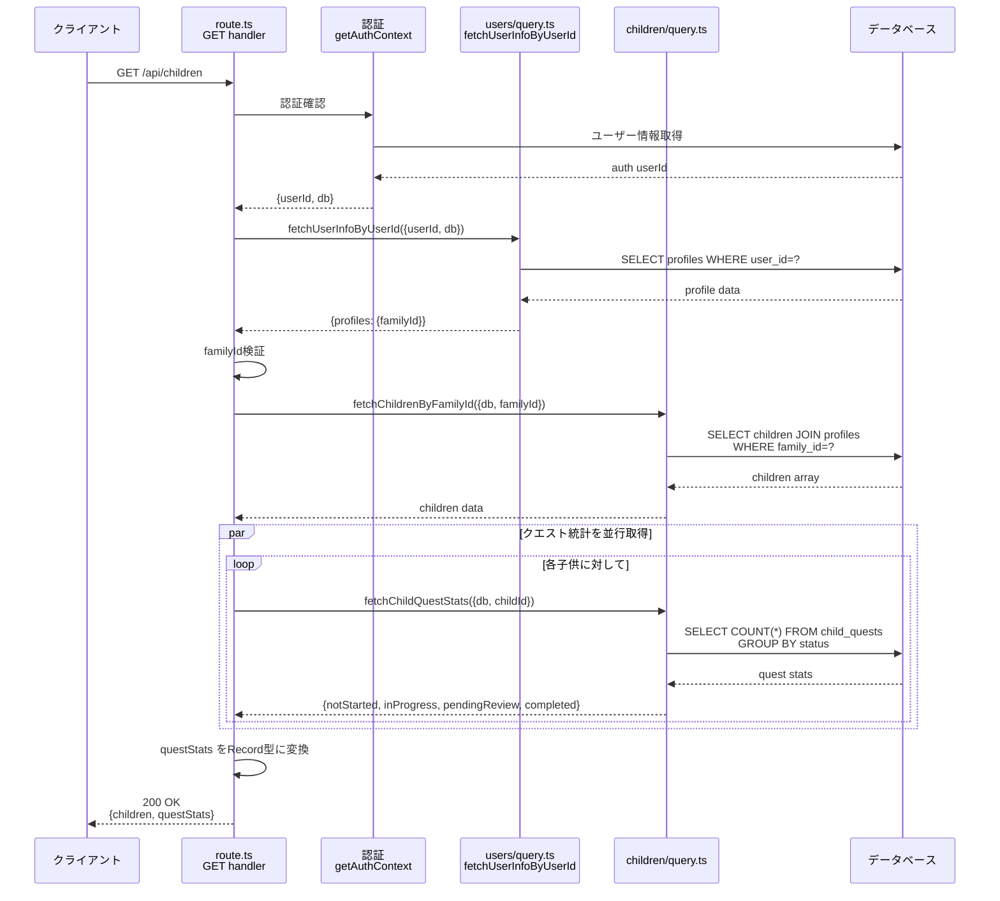
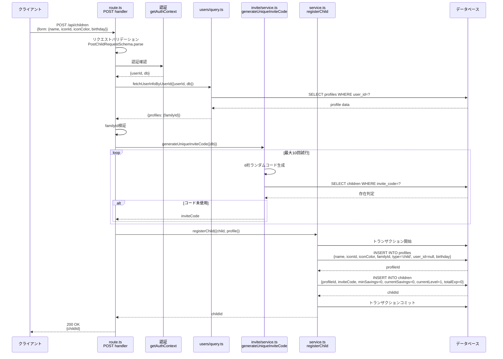
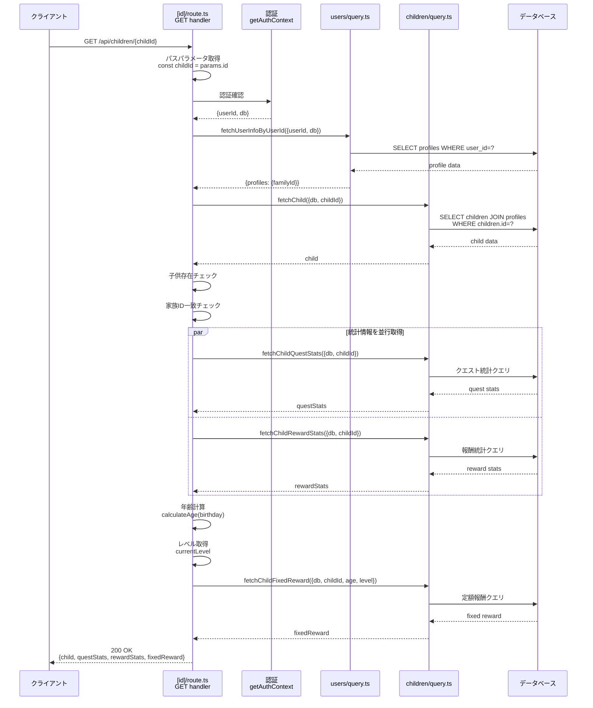
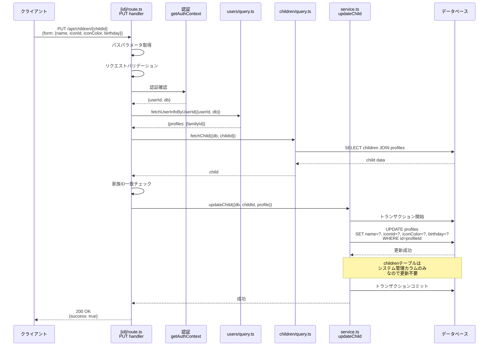
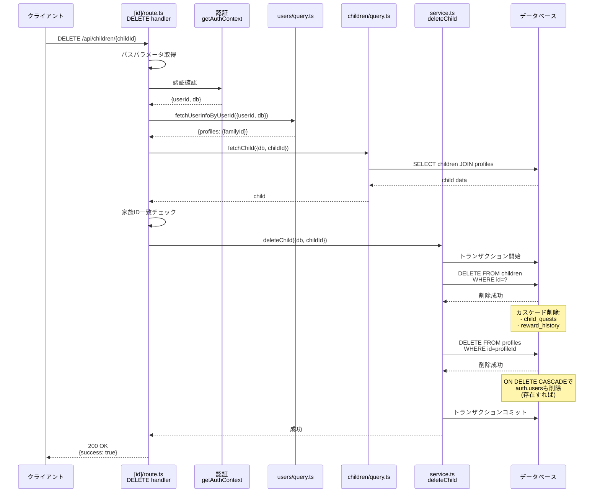
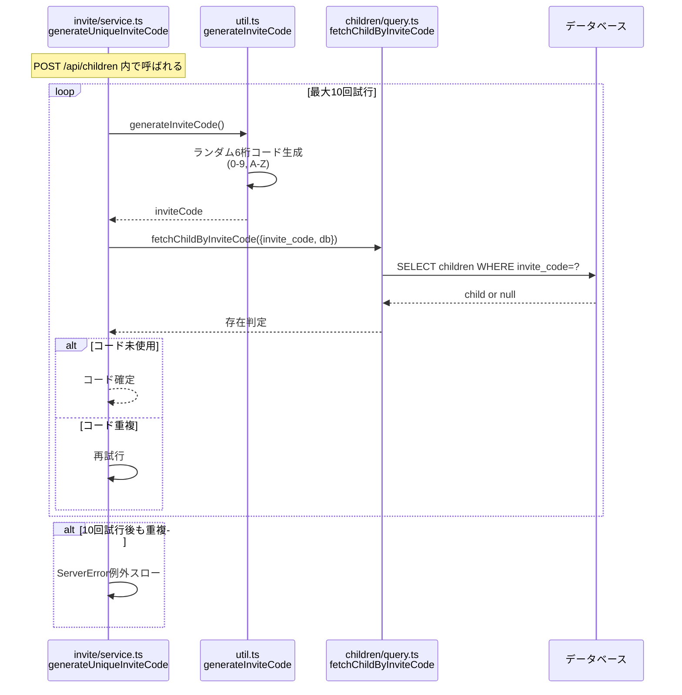

(2026年3月記載)

# 子供管理API シーケンス図

## 1. GET /api/children - 子供一覧取得



## 2. POST /api/children - 子供登録



## 3. GET /api/children/[id] - 子供詳細取得



## 4. PUT /api/children/[id] - 子供情報更新



## 5. DELETE /api/children/[id] - 子供削除



## 6. POST /api/children/invite - 招待コード生成（独立エンドポイント）

**注**: 現在、招待コードは POST /api/children 内で自動生成されます。独立したエンドポイントはありません。



## エラーレスポンス統一形式

すべてのエンドポイントで以下のエラーレスポンスを返します：

```typescript
{
  error: string           // エラーメッセージ
  code?: string          // エラーコード（オプション）
  details?: unknown      // 詳細情報（オプション）
}
```

### 共通エラーコード

- `401 Unauthorized`: 認証失敗
- `403 Forbidden`: 権限不足（別家族の子供にアクセス）
- `404 Not Found`: リソース未発見
- `422 Unprocessable Entity`: バリデーションエラー
- `500 Internal Server Error`: サーバー内部エラー
