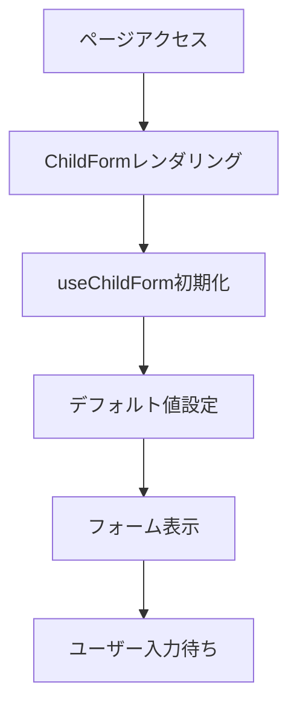
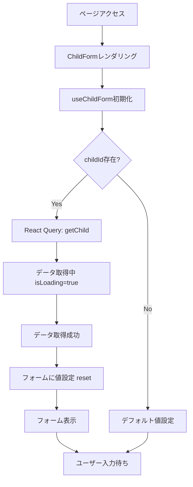
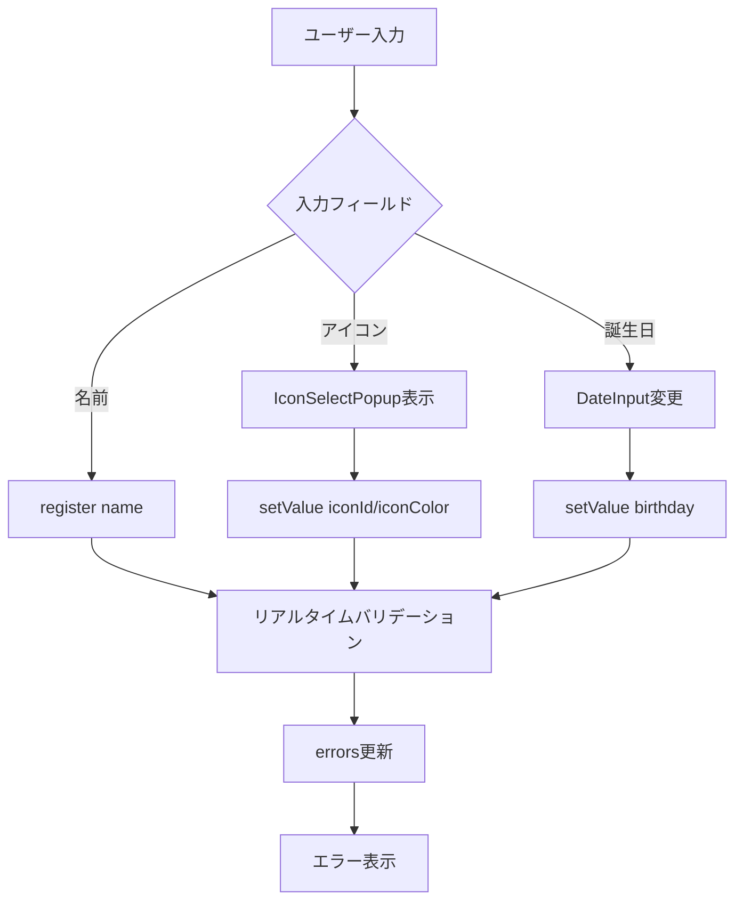
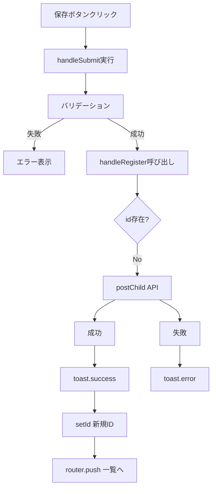
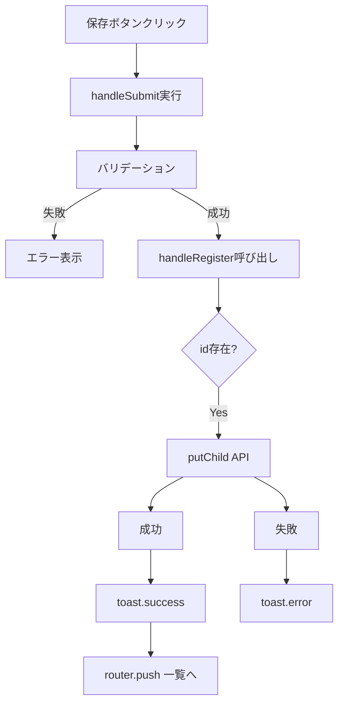
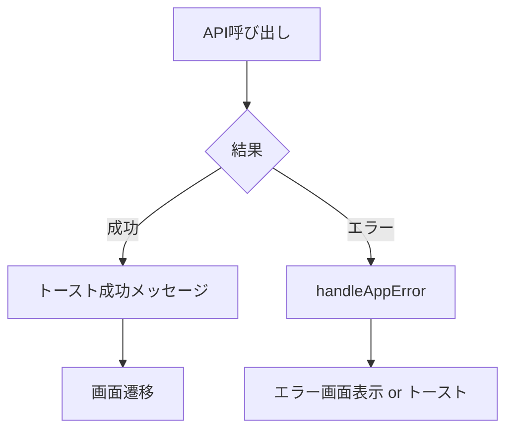
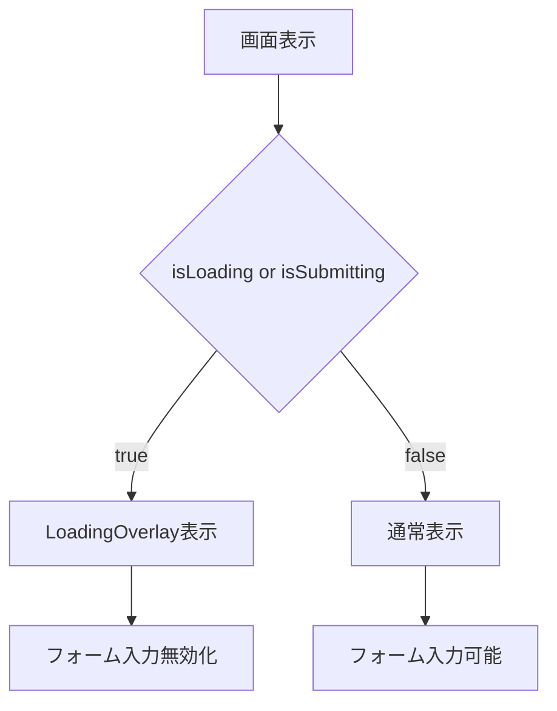

# 子供編集画面 - フローダイアグラム

（2026年3月記載）

## 画面初期化フロー

### 新規作成モード (children/new)



### 編集モード (children/[id])



## フォーム編集フロー



## バリデーションフロー

```mermaid
graph TD
  A[フォーム入力] --> B[Zod Resolver]
  B --> C{バリデーション}
  C -->|成功| D[errors = {}]
  C -->|失敗| E[errors更新]
  E --> F[フィールド下にエラー表示]
  D --> G[送信可能状態]
```

## 送信フロー

### 新規作成



### 更新



## エラーハンドリングフロー



## ローディング状態フロー


