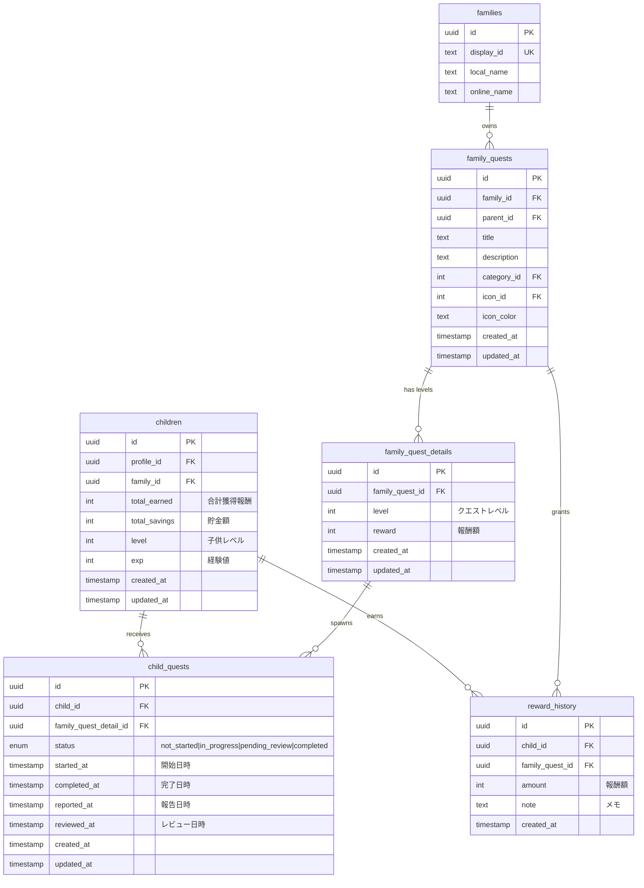

(2026年3月記載)

# 子供クエスト関連テーブル ER図

## 子供クエストのデータ構造



## 主要なリレーション

### 子供クエスト受注フロー
1. `family_quests` → `family_quest_details`: 家族クエストは複数レベル（難易度）を持つ
2. `family_quest_details` → `child_quests`: レベル詳細から子供クエストが生成される
3. `children` → `child_quests`: 子供が特定のレベルのクエストを受注
4. `child_quests.status`: ステータス遷移でライフサイクル管理
   - `not_started`: 受注直後の未着手状態
   - `in_progress`: 子供が開始ボタンを押して作業中
   - `pending_review`: 子供が完了報告して親の承認待ち
   - `completed`: 親が承認して完了

### 報酬付与フロー
1. 親が`child_quests`を承認（status: completed）
2. `reward_history`レコードが作成される
3. `children.total_earned`に報酬額が加算
4. `children.exp`に経験値が加算
5. 経験値が閾値を超えたら`children.level`がレベルアップ

### 次レベル進行フロー
1. 現在の`child_quests`が`completed`になる
2. 同じ`family_quest_id`の次レベル（level +1）の`family_quest_detail`を取得
3. 次レベルが存在する場合、新しい`child_quests`レコードを作成（status: not_started）
4. 存在しない場合、クエスト完全クリア

## データ整合性ルール

### CASCADE（連鎖削除）
- `family_quest_details`削除時:
  - `child_quests`も削除（受注済みクエストが無効化）
- `children`削除時:
  - `child_quests`も削除
  - `reward_history`も削除

### 制約
- `child_quests.child_id`: NOT NULL（必ず子供に紐づく）
- `child_quests.family_quest_detail_id`: NOT NULL（必ずレベル詳細に紐づく）
- `child_quests.status`: ENUM型で不正な値を防止
- 同一`child_id`と`family_quest_detail_id`の組み合わせで、`status != completed`のレコードは1つまで

## タイムスタンプの意味

### child_quests のタイムスタンプ
- `created_at`: クエスト受注日時（レコード作成時）
- `started_at`: 子供が「開始」ボタンを押した日時
- `reported_at`: 子供が完了報告した日時
- `reviewed_at`: 親が承認/却下のレビューをした日時
- `completed_at`: 親が承認した日時（完了確定）
- `updated_at`: 最終更新日時

### ステータスとタイムスタンプの関係
| status | started_at | reported_at | reviewed_at | completed_at |
|--------|-----------|-------------|-------------|--------------|
| not_started | NULL | NULL | NULL | NULL |
| in_progress | 設定済み | NULL | NULL | NULL |
| pending_review | 設定済み | 設定済み | NULL | NULL |
| completed | 設定済み | 設定済み | 設定済み | 設定済み |

## クエリパターン例

### 子供の進行中クエスト一覧
```sql
SELECT 
  cq.*,
  fqd.level,
  fqd.reward,
  fq.title,
  fq.description
FROM child_quests cq
JOIN family_quest_details fqd ON cq.family_quest_detail_id = fqd.id
JOIN family_quests fq ON fqd.family_quest_id = fq.id
WHERE cq.child_id = ?
  AND cq.status IN ('not_started', 'in_progress', 'pending_review')
ORDER BY cq.created_at DESC
```

### 親の承認待ちクエスト一覧
```sql
SELECT 
  cq.*,
  c.profile_id as child_profile_id,
  fqd.level,
  fqd.reward,
  fq.title
FROM child_quests cq
JOIN children c ON cq.child_id = c.id
JOIN family_quest_details fqd ON cq.family_quest_detail_id = fqd.id
JOIN family_quests fq ON fqd.family_quest_id = fq.id
WHERE fq.family_id = ?
  AND cq.status = 'pending_review'
ORDER BY cq.reported_at ASC
```

### 子供の報酬履歴
```sql
SELECT 
  rh.*,
  fq.title as quest_title
FROM reward_history rh
JOIN family_quests fq ON rh.family_quest_id = fq.id
WHERE rh.child_id = ?
ORDER BY rh.created_at DESC
LIMIT 20
```
