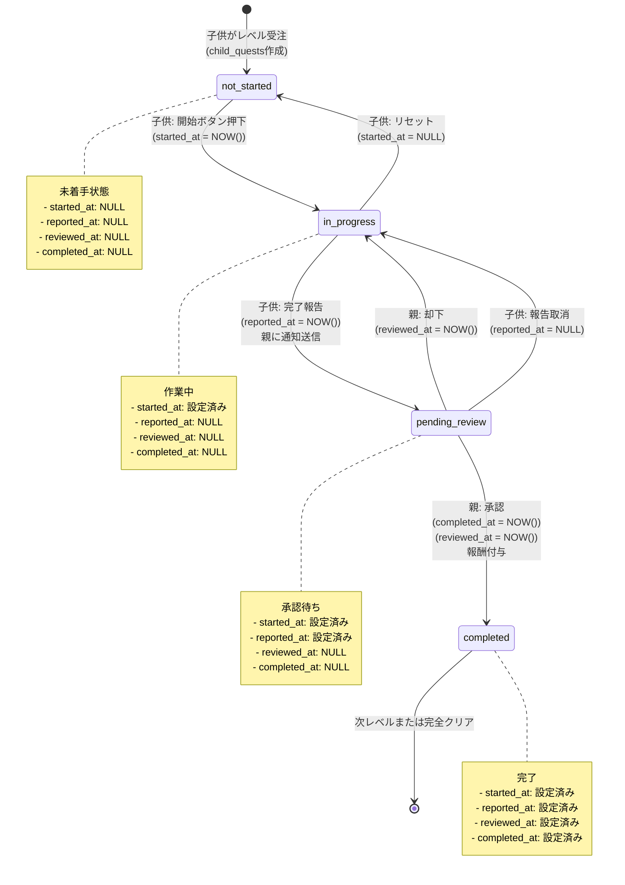
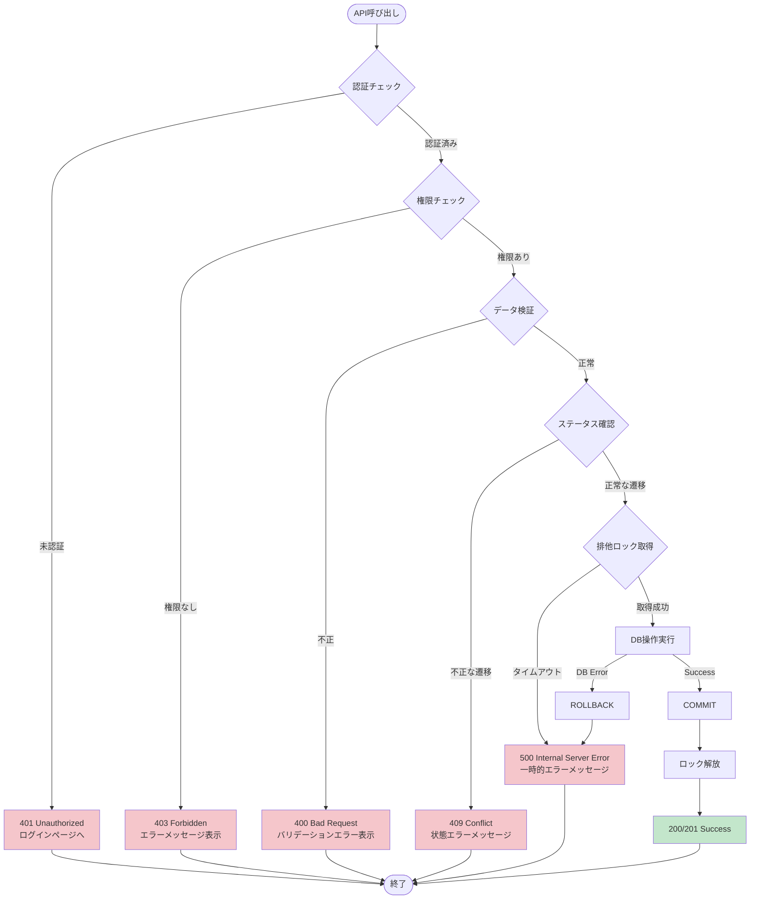
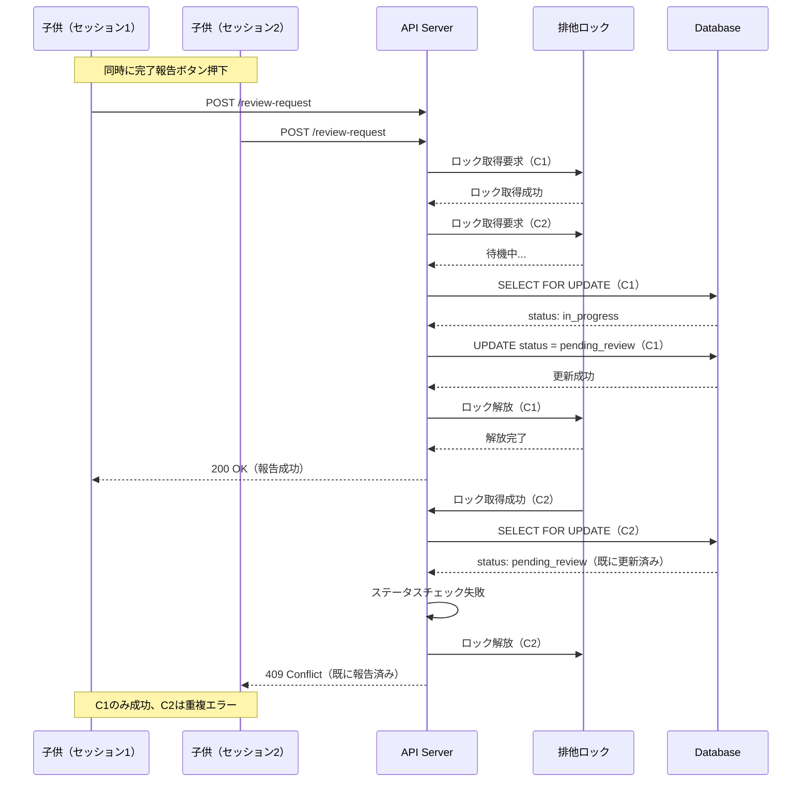

(2026年3月記載)

# 子供クエストライフサイクル フロー図

## クエスト受注から完了までの全体フロー

```mermaid
flowchart TD
    Start([子供が家族クエストを閲覧]) --> ViewQuest[家族クエスト詳細表示<br/>レベル1～n表示]
    ViewQuest --> SelectLevel{レベル選択}
    
    SelectLevel -->|受注| CheckExisting{既に受注済み?}
    CheckExisting -->|No| CreateChildQuest[child_quests作成<br/>status: not_started]
    CheckExisting -->|Yes| LoadExisting[既存のchild_quests読込]
    
    CreateChildQuest --> NotStarted[未着手状態<br/>started_at: NULL]
    LoadExisting --> CheckStatus{現在のステータス}
    
    CheckStatus -->|not_started| NotStarted
    CheckStatus -->|in_progress| InProgress
    CheckStatus -->|pending_review| PendingReview
    CheckStatus -->|completed| ShowCompleted[完了済み表示<br/>次レベルへ進む?]
    
    NotStarted --> ClickStart{開始ボタン押下?}
    ClickStart -->|Yes| StartQuest[status: in_progress<br/>started_at: NOW()]
    ClickStart -->|No| NotStarted
    
    StartQuest --> InProgress[作業中<br/>子供が作業実施]
    InProgress --> Working{作業完了?}
    
    Working -->|完了報告| ReportComplete[POST /review-request<br/>status: pending_review<br/>reported_at: NOW()]
    Working -->|リセット| ResetQuest[status: not_started<br/>started_at: NULL]
    Working -->|継続| InProgress
    
    ResetQuest --> NotStarted
    
    ReportComplete --> PendingReview[承認待ち<br/>親に通知送信]
    PendingReview --> ParentNotified[親が通知受信]
    
    ParentNotified --> ParentAction{親の判断}
    
    ParentAction -->|承認| ApproveQuest[POST /approve<br/>status: completed<br/>completed_at: NOW()<br/>reviewed_at: NOW()]
    ParentAction -->|却下| RejectQuest[POST /reject<br/>status: in_progress<br/>reviewed_at: NOW()]
    ParentAction -->|報告取消| CancelReview[POST /cancel-review<br/>status: in_progress<br/>reported_at: NULL]
    
    RejectQuest --> InProgress
    CancelReview --> InProgress
    
    ApproveQuest --> GrantReward[報酬付与処理]
    GrantReward --> CreateRewardHistory[reward_history作成<br/>amount: fqd.reward]
    CreateRewardHistory --> UpdateChild[children更新<br/>total_earned += reward<br/>exp += reward]
    UpdateChild --> CheckLevelUp{レベルアップ?}
    
    CheckLevelUp -->|Yes| LevelUp[children.level++<br/>通知・タイムライン投稿]
    CheckLevelUp -->|No| CheckNextLevel{次レベル存在?}
    
    LevelUp --> CheckNextLevel
    
    CheckNextLevel -->|Yes| CreateNextQuest[次レベルのchild_quests作成<br/>status: not_started]
    CheckNextLevel -->|No| QuestCleared[クエスト完全クリア<br/>通知・タイムライン投稿]
    
    CreateNextQuest --> NotStarted
    QuestCleared --> End([完了])
    ShowCompleted --> End
    
    style Start fill:#e1f5e1
    style End fill:#ffe1e1
    style ApproveQuest fill:#c3e6cb
    style RejectQuest fill:#f5c6cb
    style QuestCleared fill:#b8daff
    style GrantReward fill:#fff3cd
```

## 子供クエストステータス遷移詳細



## 報酬付与とレベルアップフロー

```mermaid
flowchart TD
    Start([親が承認]) --> UpdateStatus[child_quests.status = completed<br/>completed_at = NOW()<br/>reviewed_at = NOW()]
    UpdateStatus --> CreateHistory[reward_history作成<br/>child_id, family_quest_id, amount]
    
    CreateHistory --> GetReward[family_quest_details.reward取得]
    GetReward --> UpdateEarned[children.total_earned += reward]
    UpdateEarned --> UpdateExp[children.exp += reward]
    
    UpdateExp --> GetCurrentLevel[children.level取得]
    GetCurrentLevel --> CalcRequired[必要経験値計算<br/>level * 100]
    CalcRequired --> CheckLevelUp{exp >= 必要経験値?}
    
    CheckLevelUp -->|Yes| IncrementLevel[children.level++]
    CheckLevelUp -->|No| NotifyChild
    
    IncrementLevel --> PostTimeline[タイムライン投稿<br/>level_up]
    PostTimeline --> NotifyChild[子供に通知送信<br/>quest_report_approved]
    
    NotifyChild --> CheckNext{次レベル存在?}
    
    CheckNext -->|Yes| GetNextLevel[family_quest_details取得<br/>level = 現在 + 1]
    CheckNext -->|No| QuestComplete[クエスト完全クリア<br/>タイムライン投稿]
    
    GetNextLevel --> CreateNext[child_quests作成<br/>status: not_started<br/>family_quest_detail_id: 次レベル]
    CreateNext --> NotifyNext[次レベル通知送信]
    
    QuestComplete --> PostComplete[タイムライン投稿<br/>quest_completed]
    NotifyNext --> End([完了])
    PostComplete --> End
    
    style Start fill:#e1f5e1
    style End fill:#ffe1e1
    style IncrementLevel fill:#b8daff
    style QuestComplete fill:#c3e6cb
```

## エラーハンドリングフロー



## 並行処理と競合制御


