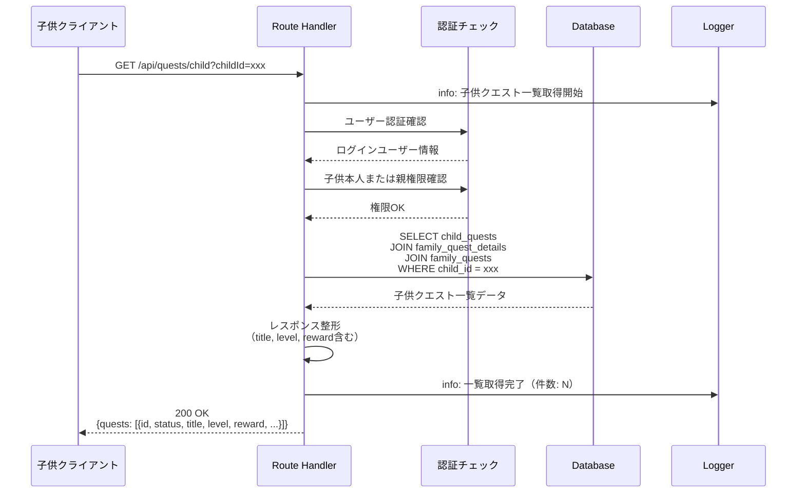
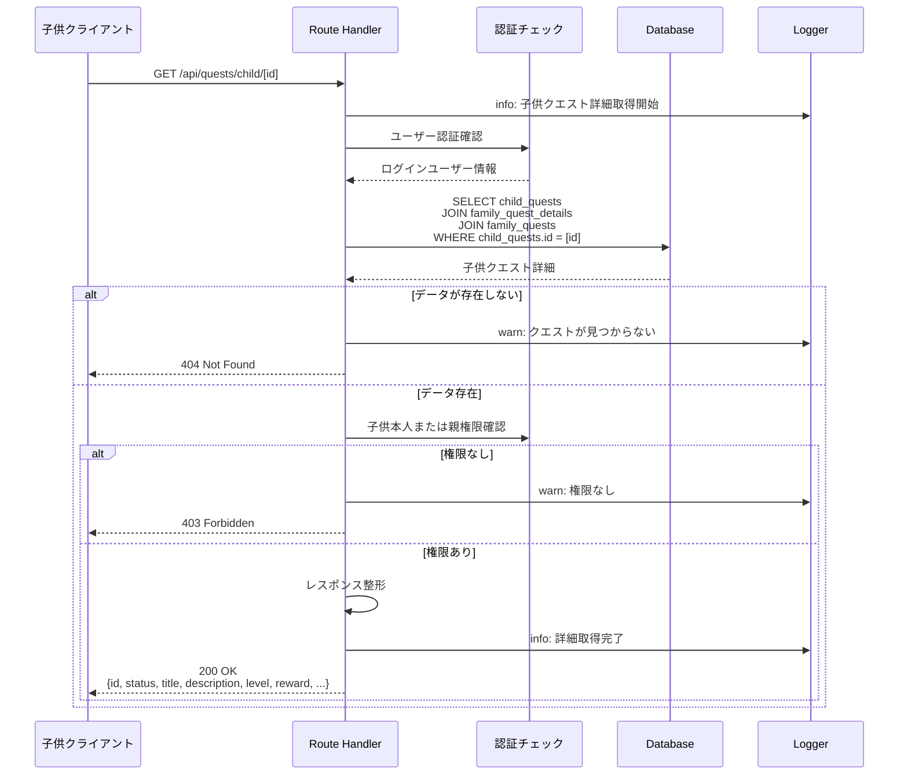
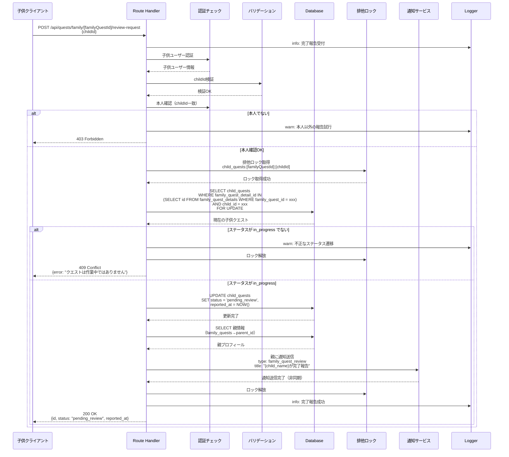
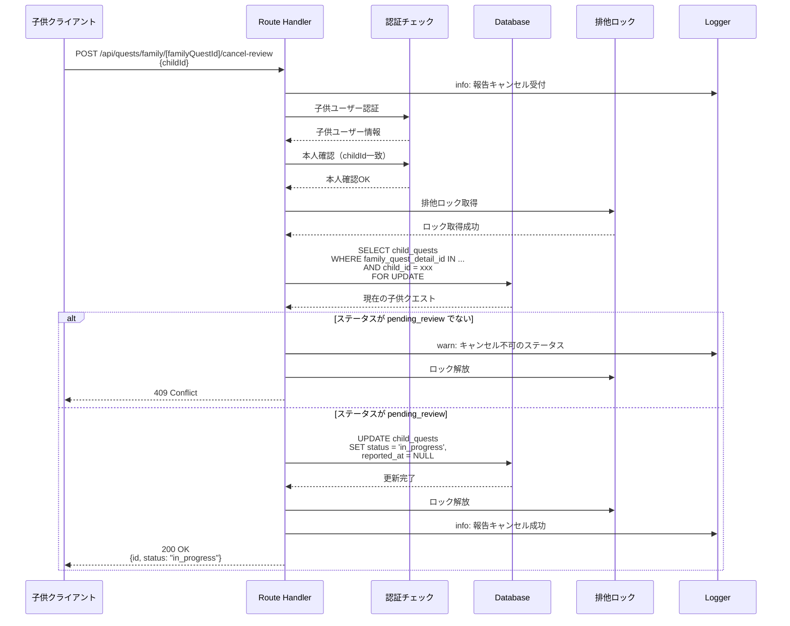
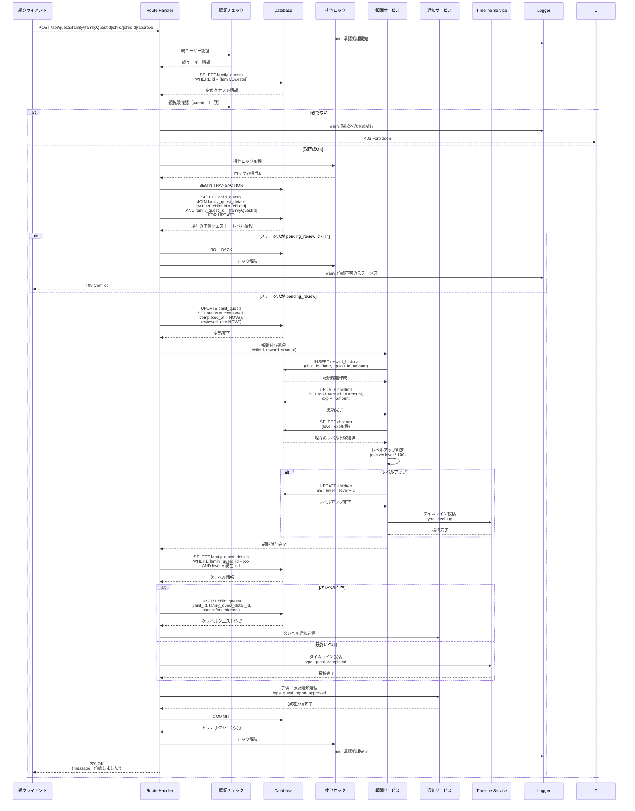
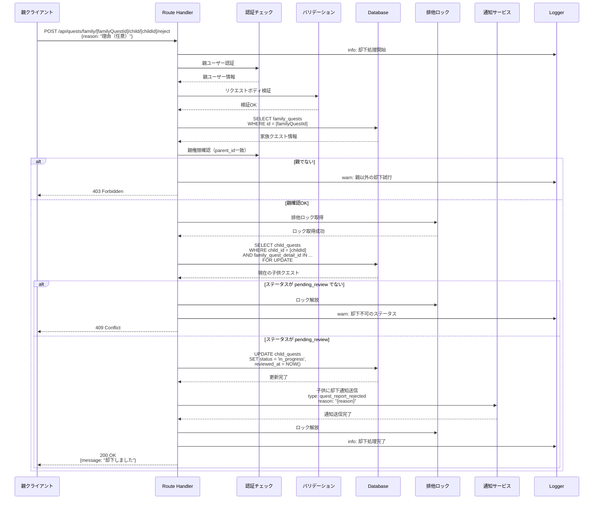
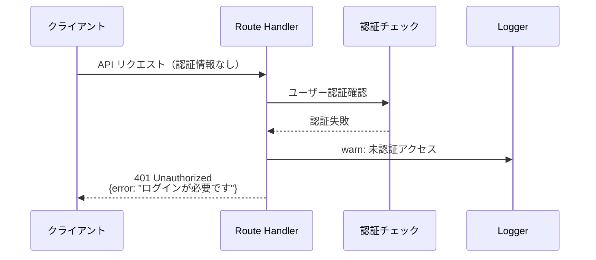
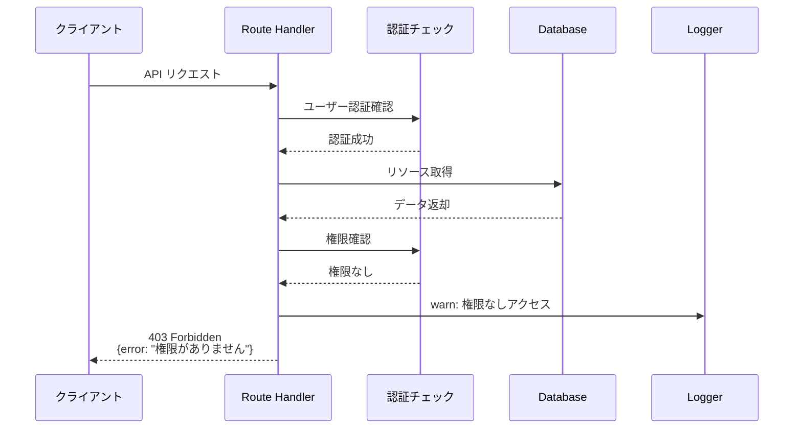
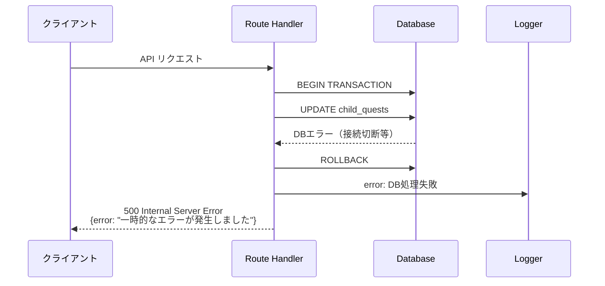
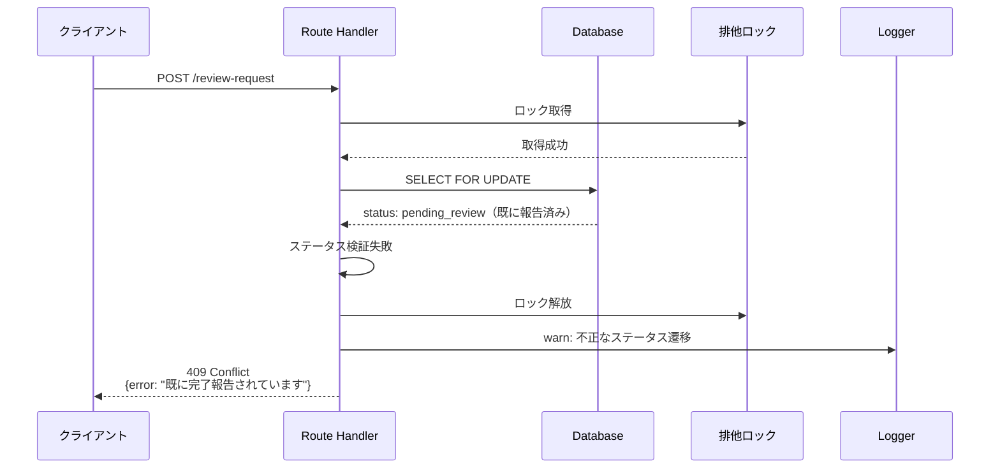

(2026年3月記載)

# 子供クエストAPI シーケンス図

## API エンドポイント一覧（再掲）

### 基本CRUD
- `GET /api/quests/child`: 子供クエスト一覧取得
- `GET /api/quests/child/[id]`: 子供クエスト詳細取得

### 受注・報告
- `POST /api/quests/family/[familyQuestId]/review-request`: 完了報告
- `POST /api/quests/family/[familyQuestId]/cancel-review`: 報告キャンセル

### 親の承認処理
- `POST /api/quests/family/[familyQuestId]/child/[childId]/approve`: 報告承認
- `POST /api/quests/family/[familyQuestId]/child/[childId]/reject`: 報告却下

## GET /api/quests/child（一覧取得）

## GET /api/quests/child/[id]（詳細取得）

## POST /api/quests/family/[familyQuestId]/review-request（完了報告）

## POST /api/quests/family/[familyQuestId]/cancel-review（報告キャンセル）

## POST /api/quests/family/[familyQuestId]/child/[childId]/approve（承認）

## POST /api/quests/family/[familyQuestId]/child/[childId]/reject（却下）

## エラーハンドリングシーケンス

### 認証エラー

### 権限エラー

### データベースエラー

### ステータス競合エラー

