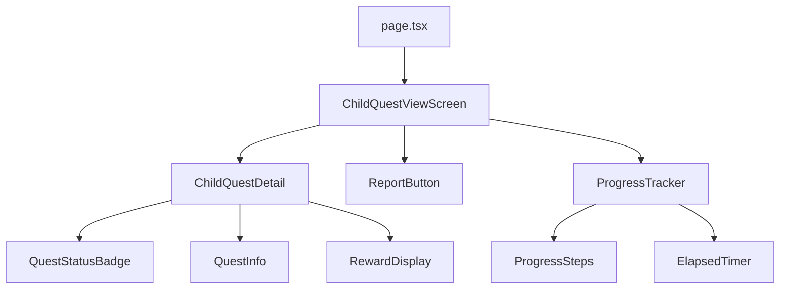

(2026年3月記載)

# 子供クエスト閲覧画面 コンポーネント構造

## ファイル構成

```
app/(app)/quests/child/[id]/
├── page.tsx                               # ページエントリーポイント
├── ChildQuestViewScreen.tsx               # メイン画面コンポーネント
└── _components/
    ├── ChildQuestDetail.tsx               # クエスト詳細表示
    ├── ReportButton.tsx                   # 完了報告ボタン
    ├── ProgressTracker.tsx                # 進捗トラッカー
    └── QuestStatusBadge.tsx               # ステータスバッジ
```

## コンポーネント階層



## 主要コンポーネント

### ChildQuestViewScreen
**責務:** 画面全体の制御とデータ管理

**Props:**
```typescript
type Props = {
  id: string                // 子供クエストID
}
```

**使用コンポーネント:**
- `ChildQuestDetail`: クエスト詳細表示
- `ReportButton`: 完了報告ボタン
- `ProgressTracker`: 進捗トラッカー
- `NotificationBanner`: 通知バナー（親の承認待ちなど）

**レイアウト構造:**
```
┌─────────────────────────────────────┐
│ Header (Title + Back Button)       │
├─────────────────────────────────────┤
│ NotificationBanner                  │
│ (pending_review時のみ)             │
├─────────────────────────────────────┤
│ ChildQuestDetail                    │
│  - Quest Title & Icon               │
│  - Quest Description                │
│  - Current Level Info               │
│  - Reward Info                      │
│  - Status Badge                     │
├─────────────────────────────────────┤
│ ProgressTracker                     │
│  - Level Progress (1/3など)        │
│  - Elapsed Time                     │
│  - Started Date                     │
├─────────────────────────────────────┤
│ ReportButton                        │
│  - "完了報告" (in_progress時)      │
│  - "報告キャンセル" (pending時)    │
└─────────────────────────────────────┘
```

### ChildQuestDetail
**責務:** クエスト詳細情報の表示

**Props:**
```typescript
type Props = {
  quest: {
    title: string
    description: string
    currentLevel: number
    totalLevels: number
    reward: number
    experiencePoints: number
    status: 'not_started' | 'in_progress' | 'pending_review' | 'completed'
  }
}
```

**表示項目:**
- クエスト名とアイコン
- クエスト説明
- 現在のレベル情報（レベル2/3など）
- 報酬金額
- 獲得経験値
- ステータスバッジ

### ReportButton
**責務:** 完了報告アクション

**Props:**
```typescript
type Props = {
  questId: string
  status: QuestStatus
  onReport: () => Promise<void>
  onCancel: () => Promise<void>
  isLoading: boolean
}
```

**表示条件:**
- `status === 'in_progress'`: 「完了報告」ボタン表示
- `status === 'pending_review'`: 「報告キャンセル」ボタン表示
- `status === 'completed'`: 非表示

**ボタンスタイル:**
- 完了報告: プライマリーボタン（青）
- 報告キャンセル: セカンダリーボタン（グレー）

### ProgressTracker
**責務:** クエスト進捗状況の可視化

**Props:**
```typescript
type Props = {
  currentLevel: number
  totalLevels: number
  startedAt: string | null
  reportedAt: string | null
}
```

**表示内容:**
- レベル進捗バー（現在レベル/全レベル）
- 開始日時
- 経過時間（リアルタイム更新）
- 報告日時（pending_review時のみ）

## 共通UIコンポーネント使用

### Mantineコンポーネント
- `Card`: 各セクションの囲み
- `Badge`: ステータス表示
- `Button`: アクションボタン
- `Stack`: 縦方向レイアウト
- `Group`: 横方向レイアウト
- `Text`: テキスト表示
- `Title`: タイトル表示
- `Progress`: プログレスバー

### カスタム共通コンポーネント
- `IconDisplay`: アイコン表示
- `RewardBadge`: 報酬表示バッジ
- `ExperienceBadge`: 経験値表示バッジ
