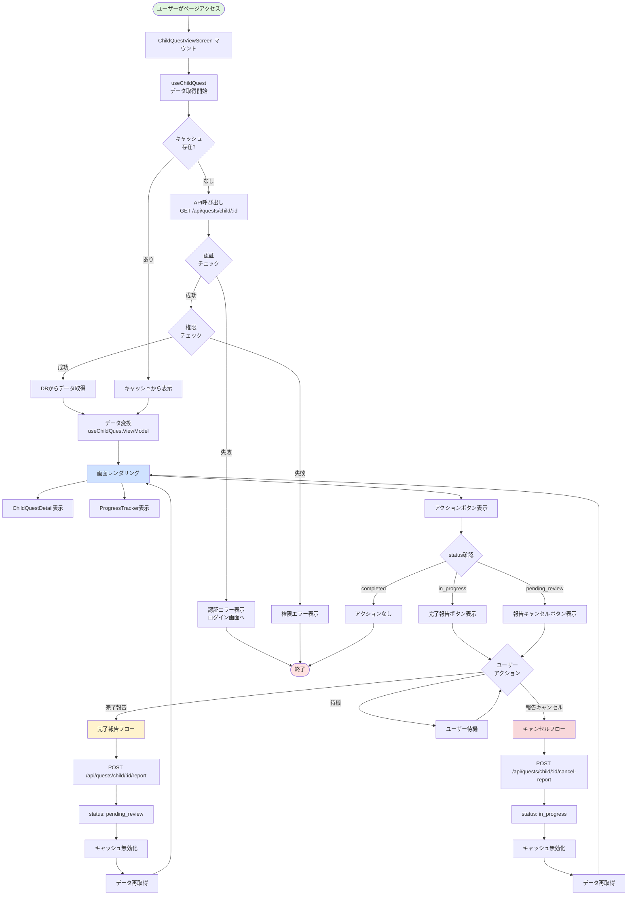
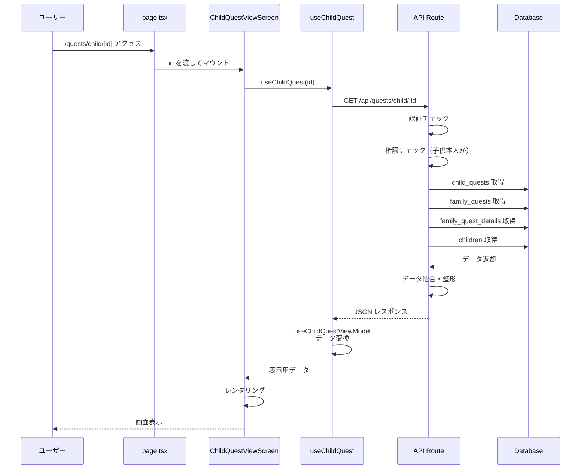
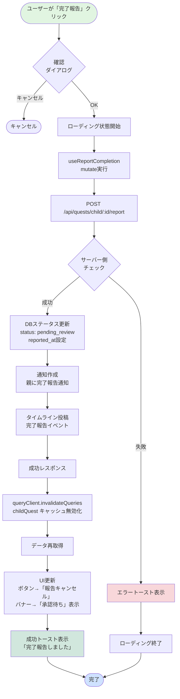
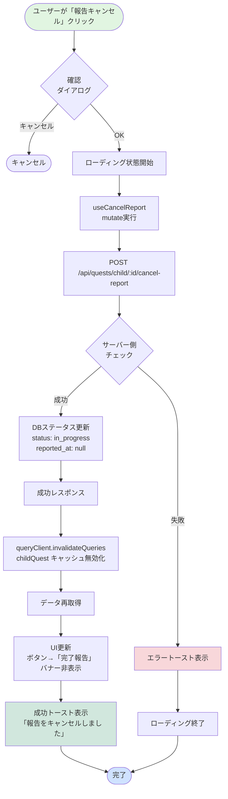
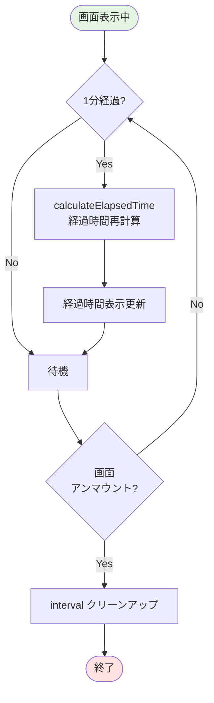
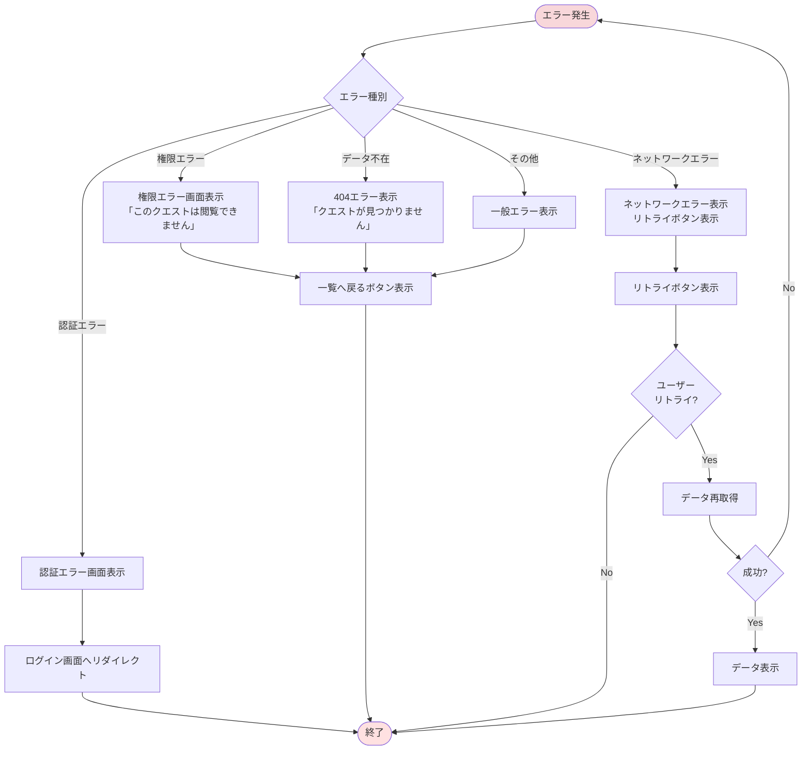

(2026年3月15日 14:30記載)

# 子供クエスト閲覧画面 フロー図

## 画面表示フロー全体

```mermaid
flowchart TD
    Start([ユーザーがページアクセス]) --> Mount[ChildQuestViewScreen マウント]
    Mount --> FetchData[useChildQuest<br/>データ取得開始]
    
    FetchData --> CheckCache{キャッシュ<br/>存在?}
    CheckCache -->|あり| UseCache[キャッシュから表示]
    CheckCache -->|なし| APICall[API呼び出し<br/>GET /api/quests/child/:id]
    
    APICall --> CheckAuth{認証<br/>チェック}
    CheckAuth -->|失敗| AuthError[認証エラー表示<br/>ログイン画面へ]
    CheckAuth -->|成功| CheckPermission{権限<br/>チェック}
    
    CheckPermission -->|失敗| PermError[権限エラー表示]
    CheckPermission -->|成功| FetchDB[DBからデータ取得]
    
    FetchDB --> Transform[データ変換<br/>useChildQuestViewModel]
    UseCache --> Transform
    
    Transform --> Render[画面レンダリング]
    
    Render --> ShowDetail[ChildQuestDetail表示]
    Render --> ShowProgress[ProgressTracker表示]
    Render --> ShowActions[アクションボタン表示]
    
    ShowActions --> CheckStatus{status確認}
    CheckStatus -->|in_progress| ShowReport[完了報告ボタン表示]
    CheckStatus -->|pending_review| ShowCancel[報告キャンセルボタン表示]
    CheckStatus -->|completed| NoAction[アクションなし]
    
    ShowReport --> UserAction{ユーザー<br/>アクション}
    ShowCancel --> UserAction
    
    UserAction -->|完了報告| ReportFlow[完了報告フロー]
    UserAction -->|報告キャンセル| CancelFlow[キャンセルフロー]
    UserAction -->|待機| WaitUser[ユーザー待機]
    
    ReportFlow --> ReportAPI[POST /api/quests/child/:id/report]
    ReportAPI --> UpdateStatus1[status: pending_review]
    UpdateStatus1 --> InvalidateCache1[キャッシュ無効化]
    InvalidateCache1 --> Refetch1[データ再取得]
    Refetch1 --> Render
    
    CancelFlow --> CancelAPI[POST /api/quests/child/:id/cancel-report]
    CancelAPI --> UpdateStatus2[status: in_progress]
    UpdateStatus2 --> InvalidateCache2[キャッシュ無効化]
    InvalidateCache2 --> Refetch2[データ再取得]
    Refetch2 --> Render
    
    WaitUser --> UserAction
    AuthError --> End([終了])
    PermError --> End
    NoAction --> End
    
    style Start fill:#e1f5e1
    style End fill:#ffe1e1
    style Render fill:#cfe2ff
    style ReportFlow fill:#fff3cd
    style CancelFlow fill:#f8d7da
```

## 初期表示シーケンス

```mermaid
sequenceDiagram
    participant User as ユーザー
    participant Page as page.tsx
    participant Screen as ChildQuestViewScreen
    participant Hook as useChildQuest
    participant API as API Route
    participant DB as Database
    
    User->>Page: /quests/child/[id] アクセス
    Page->>Screen: id を渡してマウント
    Screen->>Hook: useChildQuest(id)
    Hook->>API: GET /api/quests/child/:id
    
    API->>API: 認証チェック
    API->>API: 権限チェック（子供本人か）
    API->>DB: child_quests 取得
    API->>DB: family_quests 取得
    API->>DB: family_quest_details 取得
    API->>DB: children 取得
    
    DB-->>API: データ返却
    API->>API: データ結合・整形
    API-->>Hook: JSON レスポンス
    
    Hook->>Hook: useChildQuestViewModel<br/>データ変換
    Hook-->>Screen: 表示用データ
    
    Screen->>Screen: レンダリング
    Screen-->>User: 画面表示
```

## 完了報告フロー

```mermaid
flowchart TD
    Start([ユーザーが「完了報告」クリック]) --> Confirm{確認<br/>ダイアログ}
    
    Confirm -->|キャンセル| Cancel1([キャンセル])
    Confirm -->|OK| SetLoading[ローディング状態開始]
    
    SetLoading --> ReportMutation[useReportCompletion<br/>mutate実行]
    ReportMutation --> APICall[POST /api/quests/child/:id/report]
    
    APICall --> ServerCheck{サーバー側<br/>チェック}
    ServerCheck -->|失敗| ShowError[エラートースト表示]
    ServerCheck -->|成功| UpdateDB[DBステータス更新<br/>status: pending_review<br/>reported_at設定]
    
    UpdateDB --> CreateNotif[通知作成<br/>親に完了報告通知]
    CreateNotif --> CreateTimeline[タイムライン投稿<br/>完了報告イベント]
    CreateTimeline --> APIResponse[成功レスポンス]
    
    APIResponse --> InvalidateCache[queryClient.invalidateQueries<br/>childQuest キャッシュ無効化]
    InvalidateCache --> Refetch[データ再取得]
    Refetch --> UpdateUI[UI更新<br/>ボタン→「報告キャンセル」<br/>バナー→「承認待ち」表示]
    
    UpdateUI --> ShowSuccess[成功トースト表示<br/>「完了報告しました」]
    ShowSuccess --> End([完了])
    
    ShowError --> StopLoading[ローディング終了]
    StopLoading --> End
    
    style Start fill:#e1f5e1
    style End fill:#cfe2ff
    style ShowError fill:#f8d7da
    style ShowSuccess fill:#d1e7dd
```

## 報告キャンセルフロー

```mermaid
flowchart TD
    Start([ユーザーが「報告キャンセル」クリック]) --> Confirm{確認<br/>ダイアログ}
    
    Confirm -->|キャンセル| Cancel([キャンセル])
    Confirm -->|OK| SetLoading[ローディング状態開始]
    
    SetLoading --> CancelMutation[useCancelReport<br/>mutate実行]
    CancelMutation --> APICall[POST /api/quests/child/:id/cancel-report]
    
    APICall --> ServerCheck{サーバー側<br/>チェック}
    ServerCheck -->|失敗| ShowError[エラートースト表示]
    ServerCheck -->|成功| UpdateDB[DBステータス更新<br/>status: in_progress<br/>reported_at: null]
    
    UpdateDB --> APIResponse[成功レスポンス]
    APIResponse --> InvalidateCache[queryClient.invalidateQueries<br/>childQuest キャッシュ無効化]
    InvalidateCache --> Refetch[データ再取得]
    Refetch --> UpdateUI[UI更新<br/>ボタン→「完了報告」<br/>バナー非表示]
    
    UpdateUI --> ShowSuccess[成功トースト表示<br/>「報告をキャンセルしました」]
    ShowSuccess --> End([完了])
    
    ShowError --> StopLoading[ローディング終了]
    StopLoading --> End
    
    style Start fill:#e1f5e1
    style End fill:#cfe2ff
    style ShowError fill:#f8d7da
    style ShowSuccess fill:#d1e7dd
```

## リアルタイム更新フロー

```mermaid
flowchart TD
    Start([画面表示中]) --> CheckInterval{1分経過?}
    
    CheckInterval -->|No| Wait[待機]
    CheckInterval -->|Yes| Calculate[calculateElapsedTime<br/>経過時間再計算]
    
    Calculate --> UpdateDisplay[経過時間表示更新]
    UpdateDisplay --> Wait
    
    Wait --> CheckUnmount{画面<br/>アンマウント?}
    CheckUnmount -->|No| CheckInterval
    CheckUnmount -->|Yes| Cleanup[interval クリーンアップ]
    Cleanup --> End([終了])
    
    style Start fill:#e1f5e1
    style End fill:#ffe1e1
```

## エラーハンドリングフロー

```mermaid
flowchart TD
    Error([エラー発生]) --> CheckType{エラー種別}
    
    CheckType -->|認証エラー| AuthError[認証エラー画面表示]
    CheckType -->|権限エラー| PermError[権限エラー画面表示<br/>「このクエストは閲覧できません」]
    CheckType -->|データ不在| NotFound[404エラー表示<br/>「クエストが見つかりません」]
    CheckType -->|ネットワークエラー| NetError[ネットワークエラー表示<br/>リトライボタン表示]
    CheckType -->|その他| GenError[一般エラー表示]
    
    AuthError --> RedirectLogin[ログイン画面へリダイレクト]
    PermError --> BackButton[一覧へ戻るボタン表示]
    NotFound --> BackButton
    NetError --> RetryButton[リトライボタン表示]
    GenError --> BackButton
    
    RedirectLogin --> End([終了])
    BackButton --> End
    RetryButton --> Retry{ユーザー<br/>リトライ?}
    Retry -->|Yes| RefetchData[データ再取得]
    Retry -->|No| End
    
    RefetchData --> Success{成功?}
    Success -->|Yes| ShowData[データ表示]
    Success -->|No| Error
    
    ShowData --> End
    
    style Error fill:#f8d7da
    style End fill:#ffe1e1
```
