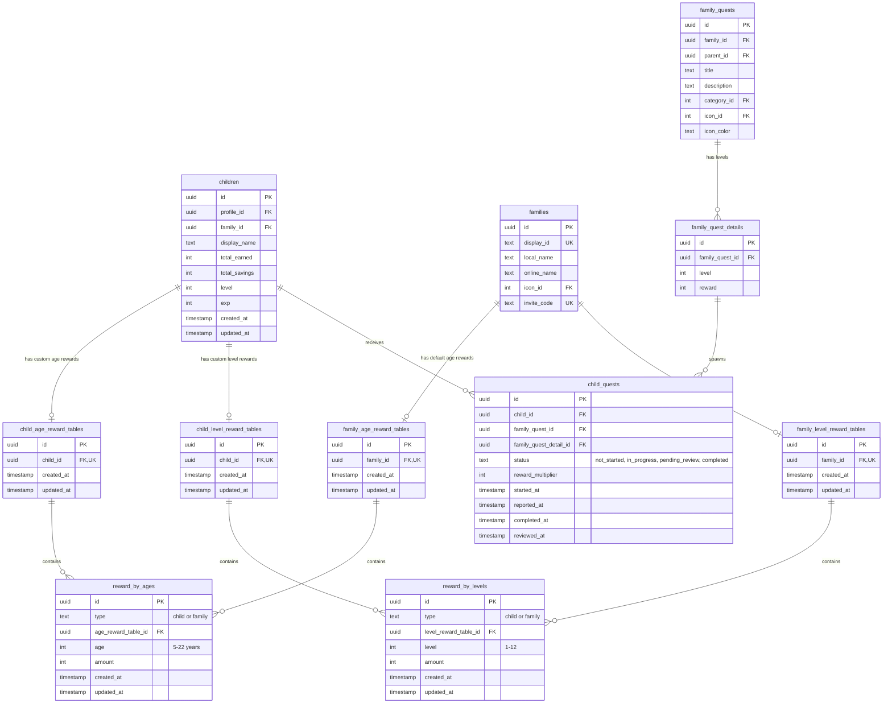

(2026年3月15日 14:30記載)

# 子供報酬設定関連テーブル ER図

## 子供報酬設定のデータ構造

## テーブル関係の説明

### 報酬設定の優先順位
1. **子供個別設定**: `child_age_reward_tables` / `child_level_reward_tables`
2. **家族デフォルト設定**: `family_age_reward_tables` / `family_level_reward_tables`
3. **システムデフォルト**: コード内で定義

### 報酬計算のフロー
1. クエスト完了時: `family_quest_details.reward` × `child_quests.reward_multiplier`
2. 報酬倍率の決定:
   - 子供個別の年齢別報酬設定を確認
   - 存在しない場合は家族の年齢別報酬設定を使用
   - 年齢に応じた倍率を適用

### 共通テーブル設計
- `reward_by_ages` と `reward_by_levels` は `type` カラムで "child" / "family" を区別
- DB操作の共通化により、コード重複を最小化
