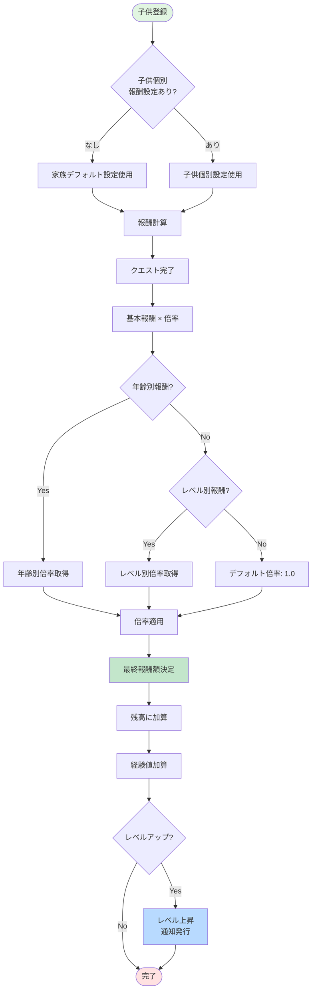
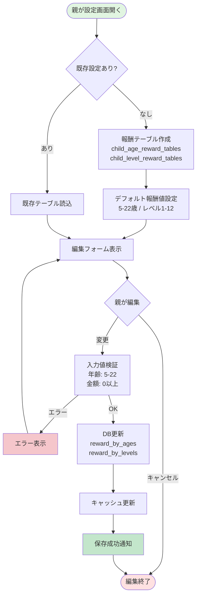
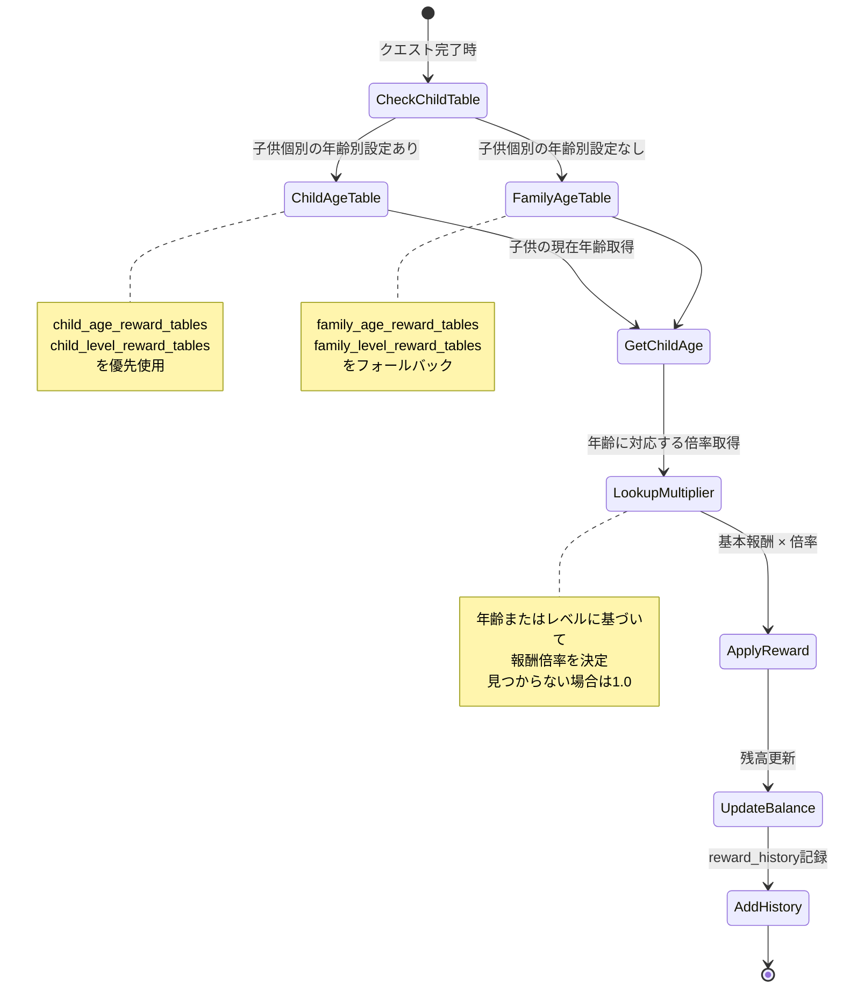
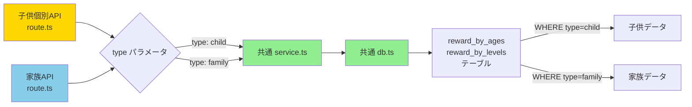

(2026年3月15日 14:30記載)

# 子供報酬設定ライフサイクル フロー図

## 報酬設定全体のライフサイクル

```mermaid
flowchart TD
    Start([子供登録]) --> CheckCustom{子供個別<br/>報酬設定あり?}
    
    CheckCustom -->|なし| UseFamilyDefault[家族デフォルト設定使用]
    CheckCustom -->|あり| UseChildCustom[子供個別設定使用]
    
    UseFamilyDefault --> RewardCalc[報酬計算]
    UseChildCustom --> RewardCalc
    
    RewardCalc --> QuestComplete[クエスト完了]
    QuestComplete --> CalcReward[基本報酬 × 倍率]
    
    CalcReward --> CheckAge{年齢別報酬?}
    CheckAge -->|Yes| GetAgeMultiplier[年齢別倍率取得]
    CheckAge -->|No| CheckLevel{レベル別報酬?}
    
    GetAgeMultiplier --> ApplyMultiplier[倍率適用]
    
    CheckLevel -->|Yes| GetLevelMultiplier[レベル別倍率取得]
    CheckLevel -->|No| DefaultMultiplier[デフォルト倍率: 1.0]
    
    GetLevelMultiplier --> ApplyMultiplier
    DefaultMultiplier --> ApplyMultiplier
    
    ApplyMultiplier --> FinalReward[最終報酬額決定]
    FinalReward --> AddToBalance[残高に加算]
    AddToBalance --> AddExp[経験値加算]
    
    AddExp --> CheckLevelUp{レベルアップ?}
    CheckLevelUp -->|Yes| LevelUp[レベル上昇<br/>通知発行]
    CheckLevelUp -->|No| End([完了])
    LevelUp --> End
    
    style Start fill:#e1f5e1
    style End fill:#ffe1e1
    style FinalReward fill:#c3e6cb
    style LevelUp fill:#b8daff
```

## 報酬設定カスタマイズフロー

```mermaid
flowchart TD
    ParentStart([親が設定画面開く]) --> LoadSettings{既存設定あり?}
    
    LoadSettings -->|なし| CreateTable[報酬テーブル作成<br/>child_age_reward_tables<br/>child_level_reward_tables]
    LoadSettings -->|あり| LoadTable[既存テーブル読込]
    
    CreateTable --> InitDefault[デフォルト報酬値設定<br/>5-22歳 / レベル1-12]
    InitDefault --> DisplayForm[編集フォーム表示]
    LoadTable --> DisplayForm
    
    DisplayForm --> ParentEdit{親が編集}
    ParentEdit -->|変更| ValidateInput[入力値検証<br/>年齢: 5-22<br/>金額: 0以上]
    ParentEdit -->|キャンセル| End([編集終了])
    
    ValidateInput -->|エラー| ShowError[エラー表示]
    ShowError --> DisplayForm
    
    ValidateInput -->|OK| UpdateDB[DB更新<br/>reward_by_ages<br/>reward_by_levels]
    UpdateDB --> RefreshCache[キャッシュ更新]
    RefreshCache --> Success[保存成功通知]
    Success --> End
    
    style ParentStart fill:#e1f5e1
    style End fill:#ffe1e1
    style Success fill:#c3e6cb
    style ShowError fill:#f5c6cb
```

## 報酬倍率決定ロジック詳細

```mermaid
stateDiagram-v2
    [*] --> CheckChildTable: クエスト完了時
    
    CheckChildTable --> ChildAgeTable: 子供個別の年齢別設定あり
    CheckChildTable --> FamilyAgeTable: 子供個別の年齢別設定なし
    
    ChildAgeTable --> GetChildAge: 子供の現在年齢取得
    FamilyAgeTable --> GetChildAge
    
    GetChildAge --> LookupMultiplier: 年齢に対応する倍率取得
    
    LookupMultiplier --> ApplyReward: 基本報酬 × 倍率
    
    ApplyReward --> UpdateBalance: 残高更新
    UpdateBalance --> AddHistory: reward_history記録
    AddHistory --> [*]
    
    note right of ChildAgeTable
        child_age_reward_tables
        child_level_reward_tables
        を優先使用
    end note
    
    note right of FamilyAgeTable
        family_age_reward_tables
        family_level_reward_tables
        をフォールバック
    end note
    
    note right of LookupMultiplier
        年齢またはレベルに基づいて
        報酬倍率を決定
        見つからない場合は1.0
    end note
```

## 共通コード利用フロー

```mermaid
flowchart LR
    A[子供個別API<br/>route.ts] --> B{type パラメータ}
    C[家族API<br/>route.ts] --> B
    
    B -->|type: child| D[共通 service.ts]
    B -->|type: family| D
    
    D --> E[共通 db.ts]
    E --> F[reward_by_ages<br/>reward_by_levels<br/>テーブル]
    
    F -->|WHERE type=child| G[子供データ]
    F -->|WHERE type=family| H[家族データ]
    
    style A fill:#ffd700
    style C fill:#87ceeb
    style D fill:#90ee90
    style E fill:#90ee90
```
