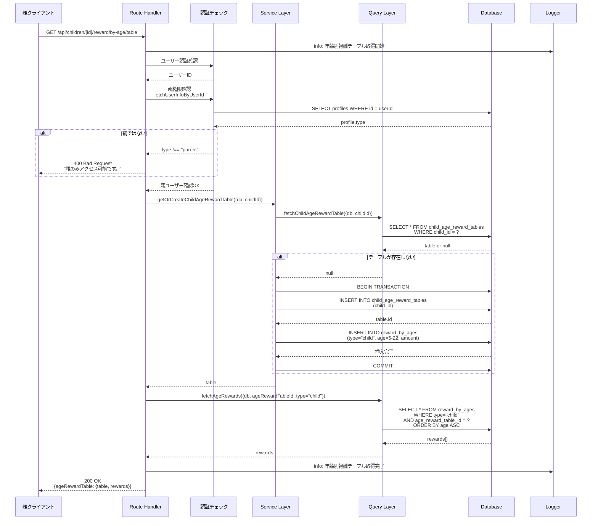
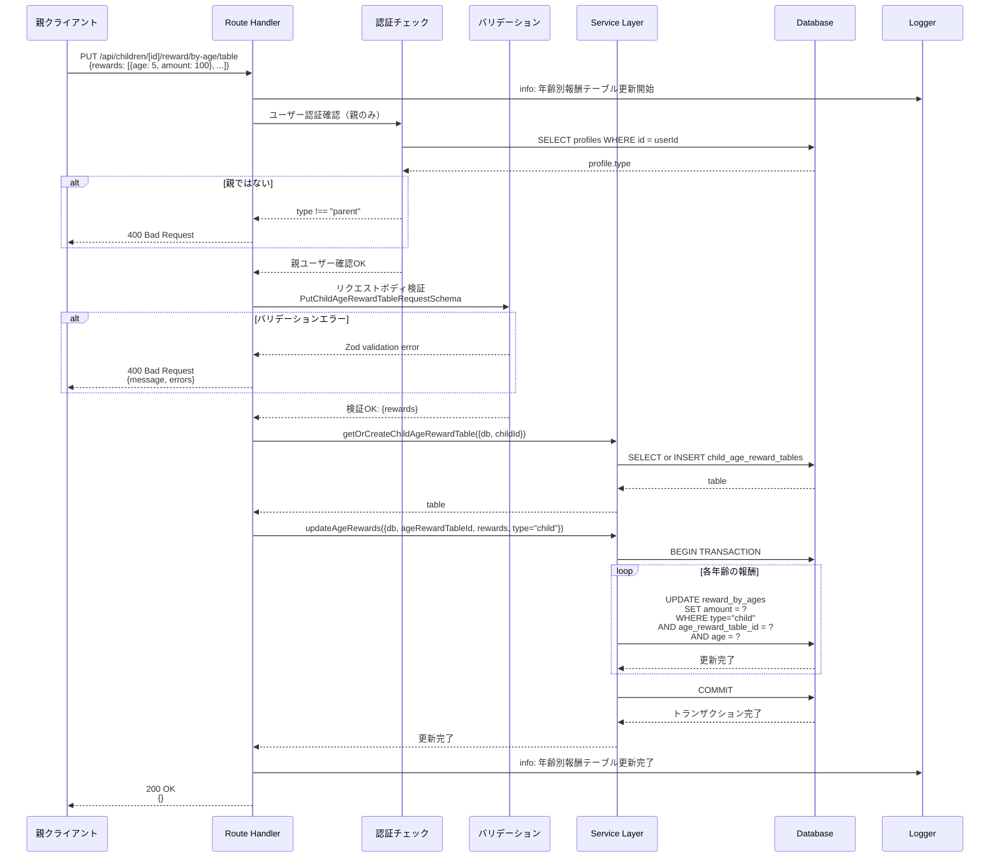
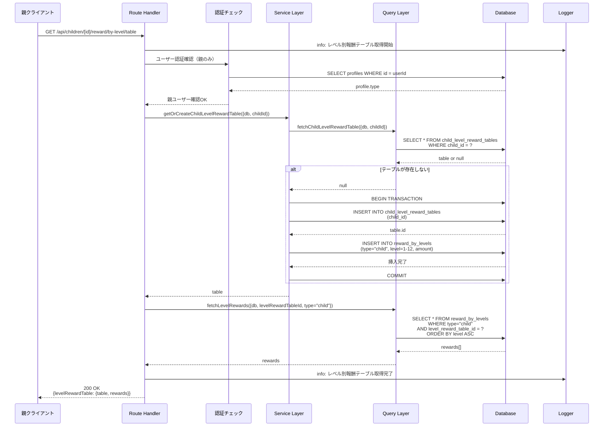
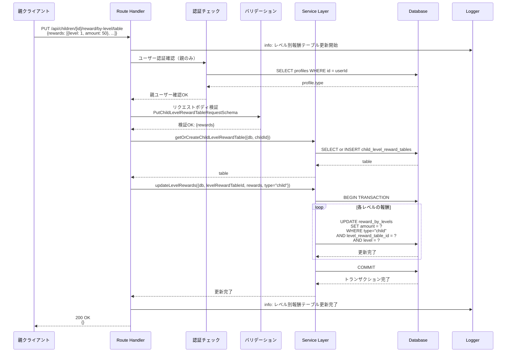
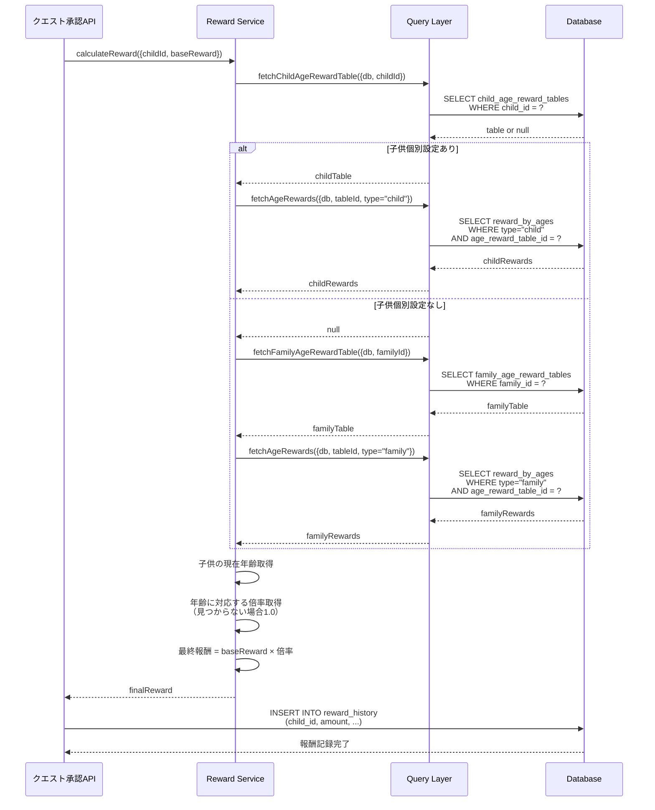

(2026年3月記載)

# 子供報酬API シーケンス図

## API エンドポイント一覧（再掲）

### 年齢別報酬
- `GET /api/children/[id]/reward/by-age/table`: 年齢別報酬テーブル取得
- `PUT /api/children/[id]/reward/by-age/table`: 年齢別報酬テーブル更新

### レベル別報酬
- `GET /api/children/[id]/reward/by-level/table`: レベル別報酬テーブル取得
- `PUT /api/children/[id]/reward/by-level/table`: レベル別報酬テーブル更新

## GET /api/children/[id]/reward/by-age/table（年齢別報酬テーブル取得）

## PUT /api/children/[id]/reward/by-age/table（年齢別報酬テーブル更新）

## GET /api/children/[id]/reward/by-level/table（レベル別報酬テーブル取得）

## PUT /api/children/[id]/reward/by-level/table（レベル別報酬テーブル更新）

## 報酬計算ロジック（クエスト完了時）

