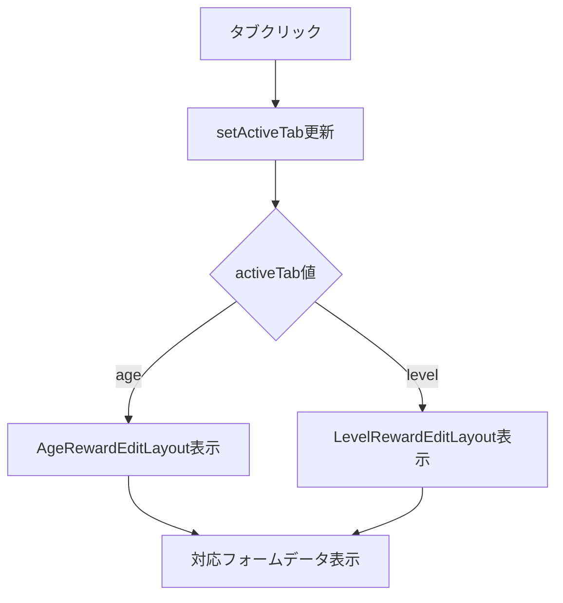
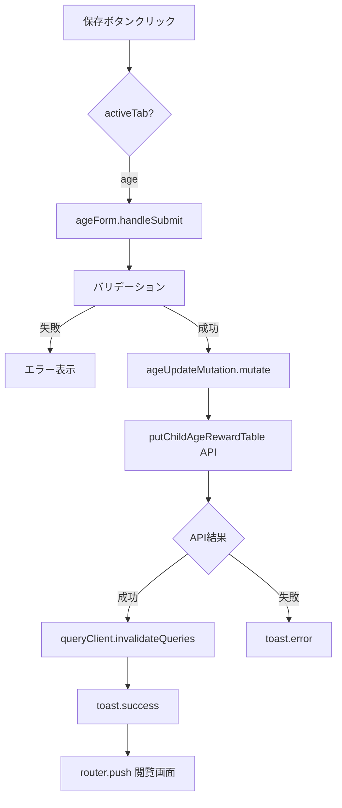
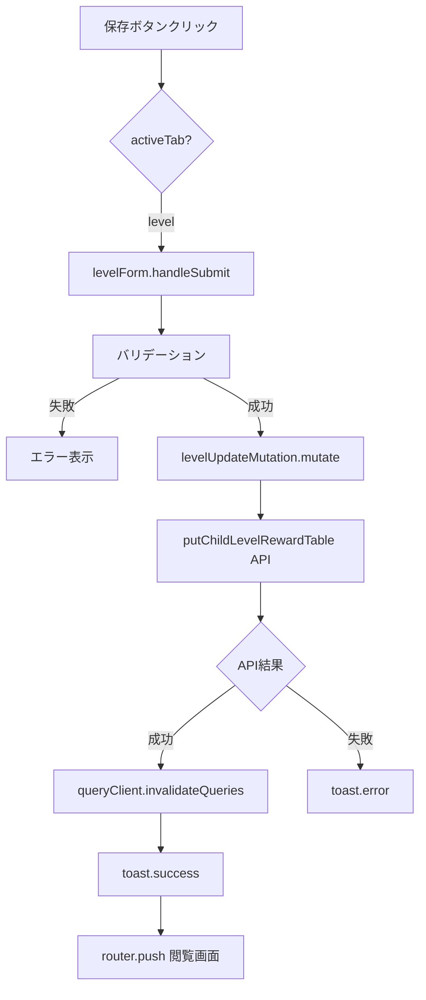
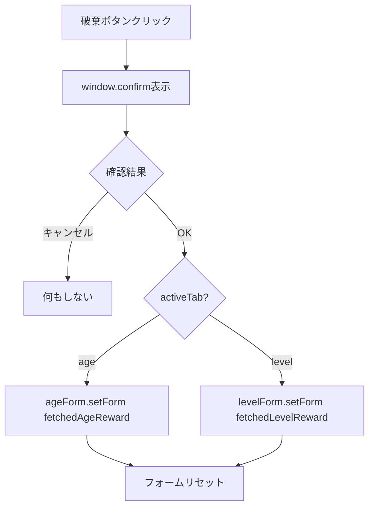
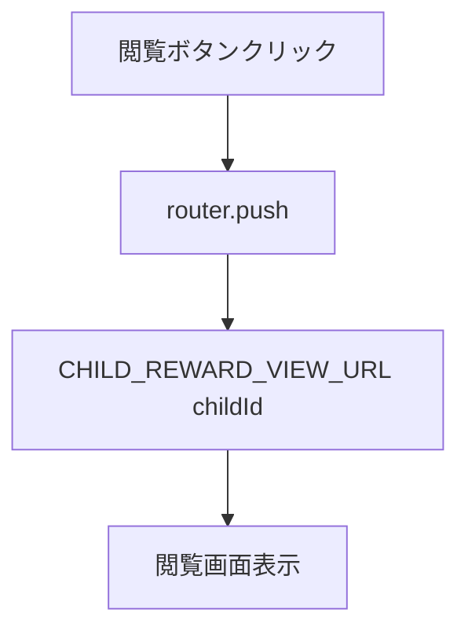
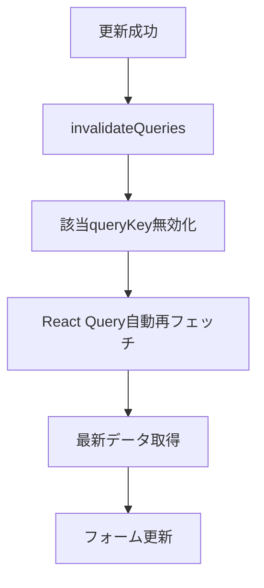
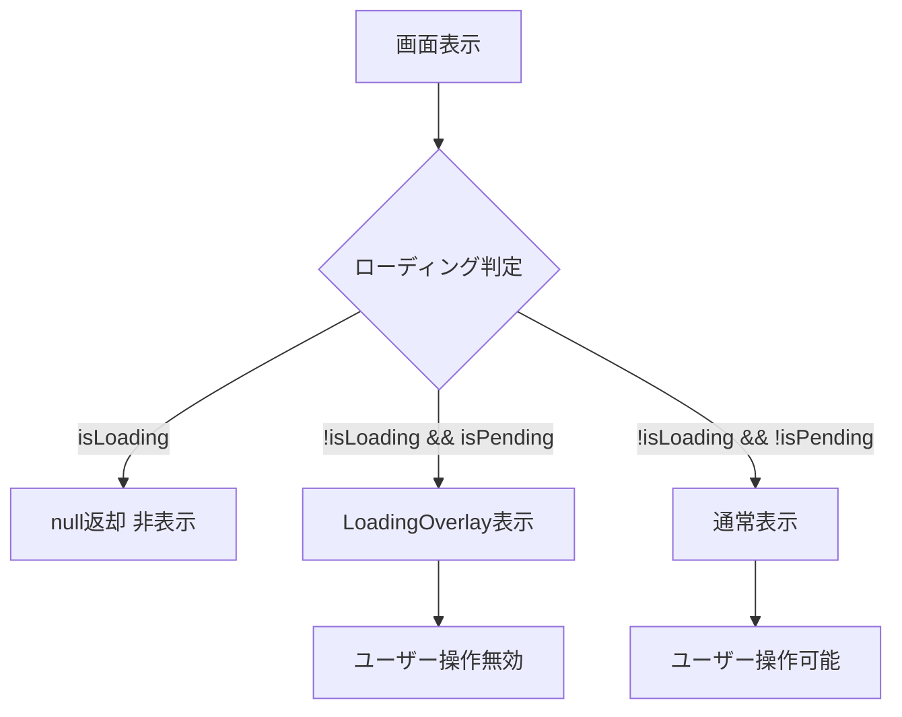
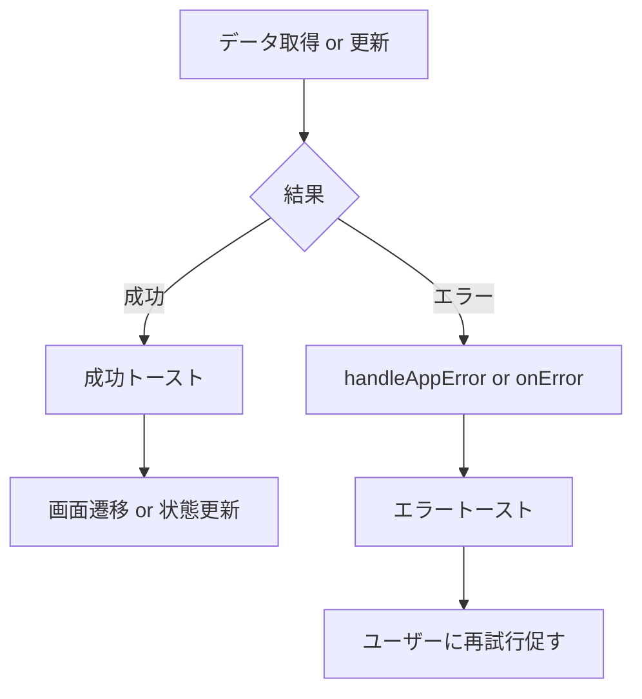

# 子供個別の報酬設定画面 - フローダイアグラム

（2026年3月記載）

## 画面初期化フロー

### 編集画面 (children/[id]/reward)

```mermaid
graph TD
  A[ページアクセス] --> B[ChildRewardEditレンダリング]
  B --> C[useChildAgeRewardForm初期化]
  B --> D[useChildLevelRewardForm初期化]
  C --> E[React Query: getChildAgeRewardTable]
  D --> F[React Query: getChildLevelRewardTable]
  E --> G[年齢別報酬取得中 isLoading=true]
  F --> H[レベル別報酬取得中 isLoading=true]
  G --> I{取得完了?}
  H --> I
  I -->|No| J[null返却 画面非表示]
  I -->|Yes| K[フォームに値設定]
  K --> L[タブ表示 activeTab="age"]
  L --> M[ユーザー操作待ち]
```

### 閲覧画面 (children/[id]/reward/view)

```mermaid
graph TD
  A[ページアクセス] --> B[ChildRewardViewレンダリング]
  B --> C[データ取得]
  C --> D[タブ表示 activeTab="age"]
  D --> E[読み取り専用レイアウト表示]
```

## タブ切り替えフロー



## フォーム編集フロー

```mermaid
graph TD
  A[ユーザー入力] --> B[フォーム値更新]
  B --> C[Zod Resolverバリデーション]
  C --> D{バリデーション}
  D -->|成功| E[errors = {}]
  D -->|失敗| F[errors更新]
  F --> G[フィールドエラー表示]
  E --> H[送信可能状態]
```

## 保存フロー

### お小遣いタブ保存



### ランク報酬タブ保存



## 破棄フロー



## 閲覧モード遷移フロー



## データ再取得フロー



## ローディング状態フロー



## エラーハンドリングフロー


