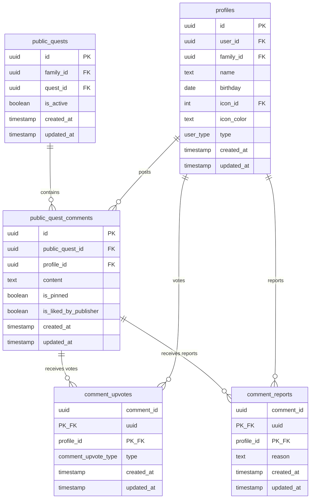

(2026年3月記載)

# コメント関連テーブル ER図

## コメントのデータ構造

## 主要なリレーション

### public_quest_comments
- **public_quest_id → public_quests.id**: カスケード削除（公開クエスト削除時にコメントも削除）
- **profile_id → profiles.id**: カスケード削除（プロフィール削除時にコメントも削除）
- **制約**: 各公開クエストにつき1つのコメントのみピン留め可能 (`UNIQUE (public_quest_id) WHERE is_pinned = true`)

### comment_upvotes
- **comment_id, profile_id**: 複合主キー（1ユーザ1コメントにつき1評価）
- **profile_id → profiles.id**: カスケード削除
- **type**: 'upvote'（高評価）または 'downvote'（低評価）

### comment_reports
- **comment_id, profile_id**: 複合主キー（1ユーザ1コメントにつき1報告）
- **profile_id → profiles.id**: カスケード削除
- **reason**: 報告理由（テキスト）

## データ整合性のルール

1. **評価の排他性**: ユーザは同じコメントに対して高評価または低評価のどちらか1つのみ
2. **自己評価禁止**: コメント投稿者は自分のコメントに評価できない（アプリケーションレベルで制御）
3. **ピン留めの一意性**: 1つの公開クエストにつき1つのコメントのみピン留め可能（DB制約）
4. **家族権限**: ピン留めと公開者いいねは公開クエストの家族メンバーのみ実行可能
5. **親のみ操作**: コメント投稿、評価、報告、ピン留めは親ユーザのみ実行可能
