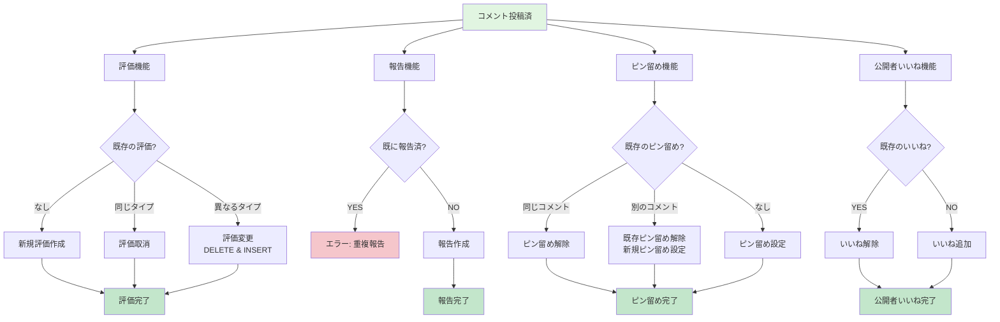

(2026年3月記載)

# コメントライフサイクル フロー図

## コメント全体のライフサイクル

```mermaid
flowchart TD
    Start([親がコメント投稿]) --> ValidateUser{親ユーザ?}
    ValidateUser -->|NO| Error1[エラー: 親のみ投稿可能]
    ValidateUser -->|YES| CreateComment[public_quest_comments作成<br/>content設定]
    
    CreateComment --> DisplayComment[コメント表示]
    
    DisplayComment --> Actions{ユーザアクション}
    
    Actions -->|編集| EditComment[PUT /comments/[commentId]<br/>content更新]
    Actions -->|削除| DeleteComment[DELETE /comments/[commentId]<br/>レコード削除]
    Actions -->|評価| VoteFlow[評価フロー]
    Actions -->|報告| ReportFlow[報告フロー]
    Actions -->|ピン留め| PinFlow[ピン留めフロー]
    Actions -->|公開者いいね| PublisherLikeFlow[公開者いいねフロー]
    
    EditComment --> DisplayComment
    DeleteComment --> End([終了])
    
    VoteFlow --> CheckSelfVote{自分のコメント?}
    CheckSelfVote -->|YES| Error2[エラー: 自己評価不可]
    CheckSelfVote -->|NO| VoteType{評価タイプ}
    
    VoteType -->|高評価| Upvote[POST /upvote<br/>comment_upvotes作成<br/>type: upvote]
    VoteType -->|低評価| Downvote[POST /downvote<br/>comment_upvotes作成<br/>type: downvote]
    VoteType -->|評価取消| RemoveVote[DELETE /upvote または /downvote<br/>comment_upvotes削除]
    
    Upvote --> DisplayComment
    Downvote --> DisplayComment
    RemoveVote --> DisplayComment
    
    ReportFlow --> CheckSelfReport{自分のコメント?}
    CheckSelfReport -->|YES| Error3[エラー: 自己報告不可]
    CheckSelfReport -->|NO| CreateReport[POST /report<br/>comment_reports作成<br/>reason設定]
    CreateReport --> DisplayComment
    
    PinFlow --> CheckFamily{公開クエストの<br/>家族メンバー?}
    CheckFamily -->|NO| Error4[エラー: 家族のみピン留め可能]
    CheckFamily -->|YES| PinAction{ピン留めアクション}
    
    PinAction -->|ピン留め| SetPin[POST /pin<br/>is_pinned: true<br/>既存のピン留め解除]
    PinAction -->|ピン留め解除| UnsetPin[DELETE /pin<br/>is_pinned: false]
    
    SetPin --> DisplayComment
    UnsetPin --> DisplayComment
    
    PublisherLikeFlow --> CheckPublisher{公開クエストの<br/>家族メンバー?}
    CheckPublisher -->|NO| Error5[エラー: 家族のみいいね可能]
    CheckPublisher -->|YES| LikeAction{いいねアクション}
    
    LikeAction -->|いいね| SetLike[POST /publisher-like<br/>is_liked_by_publisher: true]
    LikeAction -->|いいね解除| UnsetLike[DELETE /publisher-like<br/>is_liked_by_publisher: false]
    
    SetLike --> DisplayComment
    UnsetLike --> DisplayComment
    
    Error1 --> End
    Error2 --> DisplayComment
    Error3 --> DisplayComment
    Error4 --> DisplayComment
    Error5 --> DisplayComment
    
    style Start fill:#e1f5e1
    style End fill:#ffe1e1
    style Error1 fill:#f5c6cb
    style Error2 fill:#f5c6cb
    style Error3 fill:#f5c6cb
    style Error4 fill:#f5c6cb
    style Error5 fill:#f5c6cb
    style CreateComment fill:#c3e6cb
    style SetPin fill:#b8daff
    style SetLike fill:#b8daff
```

## モデレーション機能の詳細フロー


