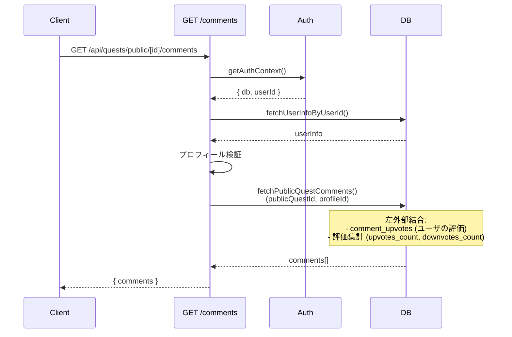
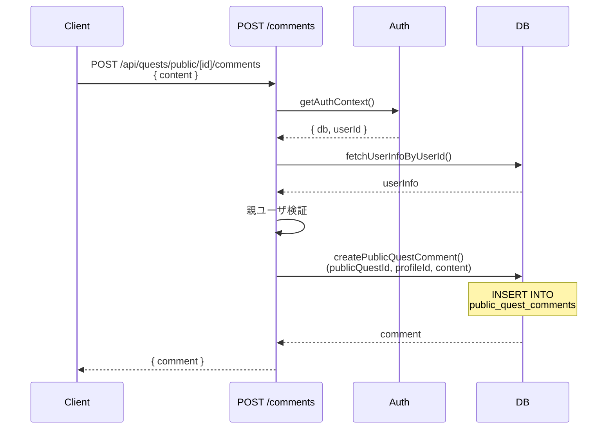
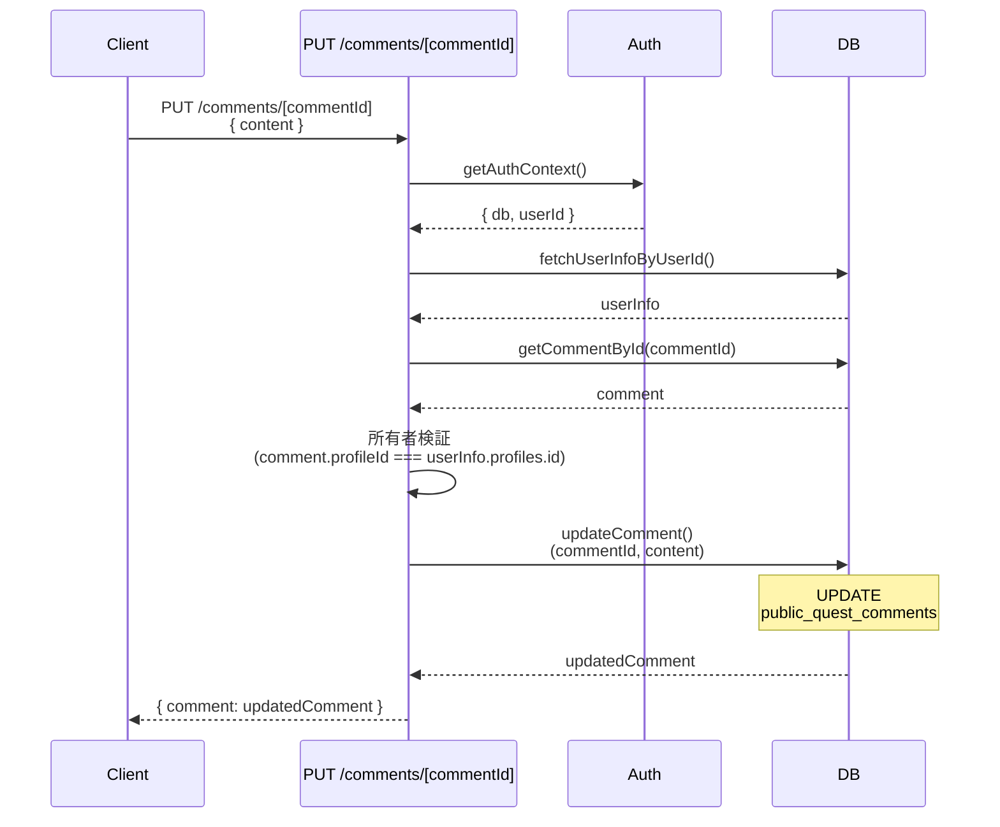
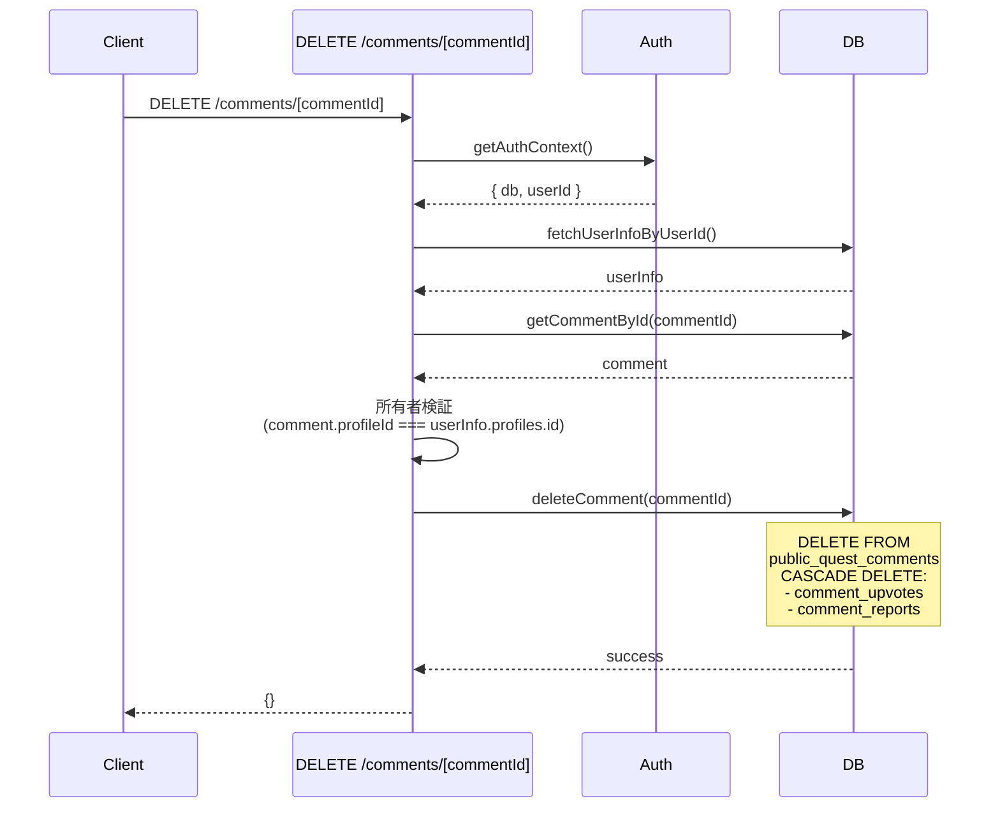
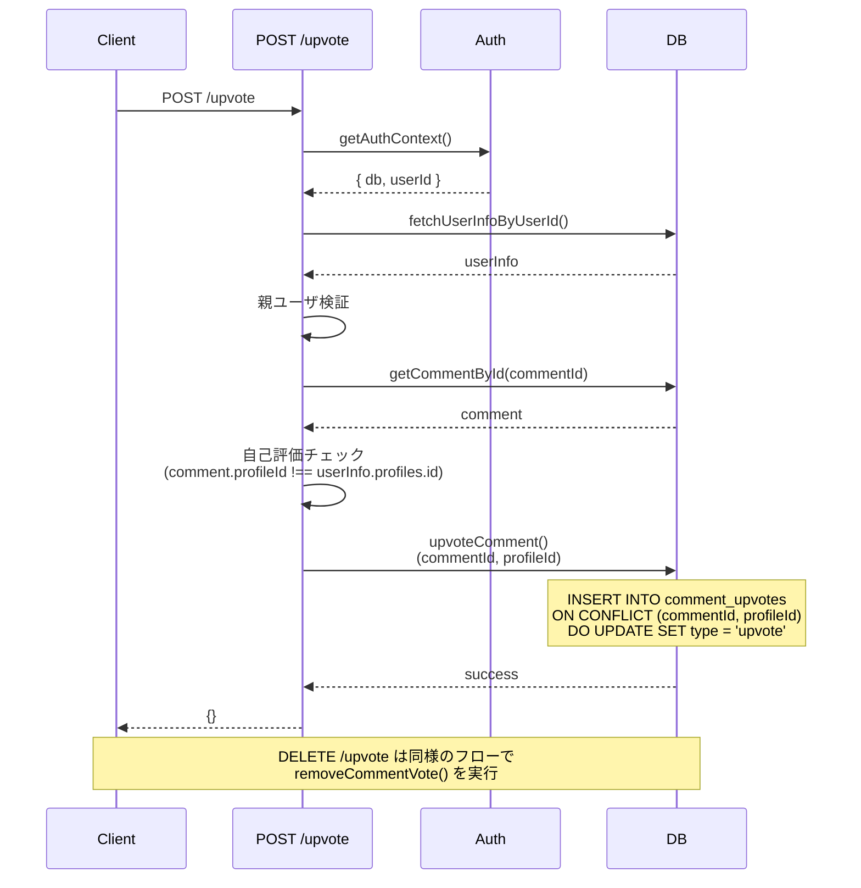
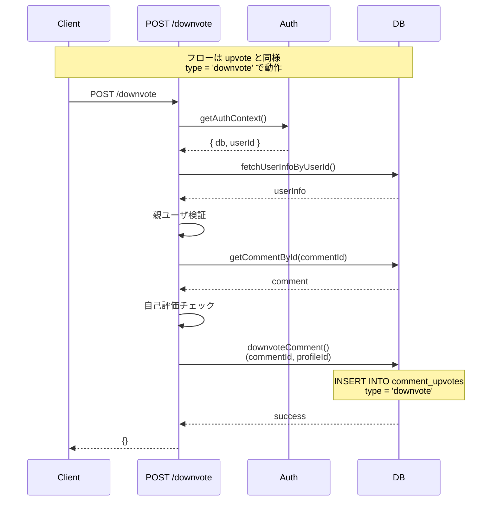
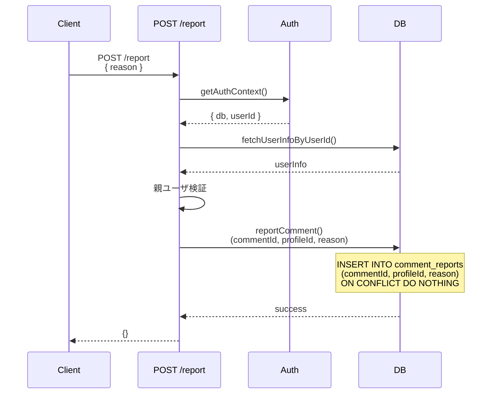
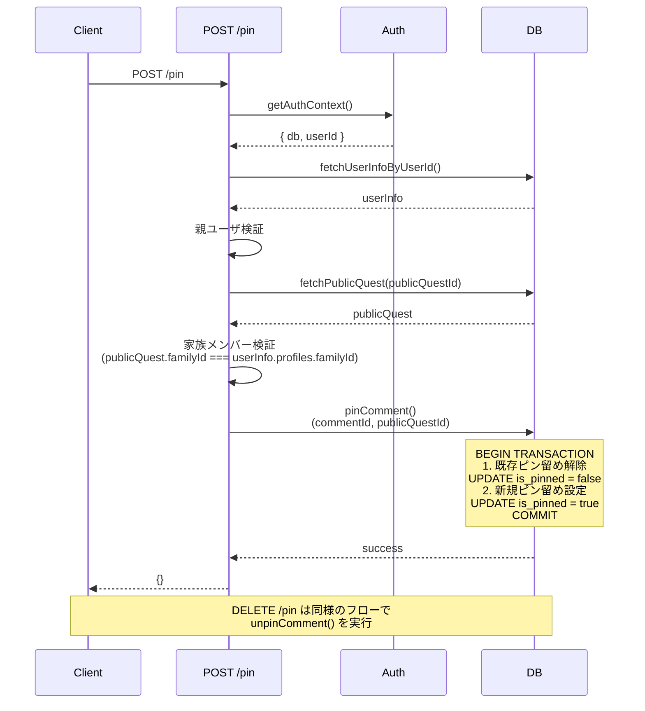
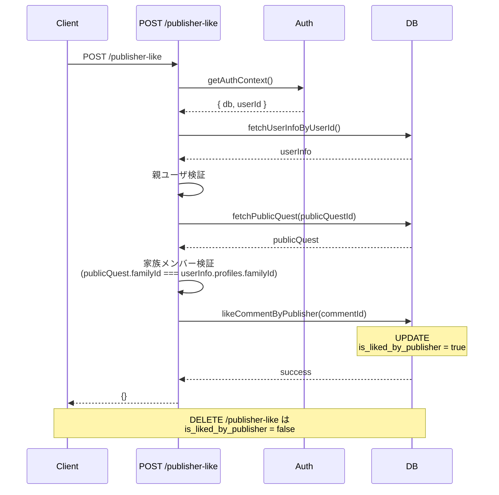
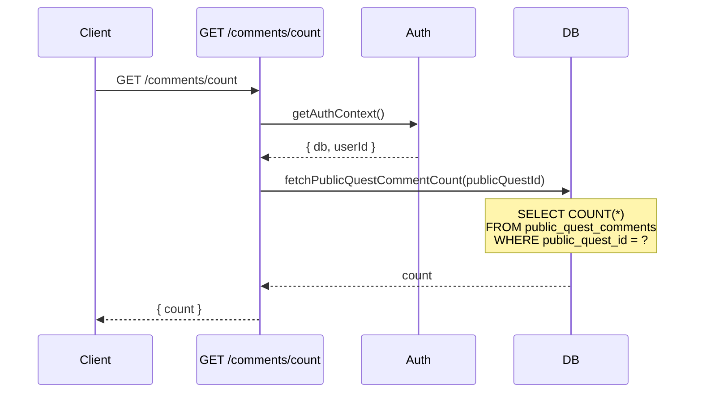

(2026年3月記載)

# コメントAPI シーケンス図

## 1. コメント一覧取得 (GET /api/quests/public/[id]/comments)

## 2. コメント投稿 (POST /api/quests/public/[id]/comments)

## 3. コメント更新 (PUT /api/quests/public/[id]/comments/[commentId])

## 4. コメント削除 (DELETE /api/quests/public/[id]/comments/[commentId])

## 5. コメント高評価 (POST/DELETE /api/quests/public/[id]/comments/[commentId]/upvote)

## 6. コメント低評価 (POST/DELETE /api/quests/public/[id]/comments/[commentId]/downvote)

## 7. コメント報告 (POST /api/quests/public/[id]/comments/[commentId]/report)

## 8. コメントピン留め (POST/DELETE /api/quests/public/[id]/comments/[commentId]/pin)

## 9. 公開者いいね (POST/DELETE /api/quests/public/[id]/comments/[commentId]/publisher-like)

## 10. コメント数取得 (GET /api/quests/public/[id]/comments/count)

