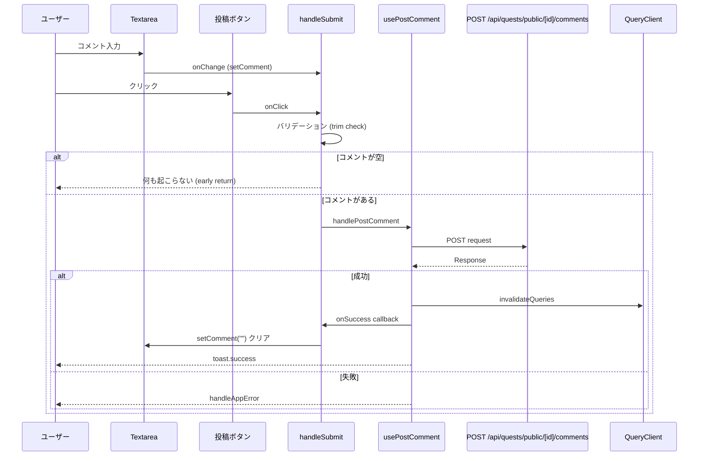

(2026年3月15日 14:30記載)

# コメント投稿機能のコンポーネント構造

## コンポーネント階層

```
PublicQuestComments (親コンポーネント)
└── CommentsModalLayout
    └── CommentsLayout
        ├── スクロールエリア (コメント一覧表示)
        └── 入力エリア (固定位置・下部)
            ├── Textarea (コメント入力)
            └── Button (投稿ボタン)
```

## 主要コンポーネント詳細

### PublicQuestComments
**ファイル**: `packages/web/app/(app)/quests/public/[id]/comments/PublicQuestComments.tsx`

**責務**:
- コメント投稿機能の統合管理
- 状態管理（コメント内容、ソート方法）
- API呼び出しの制御

**主要State**:
```typescript
const [comment, setComment] = useState("")           // 投稿するコメント内容
const [sortType, setSortType] = useState<SortType>("newest") // ソート方法
```

**主要フック**:
- `usePublicQuestComments`: コメント一覧取得
- `usePostComment`: コメント投稿
- `useUpvoteComment`: 高評価
- `useDownvoteComment`: 低評価
- `useReportComment`: コメント報告
- `useDeleteComment`: コメント削除
- `usePinComment`: ピン留め
- `usePublisherLike`: 公開者いいね

### CommentsModalLayout
**ファイル**: `packages/web/app/(app)/quests/public/[id]/comments/_components/CommentsModalLayout.tsx`

**責務**:
- モーダルUIのラッピング
- ヘッダー（タイトル + ソート選択）の管理
- 85vh固定高さのModal制御

**Props**:
```typescript
{
  isDark: boolean              // ダークモードフラグ
  opened: boolean              // モーダル開閉状態
  onClose: () => void          // 閉じるハンドラー
  sortType: SortType           // ソート方法
  onSortChange: (value: SortType) => void  // ソート変更ハンドラー
  children: ReactNode          // 子要素（CommentsLayout）
}
```

**レイアウト特性**:
- Modal size: `lg`
- height: `85vh`
- padding: `0` (内部コンポーネントで制御)
- Header: タイトル + ソート選択UI

### CommentsLayout
**ファイル**: `packages/web/app/(app)/quests/public/[id]/comments/_components/CommentsLayout.tsx`

**責務**:
- コメント一覧のスクロール表示
- コメント入力欄の下部固定表示
- ローディングオーバーレイの管理

**Props**:
```typescript
{
  comments: CommentItem[] | undefined
  isDark: boolean
  isLoading: boolean
  isQuestCreator: (familyId: string) => boolean
  hasLiked: (familyId: string) => boolean
  isPublisherFamily: boolean
  isCurrentUser: (profileId: string) => boolean
  onUpvote: (commentId: string) => void
  onDownvote: (commentId: string) => void
  onReport: (commentId: string) => void
  onDelete: (commentId: string) => void
  onPin: (commentId: string, isPinned: boolean) => void
  onPublisherLike: (commentId: string, isLiked: boolean) => void
  comment: string                      // 投稿するコメント内容
  onCommentChange: (value: string) => void  // コメント変更ハンドラー
  onSubmit: () => void                 // 投稿ハンドラー
  isPostingComment: boolean            // 投稿中フラグ
}
```

**レイアウト構造**:
```tsx
<Box style={{ height: "100%", display: "flex", flexDirection: "column" }}>
  {/* スクロールエリア - flex: 1, overflow: auto */}
  <Box style={{ flex: 1, overflow: "auto", padding: "1rem" }}>
    <LoadingOverlay visible={isLoading} />
    <Stack gap="md">
      {/* コメントアイテム一覧 */}
    </Stack>
  </Box>

  {/* 入力エリア - flexShrink: 0, borderTop, padding: "1rem" */}
  <Box style={{ flexShrink: 0, borderTop: "1px solid ...", padding: "1rem" }}>
    <Group gap="md" align="flex-start">
      <Textarea 
        placeholder="コメントを入力してください"
        value={comment}
        onChange={(e) => onCommentChange(e.currentTarget.value)}
        minRows={1}
        maxRows={4}
        style={{ flex: 1 }}
      />
      <Button
        size="md"
        radius="xl"
        onClick={onSubmit}
        disabled={!comment.trim() || isPostingComment}
      >
        投稿
      </Button>
    </Group>
  </Box>
</Box>
```

## 入力エリアの詳細設計

### Textarea仕様
- **placeholder**: "コメントを入力してください"
- **minRows**: 1 (最小1行表示)
- **maxRows**: 4 (最大4行まで自動拡張)
- **style**: `{ flex: 1 }` (横幅いっぱいに拡張)
- **制御**: value/onChangeによる制御コンポーネント

### Buttonの状態管理
**disabled条件**:
```typescript
disabled={!comment.trim() || isPostingComment}
```
- `!comment.trim()`: 空白のみのコメントは投稿不可
- `isPostingComment`: 投稿中は二重送信防止

**UI仕様**:
- size: `md`
- radius: `xl` (丸みのあるボタン)
- text: "投稿"

## フックの役割

### usePostComment
**ファイル**: `packages/web/app/(app)/quests/public/[id]/comments/_hooks/usePostComment.ts`

**責務**:
- コメント投稿のミューテーション管理
- 成功時のキャッシュ無効化
- トースト通知表示

**返り値**:
```typescript
{
  handlePostComment: ({
    publicQuestId: string,
    content: string,
    onSuccess?: () => void
  }) => void,
  isLoading: boolean
}
```

**内部処理**:
1. `postPublicQuestComment` API呼び出し
2. 成功時:
   - `toast.success("コメントを投稿しました")`
   - `queryClient.invalidateQueries` でコメント一覧・カウントを無効化
   - `onSuccess` コールバック実行（コメント内容クリア）
3. 失敗時:
   - `handleAppError` でエラーハンドリング

## 投稿フロー



## バリデーションルール

### クライアント側バリデーション
1. **空白チェック**: `!comment.trim()` で空白のみのコメントを拒否
2. **投稿中チェック**: `isPostingComment` で二重送信防止

### サーバー側バリデーション
**ファイル**: `packages/web/app/api/quests/public/[id]/comments/route.ts`

1. **認証チェック**: `getAuthContext()` でユーザー認証確認
2. **権限チェック**: 親ユーザー (`profile.type === "parent"`) のみ投稿可能
3. **コンテンツ存在チェック**: リクエストボディに `content` フィールドが必須

**エラーレスポンス例**:
```typescript
// 親以外が投稿を試みた場合
throw new ServerError("親ユーザのみコメントできます。")
```

## 状態管理のポイント

### ローディング状態の統合
```typescript
const isLoading = 
  isPostingComment || 
  isUpvoting || 
  isDownvoting || 
  isReporting || 
  isDeleting || 
  isPinning || 
  isPublisherLiking
```

全てのミューテーション操作のローディング状態を統合して、LoadingOverlayの表示を制御する。

### キャッシュ無効化戦略
投稿成功時に以下のキャッシュを無効化:
```typescript
queryClient.invalidateQueries({ queryKey: ["publicQuestComments", publicQuestId] })
queryClient.invalidateQueries({ queryKey: ["publicQuestCommentsCount", publicQuestId] })
```

## スタイリング詳細

### ダークモード対応
```typescript
style={{
  borderTop: `1px solid ${isDark ? "#373A40" : "#dee2e6"}`,
}}
```

### レスポンシブ対応
- Textarea: `style={{ flex: 1 }}` で可変幅
- Button: 固定幅（`size="md"`）
- Group: `align="flex-start"` でテキストエリア拡張時の整列
