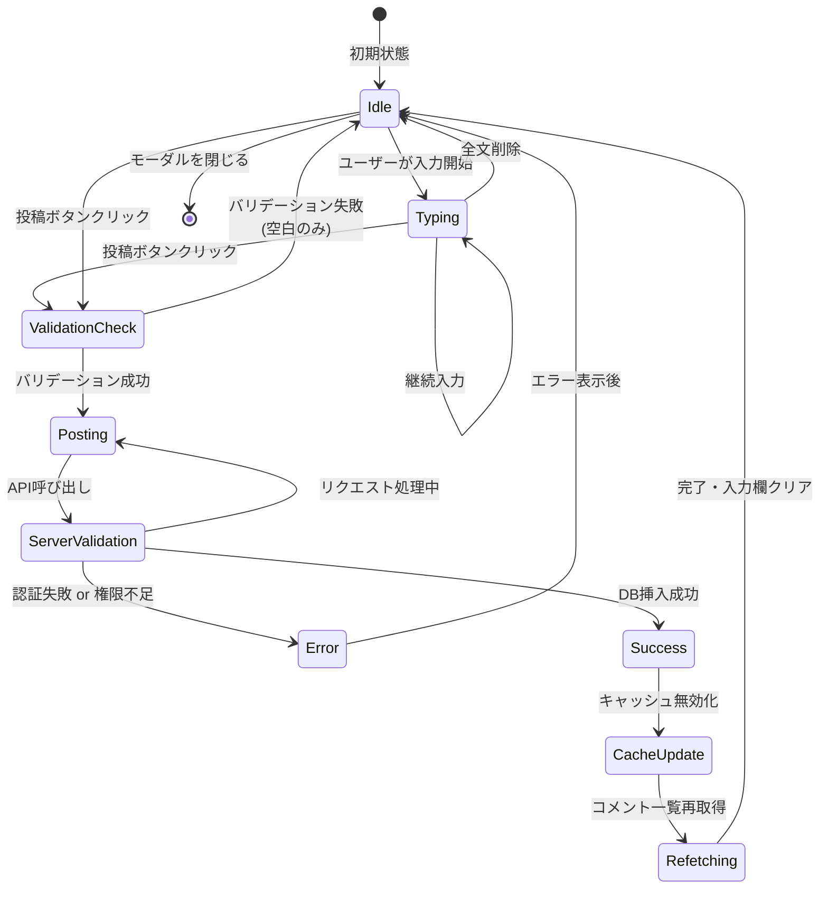
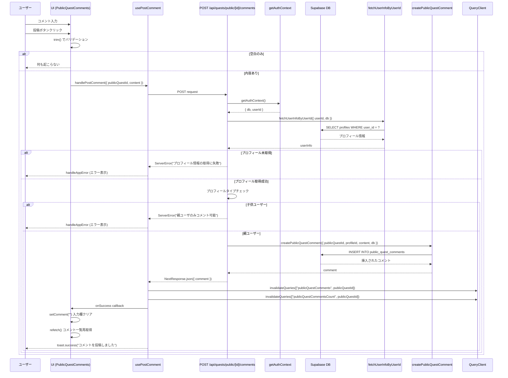
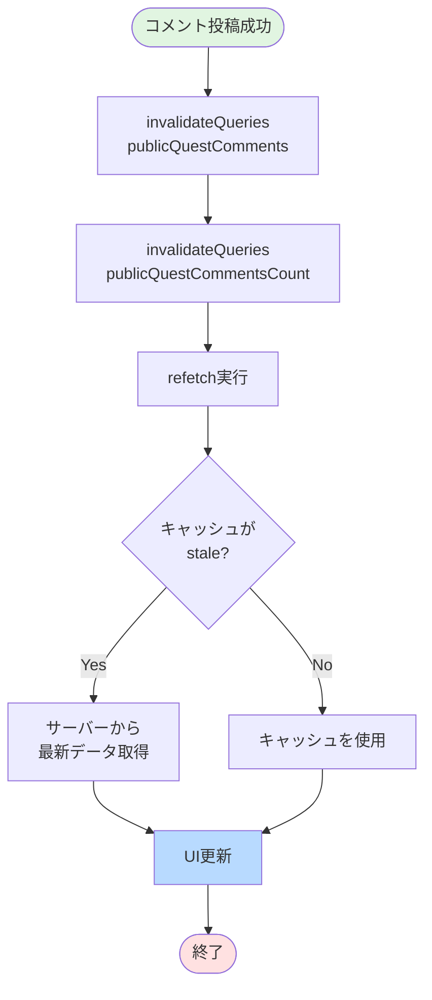
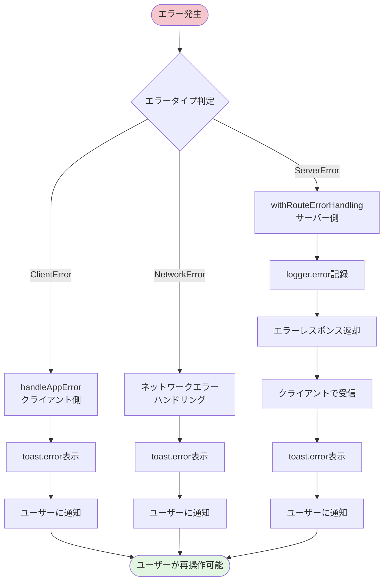

(2026年3月記載)

# コメント投稿フロー図

## 全体フロー

```mermaid
flowchart TD
    Start([ユーザーがコメント<br/>モーダルを開く]) --> OpenModal[PublicQuestComments<br/>レンダリング]
    OpenModal --> LoadComments[usePublicQuestComments<br/>コメント一覧取得]
    LoadComments --> DisplayModal[CommentsModalLayout表示<br/>85vh Modal]
    DisplayModal --> DisplayLayout[CommentsLayout表示<br/>一覧 + 入力欄]
    
    DisplayLayout --> UserInput{ユーザー操作}
    
    UserInput -->|コメント入力| InputText[Textarea onChange<br/>setComment実行]
    InputText --> UserInput
    
    UserInput -->|投稿ボタン<br/>クリック| ValidateInput{バリデーション}
    
    ValidateInput -->|空白のみ| DoNothing[何もしない<br/>early return]
    DoNothing --> UserInput
    
    ValidateInput -->|内容あり| PostComment[handlePostComment実行]
    PostComment --> ApiCall[POST /api/quests/public<br/>/[id]/comments]
    
    ApiCall --> ServerValidation{サーバー側<br/>バリデーション}
    
    ServerValidation -->|認証失敗| AuthError[401 Unauthorized]
    ServerValidation -->|権限不足<br/>子供ユーザー| PermissionError["親ユーザのみ<br/>コメント可能"エラー]
    ServerValidation -->|成功| InsertDB[public_quest_comments<br/>テーブルに挿入]
    
    AuthError --> HandleError[handleAppError<br/>エラー表示]
    PermissionError --> HandleError
    HandleError --> UserInput
    
    InsertDB --> ApiSuccess[200 OK<br/>レスポンス返却]
    ApiSuccess --> InvalidateCache[QueryClient<br/>キャッシュ無効化]
    InvalidateCache --> ClearInput[setComment("")<br/>入力欄クリア]
    ClearInput --> RefetchComments[コメント一覧再取得<br/>refetch実行]
    RefetchComments --> ShowToast[toast.success<br/>"コメントを投稿しました"]
    ShowToast --> UpdateUI[UI更新<br/>新コメント表示]
    UpdateUI --> UserInput
    
    UserInput -->|モーダルを閉じる| CloseModal[onClose実行]
    CloseModal --> End([終了])
    
    style Start fill:#e1f5e1
    style End fill:#ffe1e1
    style InsertDB fill:#c3e6cb
    style AuthError fill:#f5c6cb
    style PermissionError fill:#f5c6cb
    style ShowToast fill:#b8daff
```

## コメント投稿の詳細ステートマシン



## API呼び出しシーケンス



## バリデーションフロー

```mermaid
flowchart TD
    Start([投稿ボタンクリック]) --> ClientValidation[クライアント側<br/>バリデーション]
    
    ClientValidation --> CheckEmpty{comment.trim()<br/>が空?}
    
    CheckEmpty -->|Yes| ReturnEarly[early return<br/>何もしない]
    ReturnEarly --> End1([終了])
    
    CheckEmpty -->|No| CheckPosting{isPostingComment<br/>= true?}
    
    CheckPosting -->|Yes| ButtonDisabled[ボタン無効化<br/>二重送信防止]
    ButtonDisabled --> End2([終了])
    
    CheckPosting -->|No| SendRequest[API リクエスト送信]
    
    SendRequest --> ServerValidation[サーバー側<br/>バリデーション]
    
    ServerValidation --> CheckAuth{認証済み?}
    CheckAuth -->|No| AuthError[401 Unauthorized]
    AuthError --> End3([終了])
    
    CheckAuth -->|Yes| CheckProfile{プロフィール<br/>取得成功?}
    CheckProfile -->|No| ProfileError[ServerError<br/>プロフィール取得失敗]
    ProfileError --> End4([終了])
    
    CheckProfile -->|Yes| CheckType{type === "parent"?}
    CheckType -->|No| TypeError["親ユーザのみ<br/>コメント可能"エラー]
    TypeError --> End5([終了])
    
    CheckType -->|Yes| InsertDB[DB挿入実行]
    InsertDB --> Success[投稿成功]
    Success --> End6([終了])
    
    style Success fill:#c3e6cb
    style AuthError fill:#f5c6cb
    style ProfileError fill:#f5c6cb
    style TypeError fill:#f5c6cb
```

## キャッシュ無効化フロー



## エラーハンドリングフロー



## ユーザーインタラクションタイムライン

```mermaid
gantt
    title コメント投稿のユーザー体験タイムライン
    dateFormat s
    axisFormat %S秒

    section ユーザー操作
    モーダルを開く          :done, 0, 1s
    コメント入力            :done, 1s, 5s
    投稿ボタンクリック      :done, 6s, 1s

    section システム処理
    バリデーション           :active, 7s, 0.1s
    API呼び出し             :active, 7.1s, 0.5s
    DB挿入                  :active, 7.6s, 0.3s
    キャッシュ無効化         :active, 7.9s, 0.1s

    section UI更新
    入力欄クリア            :crit, 8s, 0.1s
    トースト表示            :crit, 8.1s, 2s
    コメント一覧更新        :crit, 8s, 0.5s
```

## 主要な状態遷移

### isPostingComment (ローディング状態)
```
false (初期状態)
  ↓ (投稿ボタンクリック)
true (投稿中)
  ↓ (API レスポンス受信)
false (完了 or エラー)
```

### comment (入力内容)
```
"" (初期状態・空)
  ↓ (ユーザー入力)
"ユーザーの入力内容"
  ↓ (投稿成功)
"" (クリア)
```

### comments (コメント一覧)
```
undefined (初期状態)
  ↓ (usePublicQuestComments)
CommentItem[] (取得済み)
  ↓ (refetch after post)
CommentItem[] (新コメント含む)
```
