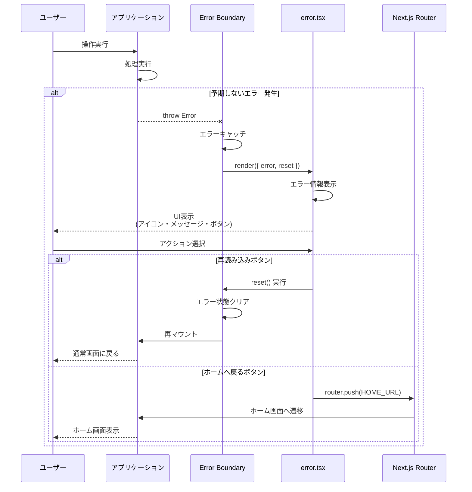
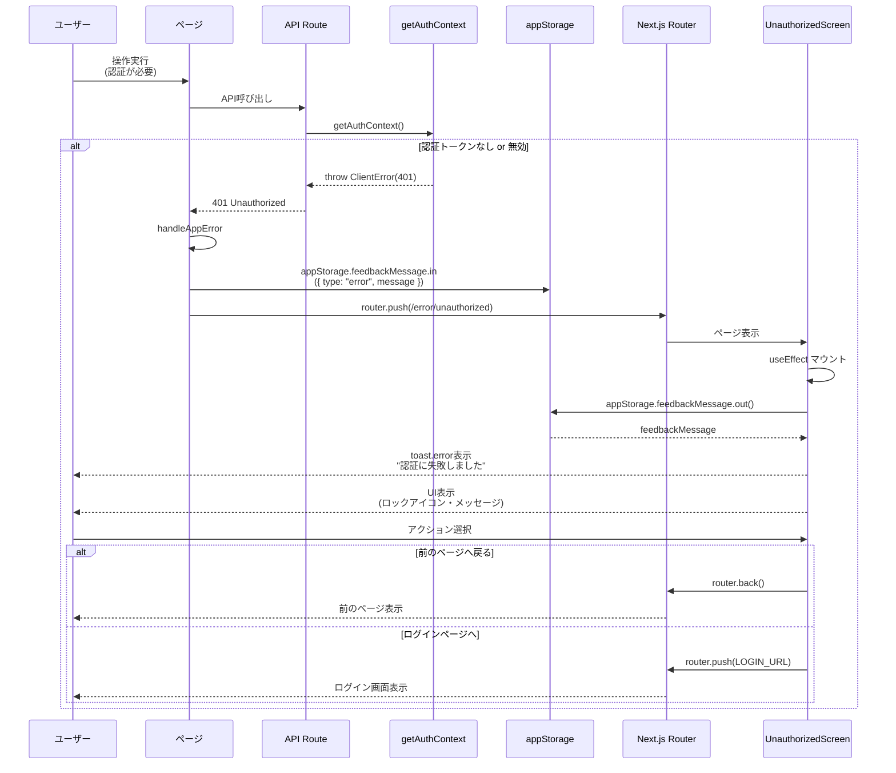
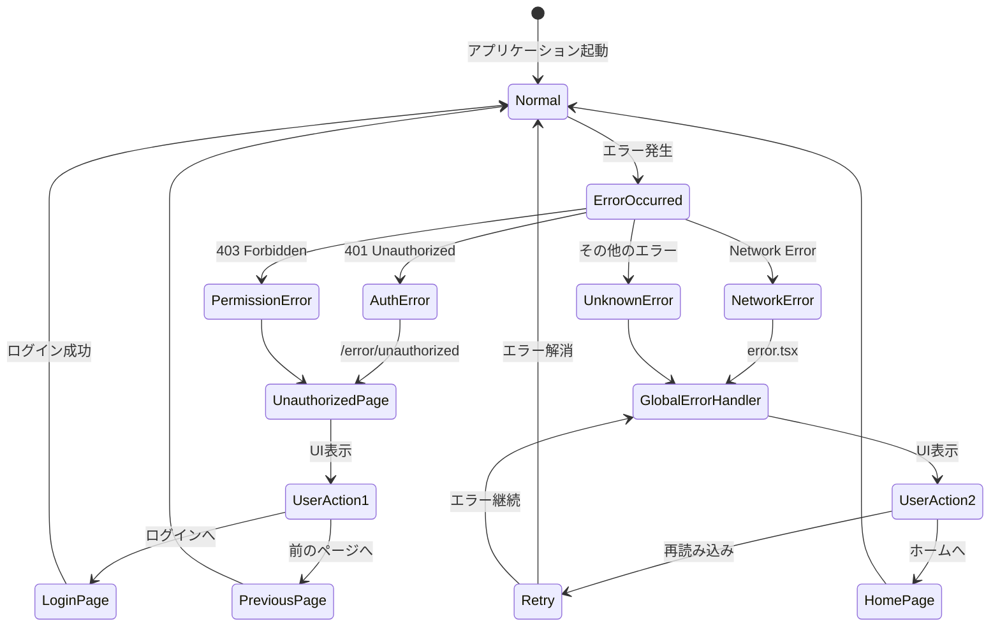
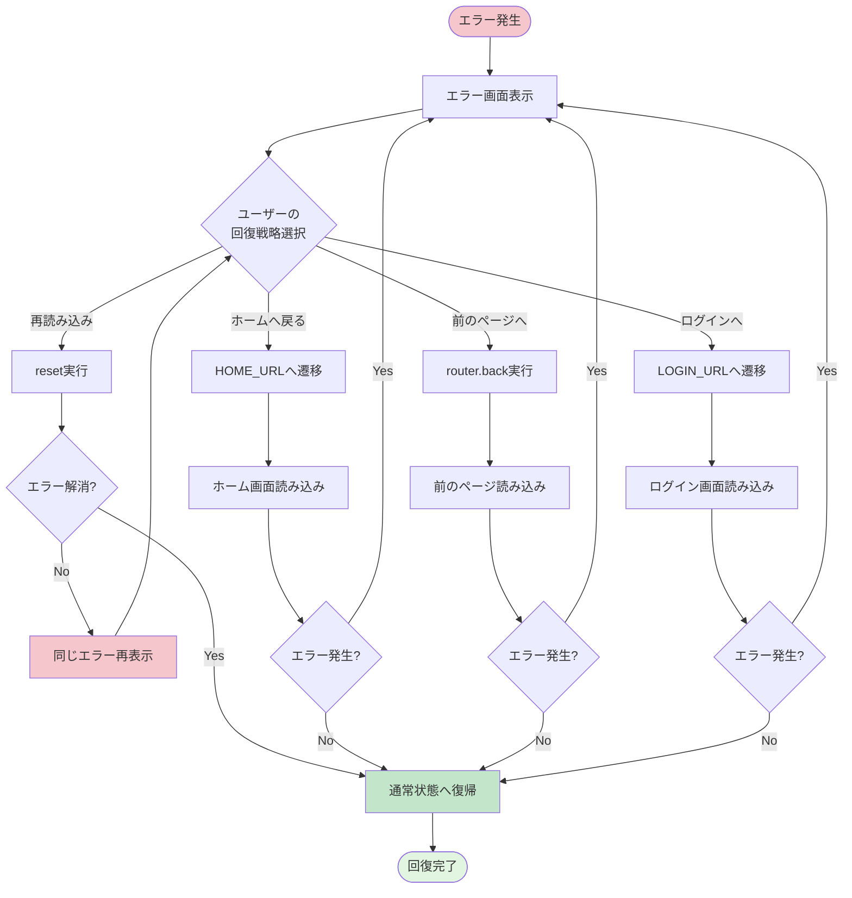
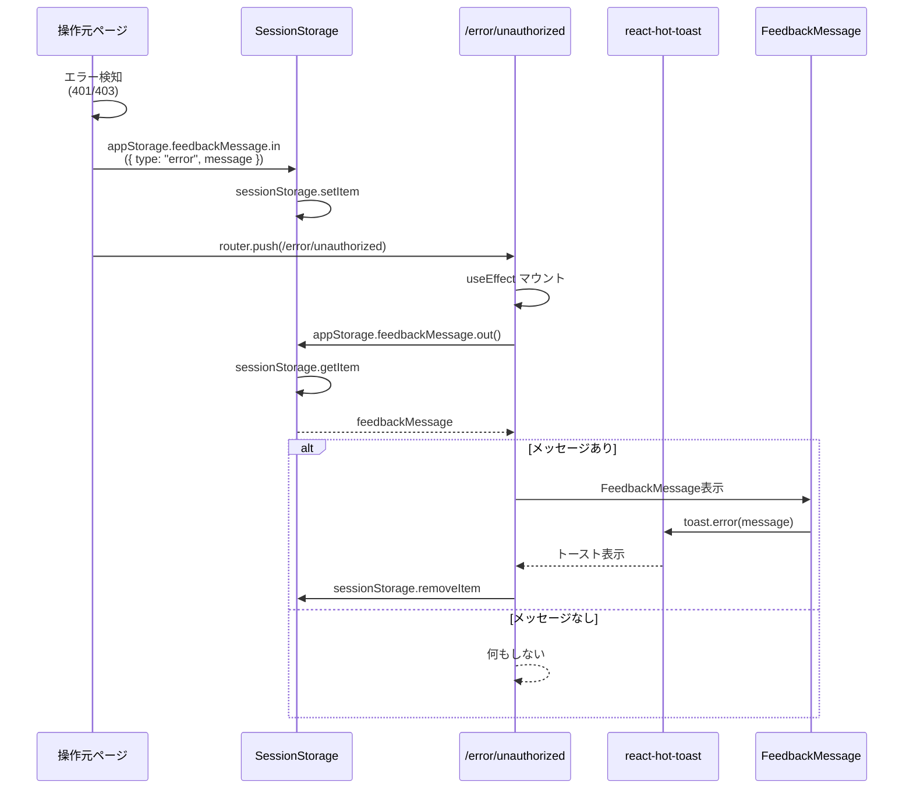
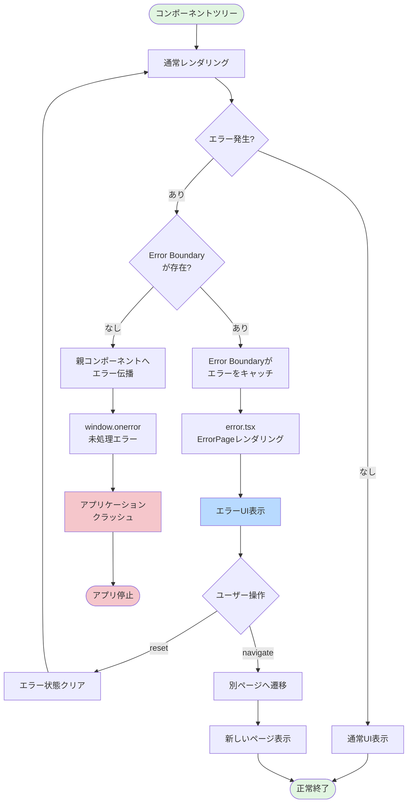
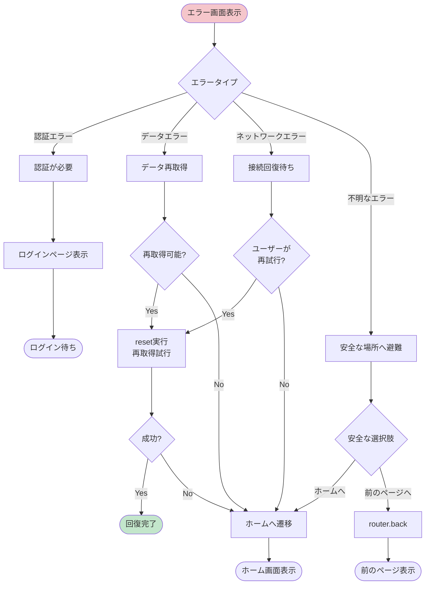

(2026年3月15日 14:30記載)

# エラー処理フロー図

## 全体エラーハンドリングフロー

```mermaid
flowchart TD
    Start([アプリケーション実行]) --> Operation[ユーザー操作<br/>・API呼び出し<br/>・画面遷移]
    
    Operation --> CheckError{エラー発生?}
    
    CheckError -->|エラーなし| ContinueApp[通常処理継続]
    ContinueApp --> Operation
    
    CheckError -->|エラー発生| DetermineType{エラータイプ判定}
    
    DetermineType -->|認証エラー<br/>401 Unauthorized| AuthError[認証エラーパス]
    DetermineType -->|権限エラー<br/>403 Forbidden| PermissionError[権限エラーパス]
    DetermineType -->|その他<br/>予期しないエラー| UnknownError[グローバルエラー<br/>ハンドラー]
    
    AuthError --> SaveMessage[appStorage.feedbackMessage<br/>メッセージ保存]
    PermissionError --> SaveMessage
    SaveMessage --> RedirectUnauth[/error/unauthorized<br/>へリダイレクト]
    RedirectUnauth --> DisplayUnauth[UnauthorizedScreen<br/>表示]
    
    UnknownError --> CatchBoundary[Error Boundary<br/>がキャッチ]
    CatchBoundary --> DisplayError[error.tsx<br/>ErrorPage表示]
    
    DisplayUnauth --> UserActionUnauth{ユーザー操作}
    UserActionUnauth -->|前のページへ戻る| GoBack[router.back実行]
    UserActionUnauth -->|ログインページへ| GoLogin[router.push<br/>LOGIN_URL]
    
    DisplayError --> UserActionError{ユーザー操作}
    UserActionError -->|再読み込み| ResetError[reset実行<br/>エラー状態クリア]
    UserActionError -->|ホームへ戻る| GoHome[router.push<br/>HOME_URL]
    
    GoBack --> Operation
    GoLogin --> LoginPage[ログイン画面]
    ResetError --> Operation
    GoHome --> HomePage[ホーム画面]
    
    LoginPage --> Operation
    HomePage --> Operation
    
    style Start fill:#e1f5e1
    style AuthError fill:#f5c6cb
    style PermissionError fill:#f5c6cb
    style UnknownError fill:#f5c6cb
    style DisplayUnauth fill:#b8daff
    style DisplayError fill:#b8daff
```

## グローバルエラーハンドラーのライフサイクル



## 認証エラーフロー



## エラータイプ別のルーティング



## エラー回復フロー



## セッションストレージとの連携フロー



## Error Boundary の動作原理



## エラーメッセージの表示タイミング

```mermaid
gantt
    title エラー発生からメッセージ表示までのタイムライン
    dateFormat s
    axisFormat %S秒

    section エラー発生
    API呼び出しエラー      :done, 0, 0.5s
    エラー検知             :done, 0.5s, 0.1s

    section ストレージ操作
    feedbackMessage保存     :active, 0.6s, 0.1s

    section ページ遷移
    router.push実行         :active, 0.7s, 0.2s
    UnauthorizedScreen表示  :active, 0.9s, 0.3s

    section メッセージ表示
    useEffect実行           :crit, 1.2s, 0.1s
    feedbackMessage取得     :crit, 1.3s, 0.1s
    toast.error表示         :crit, 1.4s, 3s
```

## グローバルエラーとローカルエラーの判別

```mermaid
flowchart TD
    Start([エラー発生]) --> CheckHandled{エラーが<br/>catch済み?}
    
    CheckHandled -->|Yes| LocalError[ローカルエラー<br/>ハンドリング]
    CheckHandled -->|No| GlobalError[グローバルエラー<br/>Error Boundary]
    
    LocalError --> CheckType{エラータイプ判定}
    
    CheckType -->|ClientError<br/>401/403| RedirectAuth[認証エラーページへ]
    CheckType -->|ServerError<br/>500系| ShowToast[toast.error表示]
    CheckType -->|ValidationError| ShowInline[インラインエラー表示]
    
    GlobalError --> BoundaryRender[error.tsx<br/>レンダリング]
    
    RedirectAuth --> UnauthorizedPage[/error/unauthorized]
    ShowToast --> StayPage[同じページに留まる]
    ShowInline --> StayPage
    
    BoundaryRender --> ErrorPage[ErrorPage表示]
    
    UnauthorizedPage --> End1([ユーザー操作待ち])
    StayPage --> End2([ユーザー操作待ち])
    ErrorPage --> End3([ユーザー操作待ち])
    
    style Start fill:#f5c6cb
    style LocalError fill:#fff4e6
    style GlobalError fill:#ffe4e6
```

## リカバリー戦略の決定ツリー


