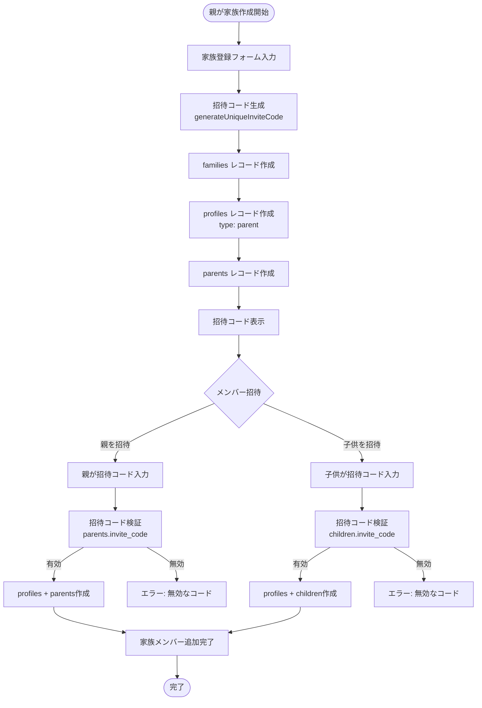
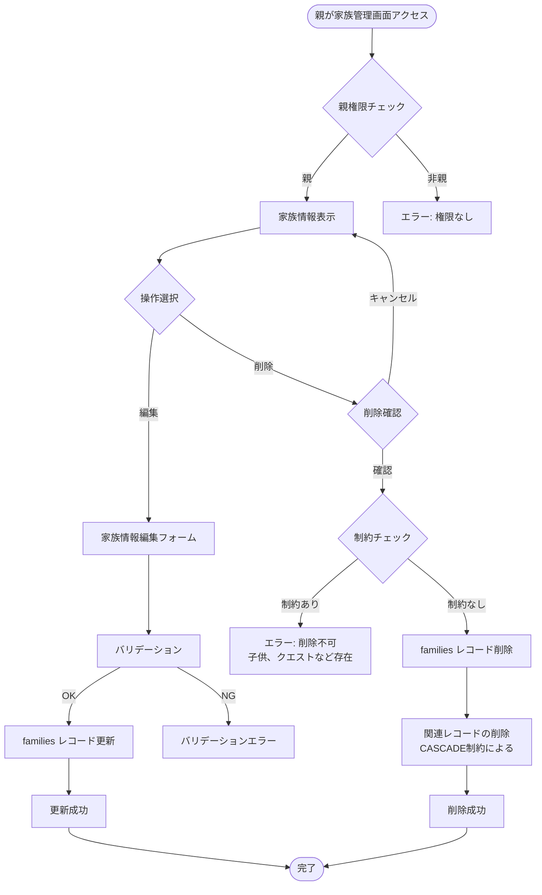
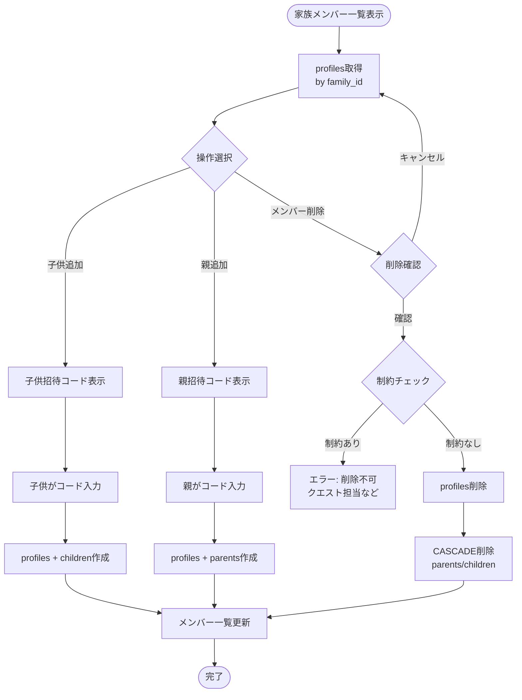

(2026年3月記載)

# 家族管理フロー図

## 家族作成からメンバー参加までのフロー



## 家族情報更新・削除フロー



## メンバー管理フロー



## ロール（親・子供）管理の概念

### 親の責務
- 家族作成・編集・削除
- 子供の招待コード生成・管理
- 親の招待コード生成・管理
- クエスト作成・承認・却下
- 報酬設定

### 子供の責務
- クエスト受注
- 完了報告
- 報酬受け取り
- 貯金管理

### 権限の判定方法
```typescript
// profiles.typeで判定
if (profile.type === 'parent') {
  // 親の権限
} else if (profile.type === 'child') {
  // 子供の権限
}

// parents/childrenテーブルの存在でも判定可能
const parent = await db.query.parents.findFirst({
  where: eq(parents.profileId, profileId)
})
if (parent) {
  // 親確認
}
```

## 家族フォロー機能フロー

```mermaid
flowchart TD
    Start([家族詳細画面表示]) --> CheckFollowStatus[フォロー状態取得<br/>GET /api/families/[id]/follow/status]
    CheckFollowStatus --> ShowButton{フォロー状態}
    
    ShowButton -->|未フォロー| ShowFollow[フォローボタン表示]
    ShowButton -->|フォロー中| ShowUnfollow[フォロー解除ボタン表示]
    
    ShowFollow --> ClickFollow[フォロークリック]
    ClickFollow --> CreateFollow[POST /api/families/[id]/follow<br/>family_follows作成]
    CreateFollow --> UpdateCount1[フォロー数更新]
    UpdateCount1 --> ShowUnfollow
    
    ShowUnfollow --> ClickUnfollow[フォロー解除クリック]
    ClickUnfollow --> DeleteFollow[DELETE /api/families/[id]/follow<br/>family_follows削除]
    DeleteFollow --> UpdateCount2[フォロー数更新]
    UpdateCount2 --> ShowFollow
    
    UpdateCount1 --> End([完了])
    UpdateCount2 --> End
```

## エラーハンドリング

### 招待コード検証エラー
- 無効な招待コード
- 既に使用済みの招待コード
- 期限切れ（必要な場合）

### 権限エラー
- 親でないユーザーが編集・削除を試みる
- 他の家族の情報にアクセスしようとする

### 制約エラー
- 子供が存在する家族の削除
- クエストが存在する家族の削除
- プロフィール削除時の外部キー制約違反
