(2026年3月記載)

# 家族API シーケンス図

## 1. 家族登録（POST /api/families）

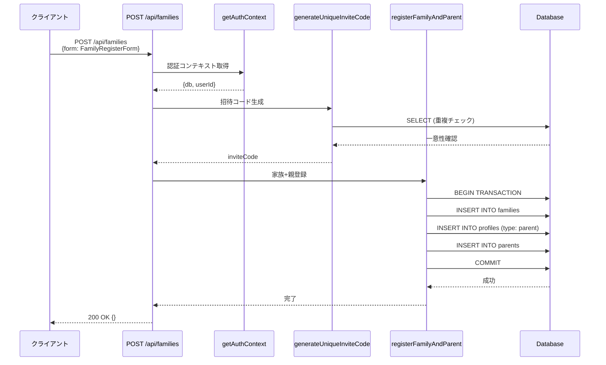

## 2. 家族一覧取得（GET /api/families）

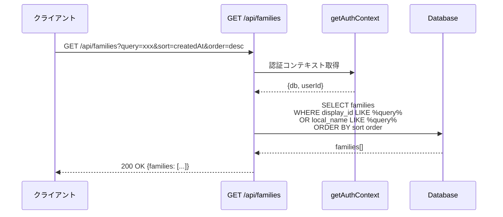

## 3. 家族詳細取得（GET /api/families/[id]）

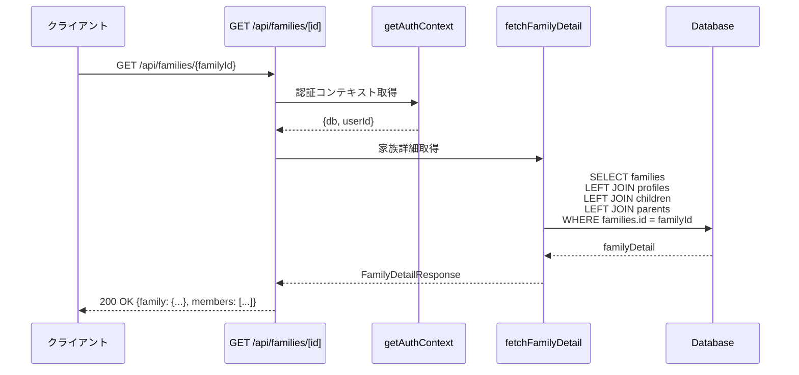

## 4. 家族情報更新（PUT /api/families/[id]）

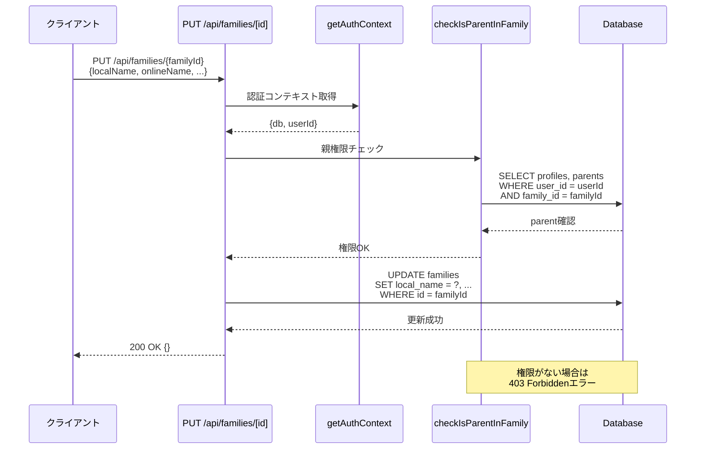

## 5. 家族削除（DELETE /api/families/[id]）

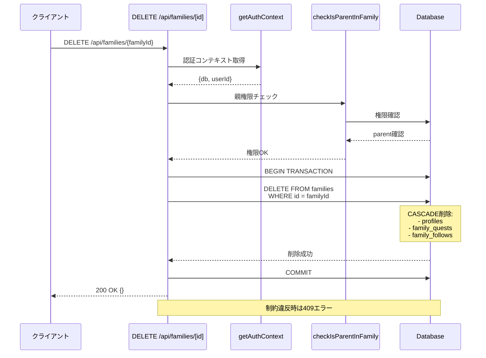

## 6. メンバー一覧取得（GET /api/families/[id]/members）

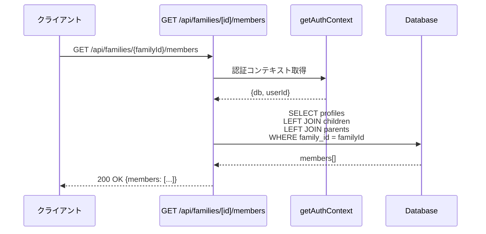

## 7. メンバー追加（POST /api/families/[id]/members）

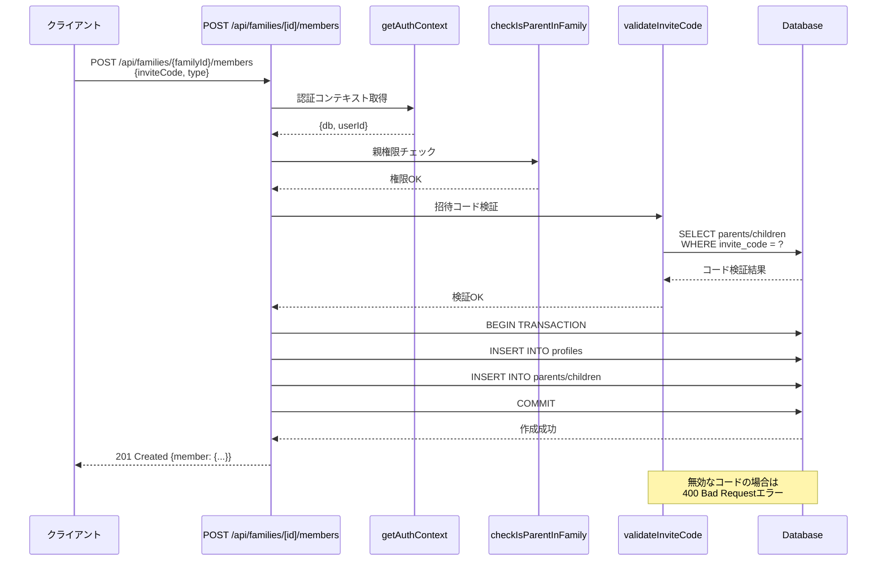

## 8. メンバー削除（DELETE /api/families/[id]/members/[memberId]）

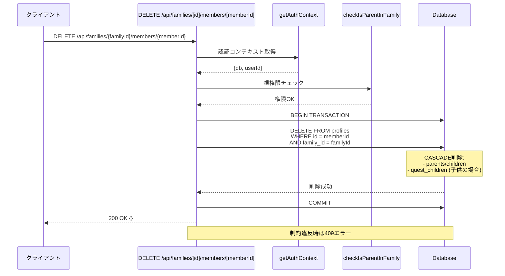

## 9. 家族フォロー（POST /api/families/[id]/follow）

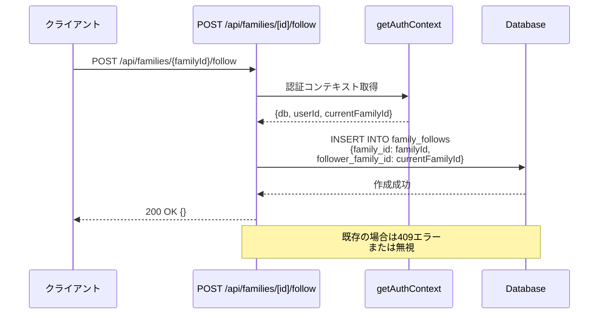

## 10. 家族フォロー解除（DELETE /api/families/[id]/follow）

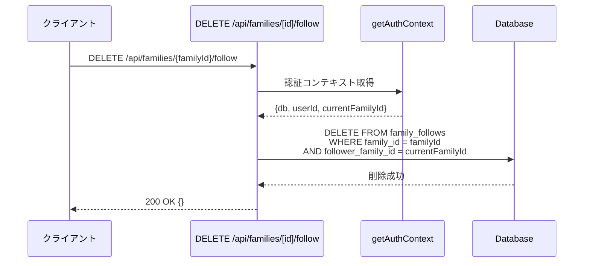

## 11. フォロー状態取得（GET /api/families/[id]/follow/status）

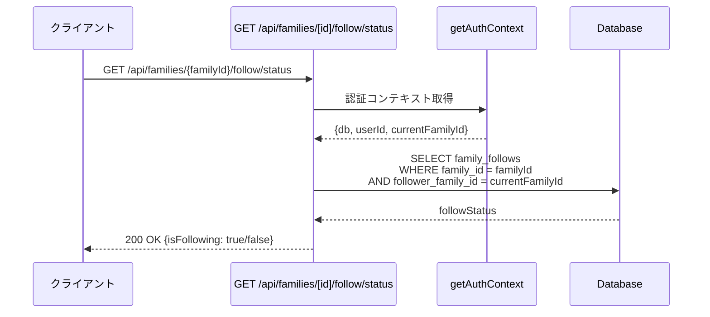

## 12. フォロー数取得（GET /api/families/[id]/follow/count）

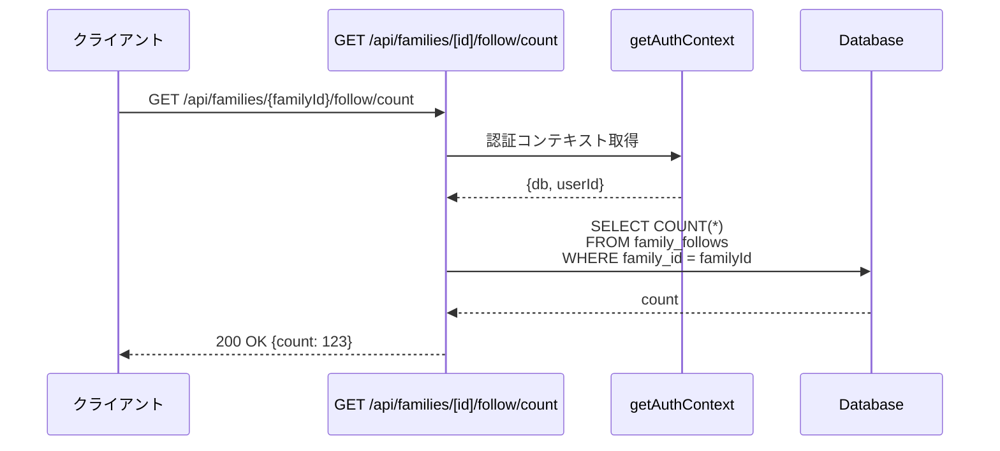

## エラーハンドリングパターン

### 認証エラー (401 Unauthorized)
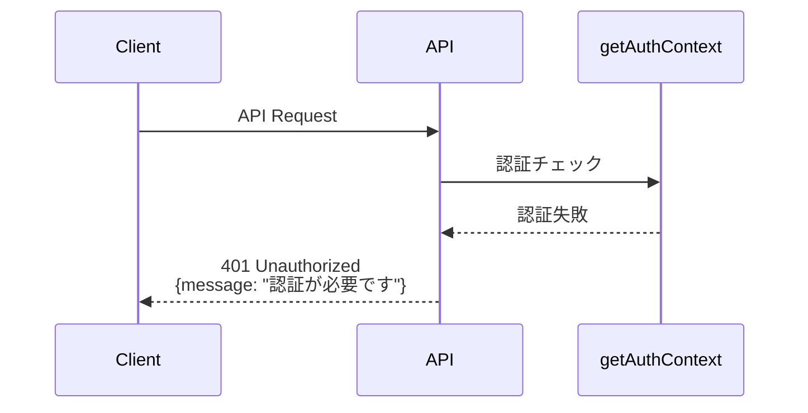

### 権限エラー (403 Forbidden)
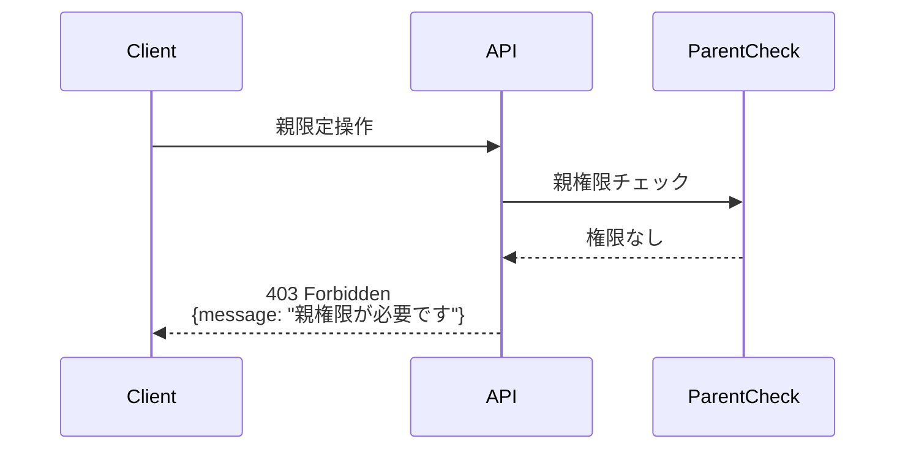

### バリデーションエラー (400 Bad Request)
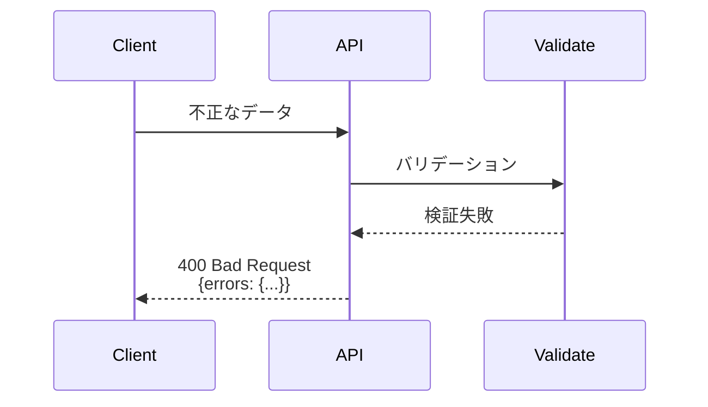

### 制約違反エラー (409 Conflict)
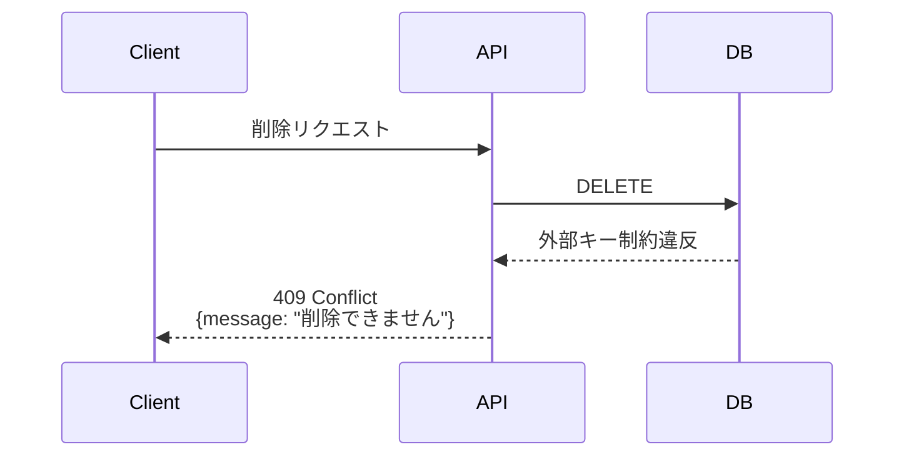
