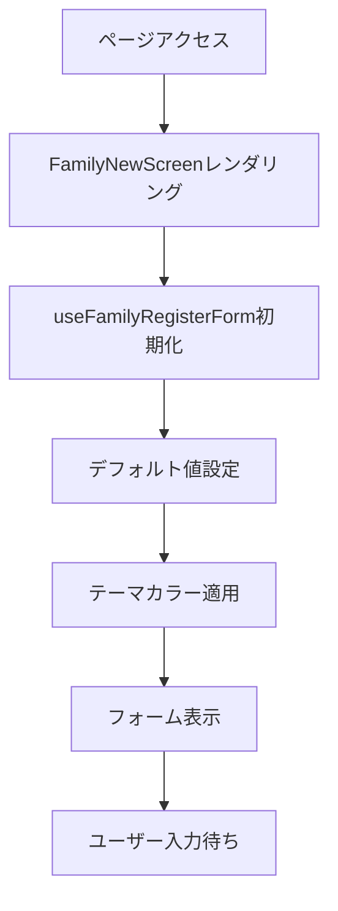
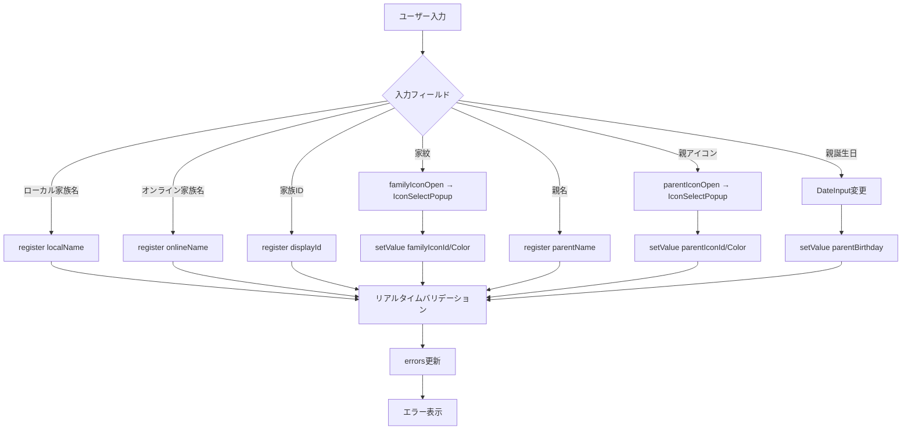
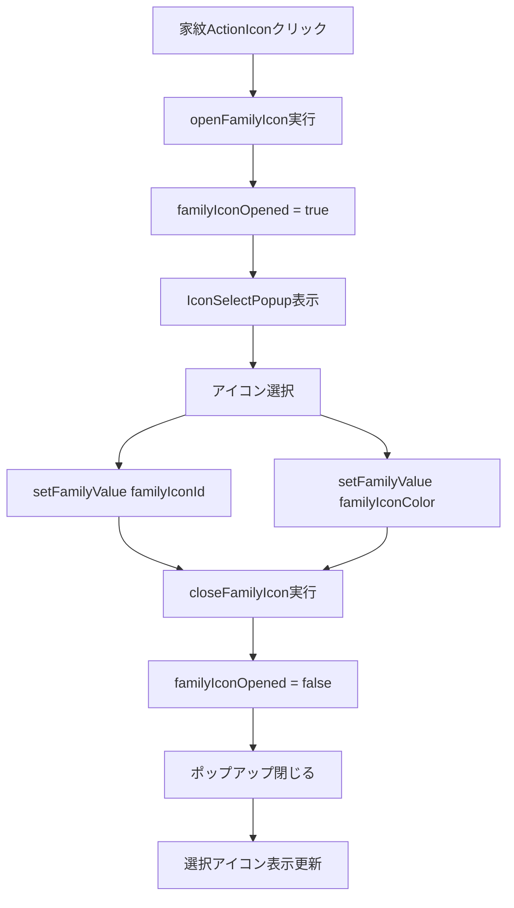
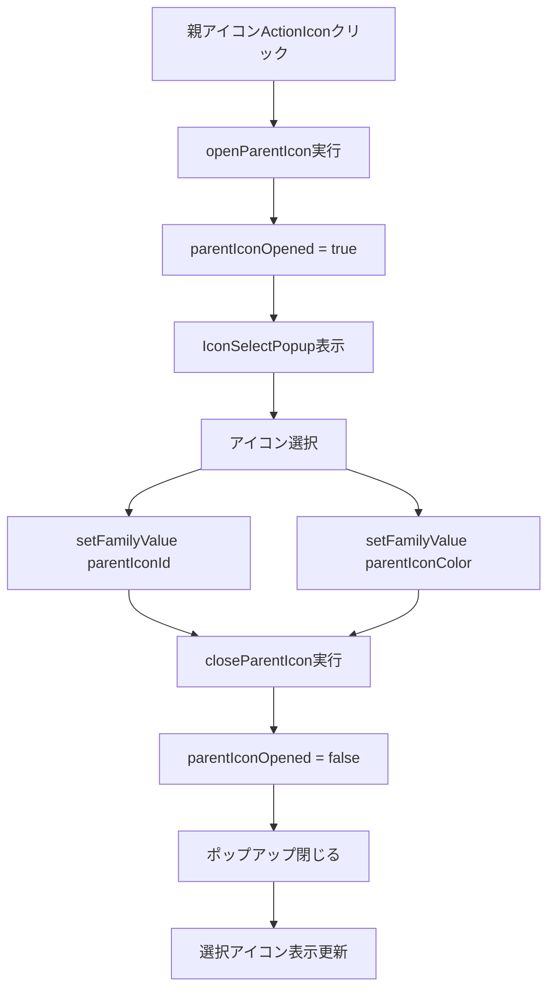
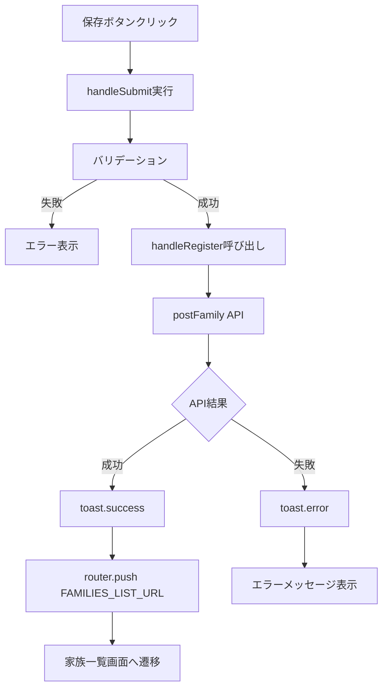
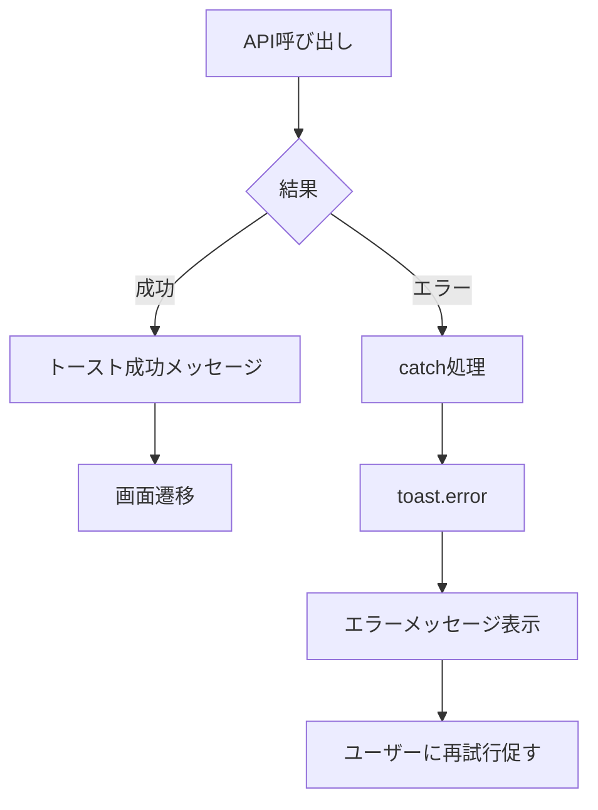
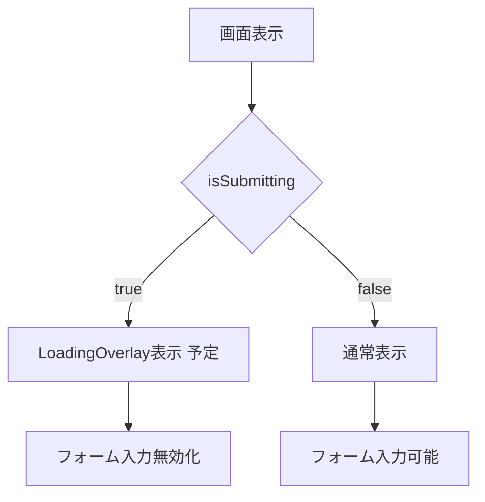
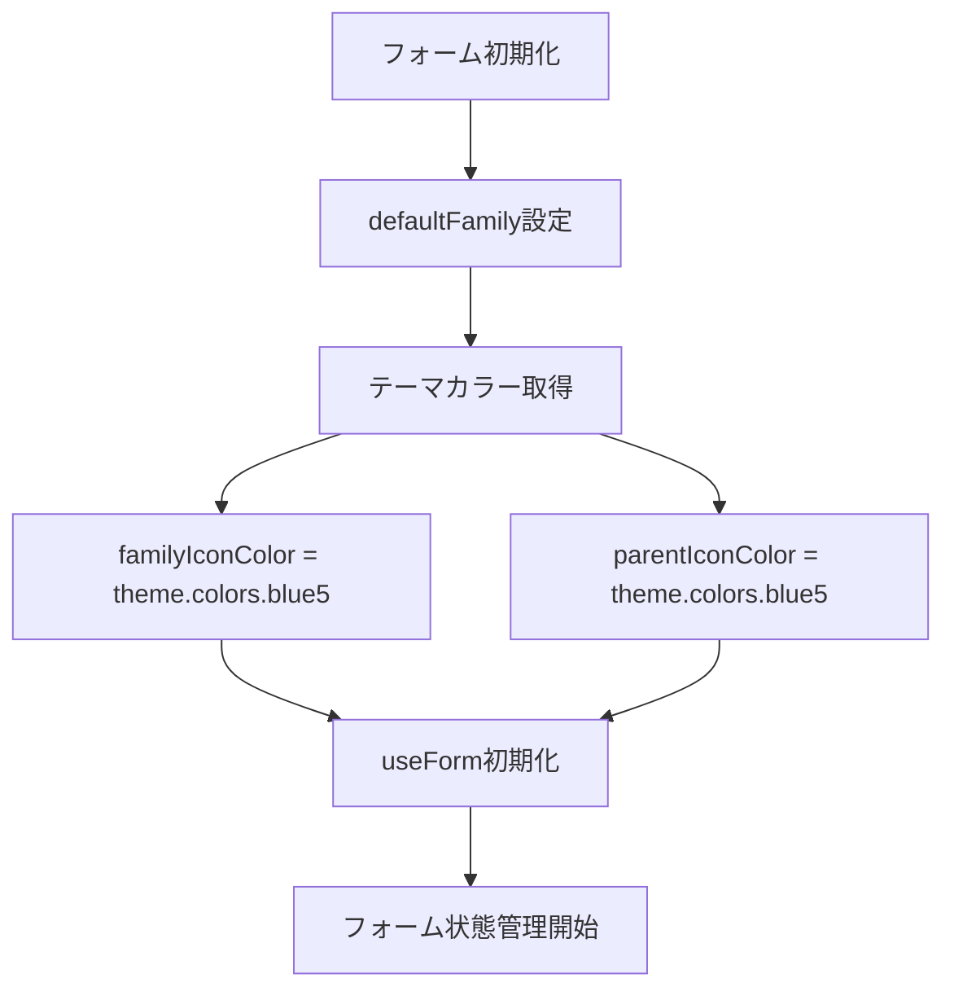
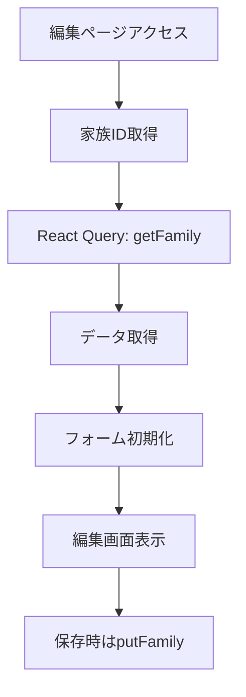

# 家族編集画面 - フローダイアグラム

（2026年3月記載）

## 画面初期化フロー

### 新規作成モード (families/new)



## フォーム編集フロー



## アイコン選択フロー

### 家紋選択



### 親アイコン選択



## バリデーションフロー

```mermaid
graph TD
  A[フォーム入力] --> B[Zod Resolver]
  B --> C{バリデーション}
  C -->|成功| D[errors = {}]
  C -->|失敗| E[errors更新]
  E --> F[フィールド下にエラー表示]
  D --> G[送信可能状態]
```

## 送信フロー

### 新規作成



## エラーハンドリングフロー



## ローディング状態フロー



**注意**: 現時点では isSubmitting 状態が未実装。今後の拡張予定。

## 状態管理フロー



## 今後の拡張予定フロー

### 編集モード（未実装）


