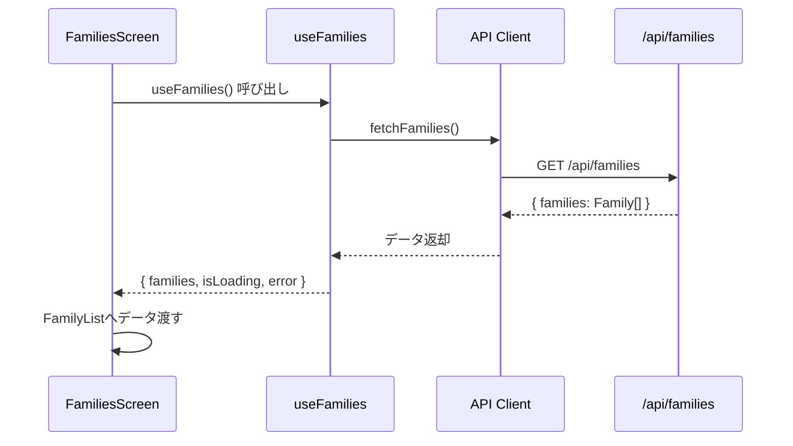

(2026年3月記載)

# 家族一覧画面 データフェッチング

## データフェッチングフロー



## 使用フック

### useFamilies
**パス**: `app/(app)/families/_hooks/useFamilies.ts`

**責務**:
- 家族一覧データの取得
- ローディング状態管理
- エラーハンドリング

**返り値**:
```typescript
{
  families: Family[]           // 家族一覧
  isLoading: boolean          // ローディング状態
  error: Error | null         // エラー情報
  refetch: () => void         // 再取得関数
}
```

**内部実装**:
- React Query (`useQuery`) を使用
- キャッシュキー: `['families']`
- staleTime: 5分
- refetchOnWindowFocus: true

---

## APIエンドポイント

### GET /api/families

**リクエスト**:
```http
GET /api/families
Authorization: Bearer <token>
```

**レスポンス**:
```typescript
{
  families: [
    {
      id: string
      name: string
      createdAt: string
      memberCount: number
      iconUrl?: string
    }
  ]
}
```

**エラーレスポンス**:
- `401 Unauthorized`: 認証エラー
- `500 Internal Server Error`: サーバーエラー

---

## ローディング状態

### 初期ローディング
```typescript
if (isLoading) {
  return <Center><Loader size="lg" /></Center>
}
```

### データ取得後
- `families`配列をFamilyListコンポーネントへ渡す
- 空配列の場合は「家族がありません」メッセージ表示

---

## エラーハンドリング

### エラー発生時
```typescript
if (error) {
  return (
    <Alert color="red">
      家族一覧の取得に失敗しました
    </Alert>
  )
}
```

### リトライ機能
- React Queryの自動リトライ機能使用
- 最大3回まで再試行
- exponential backoff適用

---

## キャッシュ戦略

### React Queryキャッシュ
- **キャッシュキー**: `['families']`
- **staleTime**: 5分（5 * 60 * 1000 ms）
- **cacheTime**: 10分
- **refetchOnWindowFocus**: true
- **refetchOnMount**: true

### キャッシュ無効化
以下の操作後にキャッシュを無効化:
- 家族作成後
- 家族編集後
- 家族削除後

```typescript
queryClient.invalidateQueries(['families'])
```

---

## データ変換

### API → UI変換
```typescript
type ApiFamilyResponse = {
  id: string
  name: string
  created_at: string
  member_count: number
  icon_url?: string
}

type Family = {
  id: string
  name: string
  createdAt: Date
  memberCount: number
  iconUrl?: string
}
```

変換処理は`useFamilies`フック内で実施。

---

## パフォーマンス最適化

### メモ化
```typescript
const families = useMemo(() => 
  rawFamilies?.map(transformFamily) ?? [], 
  [rawFamilies]
)
```

### 遅延読み込み
- 現状は全件取得
- 将来的にページネーション追加を検討

### プリフェッチ
- 家族詳細画面へのプリフェッチは未実装
- 必要に応じて`prefetchQuery`を使用
