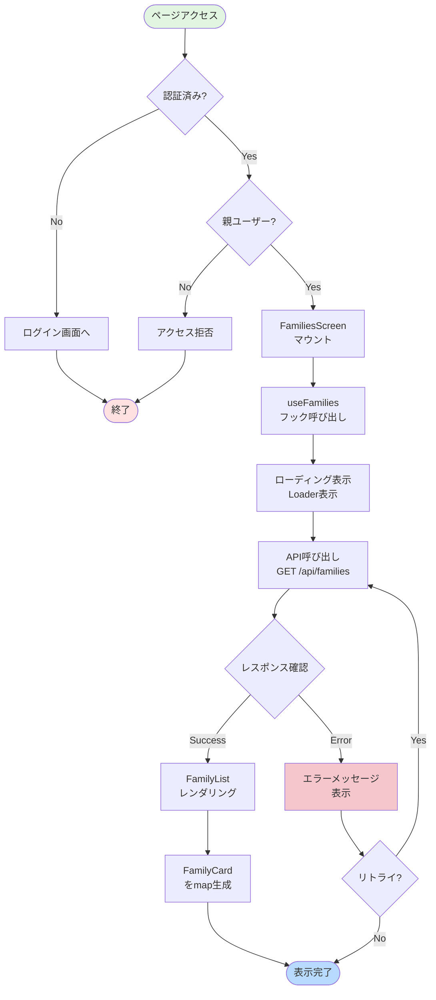
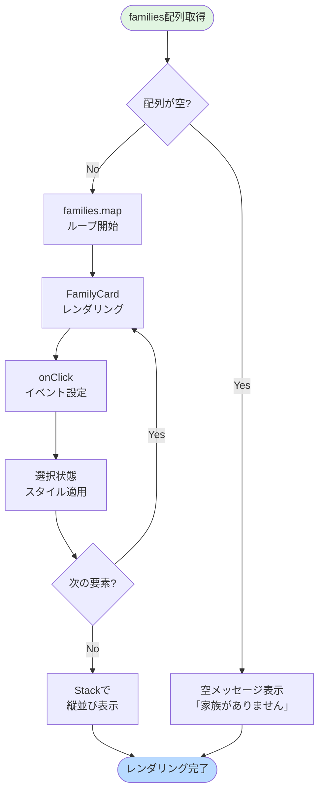
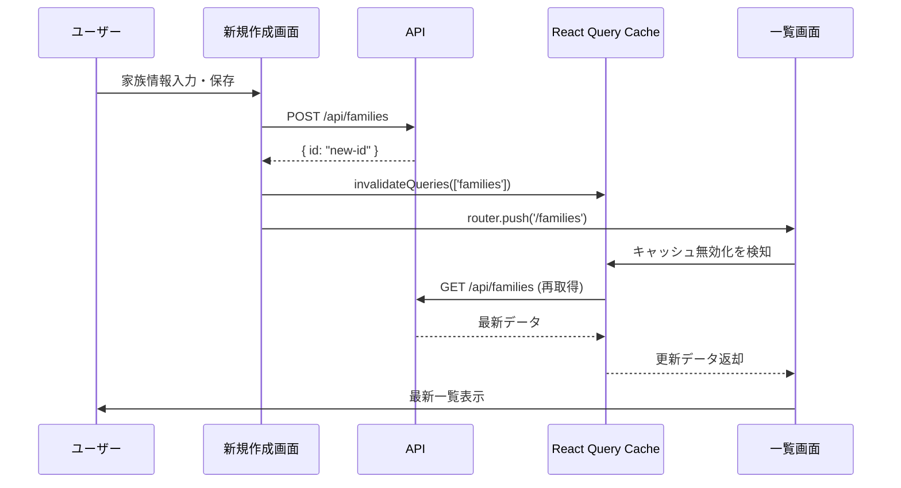
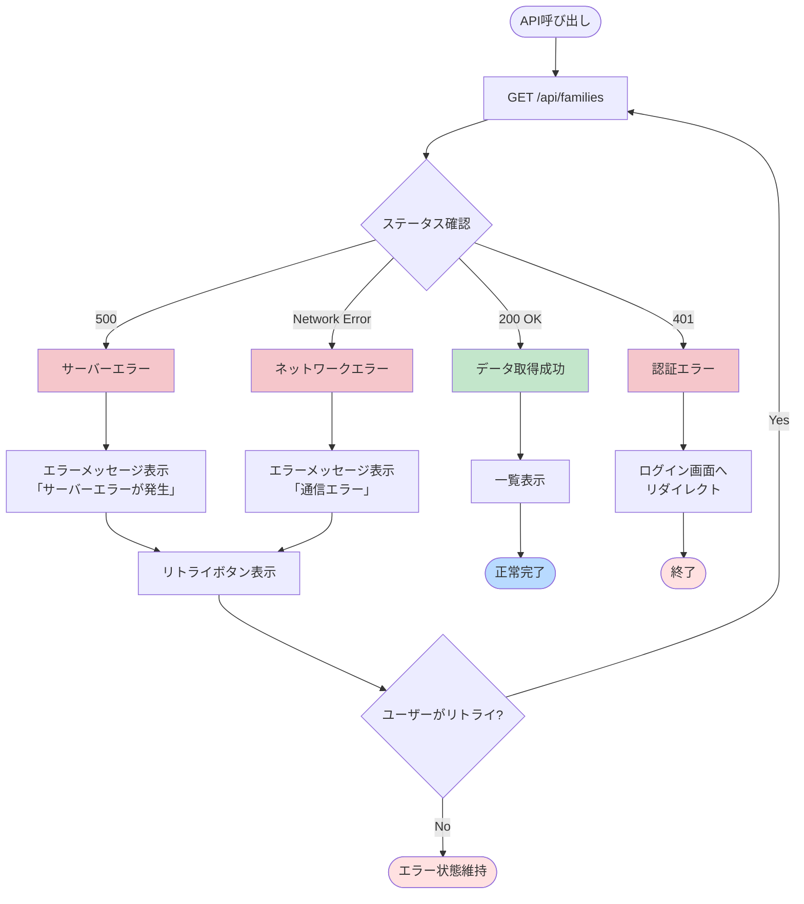
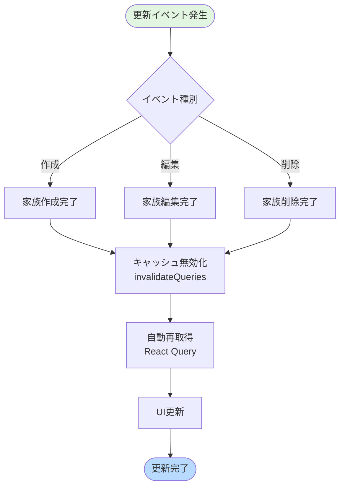

(2026年3月記載)

# 家族一覧画面 フロー図

## 初期表示フロー



---

## リストレンダリング詳細フロー



---

## ユーザーインタラクションフロー

```mermaid
flowchart TD
    Start([ユーザー操作]) --> CheckAction{アクション種別}
    
    CheckAction -->|家族カードクリック| NavigateView[家族詳細画面へ遷移<br/>router.push]
    CheckAction -->|FABクリック| NavigateNew[新規作成画面へ遷移<br/>router.push]
    CheckAction -->|プルリフレッシュ| RefetchData[データ再取得<br/>refetch()]
    
    NavigateView --> UpdateURL[URL更新<br/>/families/{id}]
    NavigateNew --> UpdateURLNew[URL更新<br/>/families/new]
    RefetchData --> ShowLoader[ローディング表示]
    
    UpdateURL --> End([画面遷移])
    UpdateURLNew --> End
    ShowLoader --> FetchAPI[API再呼び出し]
    FetchAPI --> UpdateList[一覧更新]
    UpdateList --> End
    
    style Start fill:#e1f5e1
    style End fill:#b8daff
```

---

## 新規作成後の更新フロー



---

## エラーハンドリングフロー



---

## データ更新イベントフロー


