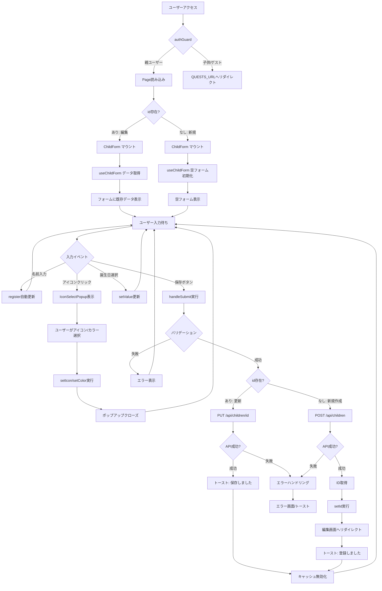
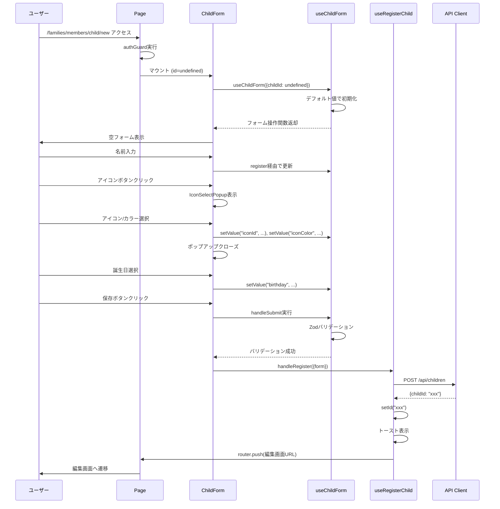
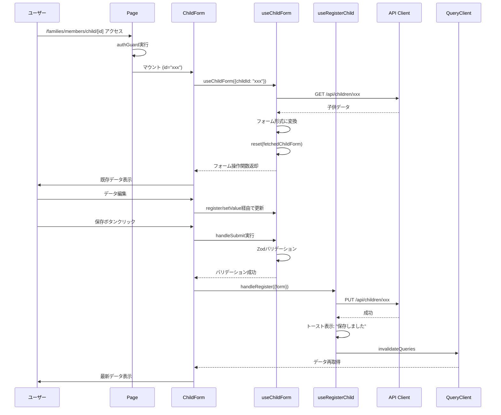
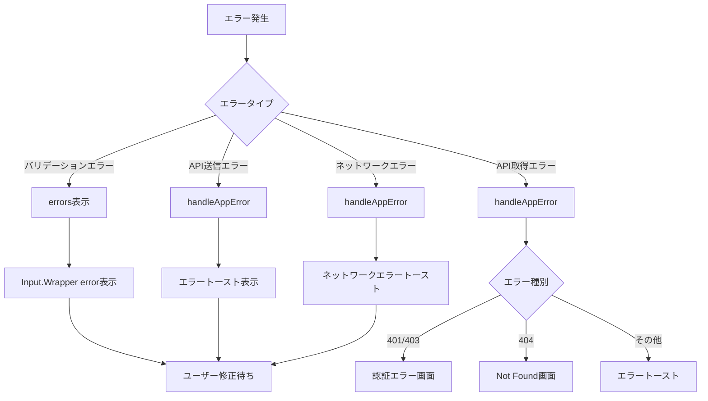
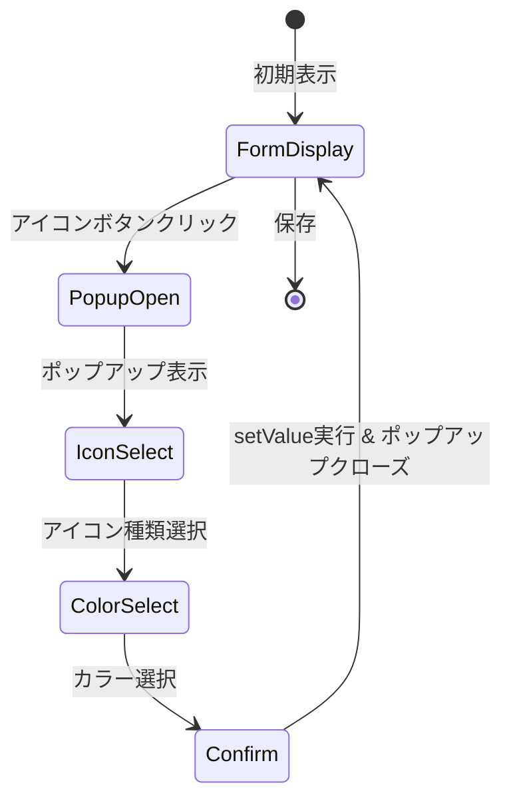
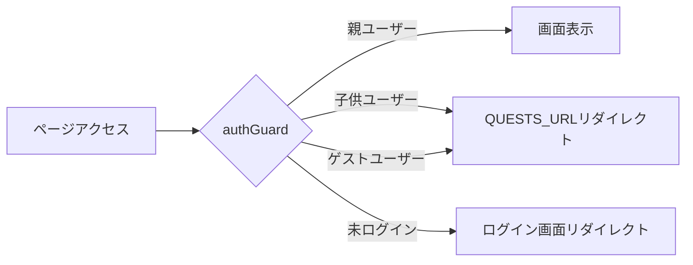

# 家族メンバー子供編集 - フロー図

**2026年3月記載**

## 全体フロー

```mermaid
graph TD
    A[ユーザーアクセス] --> B{authGuard}
    B -->|親ユーザー| C[Page読み込み]
    B -->|子供/ゲスト| D[QUESTS_URLへリダイレクト]
    
    C --> E{id存在?}
    E -->|あり: 編集| F[ChildForm マウント]
    E -->|なし: 新規| G[ChildForm マウント]
    
    F --> H[useChildForm データ取得]
    H --> I[フォームに既存データ表示]
    
    G --> J[useChildForm 空フォーム初期化]
    J --> K[空フォーム表示]
    
    I --> L[ユーザー入力待ち]
    K --> L
    
    L --> M{入力イベント}
    M -->|名前入力| N[register自動更新]
    M -->|アイコンクリック| O[IconSelectPopup表示]
    M -->|誕生日選択| P[setValue更新]
    M -->|保存ボタン| Q[handleSubmit実行]
    
    N --> L
    
    O --> R[ユーザーがアイコン/カラー選択]
    R --> S[setIcon/setColor実行]
    S --> T[ポップアップクローズ]
    T --> L
    
    P --> L
    
    Q --> U{バリデーション}
    U -->|失敗| V[エラー表示]
    V --> L
    
    U -->|成功| W{id存在?}
    W -->|あり: 更新| X[PUT /api/children/id]
    W -->|なし: 新規作成| Y[POST /api/children]
    
    X --> Z{API成功?}
    Y --> AA{API成功?}
    
    Z -->|成功| AB[トースト: 保存しました]
    Z -->|失敗| AC[エラーハンドリング]
    
    AA -->|成功| AD[ID取得]
    AA -->|失敗| AC
    
    AD --> AE[setId実行]
    AE --> AF[編集画面へリダイレクト]
    AF --> AG[トースト: 登録しました]
    
    AB --> AH[キャッシュ無効化]
    AG --> AH
    
    AH --> L
    
    AC --> AI[エラー画面/トースト]
```

## 新規作成フロー詳細

```mermaid
sequenceDiagram
    participant U as ユーザー
    participant P as Page
    participant CF as ChildForm
    participant UCF as useChildForm
    participant URC as useRegisterChild
    participant API as API Client
    
    U->>P: /families/members/child/new アクセス
    P->>P: authGuard実行
    P->>CF: マウント (id=undefined)
    CF->>UCF: useChildForm({childId: undefined})
    UCF->>UCF: デフォルト値で初期化
    UCF-->>CF: フォーム操作関数返却
    CF->>U: 空フォーム表示
    
    U->>CF: 名前入力
    CF->>UCF: register経由で更新
    
    U->>CF: アイコンボタンクリック
    CF->>CF: IconSelectPopup表示
    U->>CF: アイコン/カラー選択
    CF->>UCF: setValue("iconId", ...), setValue("iconColor", ...)
    CF->>CF: ポップアップクローズ
    
    U->>CF: 誕生日選択
    CF->>UCF: setValue("birthday", ...)
    
    U->>CF: 保存ボタンクリック
    CF->>UCF: handleSubmit実行
    UCF->>UCF: Zodバリデーション
    UCF-->>CF: バリデーション成功
    
    CF->>URC: handleRegister({form})
    URC->>API: POST /api/children
    API-->>URC: {childId: "xxx"}
    URC->>URC: setId("xxx")
    URC->>URC: トースト表示
    URC->>P: router.push(編集画面URL)
    P->>U: 編集画面へ遷移
```

## 更新フロー詳細

```mermaid
sequenceDiagram
    participant U as ユーザー
    participant P as Page
    participant CF as ChildForm
    participant UCF as useChildForm
    participant URC as useRegisterChild
    participant API as API Client
    participant QC as QueryClient
    
    U->>P: /families/members/child/[id] アクセス
    P->>P: authGuard実行
    P->>CF: マウント (id="xxx")
    CF->>UCF: useChildForm({childId: "xxx"})
    UCF->>API: GET /api/children/xxx
    API-->>UCF: 子供データ
    UCF->>UCF: フォーム形式に変換
    UCF->>UCF: reset(fetchedChildForm)
    UCF-->>CF: フォーム操作関数返却
    CF->>U: 既存データ表示
    
    U->>CF: データ編集
    CF->>UCF: register/setValue経由で更新
    
    U->>CF: 保存ボタンクリック
    CF->>UCF: handleSubmit実行
    UCF->>UCF: Zodバリデーション
    UCF-->>CF: バリデーション成功
    
    CF->>URC: handleRegister({form})
    URC->>API: PUT /api/children/xxx
    API-->>URC: 成功
    URC->>URC: トースト表示: "保存しました"
    URC->>QC: invalidateQueries
    QC-->>CF: データ再取得
    CF->>U: 最新データ表示
```

## エラーハンドリングフロー

```mermaid
graph TD
    A[エラー発生] --> B{エラータイプ}
    
    B -->|バリデーションエラー| C[errors表示]
    C --> D[Input.Wrapper error表示]
    D --> E[ユーザー修正待ち]
    
    B -->|API取得エラー| F[handleAppError]
    F --> G{エラー種別}
    G -->|401/403| H[認証エラー画面]
    G -->|404| I[Not Found画面]
    G -->|その他| J[エラートースト]
    
    B -->|API送信エラー| K[handleAppError]
    K --> L[エラートースト表示]
    L --> E
    
    B -->|ネットワークエラー| M[handleAppError]
    M --> N[ネットワークエラートースト]
    N --> E
```

## アイコン選択フロー

```mermaid
stateDiagram-v2
    [*] --> FormDisplay: 初期表示
    FormDisplay --> PopupOpen: アイコンボタンクリック
    PopupOpen --> IconSelect: ポップアップ表示
    IconSelect --> ColorSelect: アイコン種類選択
    ColorSelect --> Confirm: カラー選択
    Confirm --> FormDisplay: setValue実行 & ポップアップクローズ
    FormDisplay --> [*]: 保存
```

## 認証ガードフロー

```mermaid
graph LR
    A[ページアクセス] --> B{authGuard}
    B -->|親ユーザー| C[画面表示]
    B -->|子供ユーザー| D[QUESTS_URLリダイレクト]
    B -->|ゲストユーザー| D
    B -->|未ログイン| E[ログイン画面リダイレクト]
```
