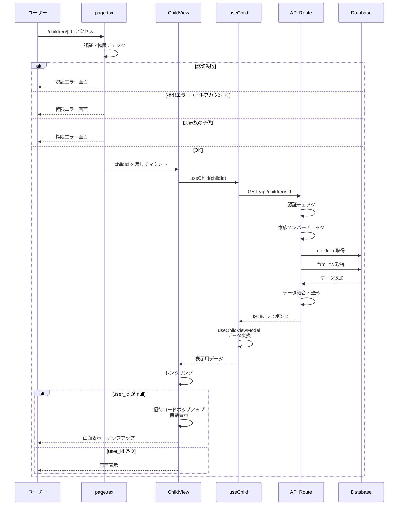
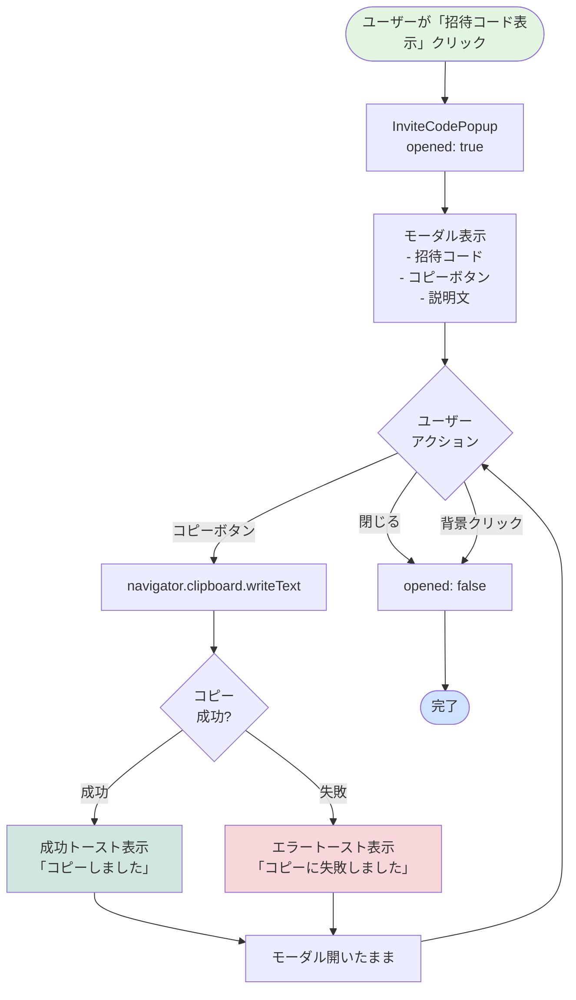
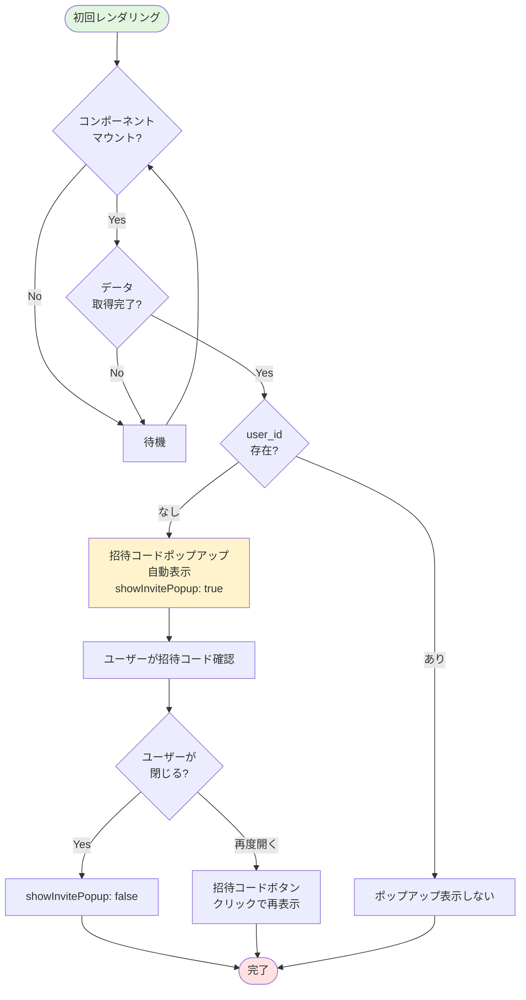
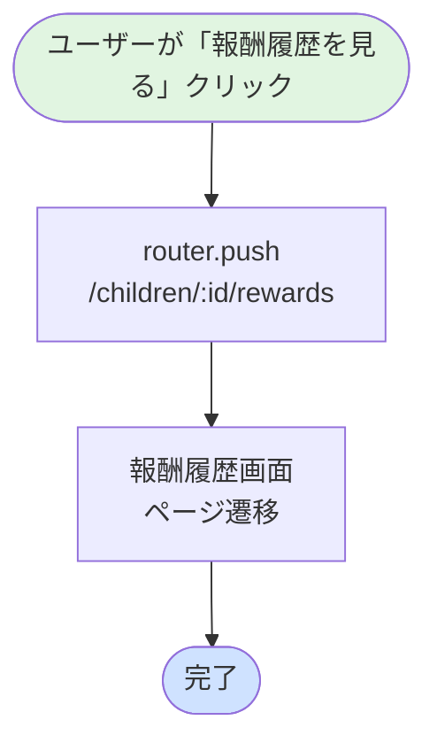
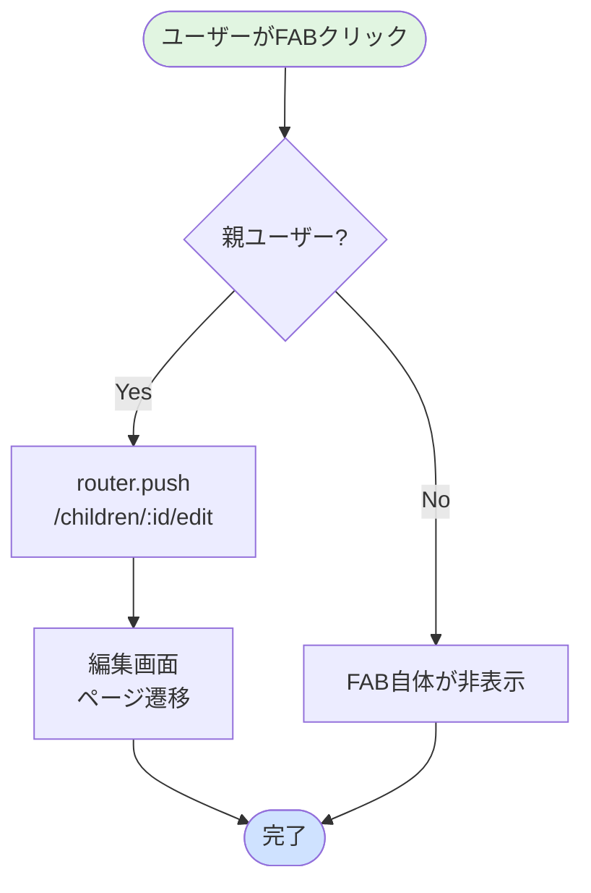
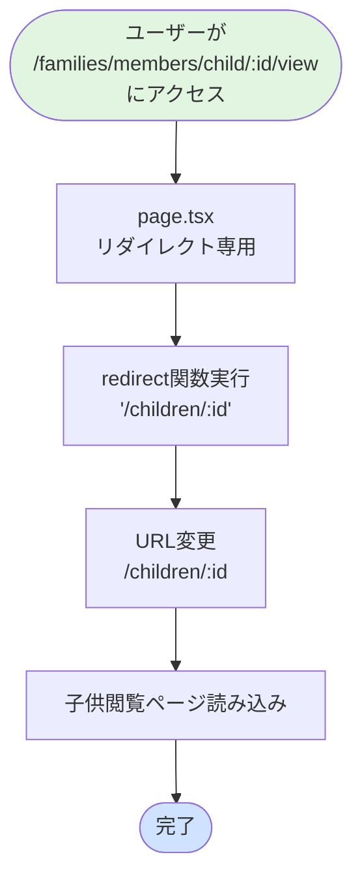
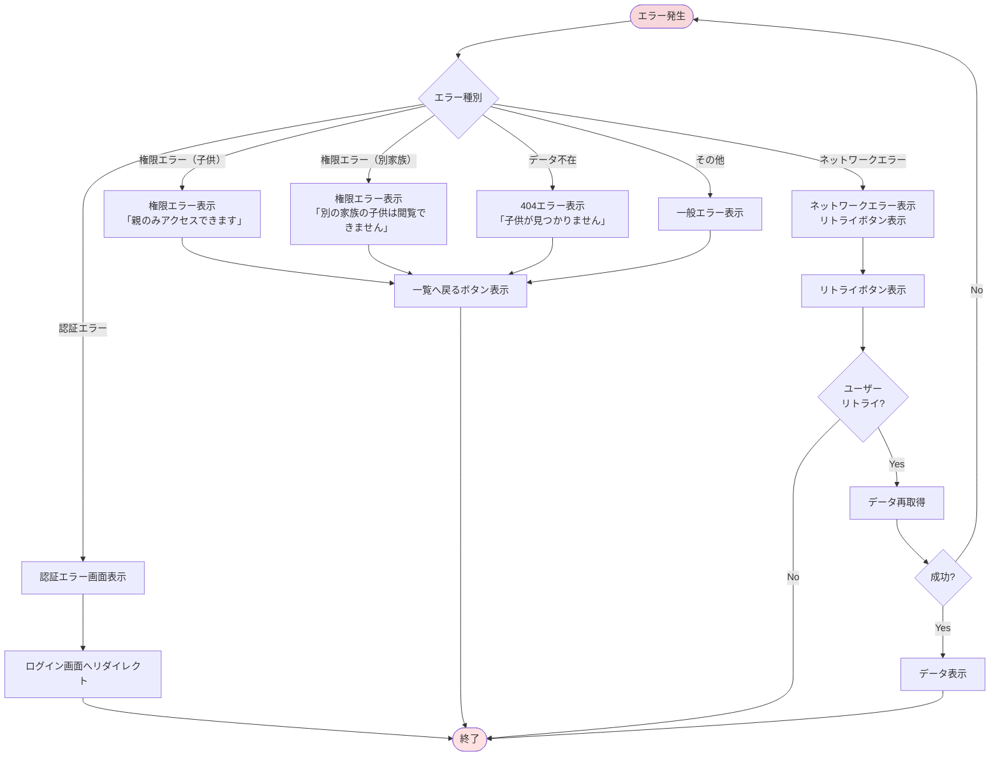
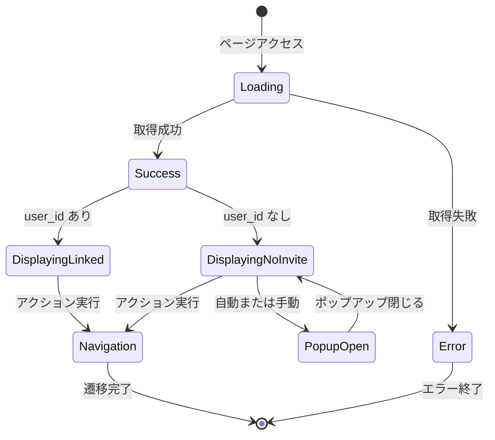

(2026年3月記載)

# 家族メンバー子供閲覧画面 フロー図

## 画面表示フロー全体

```mermaid
flowchart TD
    Start([ユーザーがページアクセス]) --> CheckPath{アクセス<br/>パス?}
    
    CheckPath -->|/families/.../view| RedirectPage[リダイレクトページ]
    CheckPath -->|/children/[id]| DirectAccess[直接アクセス]
    
    RedirectPage --> Redirect[redirect to /children/:id]
    Redirect --> DirectAccess
    
    DirectAccess --> Mount[ChildView マウント]
    Mount --> FetchData[useChild<br/>データ取得開始]
    
    FetchData --> CheckCache{キャッシュ<br/>存在?}
    CheckCache -->|あり| UseCache[キャッシュから表示]
    CheckCache -->|なし| APICall[API呼び出し<br/>GET /api/children/:id]
    
    APICall --> CheckAuth{認証<br/>チェック}
    CheckAuth -->|失敗| AuthError[認証エラー表示<br/>ログイン画面へ]
    CheckAuth -->|成功| CheckRole{ロール<br/>チェック}
    
    CheckRole -->|子供| RoleError[権限エラー表示<br/>親のみアクセス可能]
    CheckRole -->|親| CheckFamily{家族<br/>チェック}
    
    CheckFamily -->|別家族| FamilyError[権限エラー表示<br/>別の家族の子供は閲覧不可]
    CheckFamily -->|同家族| FetchDB[DBからデータ取得]
    
    FetchDB --> Transform[データ変換<br/>useChildViewModel]
    UseCache --> Transform
    
    Transform --> Render[画面レンダリング]
    
    Render --> ShowLayout[ChildViewLayout表示]
    Render --> CheckUserLink{user_id<br/>存在?}
    
    CheckUserLink -->|なし| ShowInviteAuto[招待コードポップアップ<br/>自動表示]
    CheckUserLink -->|あり| ShowActions[アクションボタン表示]
    
    ShowInviteAuto --> ShowInviteButton[招待コードボタン表示]
    ShowInviteButton --> ShowActions
    
    ShowActions --> UserAction{ユーザー<br/>アクション}
    
    UserAction -->|招待コード表示| InviteFlow[招待コード表示フロー]
    UserAction -->|報酬履歴| RewardFlow[報酬履歴画面へ遷移]
    UserAction -->|編集FAB| EditFlow[編集画面へ遷移]
    UserAction -->|待機| WaitUser[ユーザー待機]
    
    InviteFlow --> ShowPopup[InviteCodePopup表示]
    ShowPopup --> CopyAction{コピー<br/>クリック?}
    CopyAction -->|Yes| CopyCode[クリップボードにコピー]
    CopyAction -->|No| ClosePopup[ポップアップ閉じる]
    CopyCode --> ShowToast[成功トースト表示]
    ShowToast --> ClosePopup
    ClosePopup --> UserAction
    
    RewardFlow --> NavReward[navigate to /children/:id/rewards]
    EditFlow --> NavEdit[navigate to /children/:id/edit]
    
    WaitUser --> UserAction
    
    AuthError --> End([終了])
    RoleError --> End
    FamilyError --> End
    NavReward --> End
    NavEdit --> End
    
    style Start fill:#e1f5e1
    style End fill:#ffe1e1
    style Render fill:#cfe2ff
    style ShowInviteAuto fill:#fff3cd
```

## 初期表示シーケンス



## 招待コード表示フロー



## 自動ポップアップフロー



### useEffect による自動表示実装

```typescript
// ChildView.tsx
useEffect(() => {
  if (data && !data.child.user_id) {
    setShowInvitePopup(true)
  }
}, [data])
```

## 報酬履歴画面遷移フロー



## 編集画面遷移フロー（FAB）



## リダイレクトフロー



## エラーハンドリングフロー



## 状態管理フロー


