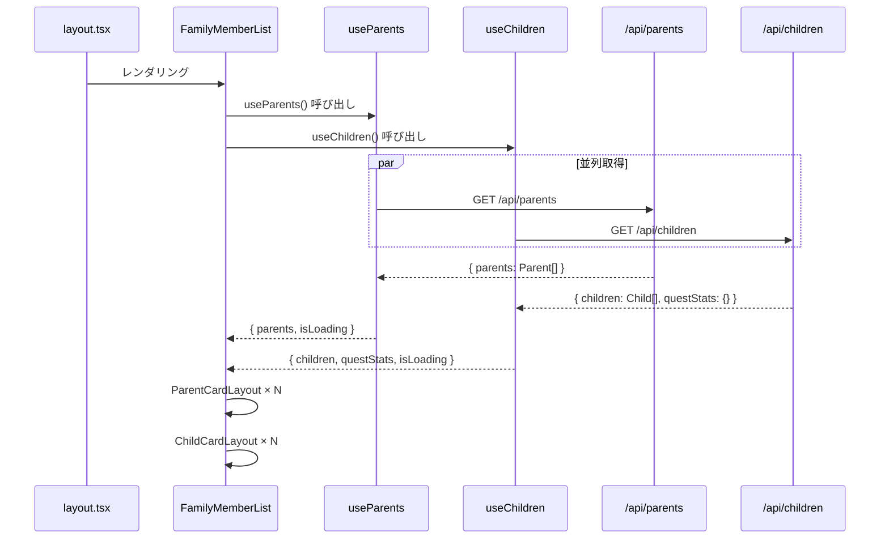

(2026年3月記載)

# 家族メンバー一覧画面 データフェッチング

## データフェッチングフロー



---

## 使用フック

### useParents
**パス**: `app/(app)/parents/_hook/useParents.ts`

**責務**:
- 親一覧データの取得
- ローディング状態管理

**返り値**:
```typescript
{
  parents: ParentWithUser[]    // 親一覧（users情報含む）
  isLoading: boolean
  error: Error | null
  refetch: () => void
}
```

**型定義**:
```typescript
type ParentWithUser = {
  parents: Parent
  users: User
}

type Parent = {
  id: string
  familyId: string
  userId: string
  role: 'owner' | 'member'
}

type User = {
  id: string
  email: string
  displayName?: string
  avatarUrl?: string
}
```

**内部実装**:
- React Query使用
- キャッシュキー: `['parents']`
- staleTime: 5分

---

### useChildren
**パス**: `app/(app)/children/_hook/useChildren.ts`

**責務**:
- 子供一覧データの取得
- クエスト統計データの取得

**返り値**:
```typescript
{
  children: ChildWithUser[]     // 子供一覧（users情報含む）
  questStats: Record<string, QuestStats>
  isLoading: boolean
  error: Error | null
  refetch: () => void
}
```

**型定義**:
```typescript
type ChildWithUser = {
  children: Child | null
  users: User
}

type Child = {
  id: string
  familyId: string
  userId: string
  level: number
  experiencePoints: number
  currentBalance: number
}

type QuestStats = {
  completedCount: number    // 完了クエスト数
  inProgressCount: number   // 進行中クエスト数
}
```

**内部実装**:
- React Query使用
- キャッシュキー: `['children']`
- staleTime: 5分
- questStatsは並行取得

---

## APIエンドポイント

### GET /api/parents

**リクエスト**:
```http
GET /api/parents
Authorization: Bearer <token>
```

**レスポンス**:
```typescript
{
  parents: [
    {
      parents: {
        id: string
        familyId: string
        userId: string
        role: 'owner' | 'member'
      },
      users: {
        id: string
        email: string
        displayName?: string
        avatarUrl?: string
      }
    }
  ]
}
```

---

### GET /api/children

**リクエスト**:
```http
GET /api/children
Authorization: Bearer <token>
```

**レスポンス**:
```typescript
{
  children: [
    {
      children: {
        id: string
        familyId: string
        userId: string
        level: number
        experiencePoints: number
        currentBalance: number
      },
      users: {
        id: string
        email: string
        displayName?: string
        avatarUrl?: string
      }
    }
  ]
}
```

---

## ローディング状態

### 並列ローディング
```typescript
const { parents, isLoading: parentLoading } = useParents()
const { children, isLoading: childLoading } = useChildren()

const isLoading = parentLoading || childLoading

if (isLoading) {
  return <Center><Loader size="lg" /></Center>
}
```

### セクション別ローディング
親と子供のセクションを独立してロード可能:
```typescript
{parentLoading ? (
  <Skeleton height={100} />
) : (
  parents.map(parent => <ParentCardLayout />)
)}

{childLoading ? (
  <Skeleton height={100} />
) : (
  children.map(child => <ChildCardLayout />)
)}
```

---

## エラーハンドリング

### 個別エラー処理
```typescript
const { parents, error: parentError } = useParents()
const { children, error: childError } = useChildren()

if (parentError) {
  return <Alert color="red">親情報の取得に失敗</Alert>
}

if (childError) {
  return <Alert color="red">子供情報の取得に失敗</Alert>
}
```

### リトライ機能
```typescript
const { refetch: refetchParents } = useParents()
const { refetch: refetchChildren } = useChildren()

<Button onClick={() => {
  refetchParents()
  refetchChildren()
}}>
  再読み込み
</Button>
```

---

## キャッシュ戦略

### React Queryキャッシュ

#### 親データ
- **キャッシュキー**: `['parents']`
- **staleTime**: 5分
- **cacheTime**: 10分
- **refetchOnWindowFocus**: true

#### 子供データ
- **キャッシュキー**: `['children']`
- **staleTime**: 5分
- **cacheTime**: 10分
- **refetchOnWindowFocus**: true

### キャッシュ無効化

#### 親関連操作後
```typescript
queryClient.invalidateQueries(['parents'])
```

- 親編集後
- 親削除後

#### 子供関連操作後
```typescript
queryClient.invalidateQueries(['children'])
```

- 子供追加後
- 子供編集後
- 子供削除後

---

## クエスト統計データの取得

### questStats取得フロー
```typescript
const { children } = useChildren()

// 子供IDリストからクエスト統計を取得
const childIds = children.map(c => c.children?.id).filter(Boolean)

const questStatsPromises = childIds.map(childId =>
  fetch(`/api/children/${childId}/quest-stats`)
)

const questStatsResults = await Promise.all(questStatsPromises)

const questStats = Object.fromEntries(
  questStatsResults.map((stats, i) => [childIds[i], stats])
)
```

### questStatsの利用
```typescript
<ChildCardLayout 
  child={child}
  questStats={questStats[child.children.id]}
/>
```

---

## パフォーマンス最適化

### メモ化
```typescript
const parentCards = useMemo(() => 
  parents.map(parent => (
    <ParentCardLayout key={parent.parents.id} parent={parent} />
  )),
  [parents, selectedId]
)

const childCards = useMemo(() =>
  children.map(child => (
    <ChildCardLayout 
      key={child.children?.id} 
      child={child}
      questStats={questStats[child.children?.id]}
    />
  )),
  [children, questStats, selectedId]
)
```

### プリフェッチ
詳細画面へのプリフェッチ（ホバー時）:
```typescript
const prefetchMemberDetail = (memberId: string) => {
  queryClient.prefetchQuery({
    queryKey: ['member', memberId],
    queryFn: () => fetchMemberDetail(memberId)
  })
}

<ParentCardLayout
  onMouseEnter={() => prefetchMemberDetail(parent.id)}
/>
```

---

## データ更新イベント

### リアルタイム更新（Supabase Realtime）
```typescript
useEffect(() => {
  const channel = supabase
    .channel('family-members')
    .on('postgres_changes', {
      event: '*',
      schema: 'public',
      table: 'parents'
    }, () => {
      refetchParents()
    })
    .on('postgres_changes', {
      event: '*',
      schema: 'public',
      table: 'children'
    }, () => {
      refetchChildren()
    })
    .subscribe()
    
  return () => {
    supabase.removeChannel(channel)
  }
}, [])
```
