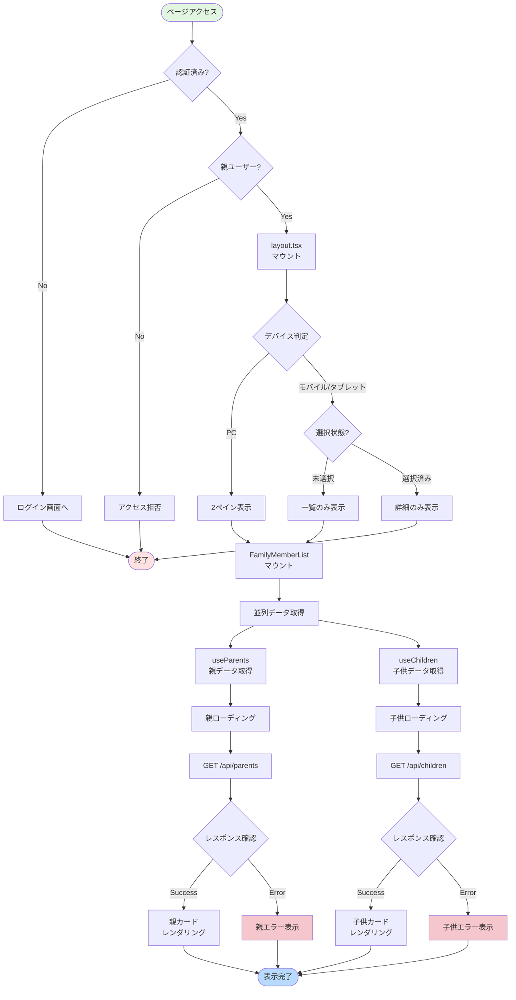
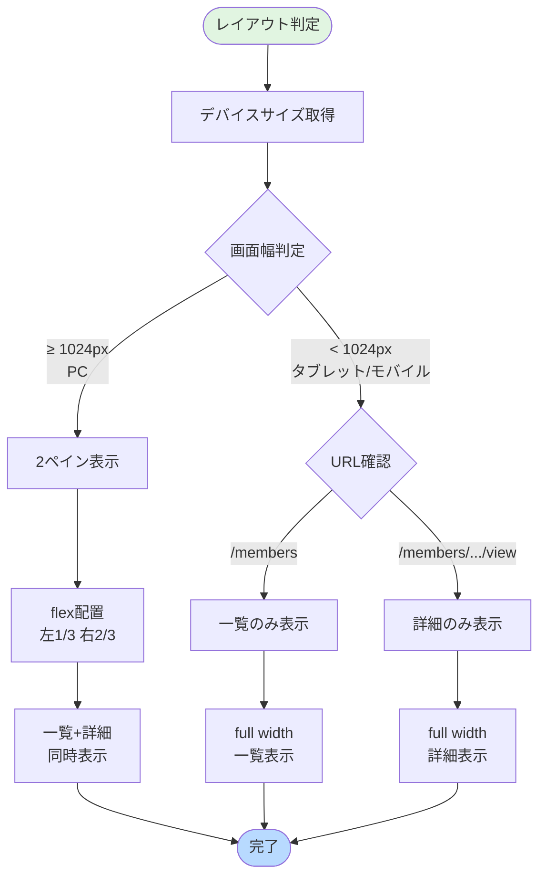
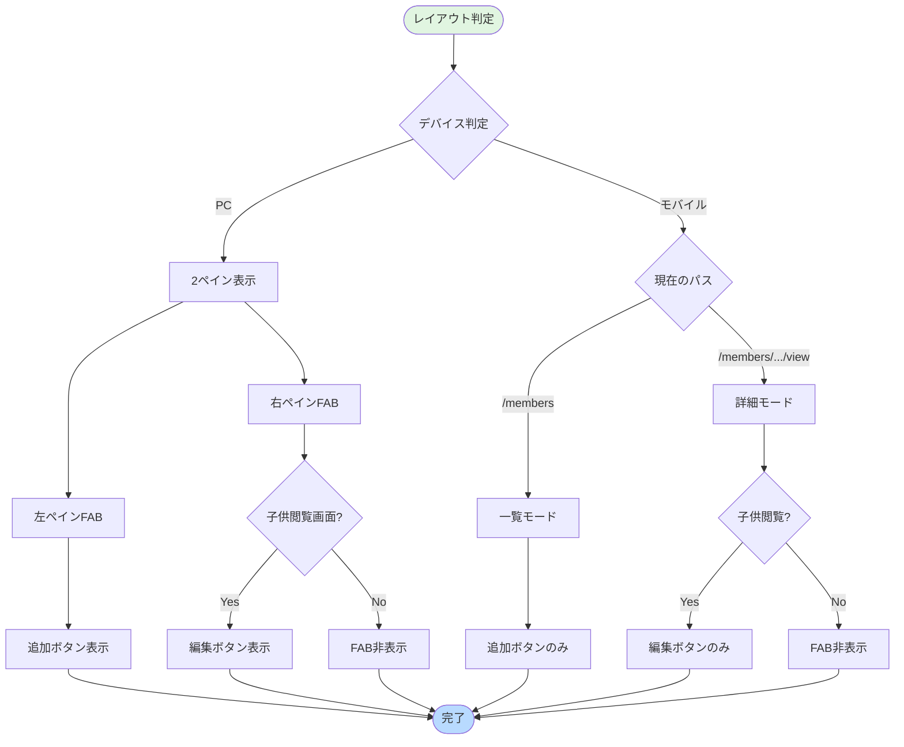

(2026年3月15日 14:30記載)

# 家族メンバー一覧画面 フロー図

## 初期表示フロー



---

## 2ペイン/シングルペイン切り替えフロー



---

## リストレンダリング詳細フロー

```mermaid
flowchart TD
    Start([データ取得完了]) --> RenderList[FamilyMemberList<br/>レンダリング開始]
    
    RenderList --> RenderHeader[PageHeader<br/>「家族メンバー」]
    RenderHeader --> RenderCard[Card開始]
    RenderCard --> RenderStack[Stack開始]
    
    RenderStack --> ParentSection[親セクション]
    ParentSection --> RenderParentLabel[Text「親」表示]
    RenderParentLabel --> CheckParents{親データあり?}
    
    CheckParents -->|Yes| MapParents[parents.map<br/>ループ]
    CheckParents -->|No| EmptyParent[空メッセージ]
    
    MapParents --> RenderParentCard[ParentCardLayout<br/>レンダリング]
    RenderParentCard --> SetParentSelected[isSelected<br/>設定]
    SetParentSelected --> BindParentClick[onClick<br/>イベント設定]
    BindParentClick --> NextParent{次の親?}
    
    NextParent -->|Yes| RenderParentCard
    NextParent -->|No| RenderDivider[Divider表示]
    
    EmptyParent --> RenderDivider
    
    RenderDivider --> ChildSection[子供セクション]
    ChildSection --> RenderChildLabel[Text「子供」表示]
    RenderChildLabel --> CheckChildren{子供データあり?}
    
    CheckChildren -->|Yes| MapChildren[children.map<br/>ループ]
    CheckChildren -->|No| EmptyChild[空メッセージ]
    
    MapChildren --> RenderChildCard[ChildCardLayout<br/>レンダリング]
    RenderChildCard --> SetChildSelected[isSelected<br/>設定]
    SetChildSelected --> SetQuestStats[questStats<br/>設定]
    SetQuestStats --> BindChildClick[onClick<br/>イベント設定]
    BindChildClick --> NextChild{次の子供?}
    
    NextChild -->|Yes| RenderChildCard
    NextChild -->|No| Complete([レンダリング完了])
    
    EmptyChild --> Complete
    
    style Start fill:#e1f5e1
    style Complete fill:#b8daff
```



---

## ユーザーインタラクションフロー

```mermaid
flowchart TD
    Start([ユーザー操作]) --> CheckAction{アクション種別}
    
    CheckAction -->|親カードクリック| ParentClick[親閲覧画面へ遷移]
    CheckAction -->|子供カードクリック| ChildClick[子供閲覧画面へ遷移]
    CheckAction -->|追加FABクリック| NewChild[子供新規作成画面へ]
    CheckAction -->|編集FABクリック| EditChild[子供編集画面へ]
    CheckAction -->|プルリフレッシュ| RefreshData[データ再取得]
    
    ParentClick --> UpdateURLParent[URL更新<br/>/members/parent/{id}/view]
    ChildClick --> UpdateURLChild[URL更新<br/>/members/child/{id}/view]
    NewChild --> UpdateURLNew[URL更新<br/>/members/child/new]
    EditChild --> UpdateURLEdit[URL更新<br/>/members/child/{id}/edit]
    
    UpdateURLParent --> CheckDevice1{デバイス判定}
    UpdateURLChild --> CheckDevice2{デバイス判定}
    
    CheckDevice1 -->|PC| Show2Pane1[2ペイン表示<br/>左:一覧 右:親詳細]
    CheckDevice1 -->|モバイル| ShowDetail1[詳細のみ表示<br/>親詳細]
    
    CheckDevice2 -->|PC| Show2Pane2[2ペイン表示<br/>左:一覧 右:子供詳細]
    CheckDevice2 -->|モバイル| ShowDetail2[詳細のみ表示<br/>子供詳細]
    
    Show2Pane1 --> HighlightCard1[選択カード<br/>ハイライト]
    Show2Pane2 --> HighlightCard2[選択カード<br/>ハイライト]
    
    ShowDetail1 --> End([完了])
    ShowDetail2 --> End
    HighlightCard1 --> End
    HighlightCard2 --> End
    UpdateURLNew --> End
    UpdateURLEdit --> End
    
    RefreshData --> ShowLoader[ローディング表示]
    ShowLoader --> ParallelRefetch[並列再取得]
    ParallelRefetch --> RefetchParents[親データ再取得]
    ParallelRefetch --> RefetchChildren[子供データ再取得]
    RefetchParents --> UpdateList[一覧更新]
    RefetchChildren --> UpdateList
    UpdateList --> End
    
    style Start fill:#e1f5e1
    style End fill:#b8daff
```

---

## FAB制御フロー



---

## データ更新イベントフロー

```mermaid
flowchart TD
    Start([更新イベント発生]) --> CheckEvent{イベント種別}
    
    CheckEvent -->|子供追加| CreateEvent[子供作成完了]
    CheckEvent -->|子供編集| EditEvent[子供編集完了]
    CheckEvent -->|子供削除| DeleteEvent[子供削除完了]
    CheckEvent -->|親編集| ParentEditEvent[親編集完了]
    
    CreateEvent --> InvalidateChildren[キャッシュ無効化<br/>invalidateQueries(['children'])]
    EditEvent --> InvalidateChildren
    DeleteEvent --> InvalidateChildren
    ParentEditEvent --> InvalidateParents[キャッシュ無効化<br/>invalidateQueries(['parents'])]
    
    InvalidateChildren --> RefetchChildren[自動再取得<br/>子供データ]
    InvalidateParents --> RefetchParents[自動再取得<br/>親データ]
    
    RefetchChildren --> UpdateChildUI[子供一覧更新]
    RefetchParents --> UpdateParentUI[親一覧更新]
    
    UpdateChildUI --> NavigateBack{一覧に戻る?}
    UpdateParentUI --> NavigateBack
    
    NavigateBack -->|Yes| ShowList[一覧画面表示]
    NavigateBack -->|No| KeepDetail[詳細画面維持]
    
    ShowList --> End([完了])
    KeepDetail --> End
    
    style Start fill:#e1f5e1
    style End fill:#b8daff
```

---

## 選択状態管理フロー

```mermaid
flowchart TD
    Start([URL変更検知]) --> ParseURL[URLパース]
    ParseURL --> CheckPattern{URLパターン}
    
    CheckPattern -->|/parent/{id}/view| ExtractParentId[親ID抽出]
    CheckPattern -->|/child/{id}/view| ExtractChildId[子供ID抽出]
    CheckPattern -->|/members| NoSelection[選択なし]
    
    ExtractParentId --> SetSelectedParent[selectedId = parentId]
    ExtractChildId --> SetSelectedChild[selectedId = childId]
    NoSelection --> SetNull[selectedId = null]
    
    SetSelectedParent --> UpdateCards[カードリスト更新]
    SetSelectedChild --> UpdateCards
    SetNull --> UpdateCards
    
    UpdateCards --> MapCards[cards.map]
    MapCards --> CheckMatch{ID一致?}
    
    CheckMatch -->|Yes| SetSelected[isSelected = true<br/>ハイライト表示]
    CheckMatch -->|No| SetUnselected[isSelected = false<br/>通常表示]
    
    SetSelected --> NextCard{次のカード?}
    SetUnselected --> NextCard
    
    NextCard -->|Yes| CheckMatch
    NextCard -->|No| RenderCards[カード再レンダリング]
    RenderCards --> End([完了])
    
    style Start fill:#e1f5e1
    style End fill:#b8daff
    style SetSelected fill:#c3e6cb
```
