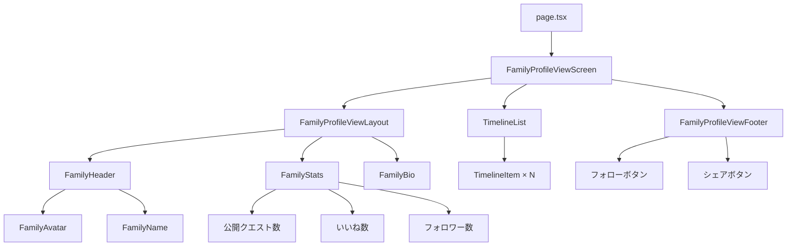

(2026年3月記載)

# 家族プロフィール閲覧画面 コンポーネント構造

## ファイル構成

```
app/(app)/families/[id]/view/
├── page.tsx                                    # ページエントリーポイント
├── FamilyProfileViewScreen.tsx                 # メイン画面コンポーネント
├── _components/
│   ├── FamilyProfileViewLayout.tsx            # プロフィール表示レイアウト
│   └── FamilyProfileViewFooter.tsx            # フッター（フォローボタン等）
└── _hooks/
    └── useFamilyProfile.ts                     # プロフィール関連フック集
        - useFamilyDetail                       # 家族詳細取得
        - useFollowStatus                       # フォロー状態取得
        - useFollowToggle                       # フォロー切り替え
        - useFamilyTimeline                     # タイムライン取得
```

## コンポーネント階層



## 主要コンポーネント

### FamilyProfileViewScreen
**責務:** 画面全体の制御とデータ管理

**ファイル:** `app/(app)/families/[id]/view/FamilyProfileViewScreen.tsx`

**Props:**
```typescript
type Props = {
  id: string  // 家族ID
}
```

**使用コンポーネント:**
- `FamilyProfileViewLayout`: プロフィール情報表示
- `TimelineList`: タイムライン表示
- `FamilyProfileViewFooter`: フォローボタン等

**レイアウト構造:**
```
┌─────────────────────────────────────┐
│ Header (Title + Back Button)       │
├─────────────────────────────────────┤
│ FamilyProfileViewLayout             │
│  ┌─────────────────────────────┐  │
│  │   [Family Avatar]           │  │
│  │   家族名                    │  │
│  │   紹介文                    │  │
│  └─────────────────────────────┘  │
│  ┌─────────────────────────────┐  │
│  │ Statistics                  │  │
│  │  公開クエスト: 12           │  │
│  │  いいね数: 45               │  │
│  │  フォロワー: 8              │  │
│  └─────────────────────────────┘  │
├─────────────────────────────────────┤
│ Timeline Section                    │
│  ┌─────────────────────────────┐  │
│  │ Timeline Item 1             │  │
│  ├─────────────────────────────┤  │
│  │ Timeline Item 2             │  │
│  ├─────────────────────────────┤  │
│  │ Timeline Item 3             │  │
│  └─────────────────────────────┘  │
├─────────────────────────────────────┤
│ FamilyProfileViewFooter             │
│  [フォロー/フォロー中] [シェア]    │
└─────────────────────────────────────┘
```

### FamilyProfileViewLayout
**責務:** 家族プロフィール情報の表示

**ファイル:** `app/(app)/families/[id]/view/_components/FamilyProfileViewLayout.tsx`

**Props:**
```typescript
type Props = {
  family: {
    id: string
    name: string
    icon: string
    description: string | null
    publicQuestCount: number
    totalLikes: number
    followerCount: number
    createdAt: string
  }
}
```

**表示項目:**
```
┌─────────────────────────┐
│    [Avatar Image]       │
│                         │
│      家族名             │
│    （サブテキスト）      │
├─────────────────────────┤
│ 紹介文                  │
│ この家族の説明文...     │
├─────────────────────────┤
│ 統計情報                │
│  📝 公開クエスト: 12    │
│  ❤️  いいね数: 45        │
│  👥 フォロワー: 8       │
├─────────────────────────┤
│ 登録日: 2026年1月1日    │
└─────────────────────────┘
```

### FamilyProfileViewFooter
**責務:** アクションボタンの表示

**ファイル:** `app/(app)/families/[id]/view/_components/FamilyProfileViewFooter.tsx`

**Props:**
```typescript
type Props = {
  familyId: string
  isFollowing: boolean
  onFollowToggle: () => Promise<void>
  isLoading: boolean
}
```

**レイアウト:**
```
┌─────────────────────────────────┐
│  [フォロー中 ✓] [シェア 🔗]    │
│  または                         │
│  [フォロー] [シェア 🔗]        │
└─────────────────────────────────┘
```

**ボタンスタイル:**
- フォロー: プライマリーボタン（青）
- フォロー中: セカンダリーボタン（グレー）+ チェックマーク
- シェア: アウトラインボタン

## タイムラインコンポーネント

### TimelineList
**責務:** 家族タイムライン一覧の表示

**使用箇所:** `FamilyProfileViewScreen` 内

**Props:**
```typescript
type Props = {
  familyId: string
  limit?: number
}
```

**実装例:**
```typescript
export function TimelineList({ familyId, limit = 10 }: Props) {
  const { data, isLoading } = useFamilyTimeline(familyId, limit)
  
  if (isLoading) return <LoadingSpinner />
  if (!data?.items.length) return <EmptyState message="タイムラインはまだありません" />
  
  return (
    <Stack gap="md">
      <Title order={3}>タイムライン</Title>
      <Stack gap="xs">
        {data.items.map((item) => (
          <TimelineItem key={item.id} item={item} />
        ))}
      </Stack>
    </Stack>
  )
}
```

### TimelineItem
**責務:** タイムライン項目の表示

**Props:**
```typescript
type Props = {
  item: {
    id: string
    eventType: 'quest_completed' | 'quest_published' | 'level_up'
    childName: string
    questTitle?: string
    level?: number
    createdAt: string
  }
}
```

**表示例:**
```
┌─────────────────────────────────┐
│ 🎉 太郎さんがレベル5に到達！   │
│ 2時間前                         │
└─────────────────────────────────┘

┌─────────────────────────────────┐
│ ✅ 花子さんが「部屋の掃除」を  │
│    完了しました！               │
│ 1日前                           │
└─────────────────────────────────┘
```

## 認証・権限管理

### アクセス制御
**ファイル:** `app/(app)/families/[id]/view/page.tsx`

```typescript
// authGuard設定
export const authGuard = {
  childNG: true,    // 子供アカウントはアクセス不可
  guestNG: true,    // ゲストアカウントはアクセス不可
}
```

**アクセス可能:**
- 親ユーザーのみ
- すべての家族のプロフィールを閲覧可能（公開情報）

## 共通UIコンポーネント使用

### Mantineコンポーネント
- `Avatar`: 家族アイコン
- `Card`: 情報カード
- `Stack`: 縦方向レイアウト
- `Group`: 横方向レイアウト
- `Text`: テキスト表示
- `Title`: タイトル表示
- `Button`: アクションボタン
- `Badge`: 統計バッジ
- `Divider`: セクション区切り

### カスタム共通コンポーネント
- `TimelineItem`: タイムライン項目
- `EmptyState`: 空状態表示
- `LoadingSpinner`: ローディング表示
- `ErrorDisplay`: エラー表示

## 統計情報の表示

### FamilyStats コンポーネント

**Props:**
```typescript
type Props = {
  publicQuestCount: number
  totalLikes: number
  followerCount: number
}
```

**実装例:**
```typescript
export function FamilyStats({ 
  publicQuestCount, 
  totalLikes, 
  followerCount 
}: Props) {
  return (
    <Card withBorder p="md">
      <Group justify="space-around">
        <Stack align="center" gap={4}>
          <Text size="xl" fw={700}>{publicQuestCount}</Text>
          <Text size="xs" c="dimmed">公開クエスト</Text>
        </Stack>
        
        <Divider orientation="vertical" />
        
        <Stack align="center" gap={4}>
          <Text size="xl" fw={700}>{totalLikes}</Text>
          <Text size="xs" c="dimmed">いいね</Text>
        </Stack>
        
        <Divider orientation="vertical" />
        
        <Stack align="center" gap={4}>
          <Text size="xl" fw={700}>{followerCount}</Text>
          <Text size="xs" c="dimmed">フォロワー</Text>
        </Stack>
      </Group>
    </Card>
  )
}
```

## レスポンシブデザイン

### プロフィールレイアウト

```typescript
// FamilyProfileViewLayout.tsx
<Stack gap="lg">
  {/* ヘッダーセクション */}
  <Group align="flex-start" wrap="nowrap">
    <Avatar size={80} src={family.icon} radius="xl" />
    <Stack gap={4} flex={1}>
      <Title order={2}>{family.name}</Title>
      <Text size="sm" c="dimmed">
        {formatDate(family.createdAt)}から参加
      </Text>
    </Stack>
  </Group>
  
  {/* 紹介文 */}
  {family.description && (
    <Text size="sm">{family.description}</Text>
  )}
  
  {/* 統計情報 */}
  <FamilyStats
    publicQuestCount={family.publicQuestCount}
    totalLikes={family.totalLikes}
    followerCount={family.followerCount}
  />
</Stack>
```
