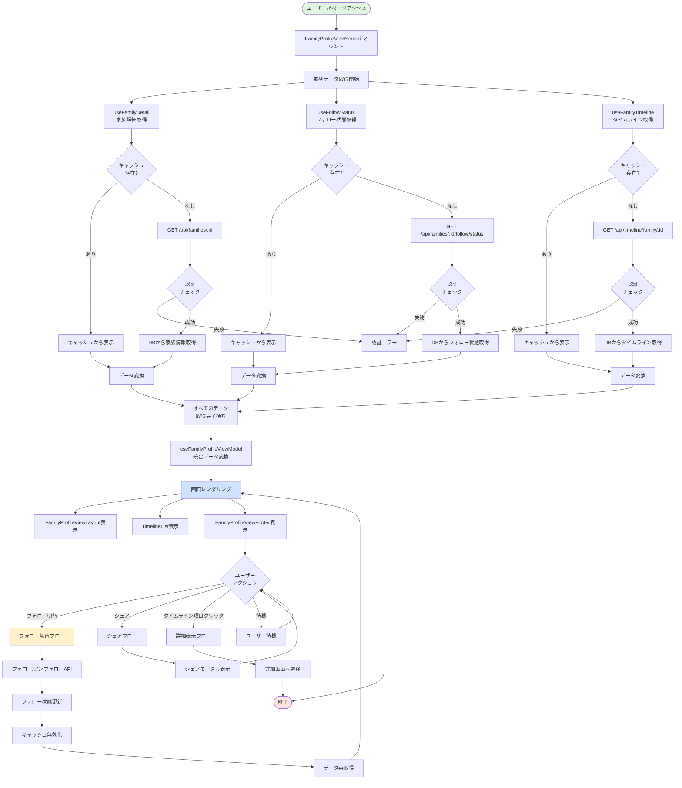
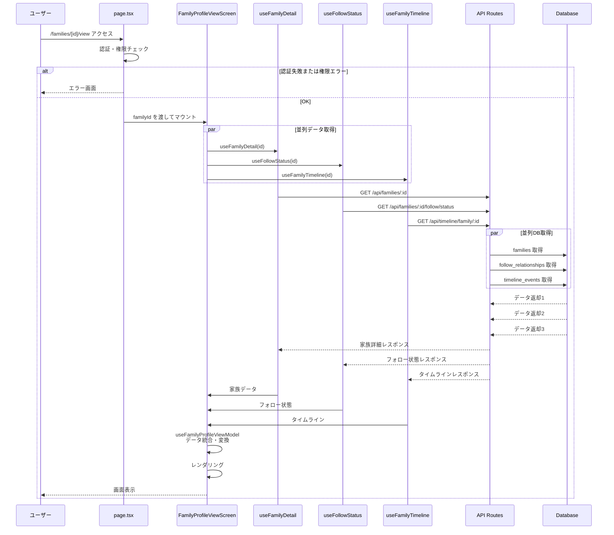
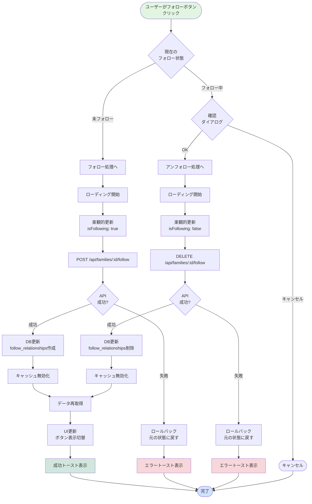
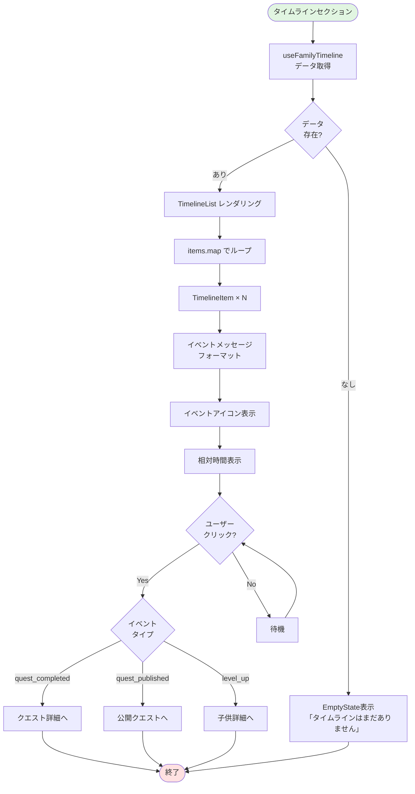
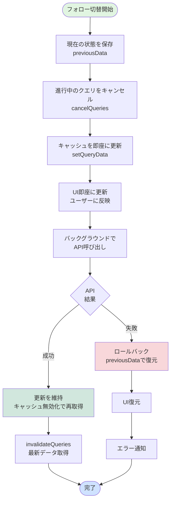
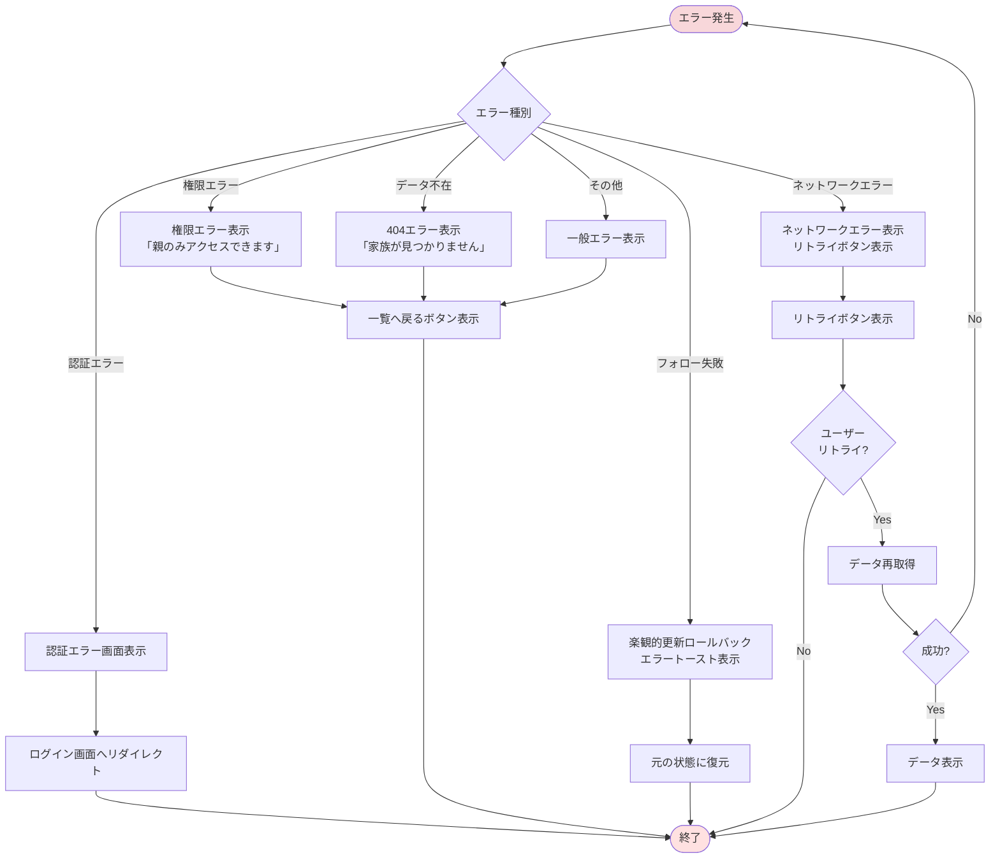
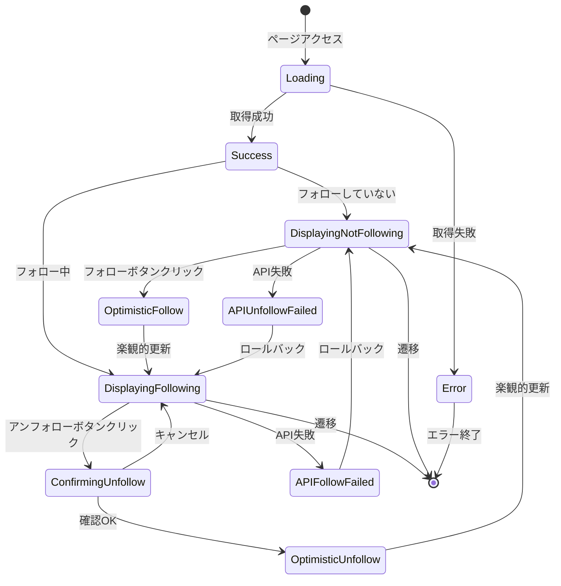
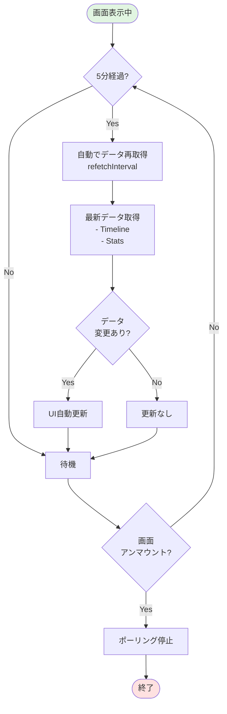

(2026年3月記載)

# 家族プロフィール閲覧画面 フロー図

## 画面表示フロー全体



## 初期表示シーケンス



## フォロー切替フロー



## シェア機能フロー

```mermaid
flowchart TD
    Start([ユーザーがシェアボタンクリック]) --> CheckShare{Web Share API<br/>サポート?}
    
    CheckShare -->|Yes| NativeShare[navigator.share()<br/>ネイティブシェア]
    CheckShare -->|No| ShowModal[シェアモーダル表示]
    
    NativeShare --> ShareSuccess{シェア<br/>成功?}
    ShareSuccess -->|Yes| ShowToast1[成功トースト]
    ShareSuccess -->|No| ShowModal
    
    ShowModal --> ModalContent[モーダル内容表示<br/>- URL<br/>- コピーボタン<br/>- SNSリンク]
    
    ModalContent --> UserSelect{ユーザー<br/>選択}
    
    UserSelect -->|URLコピー| CopyURL[クリップボードにコピー]
    UserSelect -->|SNS| OpenSNS[SNSアプリ/ブラウザ起動]
    UserSelect -->|閉じる| CloseModal[モーダル閉じる]
    
    CopyURL --> ShowToast2[コピー成功トースト]
    ShowToast2 --> ModalContent
    
    OpenSNS --> End([終了])
    CloseModal --> End
    ShowToast1 --> End
    
    style Start fill:#e1f5e1
    style End fill:#cfe2ff
```

## タイムライン表示フロー



## 楽観的更新フロー（Optimistic Update）



## エラーハンドリングフロー



## 状態管理フロー



## リアルタイム更新フロー（ポーリング）


