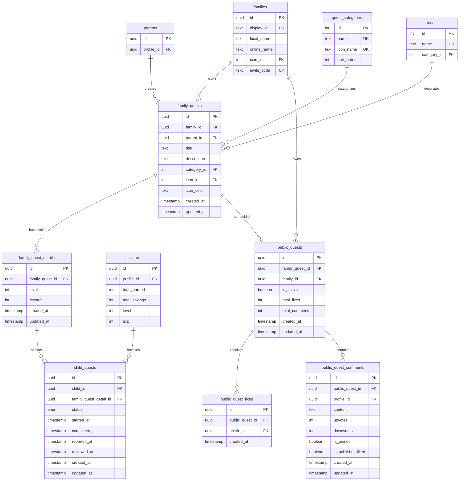

(2026年3月記載)

# 家族クエスト関連テーブル ER図

## 家族クエストのデータ構造



## 主要なリレーション

### 家族クエスト作成フロー
1. `families` → `family_quests`: 家族がクエストを所有
2. `parents` → `family_quests`: 親がクエストを作成
3. `quest_categories` → `family_quests`: カテゴリでクエストを分類
4. `icons` → `family_quests`: アイコンでクエストを装飾
5. `family_quests` → `family_quest_details`: クエストは複数レベルを持つ

### 子供クエスト受注フロー
1. `family_quest_details` → `child_quests`: レベル詳細から子供クエストが生成
2. `children` → `child_quests`: 子供がクエストを受注
3. `child_quests.status`: ステータス遷移でライフサイクル管理
   - `not_started` → `in_progress` → `pending_review` → `completed`

### 公開クエストフロー
1. `family_quests` → `public_quests`: 家族クエストを公開（1対0..1）
2. `public_quests` → `public_quest_likes`: いいねを集める
3. `public_quests` → `public_quest_comments`: コメントを受ける

## データ整合性ルール

### CASCADE（連鎖削除）
- `family_quests` 削除時:
  - `family_quest_details` も削除
  - `child_quests` も削除（間接的にfamily_quest_detailsから）
  - `public_quests` も削除

### RESTRICT（削除制限）
- `families` 削除時: family_questsが存在する場合は削除不可
- `parents` 削除時: family_questsが存在する場合は削除不可
- `quest_categories` 削除時: 使用中の場合は削除不可
- `icons` 削除時: 使用中の場合は削除不可

## 子供クエストステータス

### child_quest_status Enum
```typescript
type ChildQuestStatus = 
  | "not_started"      // 未着手
  | "in_progress"      // 進行中
  | "pending_review"   // 報告中（親の承認待ち）
  | "completed"        // 完了
```

### ステータス遷移
- `not_started` → `in_progress`: 子供がクエストを開始
- `in_progress` → `pending_review`: 子供が完了報告
- `pending_review` → `completed`: 親が承認
- `pending_review` → `in_progress`: 親が却下
- `in_progress` → `not_started`: 子供がリセット

## タイムスタンプ追跡

### family_quests, family_quest_details
- `created_at`: 作成日時
- `updated_at`: 更新日時

### child_quests
- `created_at`: 受注日時
- `started_at`: 開始日時（`not_started` → `in_progress`）
- `completed_at`: 完了日時（最終承認日時）
- `reported_at`: 報告日時（`in_progress` → `pending_review`）
- `reviewed_at`: 承認/却下日時（`pending_review` → `completed` or `in_progress`）
- `updated_at`: 最終更新日時

### public_quests
- `created_at`: 公開日時
- `updated_at`: 最終更新日時
