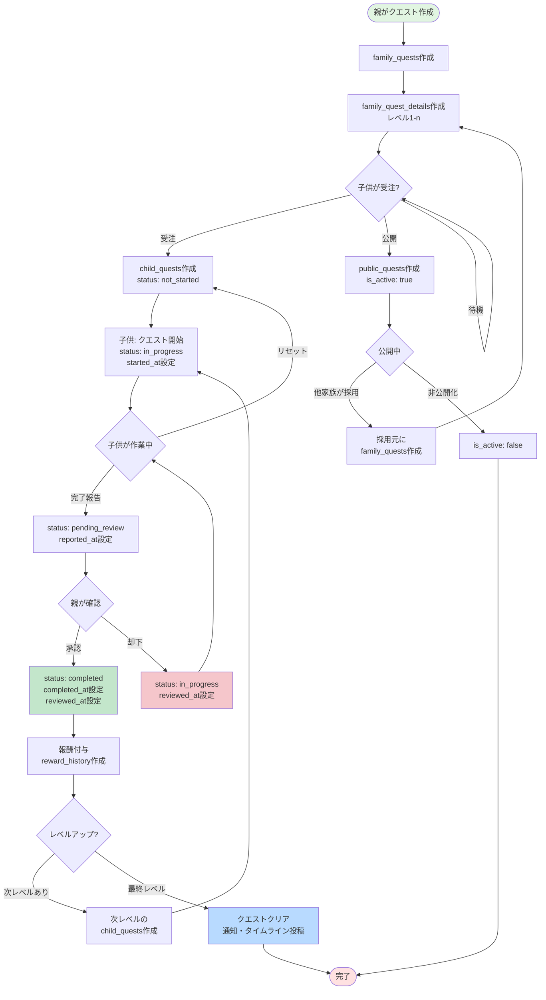
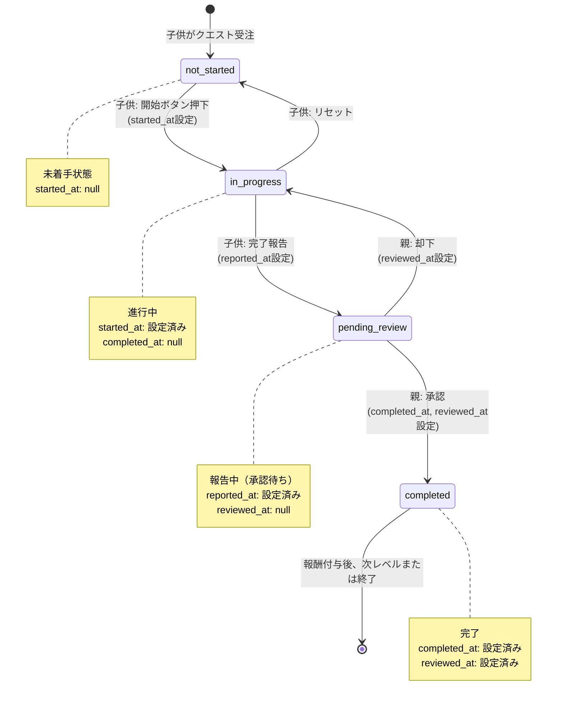
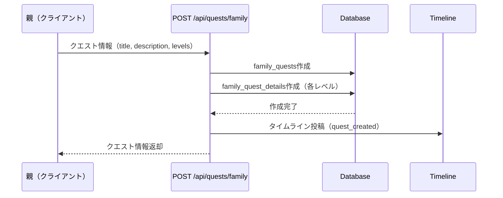
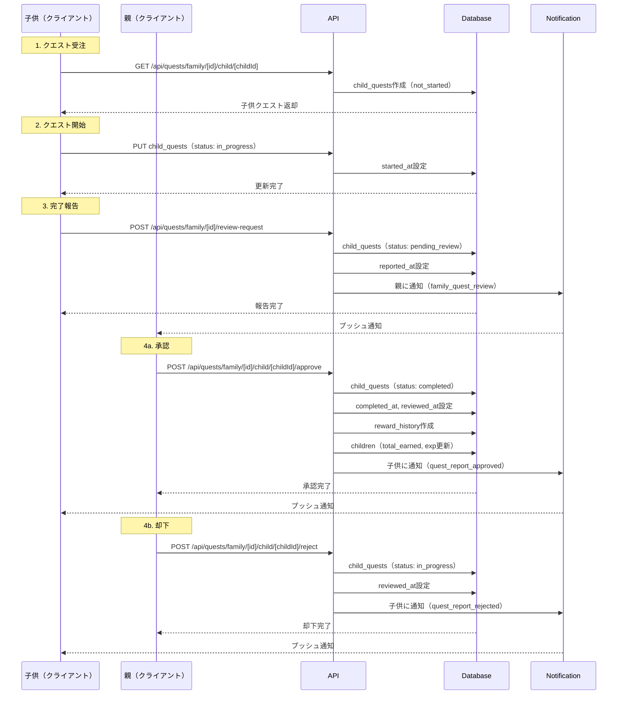
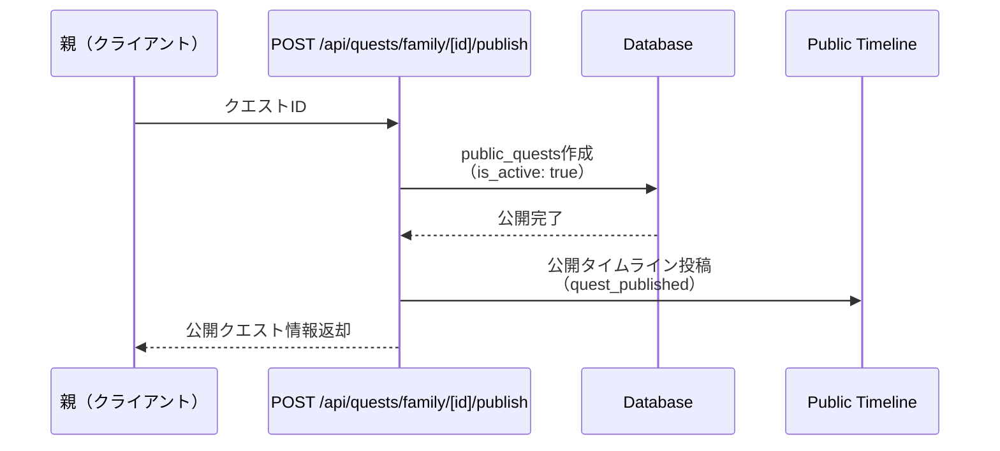

(2026年3月記載)

# 家族クエストライフサイクル フロー図

## クエスト全体のライフサイクル

## 子供クエストステータス遷移詳細

## API呼び出しフロー

### クエスト作成フロー

### クエスト受注～完了フロー

### クエスト公開フロー

## 処理の注意点

### トランザクション必須箇所
1. **クエスト作成**: family_quests + family_quest_details（複数レベル）
2. **承認処理**: child_quests更新 + reward_history作成 + children更新
3. **レベルアップ**: children更新 + 次レベルchild_quests作成

### 排他制御が必要な処理
1. **承認/却下**: 同時に複数の親が操作しないように排他制御
2. **報酬付与**: total_earnedの加算処理

### 非同期処理推奨
1. **通知送信**: API応答を遅延させない
2. **タイムライン投稿**: メイン処理と並行実行
