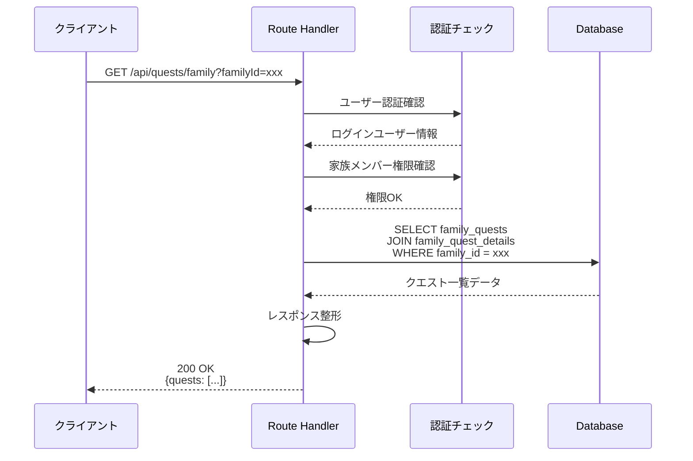
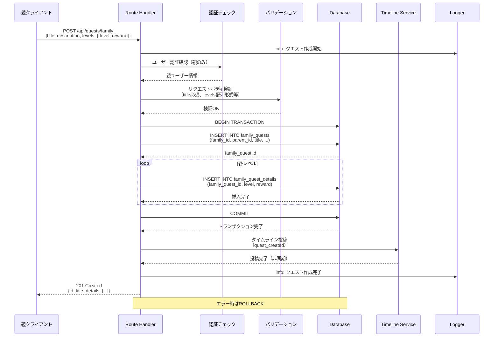
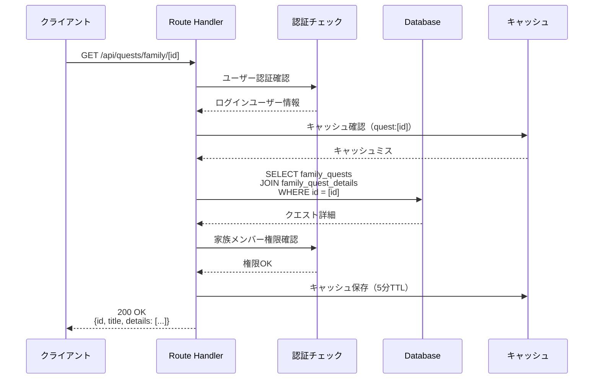
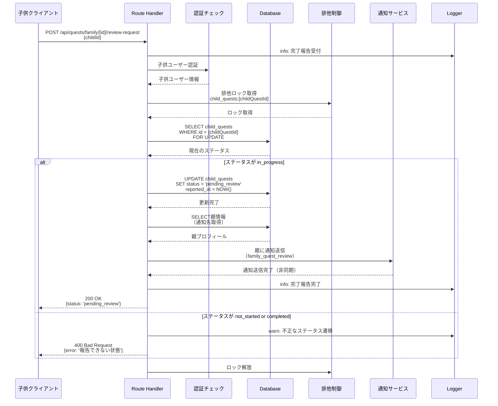
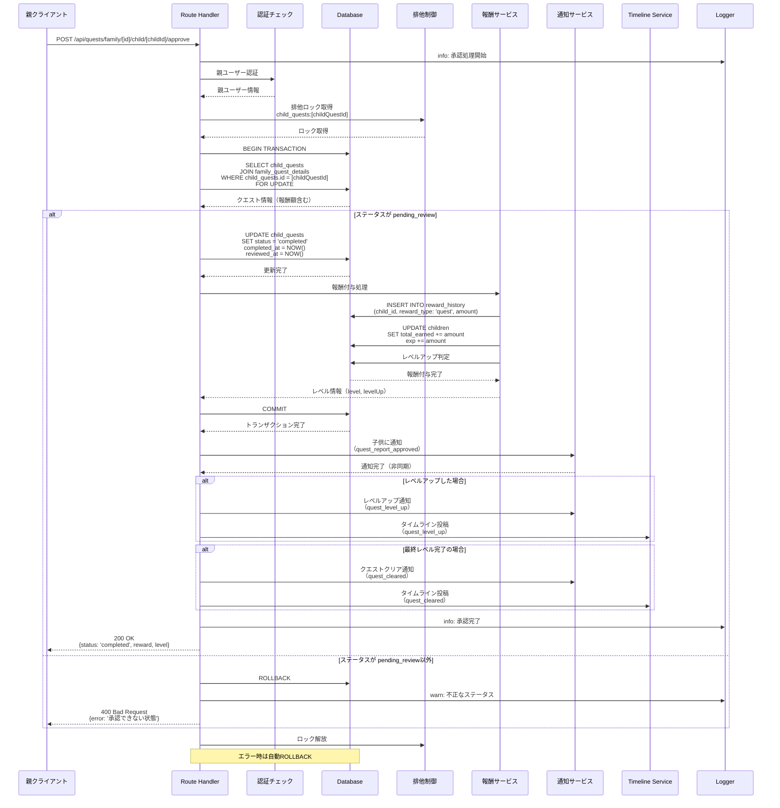
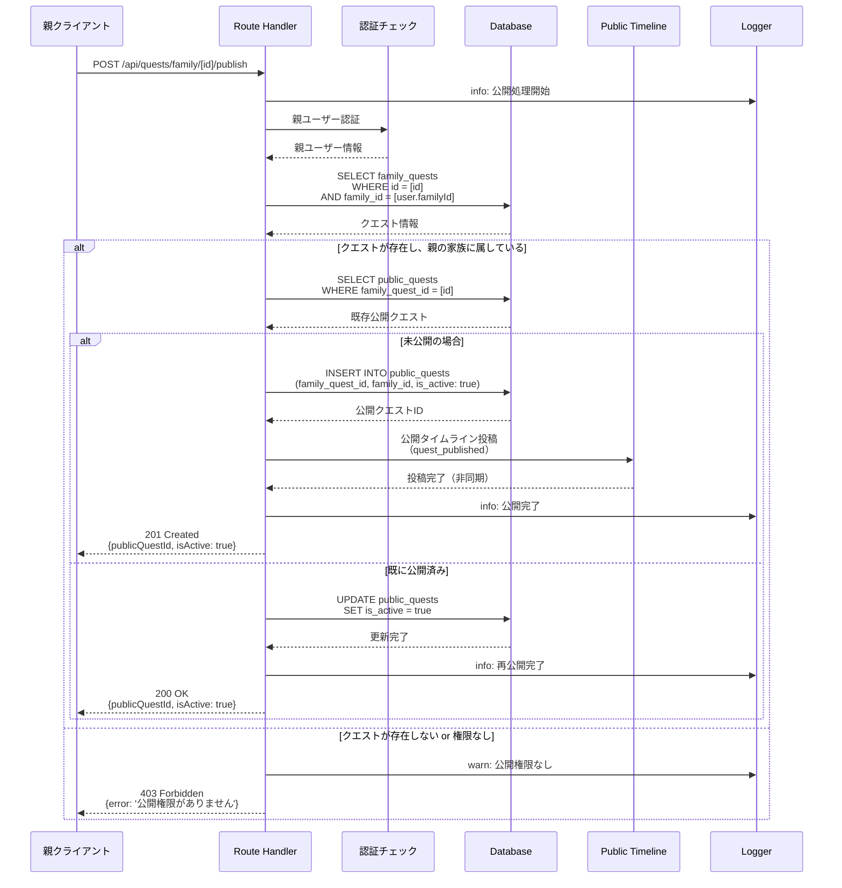
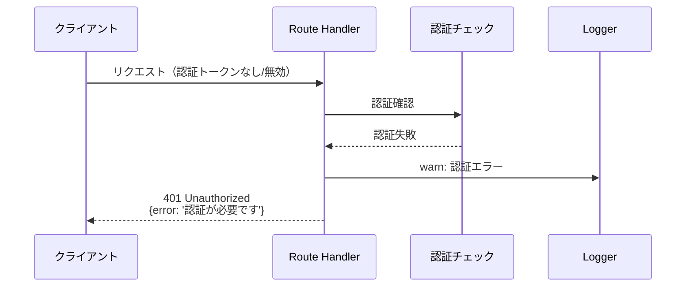
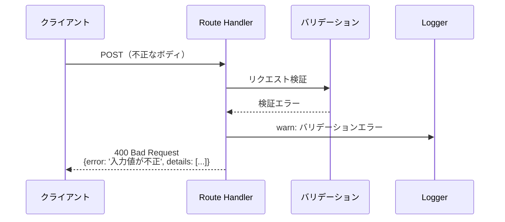
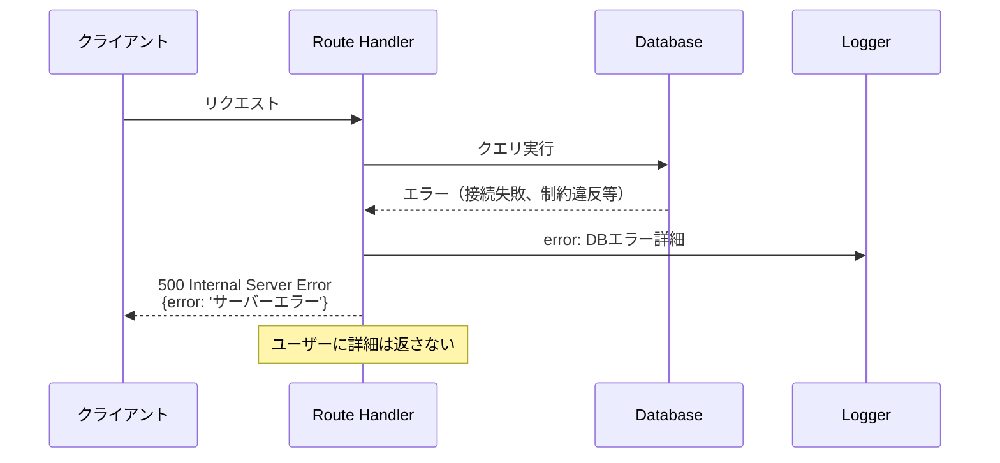

(2026年3月15日 14:30記載)

# 家族クエストAPI シーケンス図

## API エンドポイント一覧（再掲）

### 基本CRUD
- `GET /api/quests/family`: 一覧取得
- `POST /api/quests/family`: 新規作成
- `GET /api/quests/family/[id]`: 詳細取得
- `PUT /api/quests/family/[id]`: 更新
- `DELETE /api/quests/family/[id]`: 削除

### 公開機能
- `POST /api/quests/family/[id]/publish`: 公開
- `GET /api/quests/family/[id]/public`: 公開クエスト取得

### 子供クエスト操作
- `GET /api/quests/family/[id]/child/[childId]`: 子供クエスト取得
- `POST /api/quests/family/[id]/review-request`: 完了報告
- `POST /api/quests/family/[id]/cancel-review`: 報告キャンセル
- `POST /api/quests/family/[id]/child/[childId]/approve`: 承認
- `POST /api/quests/family/[id]/child/[childId]/reject`: 却下

## GET /api/quests/family（一覧取得）

## POST /api/quests/family（新規作成）

## GET /api/quests/family/[id]（詳細取得）

## POST /api/quests/family/[id]/review-request（完了報告）

## POST /api/quests/family/[id]/child/[childId]/approve（承認）

## POST /api/quests/family/[id]/publish（公開）

## エラーハンドリングパターン

### 認証エラー

### バリデーションエラー

### データベースエラー

## ファイル構成参照

### API Route Files
- `packages/web/app/api/quests/family/route.ts`: 一覧取得、作成
- `packages/web/app/api/quests/family/[id]/route.ts`: 詳細、更新、削除
- `packages/web/app/api/quests/family/[id]/publish/route.ts`: 公開
- `packages/web/app/api/quests/family/[id]/review-request/route.ts`: 完了報告
- `packages/web/app/api/quests/family/[id]/child/[childId]/approve/route.ts`: 承認
- `packages/web/app/api/quests/family/[id]/child/[childId]/reject/route.ts`: 却下

### クライアント側
- `packages/web/app/api/quests/family/client.ts`: APIクライアント
- `packages/web/app/api/quests/family/query.ts`: React Queryフック
