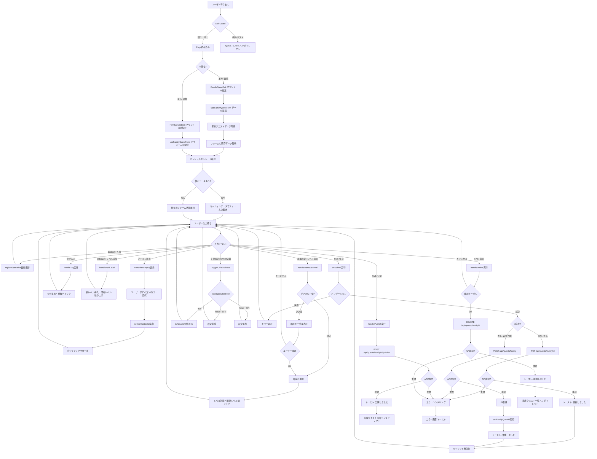
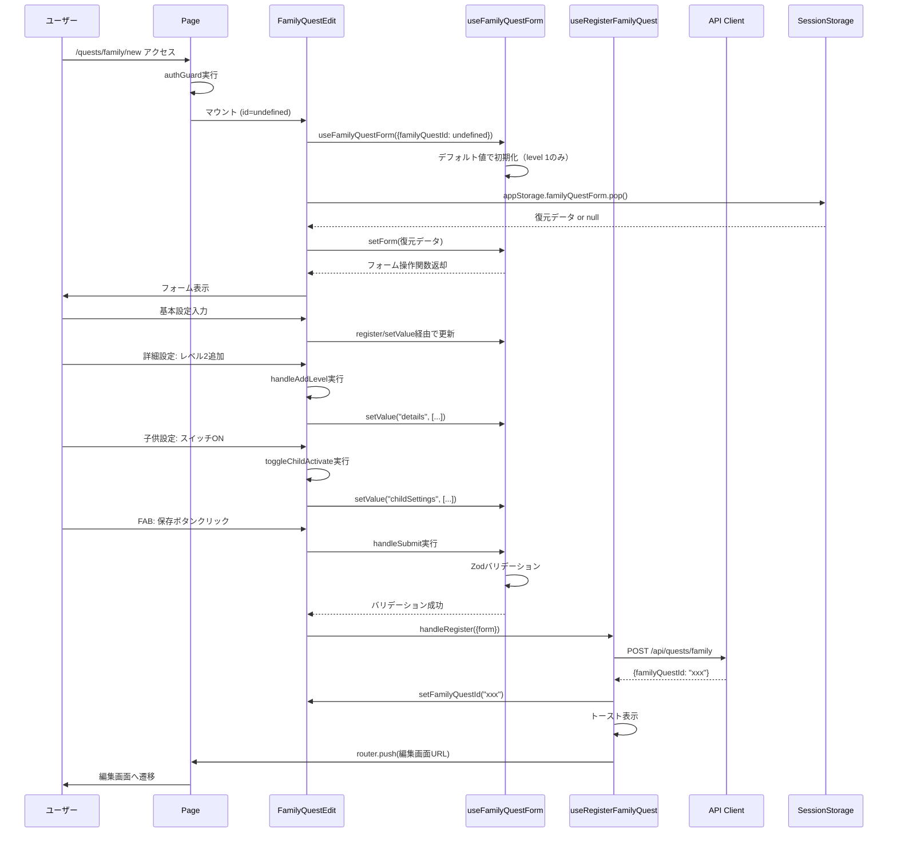
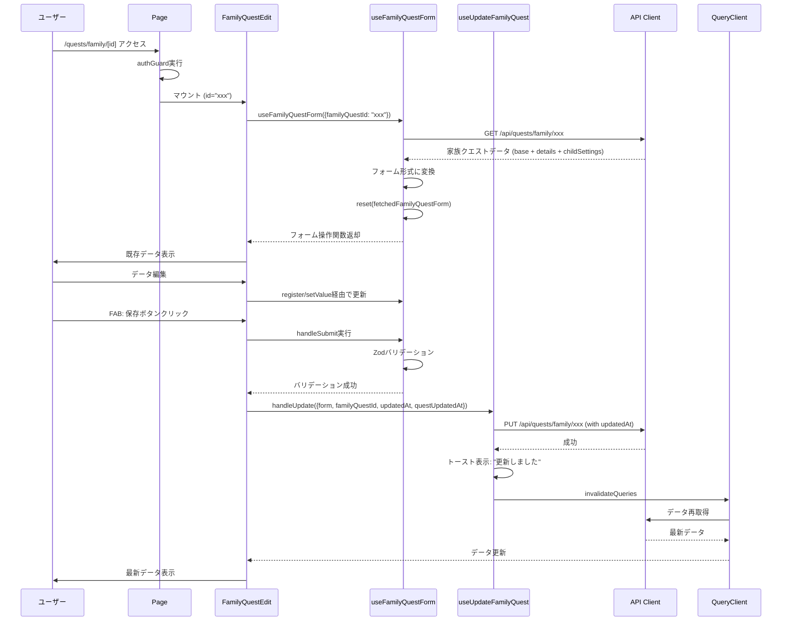
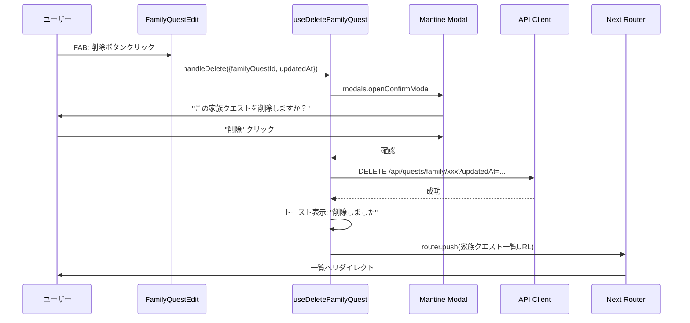
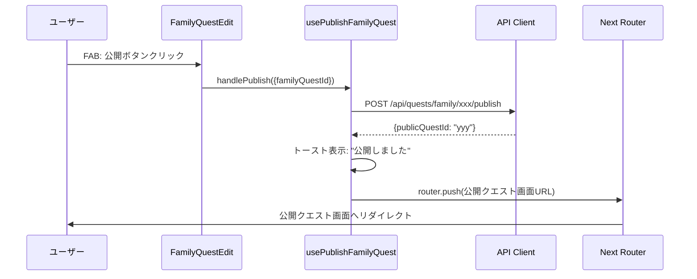
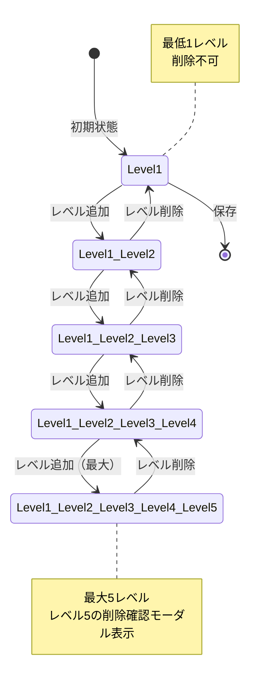
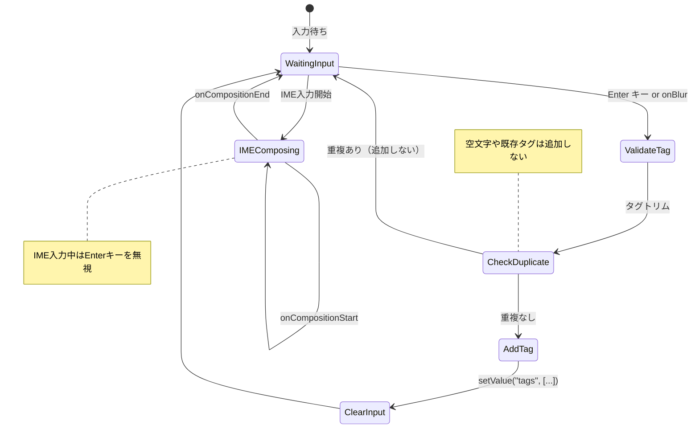
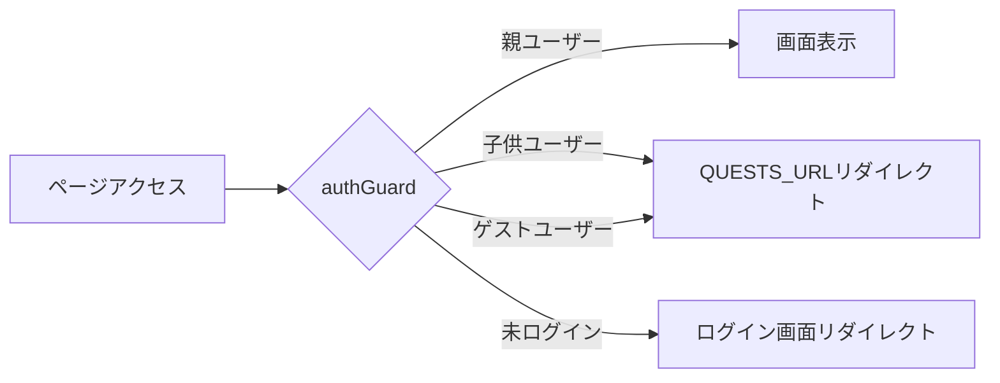

# 家族クエスト編集 - フロー図

**2026年3月記載**

## 全体フロー



## 新規作成フロー詳細



## 更新フロー詳細



## 削除フロー



## 公開フロー



## エラーハンドリングフロー

```mermaid
graph TD
    A[エラー発生] --> B{エラータイプ}
    
    B -->|バリデーションエラー| C[errors表示]
    C --> D[タブにエラーバッジ表示]
    D --> E[該当フィールドにエラーメッセージ表示]
    E --> F[ユーザー修正待ち]
    
    B -->|API取得エラー| G[handleAppError]
    G --> H{エラー種別}
    H -->|401/403| I[認証エラー画面]
    H -->|404| J[Not Found画面]
    H -->|その他| K[エラートースト]
    
    BデータベーススキーマAPI送信エラー| L[handleAppError]
    L --> M[エラートースト表示]
    M --> F
    
    B -->|楽観的ロック競合| N[409 Conflict]
    N --> O[トースト: "データが更新されています"]
    O --> P[データ再取得]
    P --> Q[最新データでフォーム更新]
    Q --> F
    
    B -->|ネットワークエラー| R[handleAppError]
    R --> S[ネットワークエラートースト]
    S --> F
```

## レベル管理フロー



## タグ入力フロー



## 認証ガードフロー


