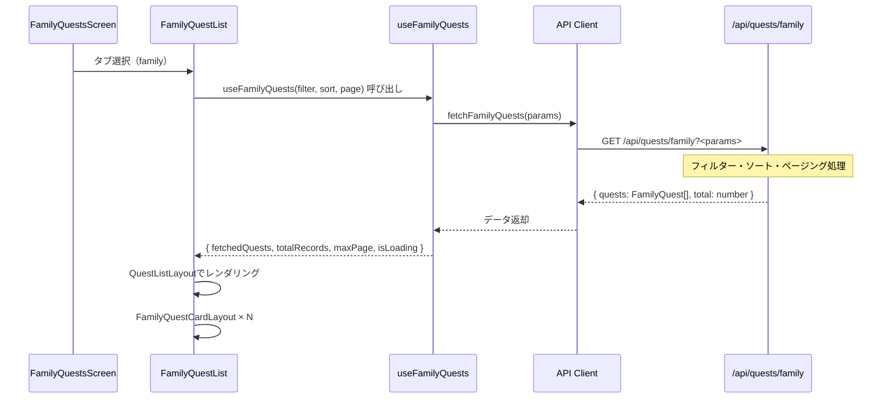

(2026年3月記載)

# 家族クエスト一覧画面 データフェッチング

## データフェッチングフロー



---

## 使用フック

### useFamilyQuests
**パス**: `app/(app)/quests/family/_hooks/useFamilyQuests.ts`

**責務**:
- 家族クエスト一覧データの取得
- フィルタリング・ソート・ページング
- キャッシュ管理

**パラメータ**:
```typescript
{
  filter: FamilyQuestFilterType
  sortColumn: string
  sortOrder: 'asc' | 'desc'
  page: number
  pageSize: number
}
```

**返り値**:
```typescript
{
  fetchedQuests: FamilyQuest[]    // クエスト一覧
  isLoading: boolean              // ローディング状態
  error: Error | null             // エラー情報
  totalRecords: number            // 総レコード数
  maxPage: number                 // 最大ページ数
  refetch: () => void             // 再取得関数
}
```

**フィルタ型定義**:
```typescript
type FamilyQuestFilterType = {
  name?: string           // クエスト名（部分一致）
  categoryId?: string     // カテゴリID
  tags?: string[]         // タグ一覧
  minReward?: number      // 最小報酬
  maxReward?: number      // 最大報酬
}
```

**内部実装**:
- React Query (`useQuery`) を使用
- キャッシュキー: `['familyQuests', filter, sortColumn, sortOrder, page, pageSize]`
- staleTime: 5分
- keepPreviousData: true（ページ遷移時のちらつき防止）

---

## APIエンドポイント

### GET /api/quests/family

**リクエスト**:
```http
GET /api/quests/family?familyId={familyId}&name={name}&categoryId={categoryId}&sortColumn={sortColumn}&sortOrder={sortOrder}&limit={limit}&offset={offset}
Authorization: Bearer <token>
```

**クエリパラメータ**:
| パラメータ | 型 | 必須 | 説明 |
|-----------|-----|------|------|
| familyId | uuid | Yes | 家族ID |
| name | string | No | クエスト名（部分一致） |
| categoryId | uuid | No | カテゴリID |
| tags | string[] | No | タグ一覧（カンマ区切り） |
| minReward | number | No | 最小報酬 |
| maxReward | number | No | 最大報酬 |
| sortColumn | string | No | ソート列（デフォルト: id） |
| sortOrder | asc/desc | No | ソート順（デフォルト: asc） |
| limit | number | No | 取得件数（デフォルト: 30） |
| offset | number | No | オフセット（デフォルト: 0） |

**レスポンス**:
```typescript
{
  quests: [
    {
      id: string
      familyId: string
      parentId: string
      title: string
      description: string
      categoryId: number
      iconId: number
      iconColor: string
      createdAt: string
      updatedAt: string
      details: [
        {
          id: string
          familyQuestId: string
          level: number
          reward: number
          experiencePoints: number
          estimatedMinutes: number
        }
      ]
    }
  ],
  total: number
}
```

**エラーレスポンス**:
- `401 Unauthorized`: 認証エラー
- `403 Forbidden`: アクセス権限なし
- `500 Internal Server Error`: サーバーエラー

---

## フィルタリング処理

### クライアント側フィルタ管理
```typescript
const [questFilter, setQuestFilter] = useState<FamilyQuestFilterType>({ tags: [] })
const [searchFilter, setSearchFilter] = useState<FamilyQuestFilterType>({ tags: [] })

// 検索ボタン押下時
const handleSearch = () => {
  setSearchFilter(questFilter)  // 検索フィルターを更新
  setPage(1)                     // ページをリセット
}
```

### URLクエリパラメータとの同期
```typescript
// クエリストリング → フィルター
useEffect(() => {
  const queryObj = Object.fromEntries(searchParams.entries())
  const parsedQuery = {
    ...queryObj,
    tags: queryObj.tags ? queryObj.tags.split(",") : []
  }
  setQuestFilter(FamilyQuestFilterScheme.parse(parsedQuery))
}, [searchParams])

// フィルター → クエリストリング
const handleFilterSearch = (filter: FamilyQuestFilterType) => {
  const paramsObj = Object.fromEntries(
    Object.entries(filter)
      .filter(([_, v]) => v !== undefined && v !== null && v !== '')
      .map(([k, v]) => [k, String(v)])
  )
  const params = new URLSearchParams({ tab: 'family', ...paramsObj })
  router.push(`${FAMILY_QUESTS_URL}?${params.toString()}`)
  setSearchFilter(filter)
}
```

---

## ソート処理

### ソート状態管理
```typescript
const [sort, setSort] = useState<QuestSort>({ 
  column: "id", 
  order: "asc" 
})

const handleSortSearch = (newSort: QuestSort) => {
  setSort(newSort)
  // URLクエリパラメータを更新
  const params = new URLSearchParams({
    tab: 'family',
    sortColumn: newSort.column,
    sortOrder: newSort.order
  })
  router.push(`${FAMILY_QUESTS_URL}?${params.toString()}`)
}
```

### ソート可能なカラム
- `id`: ID順
- `title`: タイトル順
- `createdAt`: 作成日順
- `reward`: 報酬額順（レベル1の報酬）

---

## ページネーション

### ページ状態管理
```typescript
const [page, setPage] = useState<number>(1)
const pageSize = 30

const handlePageChange = (newPage: number) => {
  setPage(newPage)
  window.scrollTo({ top: 0, behavior: 'smooth' })
}
```

### オフセット計算
```typescript
const offset = (page - 1) * pageSize
```

### 総ページ数計算
```typescript
const maxPage = Math.ceil(totalRecords / pageSize)
```

---

## ローディング状態

### 初期ローディング
```typescript
if (isLoading && !fetchedQuests.length) {
  return <Center><Loader size="lg" /></Center>
}
```

### ページ遷移時のローディング
React Queryの`keepPreviousData: true`を使用して、
前のページのデータを表示しながら次のページをロード:
```typescript
{isLoading && <Loader size="sm" />}
```

---

## エラーハンドリング

### エラー発生時
```typescript
if (error) {
  return (
    <Alert color="red">
      クエスト一覧の取得に失敗しました
      <Button onClick={refetch}>リトライ</Button>
    </Alert>
  )
}
```

### リトライ機能
```typescript
const { refetch } = useFamilyQuests({...})

<Button onClick={() => refetch()}>
  再読み込み
</Button>
```

---

## キャッシュ戦略

### React Queryキャッシュ
```typescript
{
  queryKey: ['familyQuests', filter, sortColumn, sortOrder, page, pageSize],
  queryFn: () => fetchFamilyQuests({...}),
  staleTime: 5 * 60 * 1000,      // 5分
  cacheTime: 10 * 60 * 1000,     // 10分
  keepPreviousData: true,         // ページ遷移時のちらつき防止
  refetchOnWindowFocus: true
}
```

### キャッシュ無効化
以下の操作後にキャッシュを無効化:
```typescript
// クエスト作成後
queryClient.invalidateQueries(['familyQuests'])

// クエスト編集後
queryClient.invalidateQueries(['familyQuests'])

// クエスト削除後
queryClient.invalidateQueries(['familyQuests'])
```

---

## カテゴリデータ取得

### useQuestCategories
```typescript
const { questCategories, questCategoryById, isLoading } = useQuestCategories()
```

**返り値**:
```typescript
{
  questCategories: QuestCategory[]
  questCategoryById: (id: number) => QuestCategory | undefined
  isLoading: boolean
}
```

**型定義**:
```typescript
type QuestCategory = {
  id: number
  name: string
  iconId: number
  color: string
}
```

---

## パフォーマンス最適化

### メモ化
```typescript
const renderFamilyQuestCard = useCallback((quest: FamilyQuest, index: number) => (
  <FamilyQuestCardLayout
    key={index}
    familyQuest={quest}
    onClick={(id) => router.push(FAMILY_QUEST_VIEW_URL(id))}
  />
), [router])

const questCards = useMemo(() => 
  fetchedQuests.map(renderFamilyQuestCard),
  [fetchedQuests, renderFamilyQuestCard]
)
```

### プリフェッチ
クエスト詳細画面へのプリフェッチ（ホバー時）:
```typescript
const prefetchQuestDetail = (questId: string) => {
  queryClient.prefetchQuery({
    queryKey: ['familyQuest', questId],
    queryFn: () => fetchFamilyQuestDetail(questId)
  })
}

<FamilyQuestCardLayout
  onMouseEnter={() => prefetchQuestDetail(quest.id)}
/>
```

---

## データ更新イベント

### リアルタイム更新（Supabase Realtime）
```typescript
useEffect(() => {
  const channel = supabase
    .channel('family-quests')
    .on('postgres_changes', {
      event: '*',
      schema: 'public',
      table: 'family_quests'
    }, () => {
      refetch()
    })
    .subscribe()
    
  return () => {
    supabase.removeChannel(channel)
  }
}, [])
```
