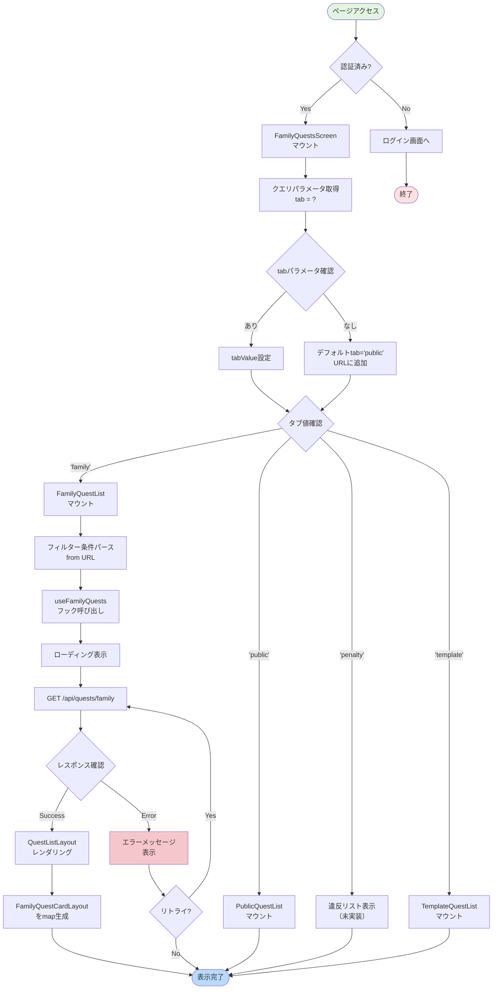
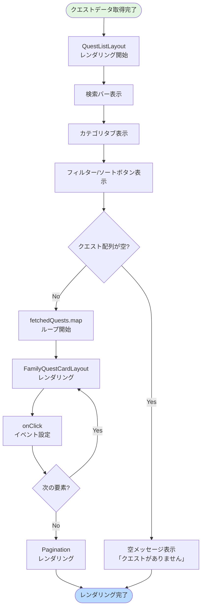
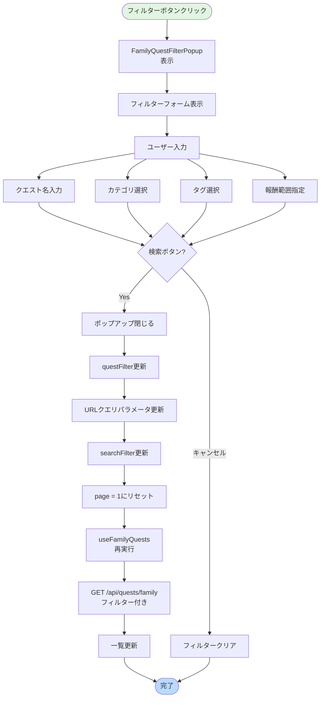
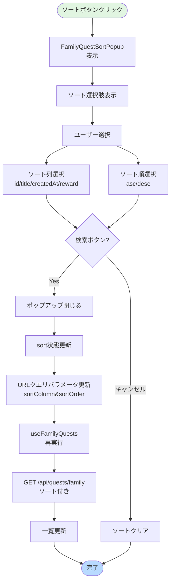
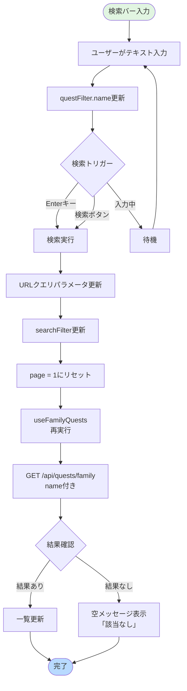
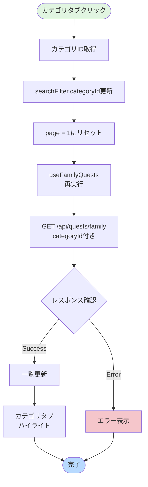
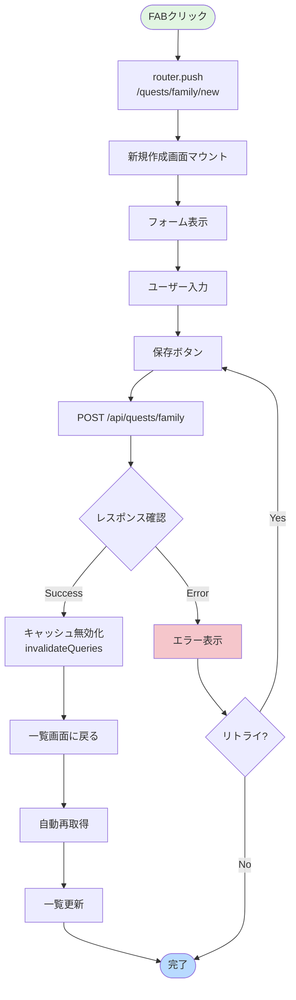

(2026年3月15日 14:30記載)

# 家族クエスト一覧画面 フロー図

## 初期表示フロー



---

## タブ切り替えフロー

```mermaid
flowchart TD
    Start([ユーザーがタブクリック]) --> GetTabValue[タブ値取得]
    GetTabValue --> UpdateState[tabValue状態更新]
    UpdateState --> UpdateQuery[URLクエリパラメータ更新<br/>?tab={value}]
    UpdateQuery --> ScrollToTab[タブ自動スクロール<br/>（横スクロール時）]
    
    ScrollToTab --> CheckTab{タブ値確認}
    CheckTab -->|'public'| ShowPublic[PublicQuestList表示]
    CheckTab -->|'family'| ShowFamily[FamilyQuestList表示]
    CheckTab -->|'penalty'| ShowPenalty[違反リスト表示]
    CheckTab -->|'template'| ShowTemplate[TemplateQuestList表示]
    
    ShowPublic --> ChangeColor1[タブカラー変更<br/>青色]
    ShowFamily --> ChangeColor2[タブカラー変更<br/>緑色]
    ShowPenalty --> ChangeColor3[タブカラー変更<br/>赤色]
    ShowTemplate --> ChangeColor4[タブカラー変更<br/>黄色]
    
    ChangeColor1 --> ResetScroll[スクロール位置リセット]
    ChangeColor2 --> ResetScroll
    ChangeColor3 --> ResetScroll
    ChangeColor4 --> ResetScroll
    
    ResetScroll --> End([完了])
    
    style Start fill:#e1f5e1
    style End fill:#b8daff
```

---

## リストレンダリング詳細フロー



---

## フィルタリングフロー



---

## ソートフロー



---

## ページネーションフロー

```mermaid
flowchart TD
    Start([ページ番号クリック]) --> GetPageNum[ページ番号取得]
    GetPageNum --> UpdatePage[page状態更新]
    UpdatePage --> ScrollTop[ページトップへ<br/>スムーススクロール]
    
    ScrollTop --> CalcOffset[オフセット計算<br/>offset = (page-1) * pageSize]
    CalcOffset --> TriggerRefetch[useFamilyQuests<br/>再実行]
    
    TriggerRefetch --> FetchAPI[GET /api/quests/family<br/>offset&limit付き]
    FetchAPI --> CheckResponse{レスポンス確認}
    
    CheckResponse -->|Success| UpdateList[一覧更新]
    CheckResponse -->|Error| ShowError[エラー表示]
    
    UpdateList --> End([完了])
    ShowError --> RetryOption{リトライ?}
    RetryOption -->|Yes| FetchAPI
    RetryOption -->|No| End
    
    style Start fill:#e1f5e1
    style End fill:#b8daff
    style ShowError fill:#f5c6cb
```

---

## 検索フロー



---

## カテゴリ切り替えフロー



---

## クエスト選択フロー

```mermaid
flowchart TD
    Start([クエストカードクリック]) --> GetQuestId[questId取得]
    GetQuestId --> Navigate[router.push<br/>/quests/family/{id}/view]
    Navigate --> UpdateURL[URL更新]
    UpdateURL --> MountDetailScreen[詳細画面マウント]
    MountDetailScreen --> FetchDetail[GET /api/quests/family/{id}]
    FetchDetail --> ShowDetail[詳細情報表示]
    ShowDetail --> End([完了])
    
    style Start fill:#e1f5e1
    style End fill:#b8daff
```

---

## 新規作成フロー



---

## データ更新イベントフロー

```mermaid
flowchart TD
    Start([更新イベント発生]) --> CheckEvent{イベント種別}
    
    CheckEvent -->|作成| CreateEvent[クエスト作成完了]
    CheckEvent -->|編集| EditEvent[クエスト編集完了]
    CheckEvent -->|削除| DeleteEvent[クエスト削除完了]
    
    CreateEvent --> Invalidate[キャッシュ無効化<br/>invalidateQueries(['familyQuests'])]
    EditEvent --> Invalidate
    DeleteEvent --> Invalidate
    
    Invalidate --> Refetch[自動再取得<br/>useFamilyQuests]
    Refetch --> UpdateUI[UI更新]
    UpdateUI --> End([完了])
    
    style Start fill:#e1f5e1
    style End fill:#b8daff
```
