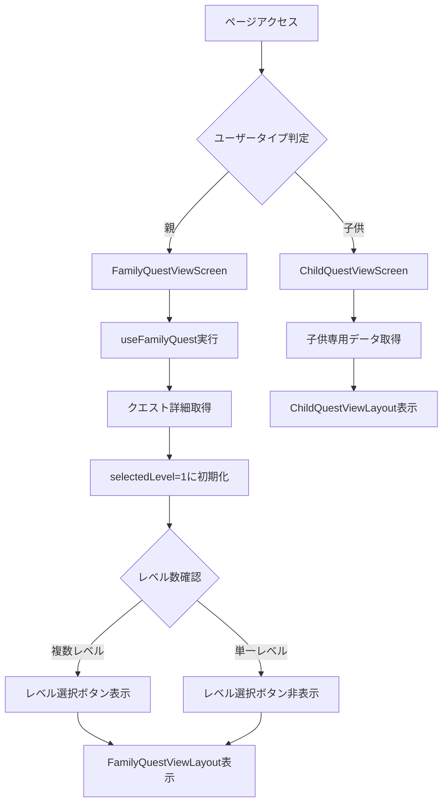
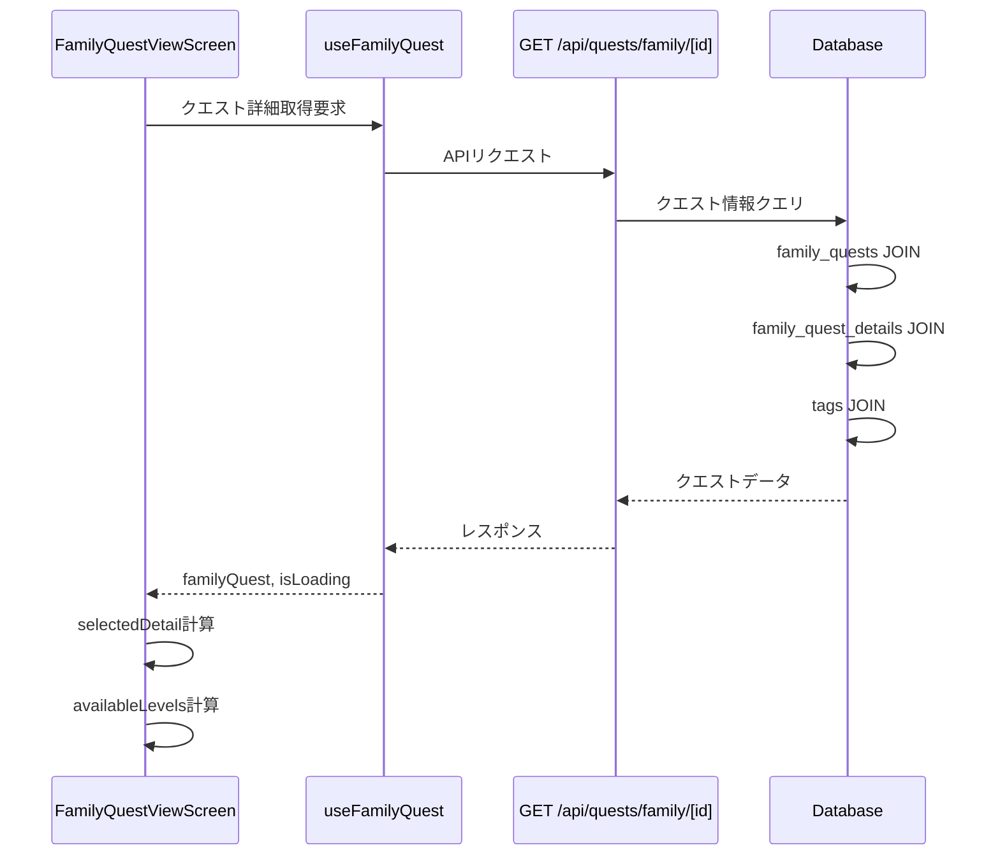
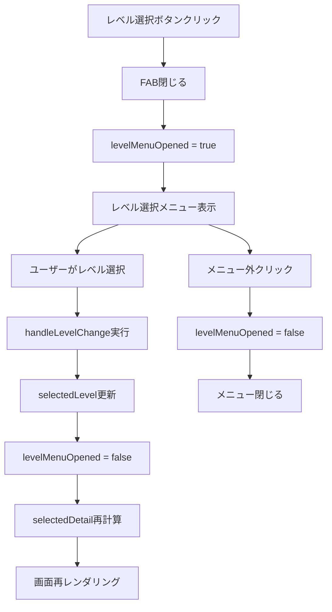
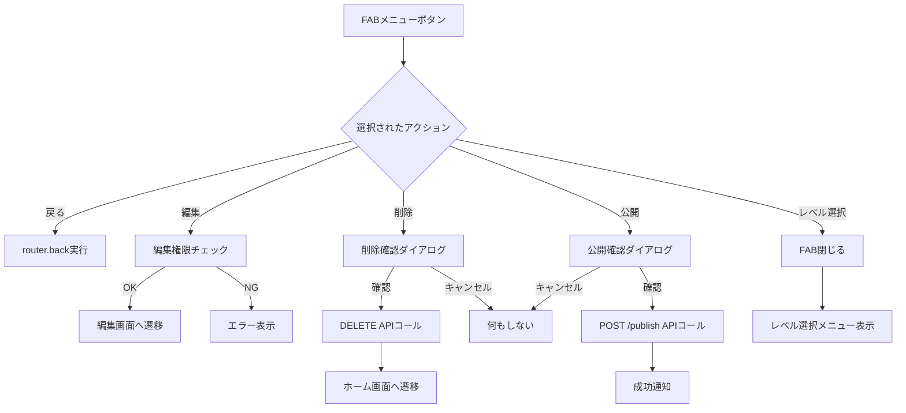
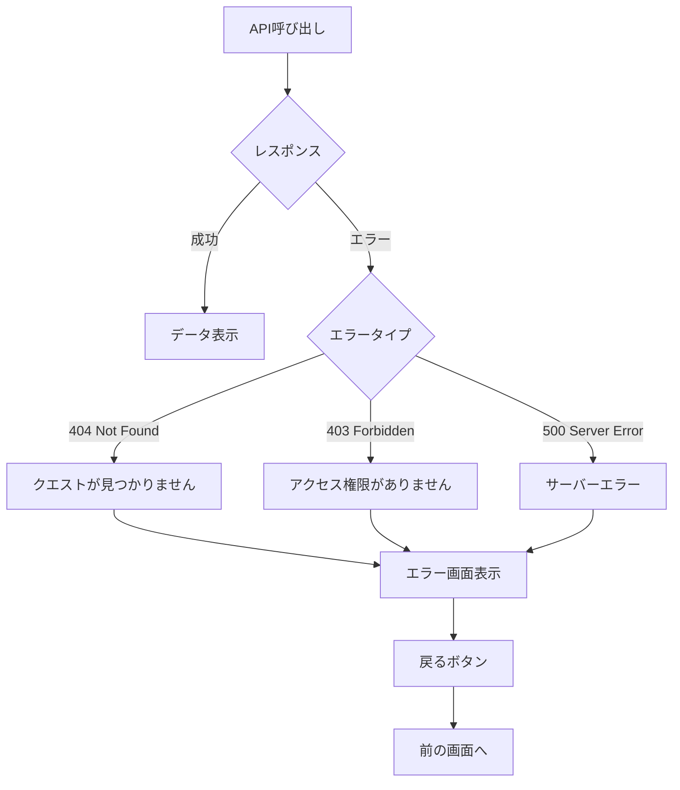

# 家族クエスト閲覧画面 - フロー図

**(2026年3月記載)**

## 画面表示フロー



## データ取得フロー



## レベル選択フロー



## FAB操作フロー



## 子供専用ビューフロー

```mermaid
graph TD
    A[子供専用ページアクセス] --> B[ChildQuestViewScreen]
    B --> C[クエスト詳細取得]
    C --> D[子供クエスト状態取得]
    D --> E{クエスト状態}
    
    E -->|not_started| F[受注ボタン表示]
    F --> G[受注ボタンクリック]
    G --> H[POST /child/[childId]/start]
    H --> I[状態をin_progressに更新]
    
    E -->|in_progress| J[完了報告ボタン表示]
    J --> K[完了報告ボタンクリック]
    K --> L[POST /review-request]
    L --> M[状態をpending_reviewに更新]
    
    E -->|pending_review| N[報告キャンセルボタン表示]
    N --> O[キャンセルボタンクリック]
    O --> P[POST /cancel-review]
    P --> Q[状態をin_progressに更新]
    
    E -->|completed| R[完了済み表示]
```

## 条件付きレンダリング

### レベル選択ボタンの表示条件
```typescript
availableLevels.length > 1
```

### レベル選択メニューの表示条件
```typescript
availableLevels.length > 1 && levelMenuOpened
```

### 編集・削除・公開ボタンの表示条件
```typescript
// 親ユーザーのみ表示
userInfo?.profiles?.role === 'parent'
```

### 子供専用アクションの表示条件
```typescript
// 子供IDが存在し、子供ユーザーの場合
childId && userInfo?.profiles?.role === 'child'
```

## エラーハンドリングフロー



## ローディング状態の管理

```typescript
// ローディング中の表示
isLoading: boolean

// FamilyQuestViewLayoutに渡す
<FamilyQuestViewLayout
  isLoading={isLoading}
  // ...other props
/>

// Loading Overlayが表示される
```
