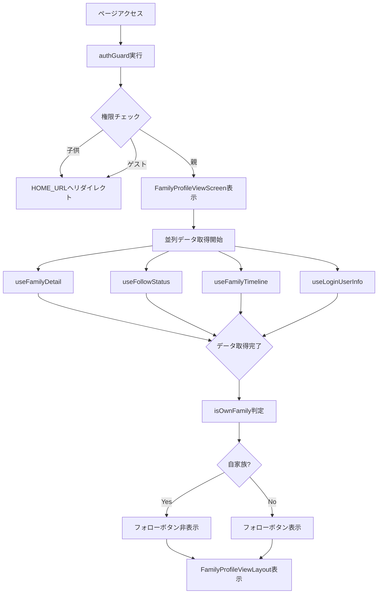
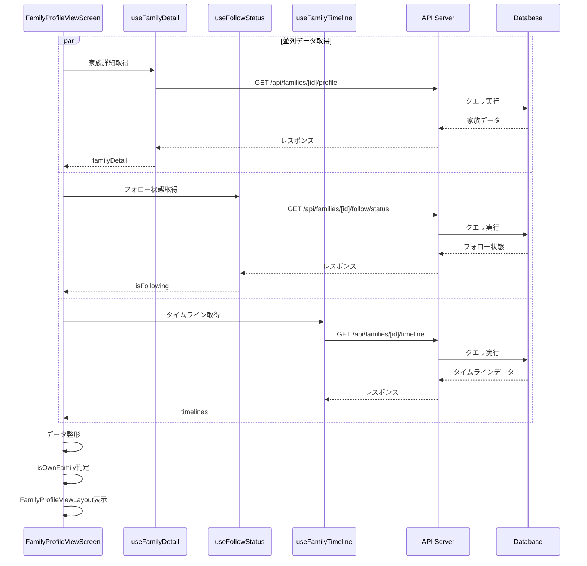
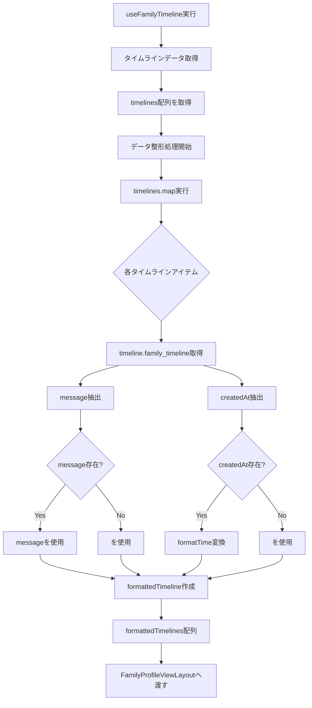
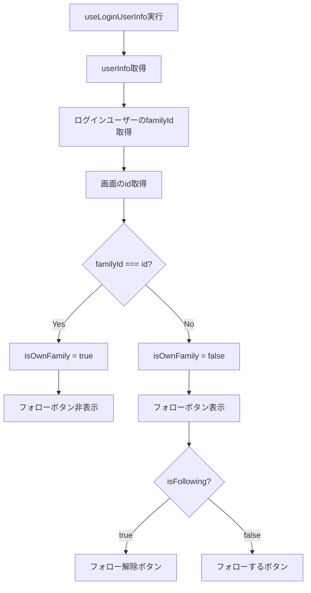
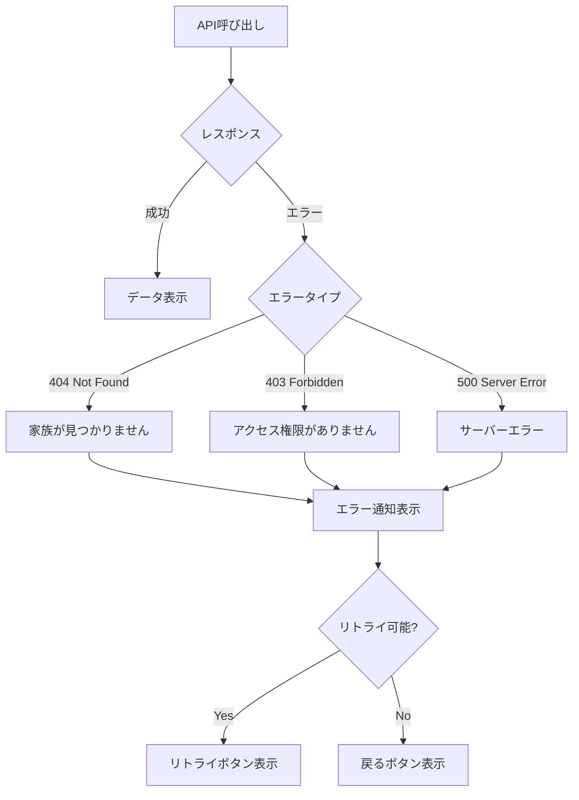
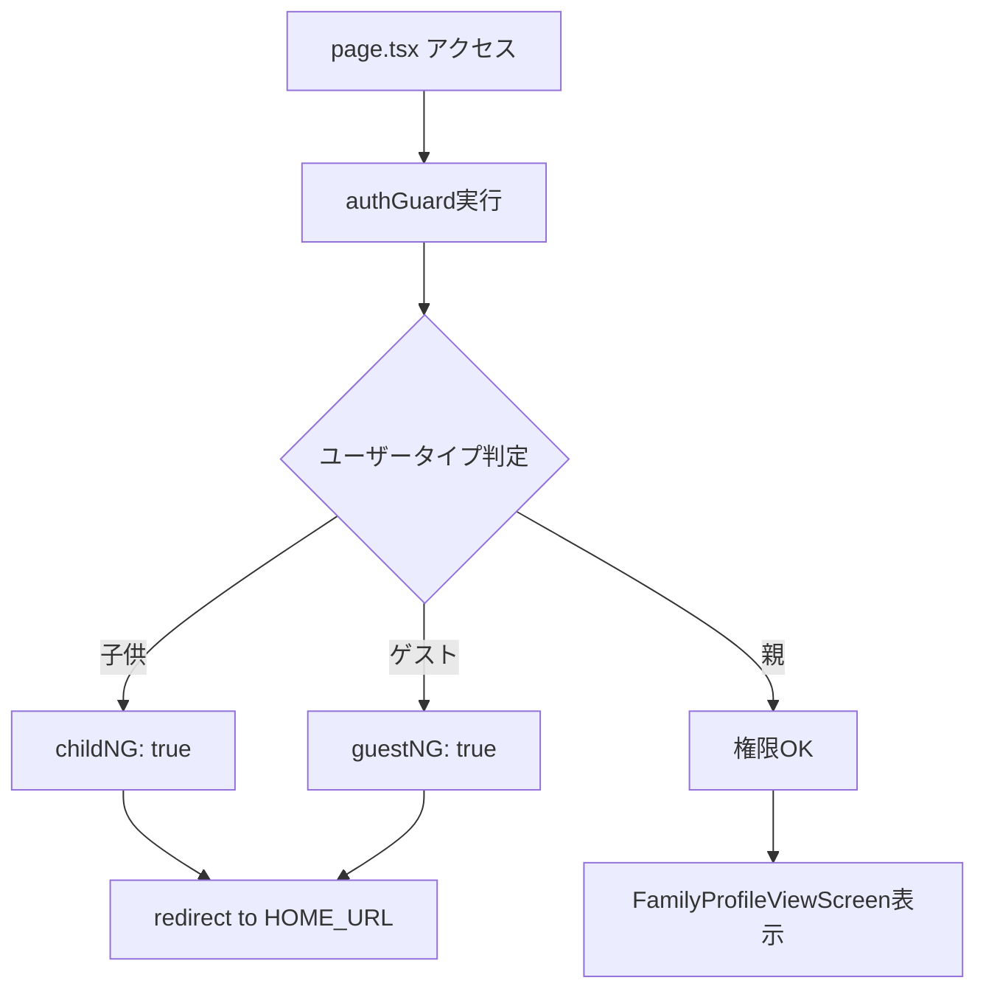

# 家族プロフィール閲覧画面 - フロー図

**(2026年3月15日 14:30記載)**

## 画面表示フロー



## データ取得シーケンス



## フォロー切り替えフロー

```mermaid
graph TD
    A[フォローボタンクリック] --> B{現在の状態}
    B -->|isFollowing === true| C[unfollow実行]
    B -->|isFollowing === false| D[follow実行]
    
    C --> E[DELETE /api/families/[id]/follow]
    D --> F[POST /api/families/[id]/follow]
    
    E --> G{API結果}
    F --> H{API結果}
    
    G -->|成功| I[フォロー状態更新]
    G -->|エラー| J[エラー通知]
    
    H -->|成功| K[フォロー状態更新]
    H -->|エラー| L[エラー通知]
    
    I --> M[useFollowStatus再取得]
    K --> M
    
    M --> N[画面再レンダリング]
```

## タイムライン表示フロー



## 自家族判定フロー



## 条件付きレンダリング

### フォローボタンの表示条件
```typescript
isOwnFamily === false
```

### フォローボタンのラベル
```typescript
isFollowing ? "フォロー解除" : "フォローする"
```

### ローディングオーバーレイの表示条件
```typescript
isFamilyLoading || isFollowLoading || isTimelineLoading || isFollowToggleLoading
```

## エラーハンドリングフロー



## authGuard フロー



**authGuard設定:**
```typescript
await authGuard({ 
  childNG: true,  // 子供はアクセス不可
  guestNG: true,  // ゲストはアクセス不可
  redirectUrl: HOME_URL 
})
```

## ページ遷移フロー

```mermaid
graph TD
    A[家族一覧画面] --> B[家族選択]
    B --> C[/families/[id]/view アクセス]
    C --> D[authGuard]
    D --> E{権限チェック}
    
    E -->|親| F[プロフィール画面表示]
    E -->|子供/ゲスト| G[ホーム画面へリダイレクト]
    
    F --> H{ユーザー操作}
    H -->|編集ボタン| I[/families/[id]/edit へ遷移]
    H -->|フォローボタン| J[フォロー処理]
    H -->|タイムライン項目| K[詳細画面へ遷移]
    H -->|戻るボタン| L[前の画面へ戻る]
```

## ローディング状態の管理

```typescript
// すべてのローディング状態を統合
const isLoading = 
  isFamilyLoading || 
  isFollowLoading || 
  isTimelineLoading || 
  isFollowToggleLoading

// Layoutに渡す
<FamilyProfileViewLayout
  isLoading={isLoading}
  // ...other props
/>
```
