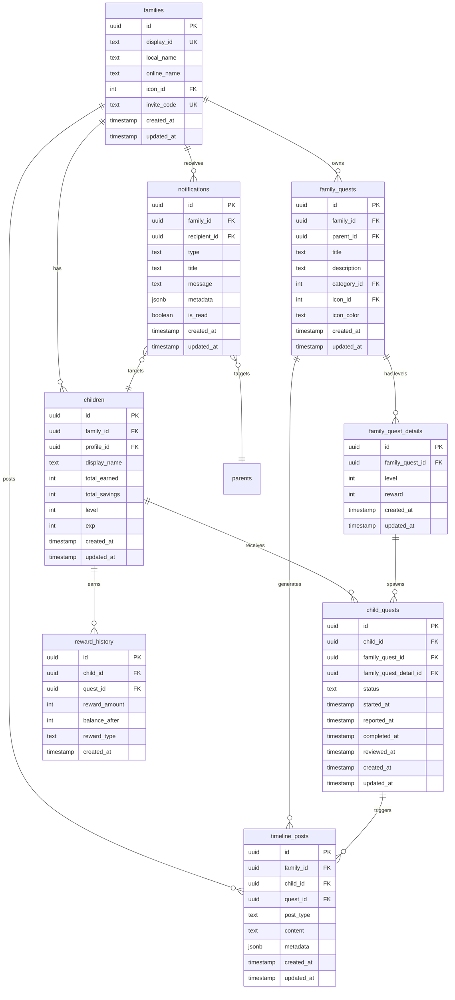

(2026年3月記載)

# ホームダッシュボード関連テーブル ER図

## ダッシュボードデータ構造

## 主要リレーション

### 統計データ集約
- **家族メンバー数**: `families` → `children` (count)
- **進行中クエスト**: `child_quests` (status: in_progress) (count)
- **完了待ちクエスト**: `child_quests` (status: pending_review) (count)
- **未読通知**: `notifications` (is_read: false) (count)

### 最近のアクティビティ
- **最近のクエスト**: `child_quests` (ORDER BY updated_at DESC)
- **最近の通知**: `notifications` (ORDER BY created_at DESC)
- **タイムライン**: `timeline_posts` (ORDER BY created_at DESC)

### 子供別サマリー
- **獲得報酬**: `children.total_earned`
- **貯金額**: `children.total_savings`
- **レベル**: `children.level`, `children.exp`
- **進行中クエスト**: `child_quests` (status: in_progress) by child_id
