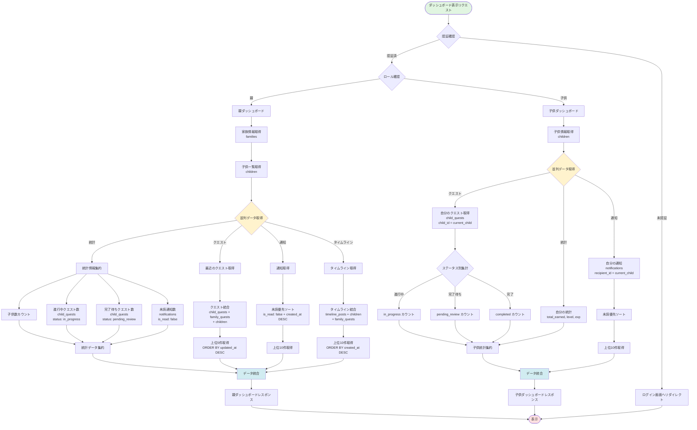

(2026年3月15日 14:30記載)

# ホームダッシュボード データ集約フロー図

## ダッシュボードデータ取得フロー

## データ集約ポイント

### 親ダッシュボード統計
- **家族メンバー**: `children` テーブルの count
- **進行中クエスト**: `child_quests.status = 'in_progress'` の count
- **完了待ちクエスト**: `child_quests.status = 'pending_review'` の count
- **未読通知**: `notifications.is_read = false` の count

### 子供ダッシュボード統計
- **獲得報酬合計**: `children.total_earned`
- **現在の貯金**: `children.total_savings`
- **レベル**: `children.level`
- **経験値**: `children.exp`
- **進行中クエスト数**: `child_quests.status = 'in_progress' AND child_id = current_child`
- **完了待ちクエスト数**: `child_quests.status = 'pending_review' AND child_id = current_child`

### キャッシュ戦略
- 統計データは5分間キャッシュ推奨
- リアルタイム更新が必要な場合はキャッシュ無効化
- 通知はキャッシュなし（常に最新取得）
