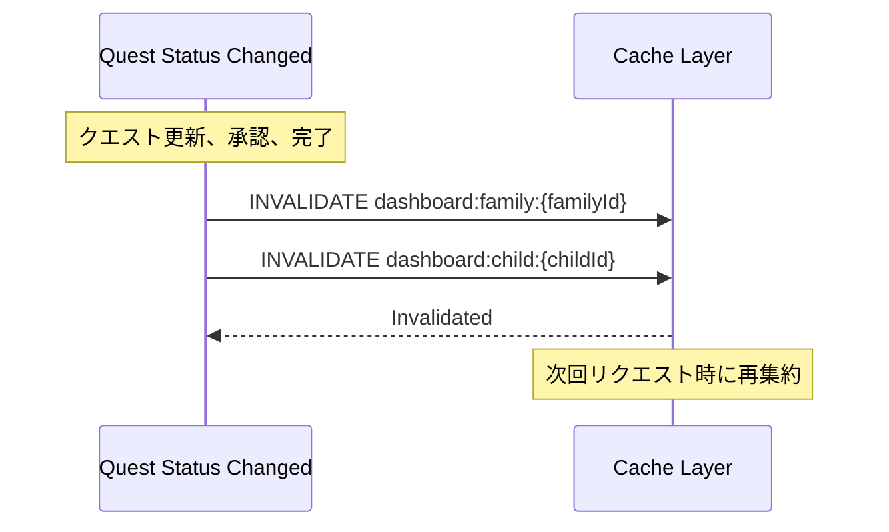
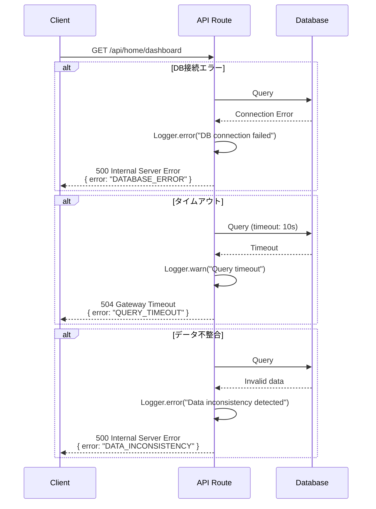

(2026年3月15日 14:30記載)

# ホームダッシュボードAPI シーケンス図

## GET /api/home/dashboard (親ダッシュボード)

```mermaid
sequenceDiagram
    participant C as Client
    participant API as API Route
    participant Auth as authGuard
    participant DB as Database
    participant Cache as Cache Layer
    
    C->>API: GET /api/home/dashboard
    API->>Auth: authGuard({})
    Auth->>DB: SELECT profiles, parents/children
    DB-->>Auth: user info
    Auth-->>API: { userId, familyId, isParent }
    
    alt 未認証
        Auth-->>API: throw AuthError
        API-->>C: 401 Unauthorized
    end
    
    alt 親ユーザー
        API->>Cache: GET dashboard:family:{familyId}
        
        alt Cache HIT
            Cache-->>API: cached data
            API-->>C: 200 OK (cached)
        else Cache MISS
            par Parallel Data Fetch
                API->>DB: SELECT children<br/>WHERE family_id = :familyId
                DB-->>API: children[]
            and
                API->>DB: SELECT COUNT(*) FROM child_quests<br/>WHERE status = 'in_progress'<br/>AND child_id IN (family children)
                DB-->>API: active_quests_count
            and
                API->>DB: SELECT COUNT(*) FROM child_quests<br/>WHERE status = 'pending_review'<br/>AND child_id IN (family children)
                DB-->>API: pending_review_count
            and
                API->>DB: SELECT COUNT(*) FROM notifications<br/>WHERE family_id = :familyId<br/>AND is_read = false
                DB-->>API: unread_notifications_count
            and
                API->>DB: SELECT cq.*, fq.title, c.display_name<br/>FROM child_quests cq<br/>JOIN family_quests fq<br/>JOIN children c<br/>WHERE cq.child_id IN (family children)<br/>ORDER BY cq.updated_at DESC<br/>LIMIT 5
                DB-->>API: recent_quests[]
            and
                API->>DB: SELECT * FROM notifications<br/>WHERE family_id = :familyId<br/>ORDER BY is_read ASC, created_at DESC<br/>LIMIT 10
                DB-->>API: notifications[]
            and
                API->>DB: SELECT tp.*, c.display_name, fq.title<br/>FROM timeline_posts tp<br/>JOIN children c<br/>LEFT JOIN family_quests fq<br/>WHERE tp.family_id = :familyId<br/>ORDER BY tp.created_at DESC<br/>LIMIT 10
                DB-->>API: timeline[]
            end
            
            API->>API: Aggregate Dashboard Data
            Note over API: {<br/>  stats: { children_count, active_quests, ... },<br/>  recent_quests: [...],<br/>  notifications: [...],<br/>  timeline: [...]<br/>}
            
            API->>Cache: SET dashboard:family:{familyId}<br/>TTL: 5 minutes
            Cache-->>API: OK
            
            API-->>C: 200 OK { dashboard data }
        end
    end
    
    alt 子供ユーザー
        API->>Cache: GET dashboard:child:{childId}
        
        alt Cache HIT
            Cache-->>API: cached data
            API-->>C: 200 OK (cached)
        else Cache MISS
            par Parallel Data Fetch
                API->>DB: SELECT * FROM children<br/>WHERE id = :childId
                DB-->>API: child info { total_earned, level, exp, ... }
            and
                API->>DB: SELECT COUNT(*) FROM child_quests<br/>WHERE child_id = :childId<br/>AND status = 'in_progress'
                DB-->>API: active_quests_count
            and
                API->>DB: SELECT COUNT(*) FROM child_quests<br/>WHERE child_id = :childId<br/>AND status = 'pending_review'
                DB-->>API: pending_review_count
            and
                API->>DB: SELECT COUNT(*) FROM child_quests<br/>WHERE child_id = :childId<br/>AND status = 'completed'
                DB-->>API: completed_quests_count
            and
                API->>DB: SELECT cq.*, fq.title, fqd.reward<br/>FROM child_quests cq<br/>JOIN family_quests fq<br/>JOIN family_quest_details fqd<br/>WHERE cq.child_id = :childId<br/>AND cq.status IN ('not_started', 'in_progress')<br/>ORDER BY cq.updated_at DESC<br/>LIMIT 5
                DB-->>API: active_quests[]
            and
                API->>DB: SELECT * FROM notifications<br/>WHERE recipient_id = :childId<br/>ORDER BY is_read ASC, created_at DESC<br/>LIMIT 10
                DB-->>API: notifications[]
            end
            
            API->>API: Aggregate Child Dashboard Data
            Note over API: {<br/>  stats: { total_earned, level, ... },<br/>  quests: { active, pending, completed },<br/>  notifications: [...]<br/>}
            
            API->>Cache: SET dashboard:child:{childId}<br/>TTL: 5 minutes
            Cache-->>API: OK
            
            API-->>C: 200 OK { child dashboard data }
        end
    end
```

## キャッシュ無効化タイミング

## エラーハンドリング

## パフォーマンス最適化ポイント

1. **並列データ取得**: `Promise.all()` で独立したクエリを並列実行
2. **インデックス活用**: 
   - `child_quests(child_id, status, updated_at)`
   - `notifications(family_id, is_read, created_at)`
   - `timeline_posts(family_id, created_at)`
3. **結果セット制限**: LIMIT句で必要最小限のデータ取得
4. **キャッシュ活用**: 5分間のTTLで頻繁なDB負荷を軽減
5. **コネクションプール**: DB接続の再利用
