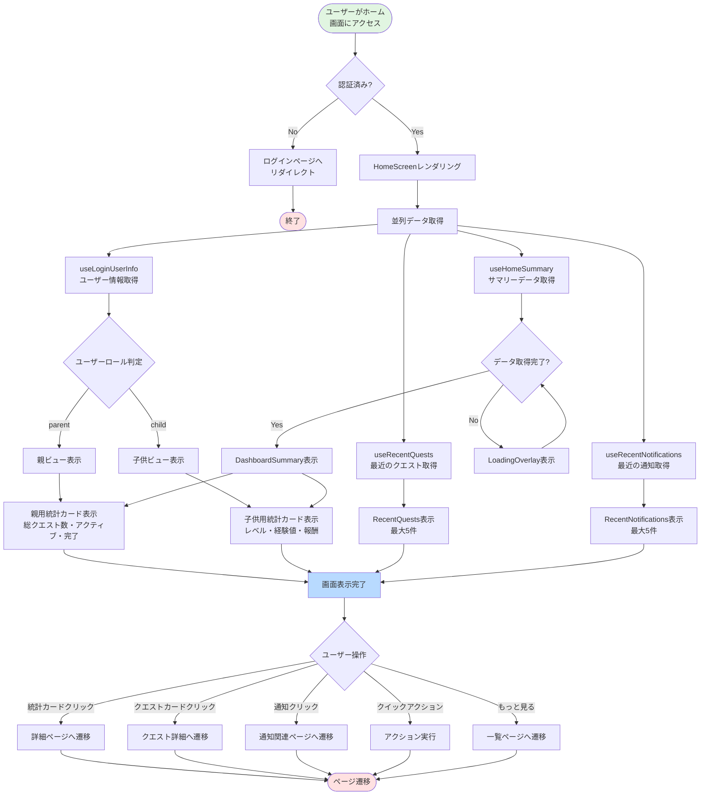
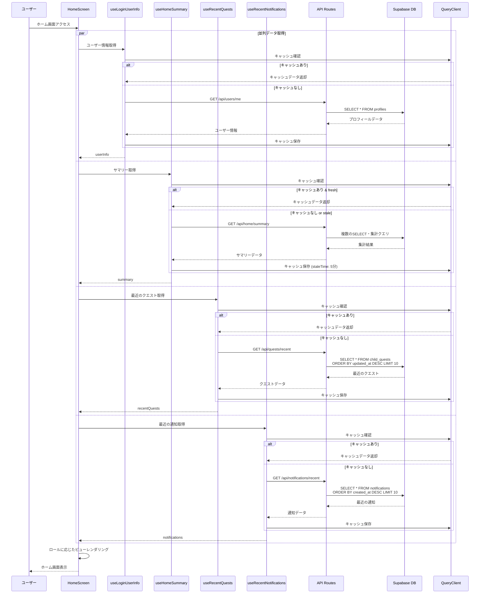
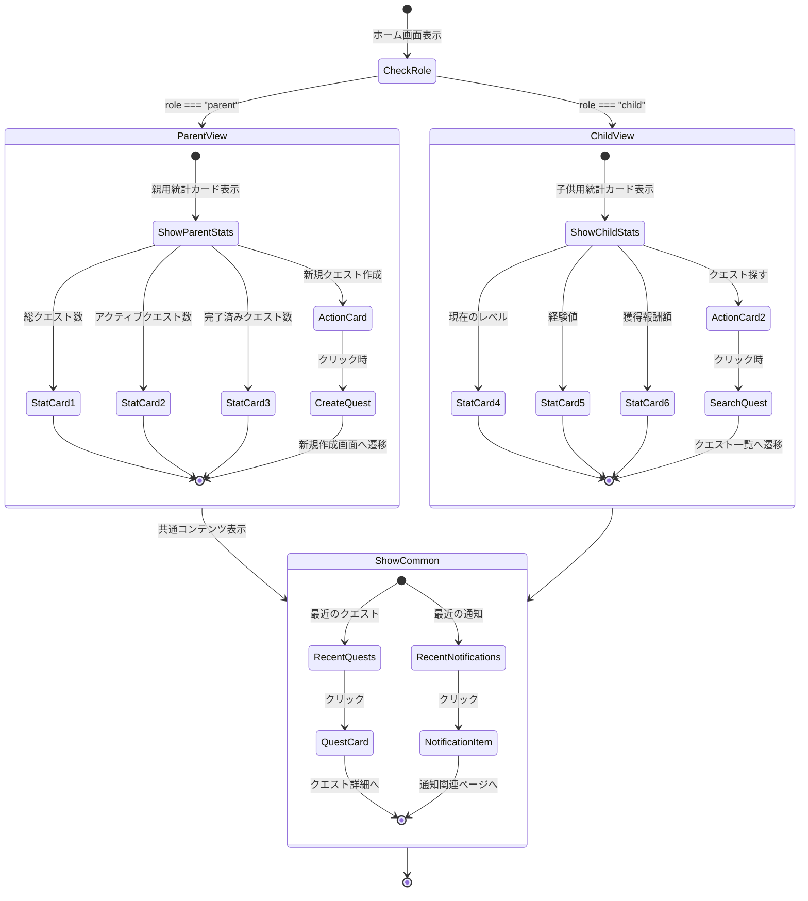
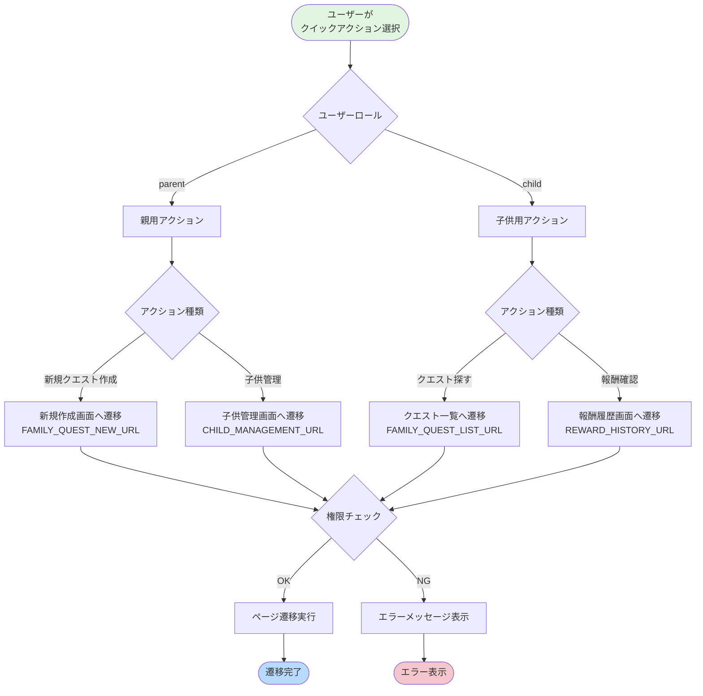
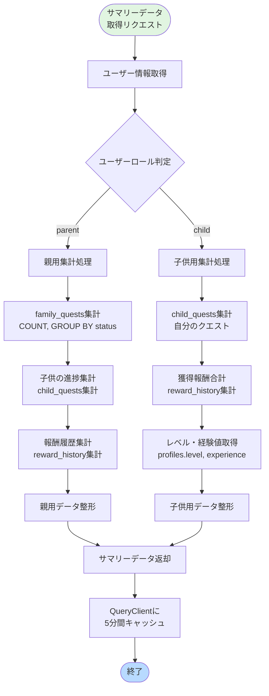
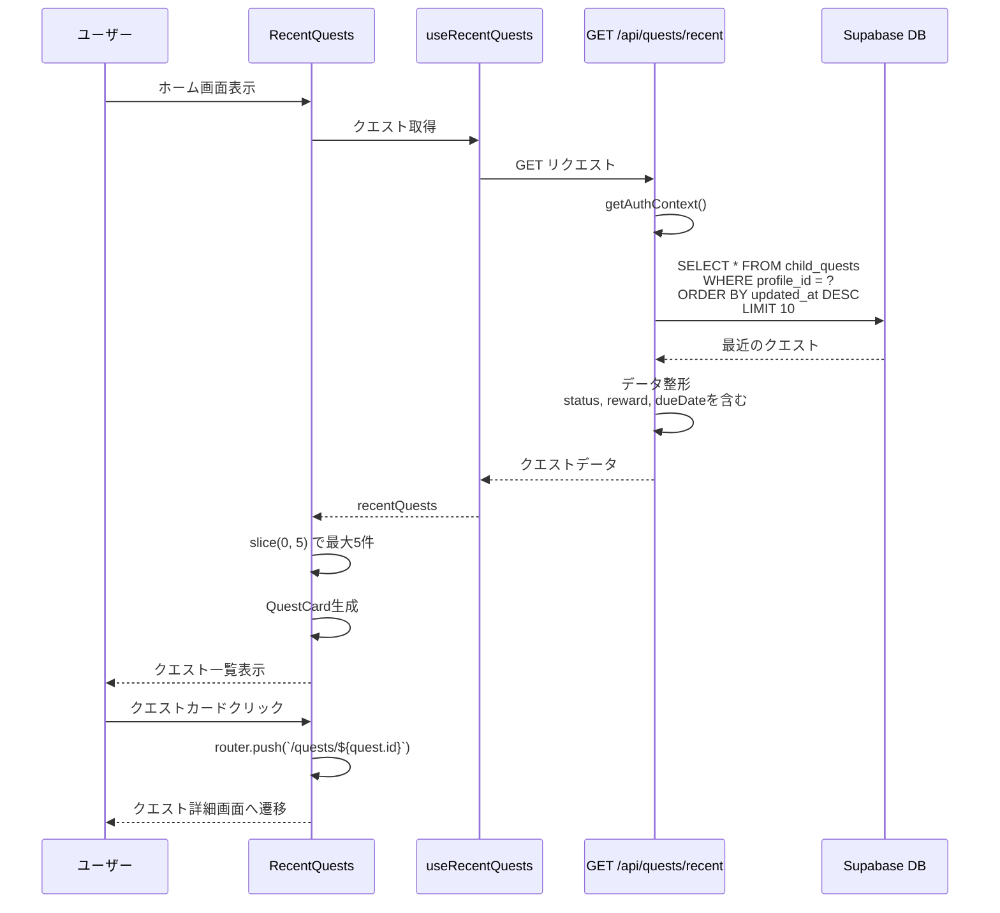
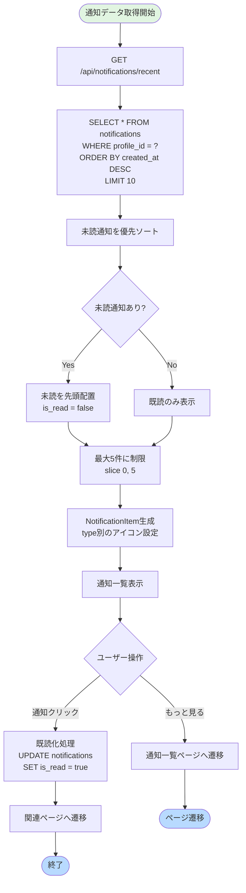
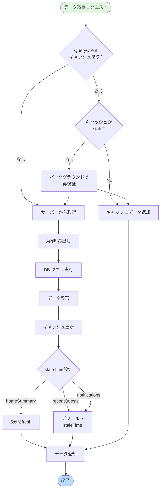
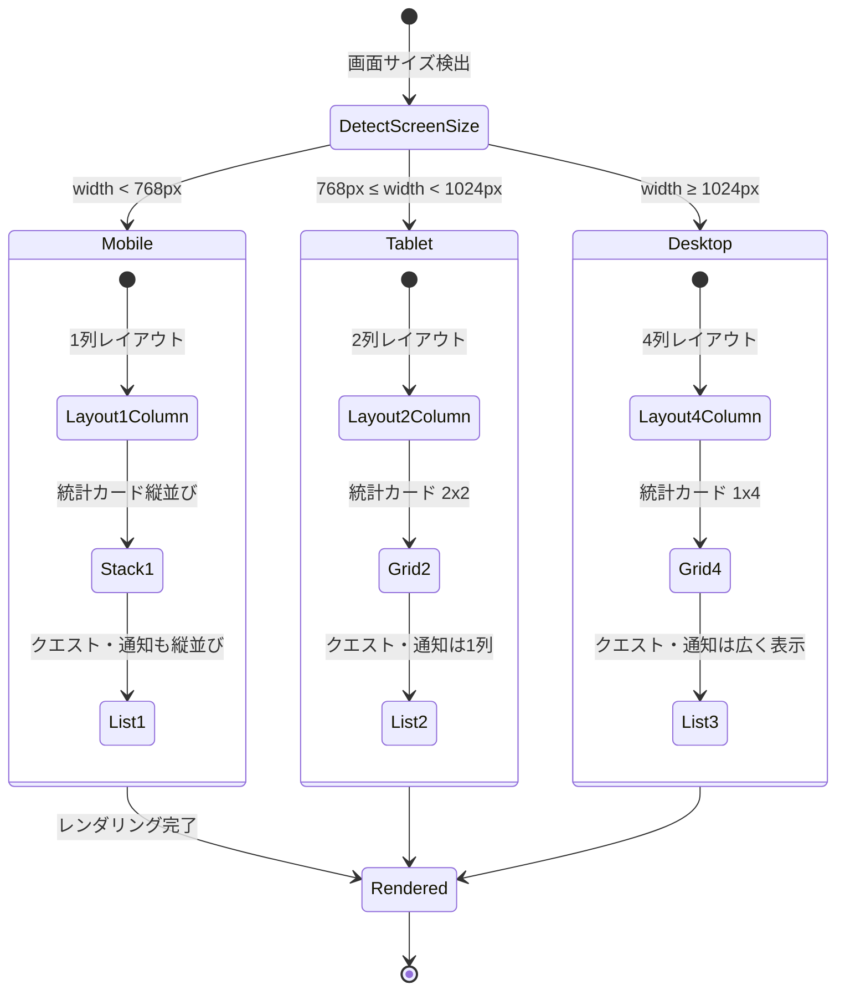

(2026年3月15日 14:30記載)

# ホーム画面の処理フロー図

## 全体の初期表示フロー



## データ取得のシーケンス



## ユーザーロール別の表示フロー



## クイックアクションフロー



## 統計データの集計フロー



## 最近のクエスト表示フロー



## 通知表示フロー



## キャッシュ戦略のフロー



## エラーハンドリングフロー

```mermaid
flowchart TD
    Start([データ取得中]) --> CheckError{エラー発生?}
    
    CheckError -->|なし| Success[データ取得成功]
    CheckError -->|あり| DetermineType{エラータイプ}
    
    DetermineType -->|401 Unauthorized| AuthError[認証エラー]
    DetermineType -->|Network Error| NetworkError[ネットワークエラー]
    DetermineType -->|Server Error| ServerError[サーバーエラー]
    
    AuthError --> RedirectLogin[ログインページへ<br/>リダイレクト]
    NetworkError --> ShowRetry[リトライボタン表示<br/>"再読み込み"]
    ServerError --> ShowError[エラーメッセージ表示<br/>"データ取得失敗"]
    
    ShowRetry --> UserRetry{ユーザーが<br/>リトライ?}
    UserRetry -->|Yes| Start
    UserRetry -->|No| ShowFallback[フォールバックUI表示]
    
    ShowError --> ShowFallback
    
    Success --> End1([正常終了])
    RedirectLogin --> End2([ログイン画面])
    ShowFallback --> End3([エラー状態])
    
    style Start fill:#e1f5e1
    style Success fill:#c3e6cb
    style End1 fill:#b8daff
    style End2 fill:#ffe1e1
    style End3 fill:#f5c6cb
    style AuthError fill:#f5c6cb
    style NetworkError fill:#f5c6cb
    style ServerError fill:#f5c6cb
```

## レスポンシブ表示フロー



## データリフレッシュのタイミング

```mermaid
gantt
    title ホーム画面のデータリフレッシュサイクル
    dateFormat s
    axisFormat %S秒

    section 初期表示
    ページアクセス              :done, 0, 1s
    並列データ取得              :active, 1s, 2s
    UI表示                     :active, 3s, 1s

    section キャッシュ期間
    キャッシュfresh (5分間)     :crit, 4s, 300s
    バックグラウンド再検証      :active, 304s, 2s

    section ユーザー操作
    クエスト完了後の再取得      :milestone, 150s, 0s
    通知クリック後の既読化      :milestone, 200s, 0s
```
