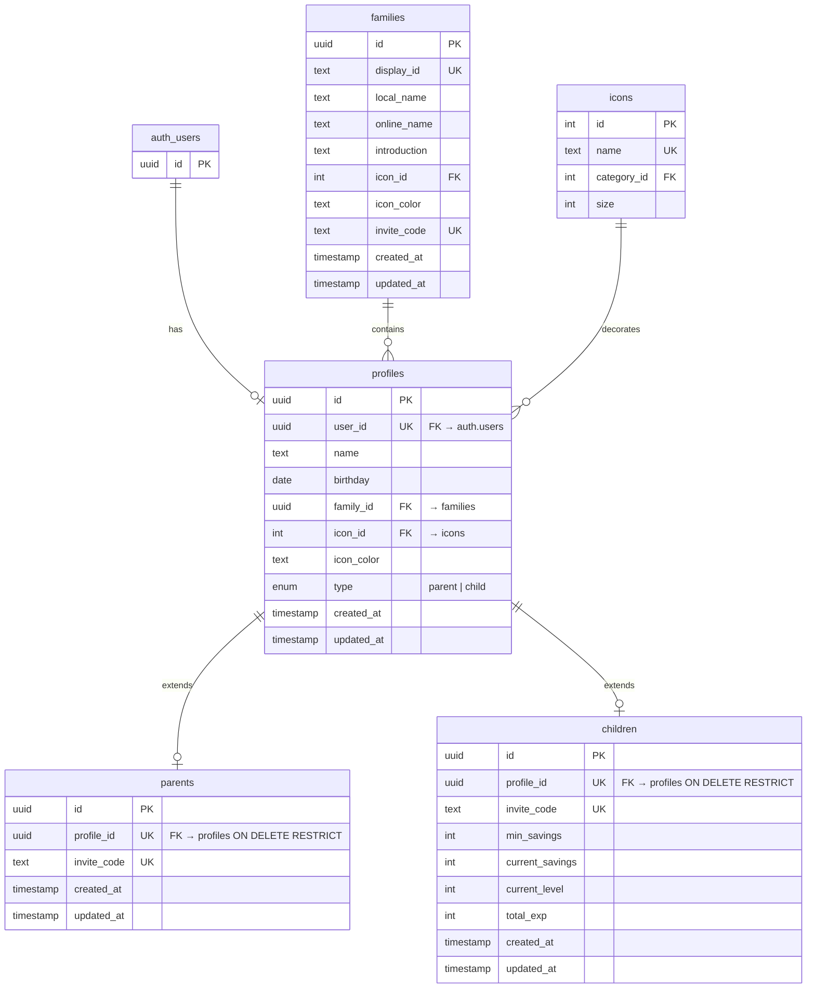

(2026年3月記載)

# ログイン・認証関連テーブル ER図

## 認証とユーザー管理のデータ構造

## テーブル関係性

### 認証フロー
1. **Supabase認証**: `auth.users` テーブルにユーザー登録
2. **プロフィール作成**: `profiles` テーブルに基本情報登録
3. **ロール拡張**: `parents` または `children` テーブルに詳細情報登録

### リレーション詳細

#### auth.users → profiles (1対0..1)
- `profiles.user_id` = `auth.users.id`
- 初回ログイン時は `profiles` レコードなし
- タイプ選択後に `profiles` レコード作成

#### profiles → parents/children (1対0..1)
- `profiles.type` により、`parents` または `children` のどちらかのみ存在
- `parents.profile_id` = `profiles.id` (親の場合)
- `children.profile_id` = `profiles.id` (子の場合)

#### families → profiles (1対多)
- 1つの家族に複数のプロフィール（親・子）が所属
- 招待コード (`families.invite_code`) 経由で家族に参加

## 招待コード関連

### 家族招待コード
- `families.invite_code`: 家族全体の招待コード（既存家族への親/子参加時に使用）

### 個別招待コード
- `parents.invite_code`: 親個別の招待コード
- `children.invite_code`: 子個別の招待コード

## セッション管理

- Supabaseの組み込みセッション管理を使用
- `auth.users` テーブルで認証状態を管理
- クライアント側: `@supabase/supabase-js` でセッション取得
