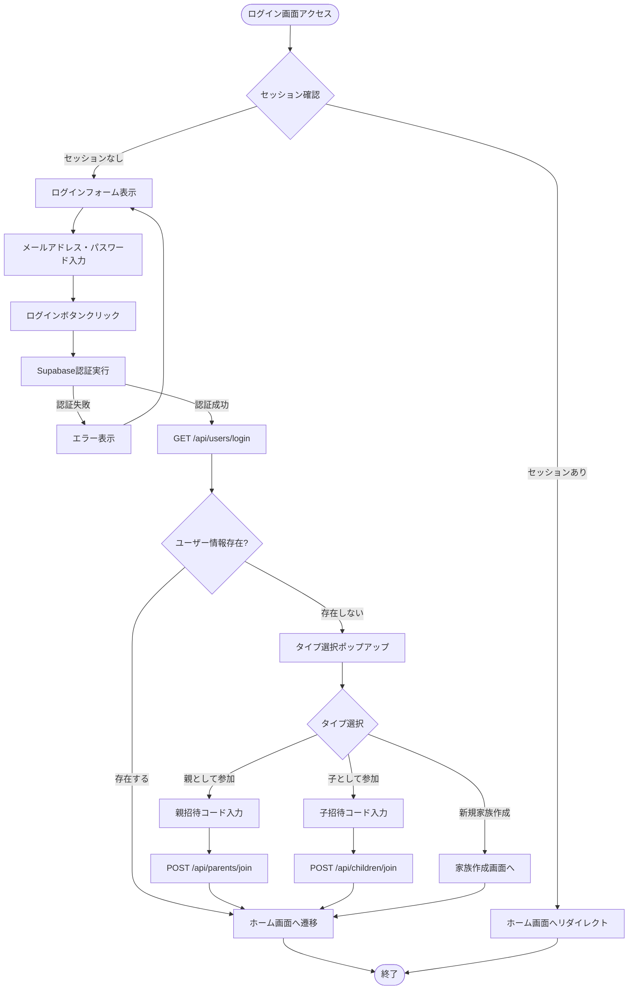
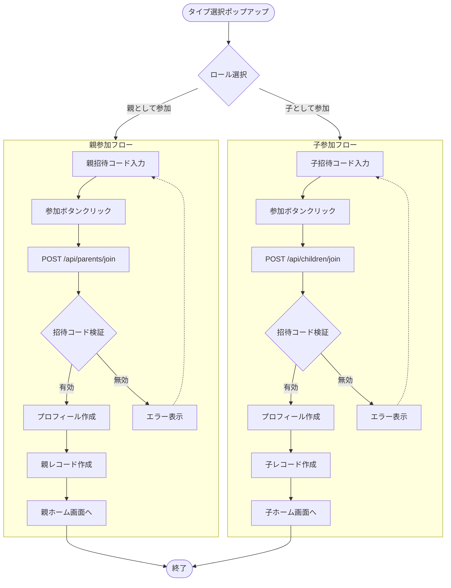
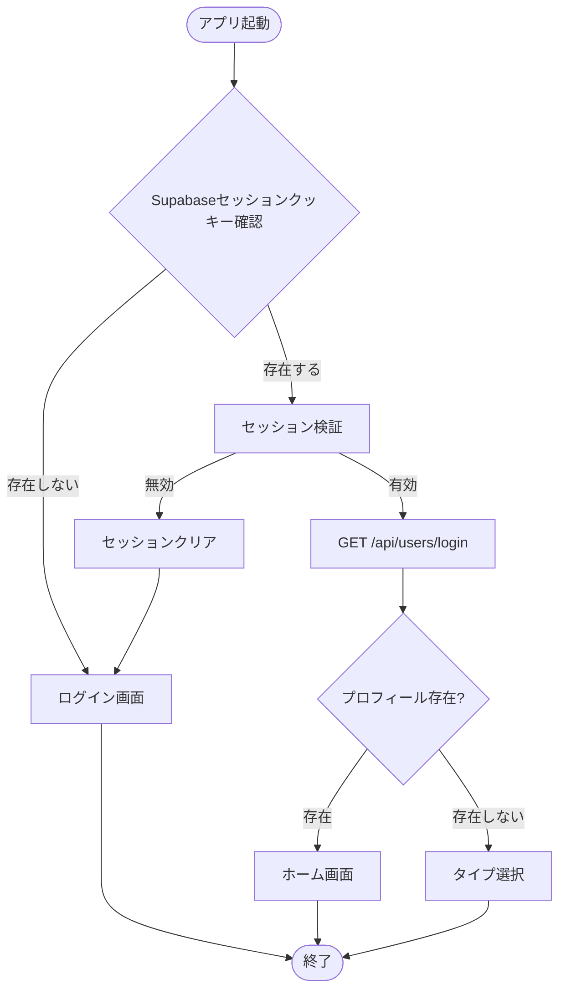
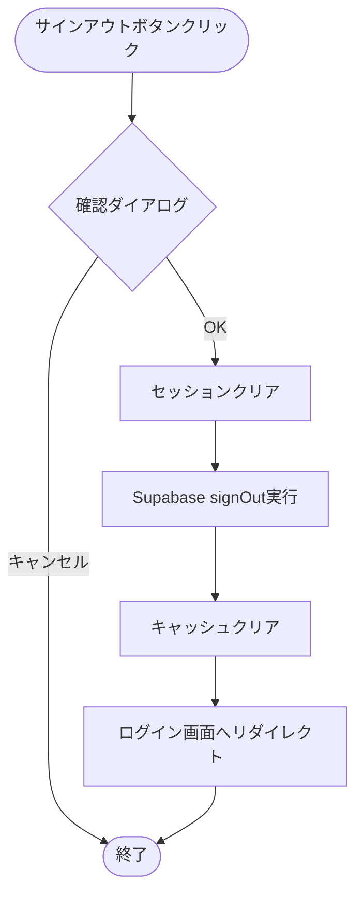

(2026年3月記載)

# ログインフロー図

## 標準ログインフロー



## ロール検出とリダイレクトフロー

```mermaid
flowchart TD
    Start([認証成功]) --> GetUserInfo[GET /api/users/login]
    GetUserInfo --> ParseResponse{レスポンス解析}
    
    ParseResponse -->|userInfo: null| FirstLogin[初回ログイン]
    ParseResponse -->|userInfo: exists| CheckType{profiles.type確認}
    
    FirstLogin --> ShowPopup[タイプ選択ポップアップ]
    
    CheckType -->|type: parent| ParentHome[親ホーム画面]
    CheckType -->|type: child| ChildHome[子ホーム画面]
    
    ShowPopup --> TypeSelection{選択}
    TypeSelection -->|新規家族| FamilyCreate[/families/new]
    TypeSelection -->|親参加| ParentJoin[招待コード入力 → useJoinAsParent]
    TypeSelection -->|子参加| ChildJoin[招待コード入力 → useJoinAsChild]
    
    ParentJoin --> ParentHome
    ChildJoin --> ChildHome
    FamilyCreate --> ParentHome
    
    ParentHome --> End([終了])
    ChildHome --> End
```

## 招待コードログインフロー



## セッション管理フロー



## サインアウトフロー


