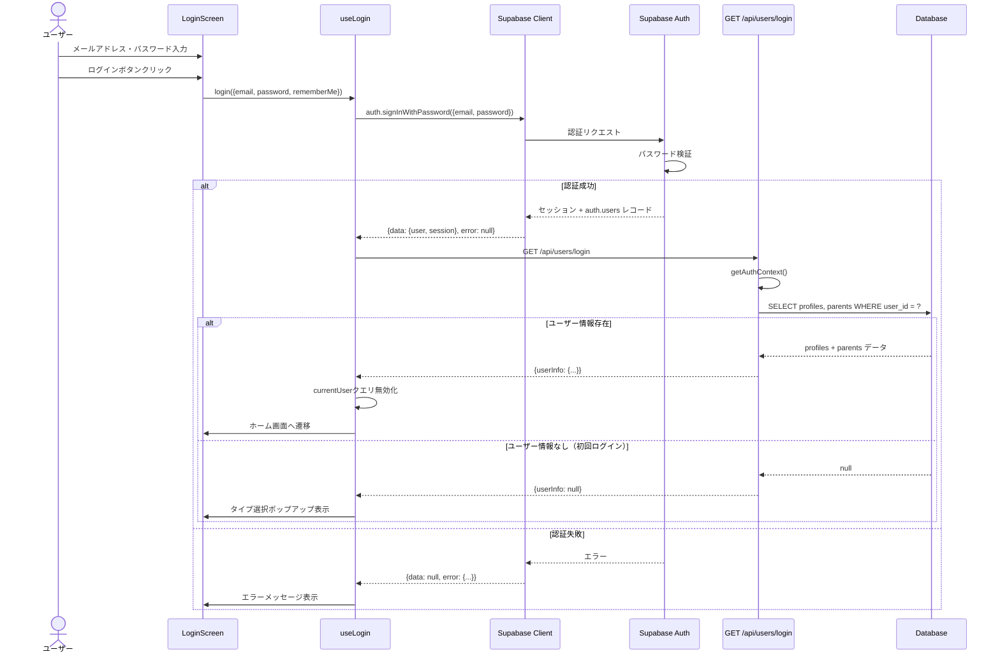
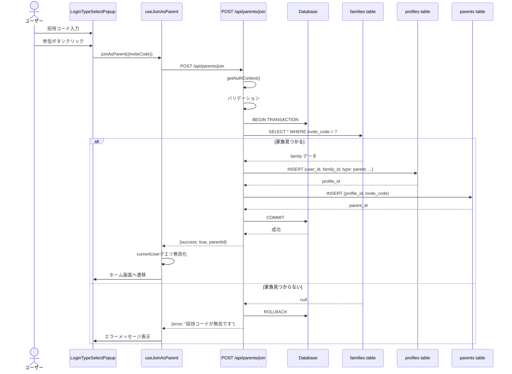
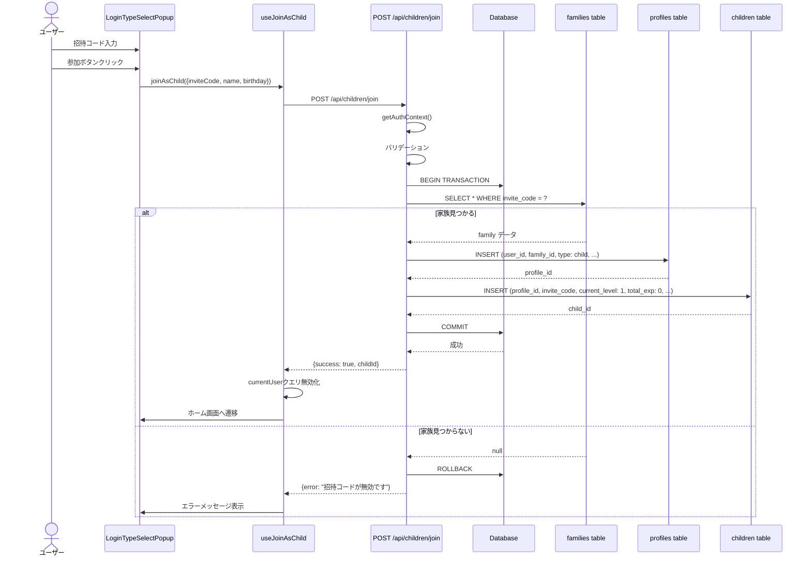
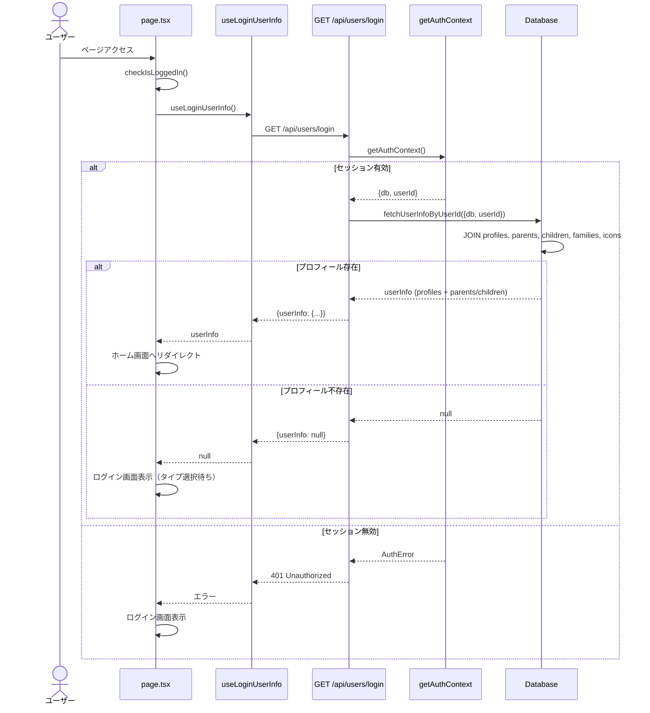
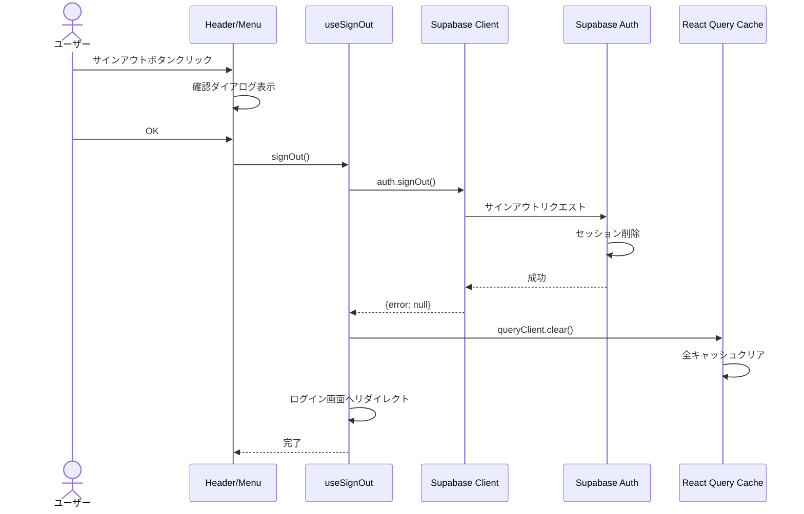
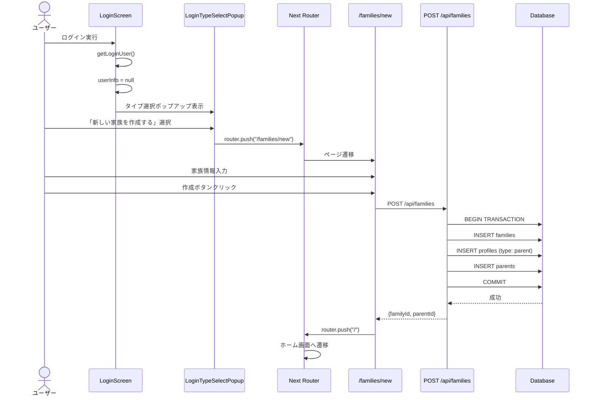

(2026年3月記載)

# ログインAPIシーケンス図

## POST /api/auth/login (親ログイン)

## POST /api/parents/join (親として参加)

## POST /api/children/join (子として参加)

## GET /api/users/login (セッション確認)

## POST /api/auth/logout (サインアウト)

## 初回ログイン → 家族作成フロー

