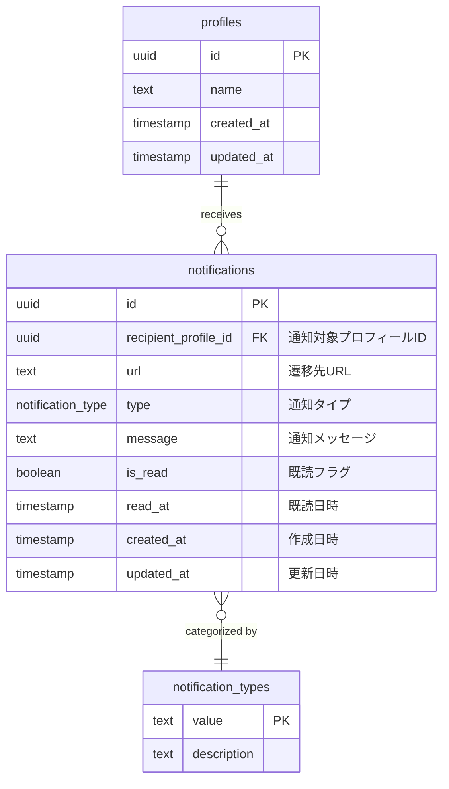
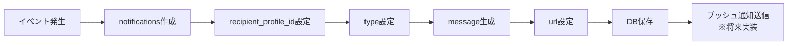

(2026年3月15日 14:30記載)

# 通知関連テーブル ER図

## 通知のデータ構造



## 通知タイプ (notification_type enum)

以下の通知タイプがサポートされています:

| タイプ | 説明 | 用途 |
|--------|------|------|
| `family_quest_review` | 家族クエスト承認依頼 | 子供がクエストの完了報告をした時に親に通知 |
| `quest_report_rejected` | クエスト報告却下 | 親が完了報告を却下した時に子供に通知 |
| `quest_report_approved` | クエスト報告承認 | 親が完了報告を承認した時に子供に通知 |
| `quest_cleared` | クエストクリア | クエストの全レベルをクリアした時に通知 |
| `quest_level_up` | クエストレベルアップ | クエストのレベルが上がった時に通知 |
| `quest_completed` | クエスト完了 | クエストの1レベルが完了した時に通知 |
| `other` | その他 | 上記以外の汎用的な通知 |

## リレーション詳細

### profiles → notifications (1:N)
- **外部キー**: `notifications.recipient_profile_id` → `profiles.id`
- **削除時動作**: CASCADE（プロフィール削除時に関連通知も削除）
- **説明**: 1つのプロフィールは複数の通知を受け取ることができる

## インデックス設計

### パフォーマンス最適化のための推奨インデックス

```sql
-- プロフィールIDでの通知検索（最も頻繁に使用）
CREATE INDEX idx_notifications_recipient_profile_id 
ON notifications(recipient_profile_id);

-- 未読通知の検索
CREATE INDEX idx_notifications_recipient_is_read 
ON notifications(recipient_profile_id, is_read);

-- 作成日時での並び替え
CREATE INDEX idx_notifications_created_at 
ON notifications(created_at DESC);

-- 複合インデックス（プロフィールID + 既読フラグ + 作成日時）
CREATE INDEX idx_notifications_recipient_read_created 
ON notifications(recipient_profile_id, is_read, created_at DESC);
```

## データフロー

### 通知作成


### 通知取得・既読管理
```mermaid
flowchart TD
    User[ユーザー] --> Fetch[通知一覧取得]
    Fetch --> Filter[未読のみフィルタ可能]
    Filter --> Display[画面表示]
    Display --> Read[既読マーク]
    Read --> Update[is_read=true<br/>read_at=NOW()]
    Update --> Refresh[一覧再取得]
```

## 制約事項

### NOT NULL制約
- `recipient_profile_id`: 必須（通知対象が不明な通知は作成不可）
- `type`: 必須（デフォルト: 'other'）
- `message`: 必須（デフォルト: ''）
- `url`: 必須（デフォルト: ''）
- `is_read`: 必須（デフォルト: false）

### デフォルト値
- `id`: `gen_random_uuid()`で自動生成
- `type`: `'other'`
- `message`: 空文字列 `''`
- `url`: 空文字列 `''`
- `is_read`: `false`
- `created_at`: 現在時刻
- `updated_at`: 現在時刻

## データ保持ポリシー

### 通知の削除
- **自動削除**: プロフィール削除時に CASCADE で自動削除
- **手動削除**: 現在は未実装（将来的に追加予定）
- **一括削除**: 現在は未実装（古い通知の一括削除機能を検討中）

### アーカイブ戦略（将来実装）
- 一定期間経過した既読通知のアーカイブ
- 未読通知は期限なく保持
- アーカイブテーブルへの移動（通知履歴として保存）
