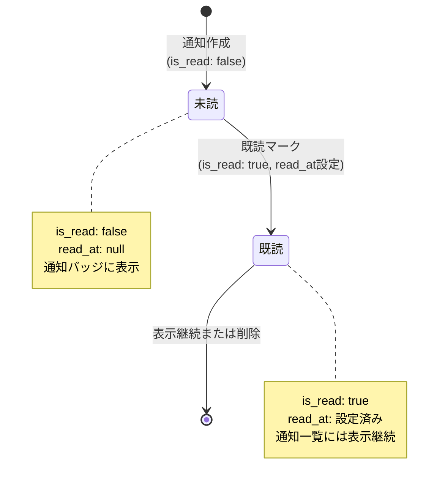
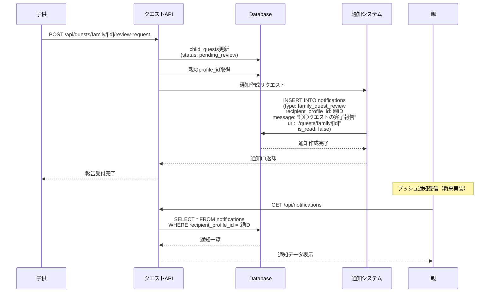
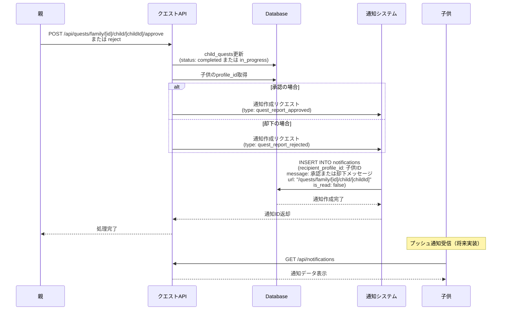
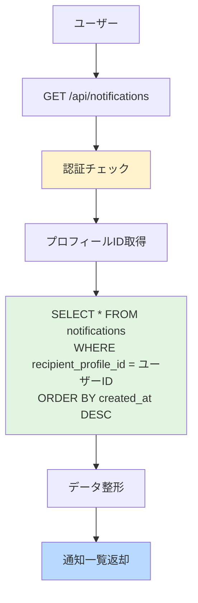
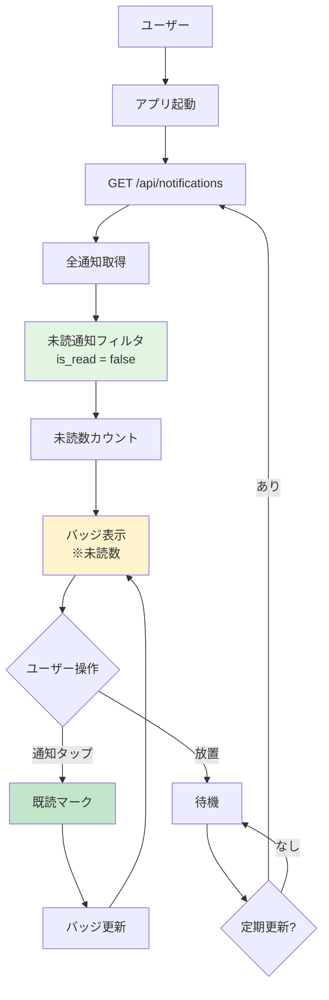
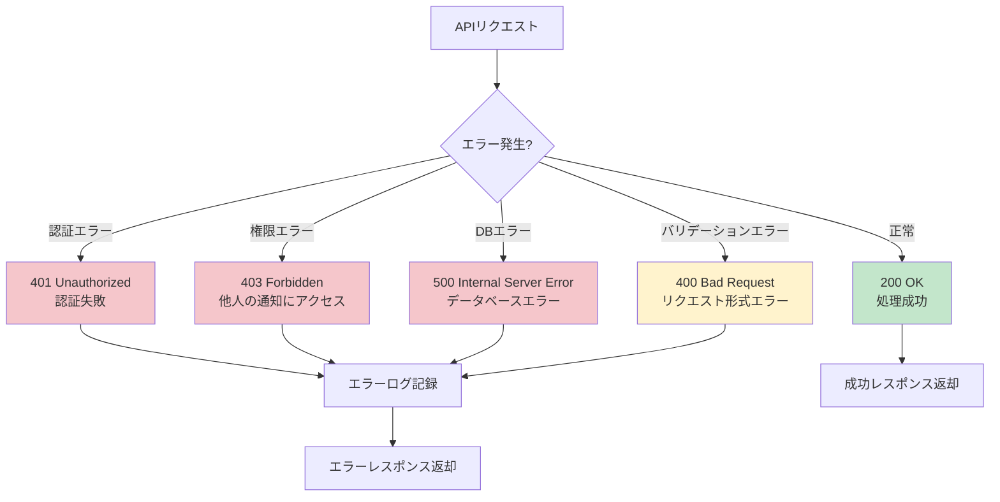
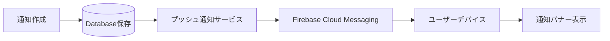
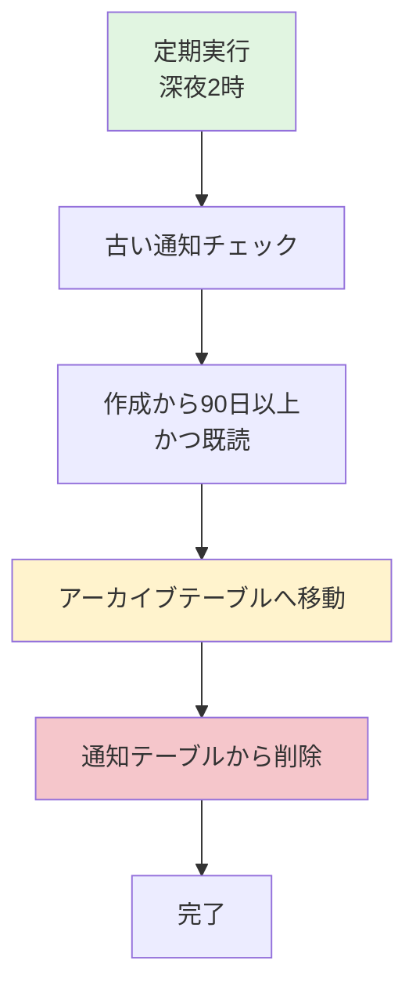

(2026年3月記載)

# 通知ライフサイクル フロー図

## 通知の全体ライフサイクル

```mermaid
flowchart TD
    Start([イベント発生]) --> EventType{イベント種別}
    
    EventType -->|子供が完了報告| ReviewRequest[family_quest_review通知]
    EventType -->|親が承認| Approved[quest_report_approved通知]
    EventType -->|親が却下| Rejected[quest_report_rejected通知]
    EventType -->|レベルアップ| LevelUp[quest_level_up通知]
    EventType -->|クエストクリア| Cleared[quest_cleared通知]
    EventType -->|その他| Other[other通知]
    
    ReviewRequest --> CreateNotif[notifications作成]
    Approved --> CreateNotif
    Rejected --> CreateNotif
    LevelUp --> CreateNotif
    Cleared --> CreateNotif
    Other --> CreateNotif
    
    CreateNotif --> SetFields[フィールド設定<br/>recipient_profile_id<br/>type, message, url<br/>is_read: false]
    SetFields --> SaveDB[DB保存]
    SaveDB --> PushNotif[プッシュ通知送信<br/>※将来実装]
    
    PushNotif --> UserView{ユーザーが通知確認?}
    UserView -->|未確認| Waiting[未読状態で待機]
    Waiting --> UserView
    UserView -->|確認| MarkRead[既読マーク<br/>is_read: true<br/>read_at: NOW()]
    
    MarkRead --> Complete[完了]
    
    style Start fill:#e1f5e1
    style Complete fill:#b8daff
    style CreateNotif fill:#fff3cd
    style MarkRead fill:#c3e6cb
```

## 通知ステータス遷移



## 通知作成フロー（イベント別）

### 1. 完了報告時（親への通知）



### 2. 承認/却下時（子供への通知）



## 通知取得・既読管理フロー

### 通知一覧取得



### 既読マーク（複数）

```mermaid
flowchart TD
    User[ユーザー] --> Select[通知選択]
    Select --> Request[PUT /api/notifications/read<br/>{notificationIds, updatedAt}]
    Request --> Auth[認証チェック]
    Auth --> Verify{通知ID検証}
    
    Verify -->|所有者確認OK| Begin[BEGIN TRANSACTION]
    Verify -->|他人の通知| Error[エラー返却]
    
    Begin --> Loop[各通知IDループ]
    Loop --> Update[UPDATE notifications<br/>SET is_read = true<br/>read_at = NOW()<br/>WHERE id = notificationId]
    Update --> Next{次の通知あり?}
    Next -->|あり| Loop
    Next -->|なし| Commit[COMMIT]
    
    Commit --> Response[完了返却]
    Error --> End[処理終了]
    Response --> End
    
    style Auth fill:#fff3cd
    style Begin fill:#e1f5e1
    style Commit fill:#c3e6cb
    style Error fill:#f5c6cb
```

## 通知バッジ表示フロー



## エラーハンドリングフロー



## 将来実装予定の機能

### プッシュ通知


### 通知の自動削除

