(2026年3月15日 14:30記載)

# 通知API シーケンス図

## API エンドポイント一覧（再掲）

### 通知管理
- `GET /api/notifications`: 通知一覧取得
- `PUT /api/notifications/read`: 既読マーク（複数）

### 将来実装予定
- `DELETE /api/notifications/[id]`: 通知削除
- `GET /api/notifications/unread-count`: 未読件数取得
- `PUT /api/notifications/read-all`: 全件既読マーク

## GET /api/notifications（通知一覧取得）

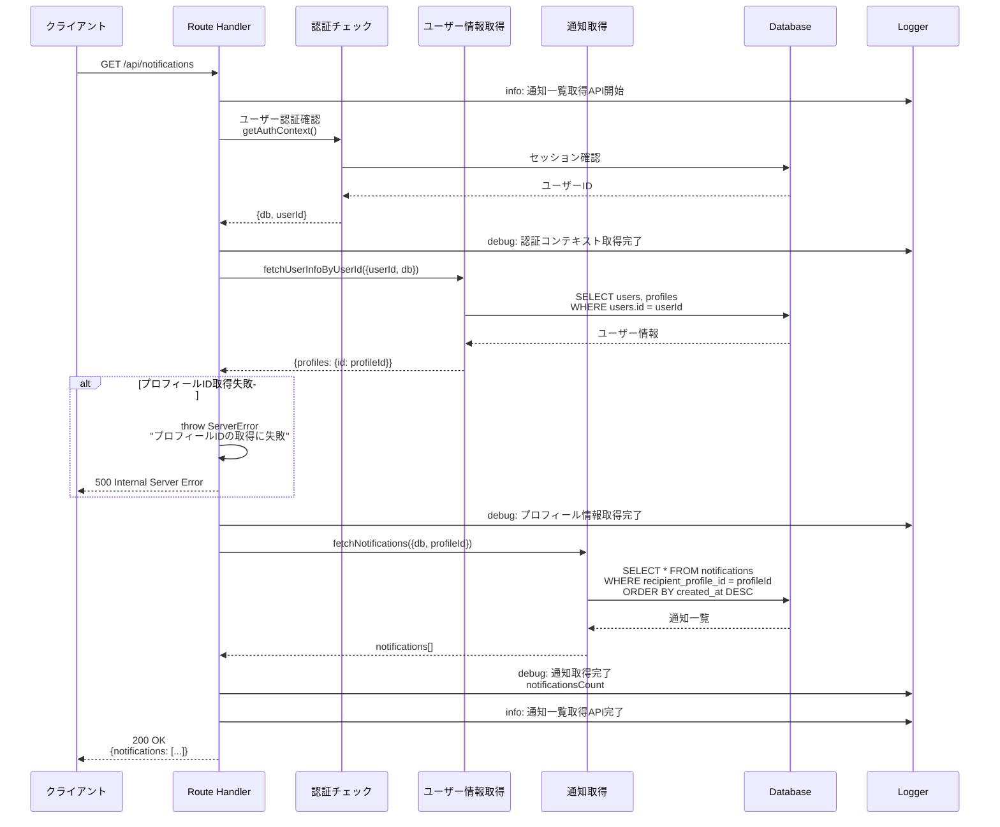

### レスポンス詳細

**成功時 (200 OK)**:
```typescript
{
  notifications: [
    {
      id: "550e8400-e29b-41d4-a716-446655440001",
      recipientProfileId: "550e8400-e29b-41d4-a716-446655440002",
      url: "/quests/family/abc123",
      type: "family_quest_review",
      message: "お部屋の片付けクエストの完了報告がありました",
      isRead: false,
      readAt: null,
      createdAt: "2026-03-15T10:00:00Z",
      updatedAt: "2026-03-15T10:00:00Z"
    },
    // ... more notifications
  ]
}
```

**エラー時**:
- `401 Unauthorized`: 認証失敗
- `500 Internal Server Error`: プロフィールID取得失敗またはDB エラー

## PUT /api/notifications/read（既読マーク）

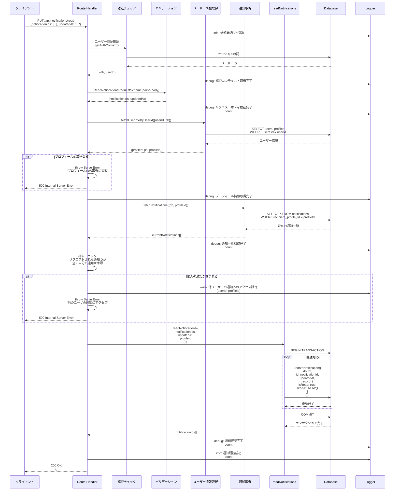

### リクエスト詳細

**Request Body**:
```typescript
{
  notificationIds: [
    "550e8400-e29b-41d4-a716-446655440001",
    "550e8400-e29b-41d4-a716-446655440002"
  ],
  updatedAt: "2026-03-15T10:00:00Z"  // 楽観的ロック用
}
```

**成功時 (200 OK)**:
```typescript
{}  // 空オブジェクト
```

**エラー時**:
- `401 Unauthorized`: 認証失敗
- `400 Bad Request`: リクエストボディのバリデーションエラー
- `500 Internal Server Error`: 
  - プロフィールID取得失敗
  - 他人の通知へのアクセス試行
  - データベースエラー

## データベース操作詳細

### fetchNotifications（通知取得）

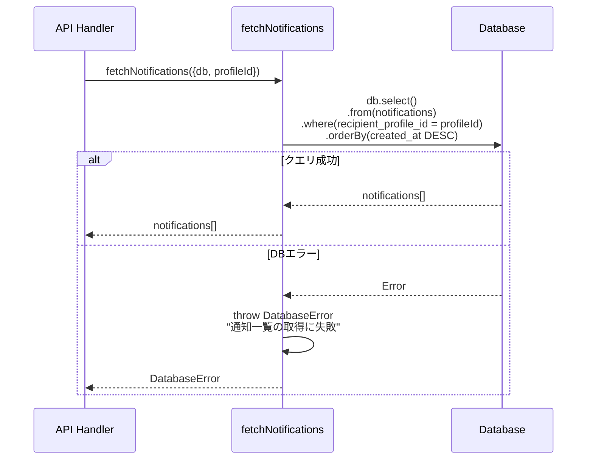

### updateNotification（既読更新）

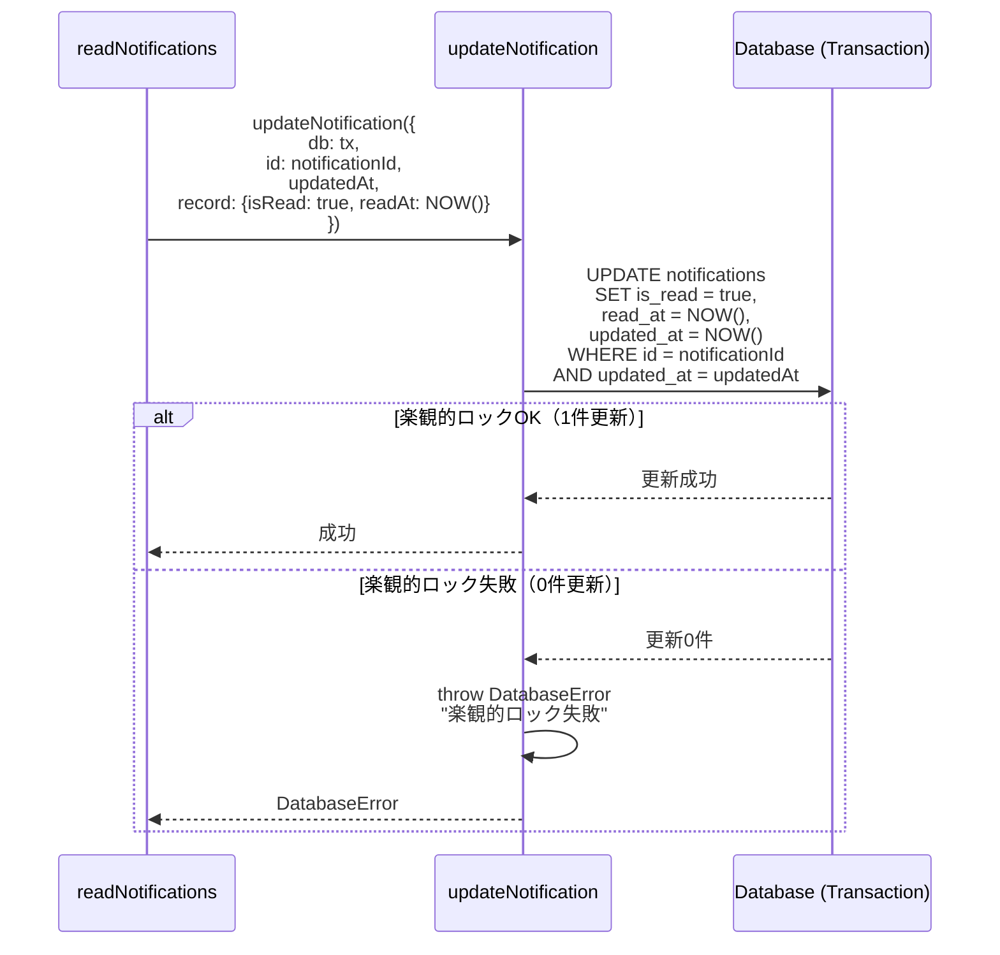

## エラーハンドリングパターン

### 認証エラー

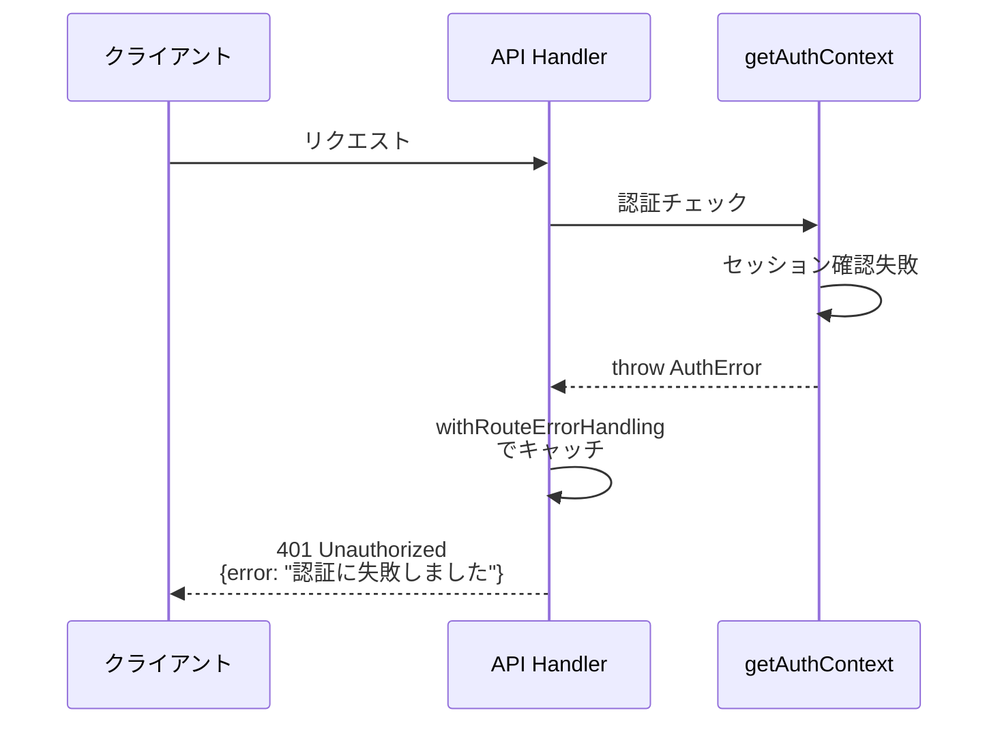

### バリデーションエラー

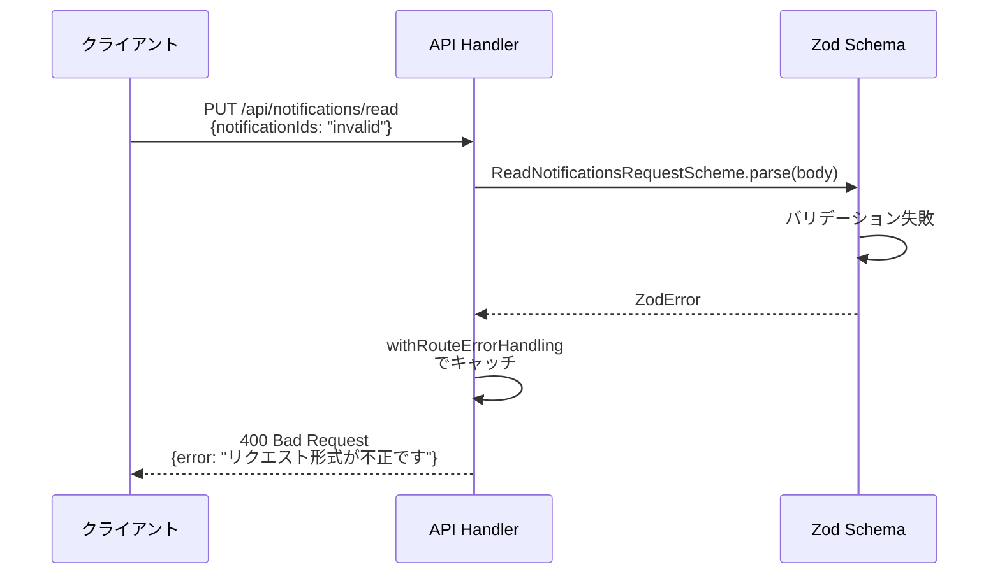

### データベースエラー

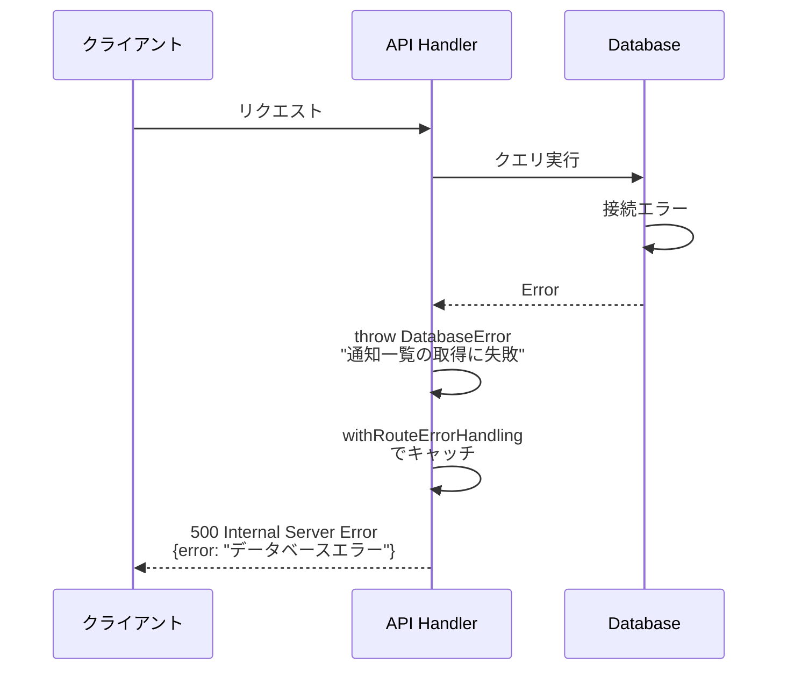

### 権限エラー（他人の通知へのアクセス）

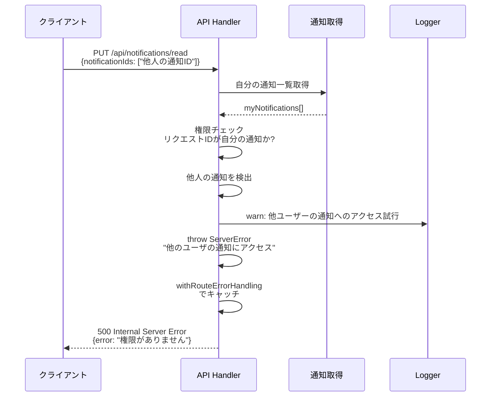

## トランザクション管理

### 複数通知の既読処理

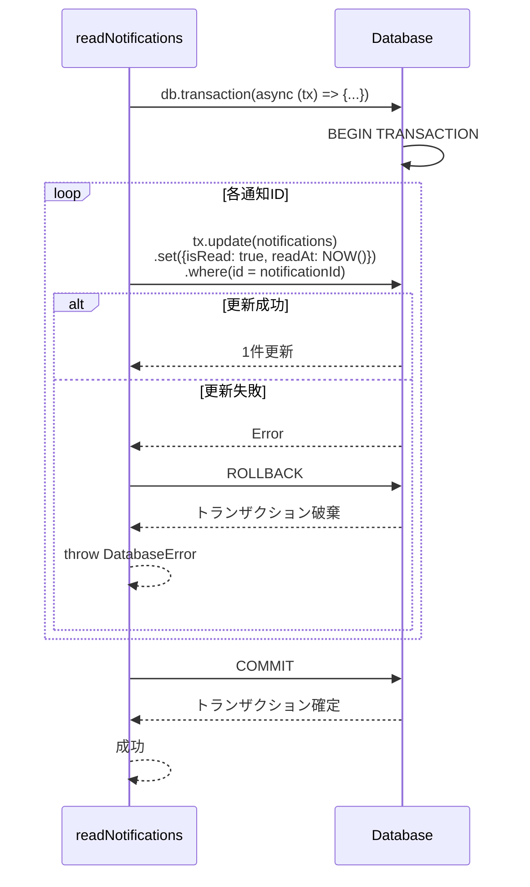

## ログ記録パターン

### 正常系ログ

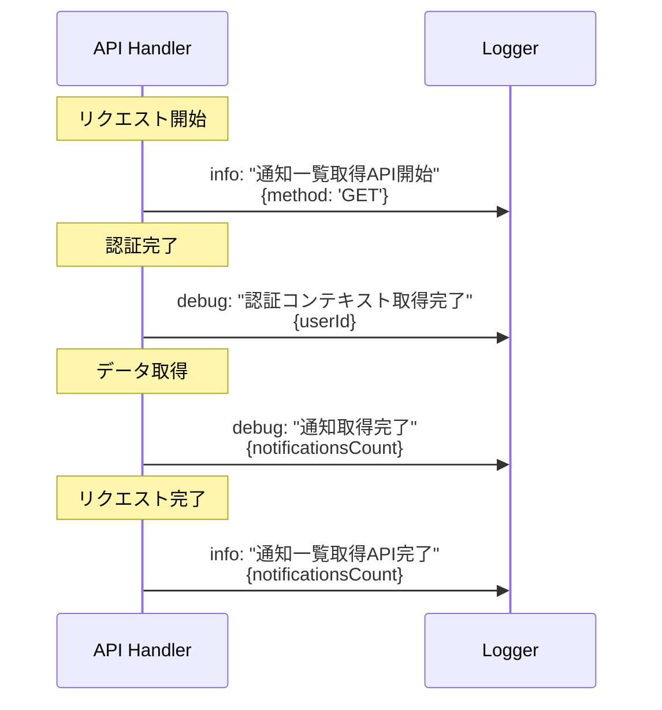

### エラー系ログ

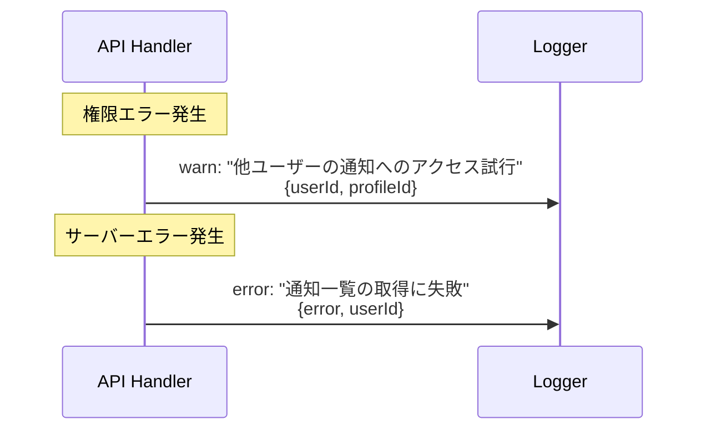
