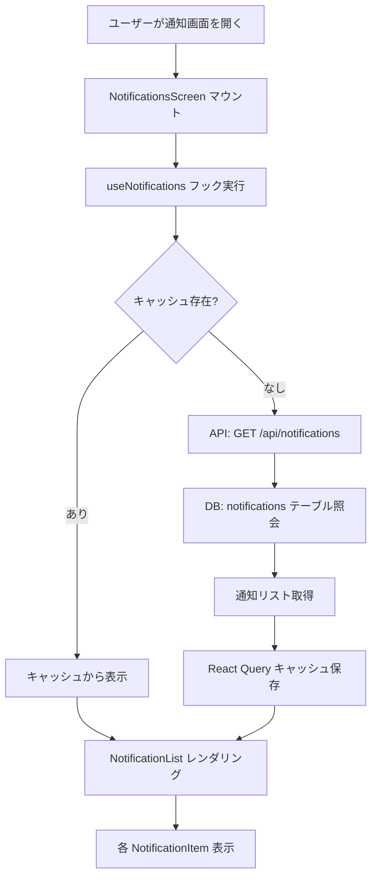
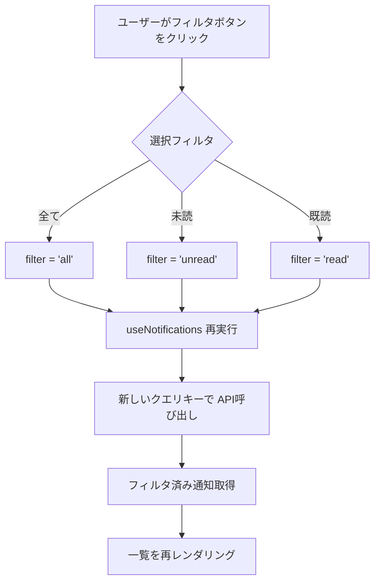
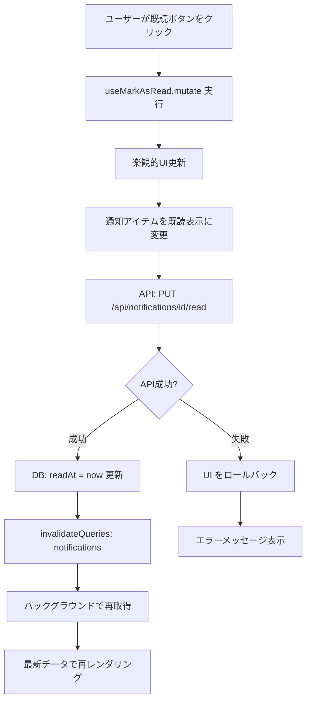
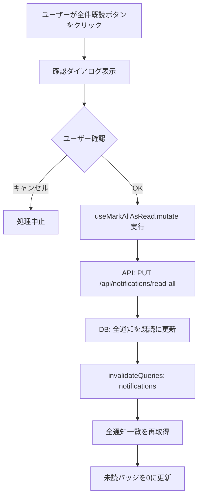
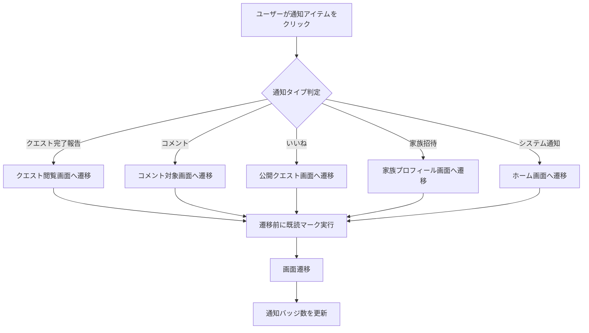
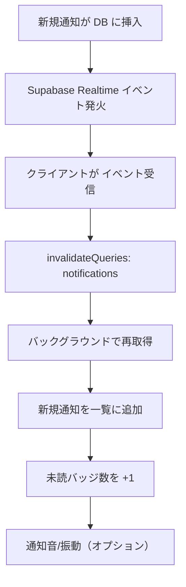
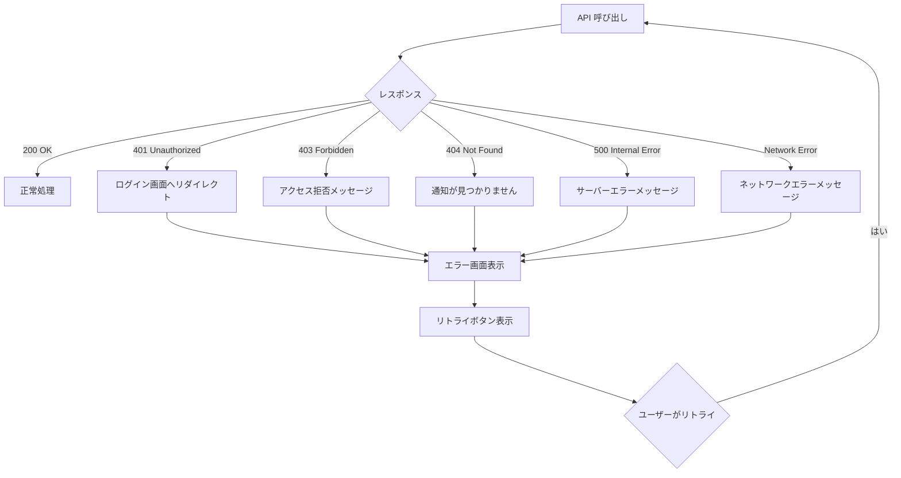
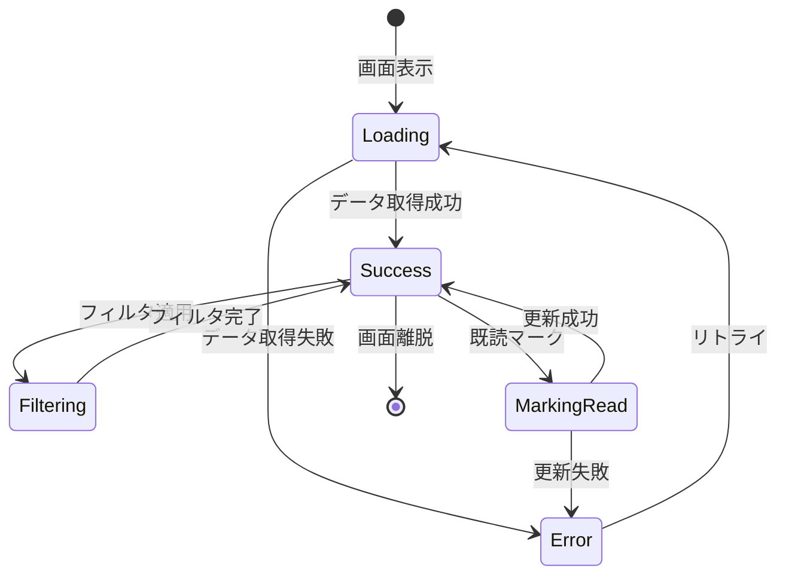

(2026年3月記載)

# 通知一覧 フロー図

## 初期表示フロー

```mermaid
flowchart TD
    A[ユーザーが通知画面を開く] --> B[NotificationsScreen マウント]
    B --> C[useNotifications フック実行]
    C --> D{キャッシュ存在?}
    D -->|あり| E[キャッシュから表示]
    D -->|なし| F[API: GET /api/notifications]
    F --> G[DB: notifications テーブル照会]
    G --> H[通知リスト取得]
    H --> I[React Query キャッシュ保存]
    E --> J[NotificationList レンダリング]
    I --> J
    J --> K[各 NotificationItem 表示]
```

## フィルタリングフロー

```mermaid
flowchart TD
    A[ユーザーがフィルタボタンをクリック] --> B{選択フィルタ}
    B -->|全て| C[filter = 'all']
    B -->|未読| D[filter = 'unread']
    B -->|既読| E[filter = 'read']
    C --> F[useNotifications 再実行]
    D --> F
    E --> F
    F --> G[新しいクエリキーで API呼び出し]
    G --> H[フィルタ済み通知取得]
    H --> I[一覧を再レンダリング]
```

## 既読マークフロー

```mermaid
flowchart TD
    A[ユーザーが既読ボタンをクリック] --> B[useMarkAsRead.mutate 実行]
    B --> C[楽観的UI更新]
    C --> D[通知アイテムを既読表示に変更]
    D --> E[API: PUT /api/notifications/id/read]
    E --> F{API成功?}
    F -->|成功| G[DB: readAt = now 更新]
    F -->|失敗| H[UI をロールバック]
    G --> I[invalidateQueries: notifications]
    I --> J[バックグラウンドで再取得]
    J --> K[最新データで再レンダリング]
    H --> L[エラーメッセージ表示]
```

## 全件既読フロー

```mermaid
flowchart TD
    A[ユーザーが全件既読ボタンをクリック] --> B[確認ダイアログ表示]
    B --> C{ユーザー確認}
    C -->|キャンセル| D[処理中止]
    C -->|OK| E[useMarkAllAsRead.mutate 実行]
    E --> F[API: PUT /api/notifications/read-all]
    F --> G[DB: 全通知を既読に更新]
    G --> H[invalidateQueries: notifications]
    H --> I[全通知一覧を再取得]
    I --> J[未読バッジを0に更新]
```

## 通知からの遷移フロー

```mermaid
flowchart TD
    A[ユーザーが通知アイテムをクリック] --> B{通知タイプ判定}
    B -->|クエスト完了報告| C[クエスト閲覧画面へ遷移]
    B -->|コメント| D[コメント対象画面へ遷移]
    B -->|いいね| E[公開クエスト画面へ遷移]
    B -->|家族招待| F[家族プロフィール画面へ遷移]
    B -->|システム通知| G[ホーム画面へ遷移]
    C --> H[遷移前に既読マーク実行]
    D --> H
    E --> H
    F --> H
    G --> H
    H --> I[画面遷移]
    I --> J[通知バッジ数を更新]
```

## リアルタイム更新フロー（将来実装）

```mermaid
flowchart TD
    A[新規通知が DB に挿入] --> B[Supabase Realtime イベント発火]
    B --> C[クライアントが イベント受信]
    C --> D[invalidateQueries: notifications]
    D --> E[バックグラウンドで再取得]
    E --> F[新規通知を一覧に追加]
    F --> G[未読バッジ数を +1]
    G --> H[通知音/振動（オプション）]
```

## エラーハンドリングフロー

```mermaid
flowchart TD
    A[API 呼び出し] --> B{レスポンス}
    B -->|200 OK| C[正常処理]
    B -->|401 Unauthorized| D[ログイン画面へリダイレクト]
    B -->|403 Forbidden| E[アクセス拒否メッセージ]
    B -->|404 Not Found| F[通知が見つかりません]
    B -->|500 Internal Error| G[サーバーエラーメッセージ]
    B -->|Network Error| H[ネットワークエラーメッセージ]
    D --> I[エラー画面表示]
    E --> I
    F --> I
    G --> I
    H --> I
    I --> J[リトライボタン表示]
    J --> K{ユーザーがリトライ}
    K -->|はい| A
```

## 状態遷移図

```mermaid
stateDiagram-v2
    [*] --> Loading: 画面表示
    Loading --> Success: データ取得成功
    Loading --> Error: データ取得失敗
    Success --> Filtering: フィルタ適用
    Filtering --> Success: フィルタ完了
    Success --> MarkingRead: 既読マーク
    MarkingRead --> Success: 更新成功
    MarkingRead --> Error: 更新失敗
    Error --> Loading: リトライ
    Success --> [*]: 画面離脱
```
